## Our question for today

<div class="major-question">When can an LLM output support a sociological claim?</div>

<div class="semantic-line">We will follow one small example from the original text, through a model call, to the record we would need for research.</div>

---

## How are you using AI now?

<div class="discussion-list">
<p><span>01</span> Where are you already using AI in research or teaching?</p>
<p><span>02</span> What has it made easier?</p>
<p><span>03</span> What might you stop learning if the operation becomes invisible?</p>
</div>

---

## AI use is permitted - with responsibility and disclosure

<div class="two-col"><div><div class="kicker">Use it</div><p>to question, explore, debug, compare and revise.</p></div><div><div class="kicker">You remain responsible</div><p>for every claim and every line of submitted code.</p></div></div>

<div class="semantic-line warning">You must be able to explain what the code does, what the model returned, and what you learned or failed to learn by using AI.</div>

---

## We begin with one sentence

<div class="source-object"><div class="object-label">Source text</div><blockquote>“You can never be too careful when dealing with people.”</blockquote></div>

<div class="semantic-line">This is our input. It is a sentence from a familiar survey question about generalized trust.</div>

---

## The first Python object is the text itself

<div class="code-io-layout"><div>

```python
source_text = (
    "You can never be too careful "
    "when dealing with people."
)

print(source_text)
print(type(source_text))
```

</div><div class="output-box"><div class="object-label">Printed output</div><pre>You can never be too careful when dealing with people.
&lt;class 'str'&gt;</pre></div></div>

<div class="trace-line"><b>Input:</b> text &nbsp; <b>Operation:</b> assign and inspect &nbsp; <b>Output type:</b> string (<code>str</code>)</div>

---

## We ask the model to perform a specific task

<div class="task-composition"><div class="source-object compact-source"><div class="object-label">Input text</div><p>You can never be too careful when dealing with people.</p></div><div class="task-arrow">+</div><div class="source-object compact-source"><div class="object-label">Researcher instruction</div><p>Score the social trust expressed in the text from 0 (low) to 2 (high).</p></div></div>

<div class="semantic-line">The model has not discovered our measurement rule. We supplied the task and the scale.</div>

---

## We can require a response with named fields

<div class="two-col structured-example"><div><div class="kicker">Requested structure</div><pre>{
  "trust_score": 0, 1, or 2,
  "reason": "short explanation"
}</pre></div><div><div class="kicker">Illustrative response</div><pre>{
  "trust_score": 0,
  "reason": "The statement expects
             caution toward others."
}</pre></div></div>

<div class="semantic-line warning">A structured output controls the shape of the response. It does not establish that the score measures generalized trust well.</div>

::: {.notes}
[Sources]
- OpenRouter structured outputs documentation | Source: https://openrouter.ai/docs/guides/features/structured-outputs | Accessed: 2026-08-26
[/Sources]
:::

---

## The same output can be used to make very different claims

<div class="claim-ladder"><div><b>Observed output</b><span>The model returned a score of 0.</span></div><div><b>Measurement claim</b><span>The sentence expresses low generalized trust.</span></div><div><b>Validation claim</b><span>This procedure measures trust accurately across texts.</span></div><div><b>Substantive claim</b><span>The people represented by these texts differ in social trust.</span></div></div>

---

## Each stronger claim requires additional evidence

<table class="closed-table claim-evidence-table"><thead><tr><th>Claim</th><th>Evidence we have</th><th>Evidence still needed</th></tr></thead><tbody><tr><td>Model returned 0</td><td>Saved response</td><td>Exact request and response record</td></tr><tr><td>Text expresses low trust</td><td>One model judgment</td><td>Defined construct and coding rule</td></tr><tr><td>Procedure measures trust</td><td>One case</td><td>Human reference cases and errors</td></tr><tr><td>Groups differ in trust</td><td>None yet</td><td>Sampling, comparison and downstream analysis</td></tr></tbody></table>

<div class="semantic-line">The model output is one object inside a longer research design.</div>

---

## Sociologists are already using GenAI - mostly outside data collection

<div class="paper-intro-layout">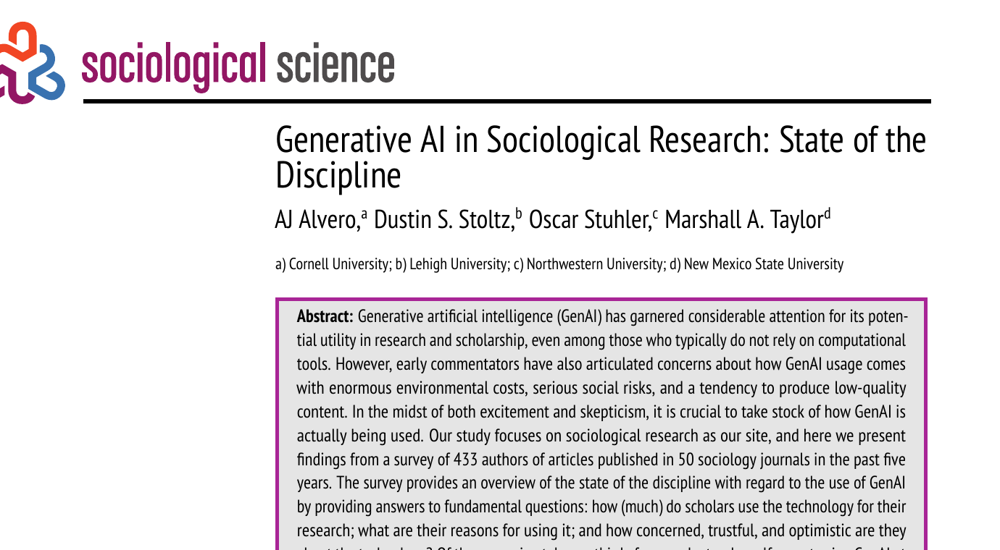<div><p><b>Material:</b> survey of 433 authors who had published in 50 sociology journals.</p><p><b>Question:</b> how often, where and why are sociologists using GenAI?</p><p><b>Finding:</b> around one third reported at least weekly use; writing assistance was much more common than data collection.</p></div></div>

<p class="citation">Alvero, Stoltz, Stuhler & Taylor (2026), “Generative AI in Sociological Research: State of the Discipline,” <i>Sociological Science</i> 13:45-62. https://doi.org/10.15195/v13.a3.</p>

::: {.notes}
[Sources]
- Alvero et al. (2026), published article | Local source: literature/source_pdfs/session01/alvero_et_al_2026_genai_sociology.pdf | Accessed: 2026-08-26
[/Sources]
:::

---

## Their survey distinguishes everyday use from research stages

<div class="evidence-main-side">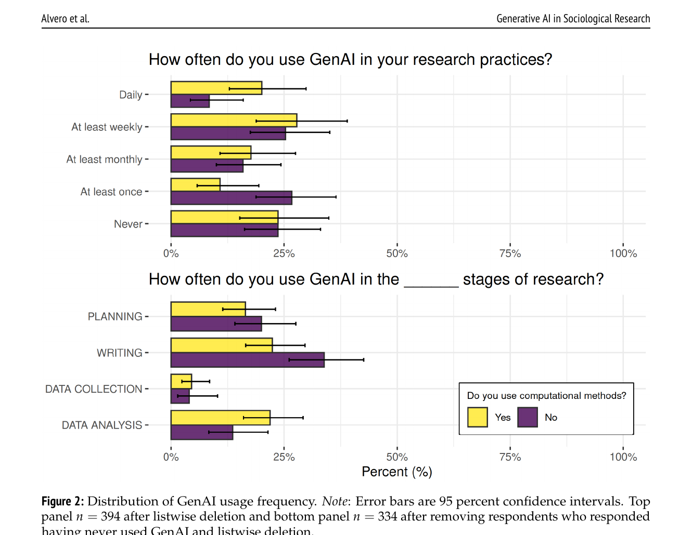<div><p>The top panel measures frequency of use.</p><p>The bottom panel asks where GenAI enters research.</p><p class="accent">Writing is the most common research-stage use. Data collection is rare in this survey.</p></div></div>

<p class="citation">Alvero et al. (2026), Figure 2. Top panel <i>n</i> = 394; bottom panel <i>n</i> = 334.</p>

::: {.notes}
[Sources]
- Alvero et al. (2026), Figure 2 | Local source: literature/source_pdfs/session01/alvero_et_al_2026_genai_sociology.pdf, p. 51 | Accessed: 2026-08-26
[/Sources]
:::

---

## Davidson and Karell organize the new work around three uses

<div class="paper-intro-layout">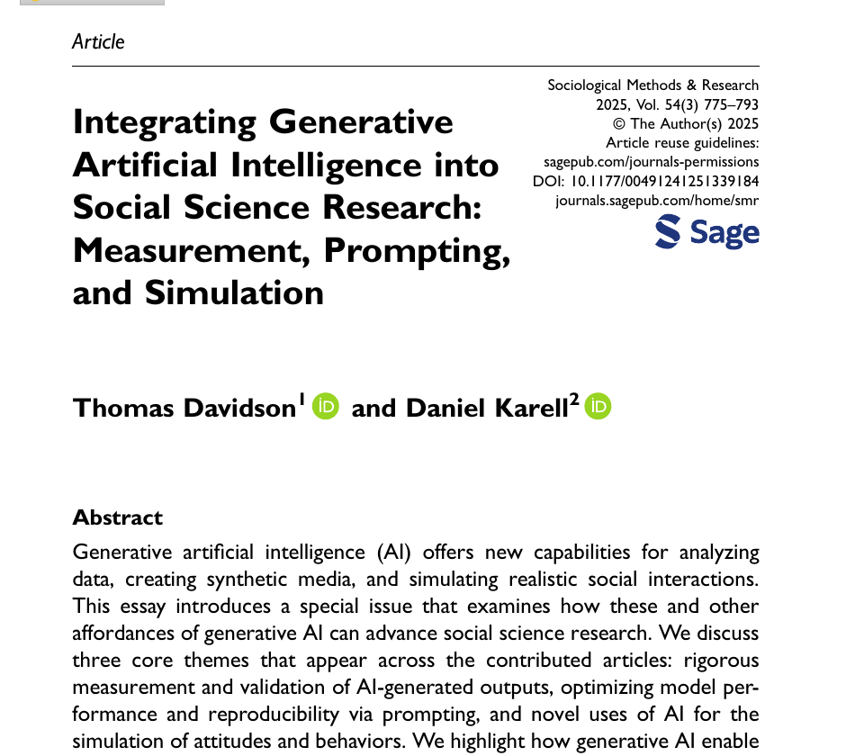<div><p><b>Measurement:</b> turn records into variables or classifications.</p><p><b>Prompting:</b> specify and test the instruction given to the model.</p><p><b>Simulation:</b> generate synthetic responses, media or interactions.</p></div></div>

<p class="citation">Davidson & Karell (2025), “Integrating Generative Artificial Intelligence into Social Science Research,” <i>Sociological Methods & Research</i> 54(3):775-793. https://doi.org/10.1177/00491241251339184.</p>

::: {.notes}
[Sources]
- Davidson and Karell (2025), published article | Local source: literature/source_pdfs/session01/davidson-karell-2025-integrating-generative-artificial-intelligence-into-social-science-research-measurement-prompting.pdf | Accessed: 2026-08-26
[/Sources]
:::

---

## Their starting point is established measurement practice

<div class="quote-evidence-layout">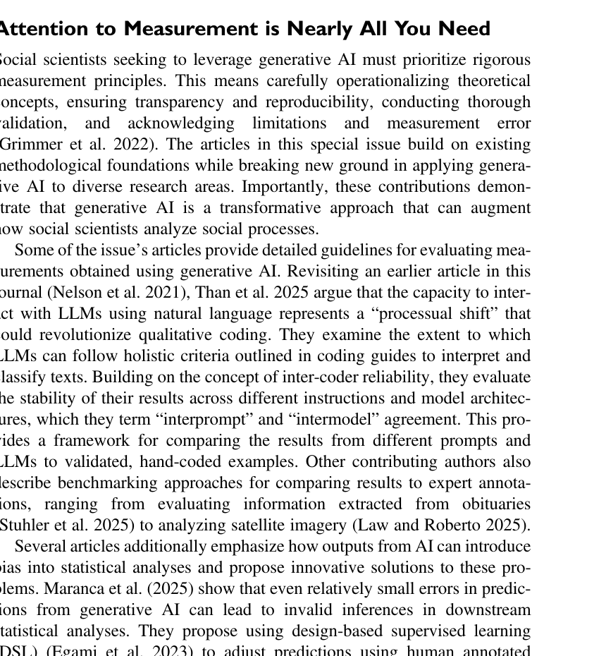<div><div class="kicker">For our example</div><p>What is “generalized trust”?</p><p>How does the 0-2 rule operationalize it?</p><p>Which human-coded cases will test the output?</p><p>How could error affect the later comparison?</p></div></div>

<p class="citation">Davidson & Karell (2025), p. 779. The authors emphasize operationalization, transparency, reproducibility, validation and measurement error.</p>

::: {.notes}
[Sources]
- Davidson and Karell (2025), “Attention to Measurement is Nearly All You Need” | Local source: literature/source_pdfs/session01/davidson-karell-2025-integrating-generative-artificial-intelligence-into-social-science-research-measurement-prompting.pdf, p. 779 | Accessed: 2026-08-26
[/Sources]
:::

---

## The first half of the course follows familiar research operations

<div class="domain-overview"><div><b>Annotation</b><span>Score text for social trust</span><small>Week 2</small></div><div><b>Qualitative research</b><span>Propose themes and retrieve passages</span><small>Week 3</small></div><div><b>Observation</b><span>Describe images, audio and sequences</span><small>Week 4</small></div><div><b>Treatments</b><span>Generate or adapt experimental material</span><small>Weeks 5-6</small></div></div>

---

## Later sessions ask what happens when models do more of the work

<div class="domain-overview three-domain"><div><b>Synthetic respondents</b><span>Generate answers for profiles</span><small>Week 7</small></div><div><b>Simulation and agents</b><span>Generate actions and interactions</span><small>Weeks 8-10</small></div><div><b>Research agents</b><span>Plan, search, use tools and revise</span><small>Weeks 11-12</small></div></div>

<div class="semantic-line">The more of the workflow the system performs, the more important it becomes to preserve the intermediate decisions.</div>

---

## Faster production changes more than the speed of one task

<div class="major-question compact-question">If AI makes research easier to produce, what happens to the range of questions, methods and people involved in producing knowledge?</div>

<div class="semantic-line">Two papers let us separate an empirical pattern from a broader argument about scientific understanding.</div>

---

## Hao and colleagues study AI use across 41.3 million papers

<div class="paper-intro-layout">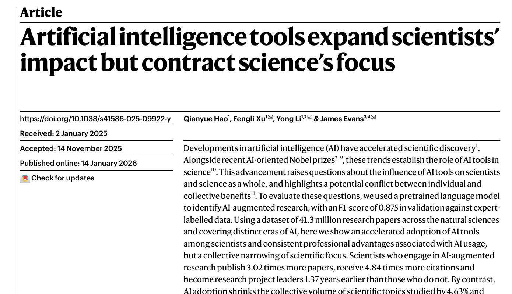<div><p><b>Material:</b> natural-science papers from 1980 to 2025.</p><p><b>Comparison:</b> papers and researchers identified as using AI tools versus matched non-AI counterparts.</p><p><b>Question:</b> how is adoption associated with productivity, impact, careers and the collective range of research?</p></div></div>

<p class="citation">Hao, Xu, Li et al. (2026), “Artificial intelligence tools expand scientists’ impact but contract science’s focus,” <i>Nature</i> 649:1237-1243. https://doi.org/10.1038/s41586-025-09922-y.</p>

::: {.notes}
[Sources]
- Hao et al. (2026), version of record | Local source: literature/source_pdfs/session01/s41586-025-09922-y.pdf | Accessed: 2026-08-26
[/Sources]
:::

---

## AI adoption is associated with more papers and citations

<div class="wide-evidence-slide">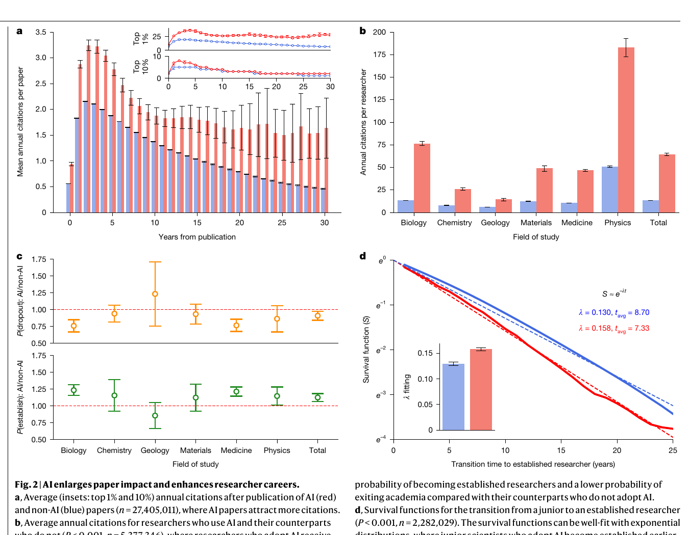</div>

<div class="figure-reading"><b>Read panel b:</b> across six fields, AI-adopting researchers received more annual citations than the comparison group. The paper also reports 3.02 times more papers per year.</div>

<p class="citation">Hao et al. (2026), Figure 2 and Extended Data Figure 4. These are observational associations following identified AI adoption.</p>

::: {.notes}
[Sources]
- Hao et al. (2026), Figure 2 and Extended Data Figure 4 | Local source: literature/source_pdfs/session01/s41586-025-09922-y.pdf | Accessed: 2026-08-26
[/Sources]
:::

---

## The same study finds a narrower collective knowledge space

<div class="wide-evidence-slide hao-focus">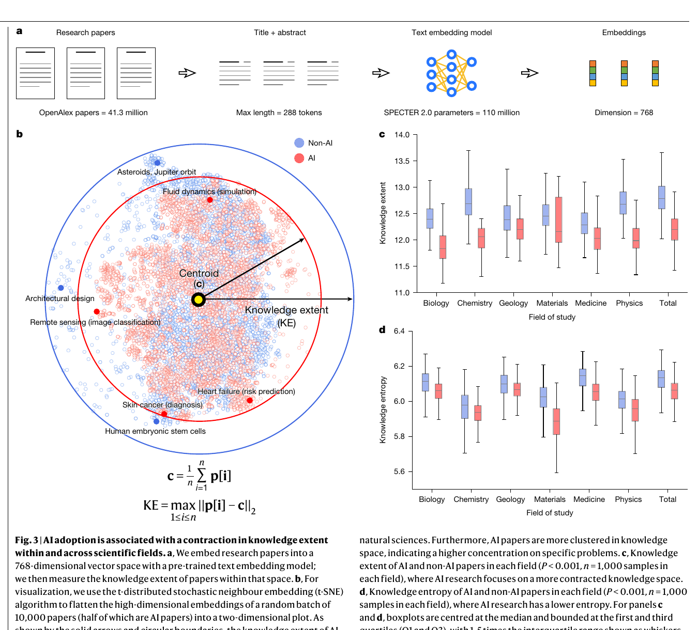</div>

<div class="figure-reading"><b>Read panels b-c:</b> the red AI-paper distribution occupies a smaller knowledge extent, and the field-level estimates are lower in most disciplines.</div>

<p class="citation">Hao et al. (2026), Figure 3. “Knowledge extent” is measured from title and abstract embeddings; it is not a direct measure of scientific understanding.</p>

::: {.notes}
[Sources]
- Hao et al. (2026), Figure 3 | Local source: literature/source_pdfs/session01/s41586-025-09922-y.pdf, p. 1241 | Accessed: 2026-08-26
[/Sources]
:::

---

## Messeri and Crockett ask why AI is so attractive to scientists

<div class="paper-intro-layout">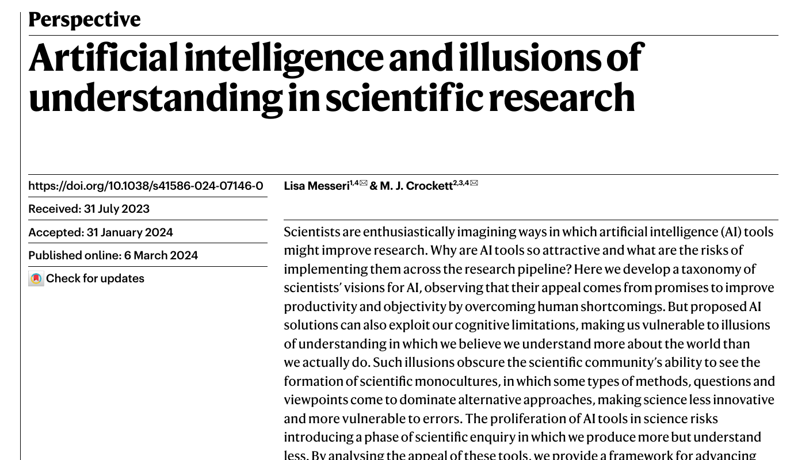<div><p><b>Type of paper:</b> a perspective on AI and scientific knowledge production.</p><p><b>Material:</b> published visions of AI across the research pipeline.</p><p><b>Argument:</b> promises of productivity and objectivity can encourage scientists to trust AI as a knowledge-producing partner.</p></div></div>

<p class="citation">Messeri & Crockett (2024), “Artificial intelligence and illusions of understanding in scientific research,” <i>Nature</i> 627:49-58. https://doi.org/10.1038/s41586-024-07146-0.</p>

::: {.notes}
[Sources]
- Messeri and Crockett (2024), version of record | Local source: literature/source_pdfs/session01/s41586-024-07146-0.pdf | Accessed: 2026-08-26
[/Sources]
:::

---

## Their argument begins with four recurring visions of AI

<div class="evidence-main-side messeri-table-slide">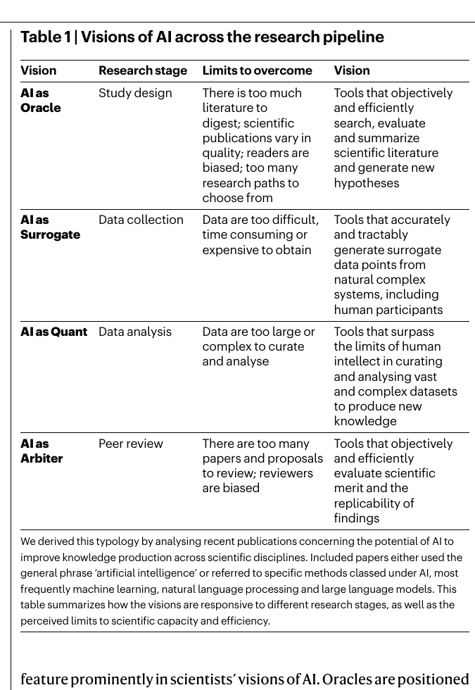<div><p><b>Oracle:</b> searches and summarizes.</p><p><b>Surrogate:</b> supplies data points.</p><p><b>Quant:</b> curates and analyses.</p><p><b>Arbiter:</b> evaluates scientific work.</p><p class="accent">Each vision promises to overcome a limit attributed to human researchers.</p></div></div>

<p class="citation">Messeri & Crockett (2024), Table 1.</p>

::: {.notes}
[Sources]
- Messeri and Crockett (2024), Table 1 | Local source: literature/source_pdfs/session01/s41586-024-07146-0.pdf, p. 53 | Accessed: 2026-08-26
[/Sources]
:::

---

## A good output can encourage a stronger belief than the evidence supports

<div class="evidence-main-side illusion-slide">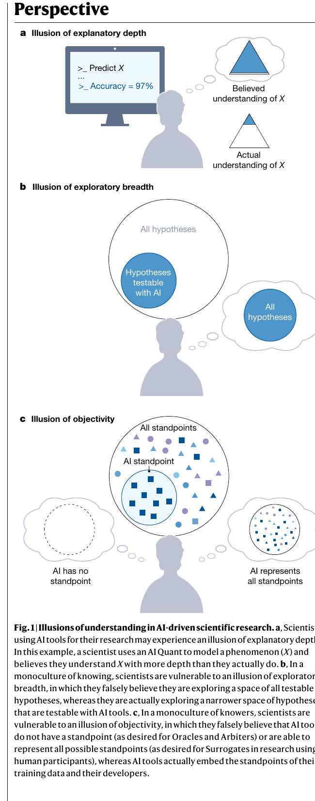<div><p><b>Explanatory depth:</b> accurate prediction is mistaken for understanding the mechanism.</p><p><b>Exploratory breadth:</b> the questions suited to AI are mistaken for all possible questions.</p><p><b>Objectivity:</b> the model's standpoint is overlooked.</p></div></div>

<p class="citation">Messeri & Crockett (2024), Figure 1.</p>

::: {.notes}
[Sources]
- Messeri and Crockett (2024), Figure 1 | Local source: literature/source_pdfs/session01/s41586-024-07146-0.pdf, p. 52 | Accessed: 2026-08-26
[/Sources]
:::

---

## Return to the trust score

<div class="return-example"><div class="returned-json"><pre>{"trust_score": 0}</pre></div><div><p>It may be a useful proposed code.</p><p>It does not tell us whether the construct is well defined.</p><p>It does not tell us how the score compares with human judgments.</p><p>It does not tell us whether the result will survive another run.</p></div></div>

---

## Suppose the next run returns a different score

<div class="run-comparison"><div><div class="object-label">Run 1</div><pre>{"trust_score": 0}</pre></div><div><div class="object-label">Run 2</div><pre>{"trust_score": 1}</pre></div></div>

<div class="semantic-line warning">This is a thought experiment, not an observed result. It creates the next question: what should another researcher expect when repeating our procedure?</div>

---

## We have now shifted from measurement to replication

<div class="question-sequence"><div><b>Measurement</b><span>What does the score represent?</span></div><div class="active"><b>Replication</b><span>What survives a justified repetition?</span></div></div>

<div class="semantic-line">An unstable measure can change the later substantive finding.</div>

---

## Barrie, Palmer and Spirling repeat LLM tasks over time

<div class="paper-intro-layout">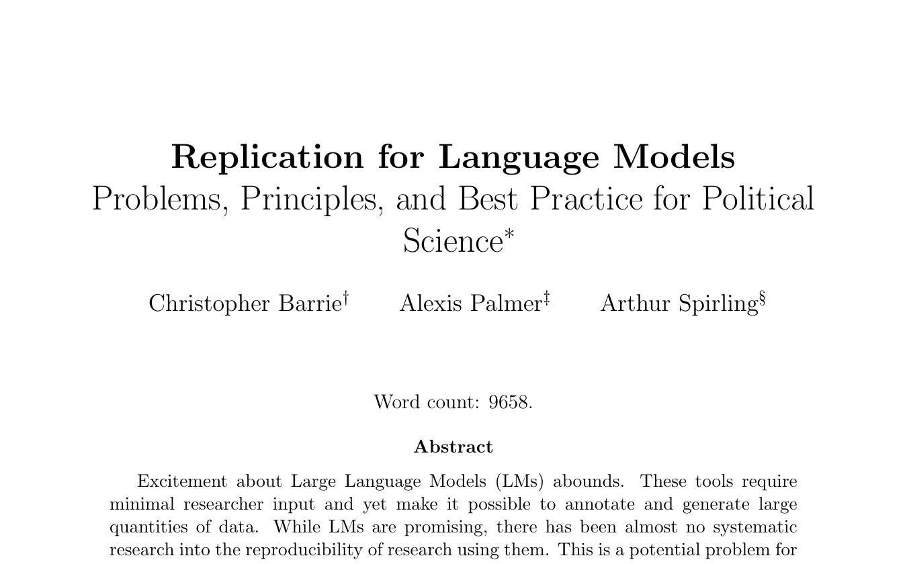<div><p><b>Design:</b> a rolling iterated replication using repeated classification tasks.</p><p><b>Comparisons:</b> hosted language models, a locally run open model and crowdworkers.</p><p><b>Outcomes:</b> accuracy, variation across runs and effects on later statistical estimates.</p></div></div>

<p class="citation">Barrie, Palmer & Spirling (2025), “Replication for Language Models: Problems, Principles, and Best Practices for Political Science,” working paper, 4 November.</p>

::: {.notes}
[Sources]
- Barrie, Palmer and Spirling (2025), manuscript | Local source: literature/source_pdfs/session01/barrie_palmer_spirling_2025_replication.pdf | Accessed: 2026-08-26
[/Sources]
:::

---

## Their design separates new data from repeated model behavior

<div class="design-sequence"><div><b>Three tasks</b><span>manifestos, protests and populism</span></div><div><b>Two samples</b><span>a fixed sample and a changing monthly sample</span></div><div><b>Repeated runs</b><span>the same labeling procedure run many times</span></div><div><b>Several sources</b><span>hosted LMs, local Llama and crowdworkers</span></div></div>

<div class="semantic-line">The fixed sample reveals variation produced by the labeling system rather than by changing documents.</div>

::: {.notes}
[Sources]
- Barrie, Palmer and Spirling (2025), sections 4-5 | Local source: literature/source_pdfs/session01/barrie_palmer_spirling_2025_replication.pdf | Accessed: 2026-08-26
[/Sources]
:::

---

## Their typology asks two concrete questions

<div class="wide-evidence-slide bps-typology">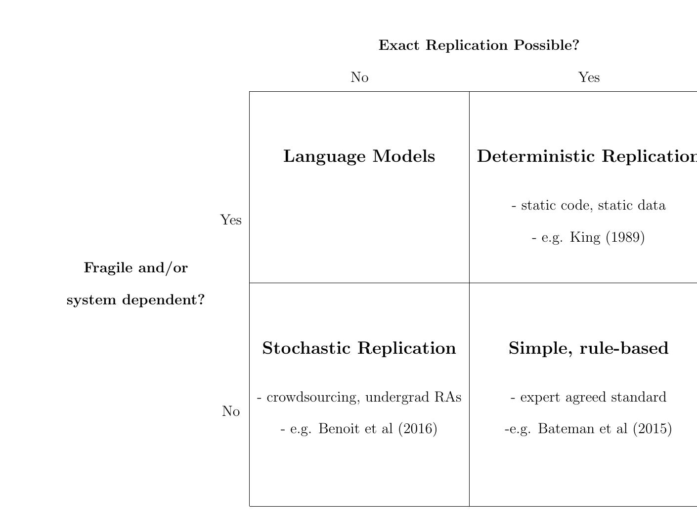</div>

<div class="figure-reading"><b>Language models occupy the upper-left cell:</b> exact repetition is unavailable, while the result can also depend on a fragile model and service.</div>

<p class="citation">Barrie, Palmer & Spirling (2025), Table 1.</p>

::: {.notes}
[Sources]
- Barrie, Palmer and Spirling (2025), Table 1 | Local source: literature/source_pdfs/session01/barrie_palmer_spirling_2025_replication.pdf, p. 13 | Accessed: 2026-08-26
[/Sources]
:::

---

## Four words describe different kinds of repetition

<table class="closed-table definition-table"><thead><tr><th>Term</th><th>What remains the same?</th><th>What are we checking?</th></tr></thead><tbody><tr><td>Rerun</td><td>Code, data and available system</td><td>Can the procedure execute again?</td></tr><tr><td>Repeat</td><td>Task and design</td><td>How much do new stochastic outputs vary?</td></tr><tr><td>Reproduce</td><td>Research design</td><td>Can an independent implementation recover the result?</td></tr><tr><td>Replicate</td><td>Substantive claim</td><td>Does the claim survive new evidence or a new setting?</td></tr></tbody></table>

<p class="citation">Terminology adapted for teaching from Barrie, Palmer & Spirling (2025), sections 2-3.</p>

---

## High accuracy and low variation are different results

<div class="wide-evidence-slide bps-results">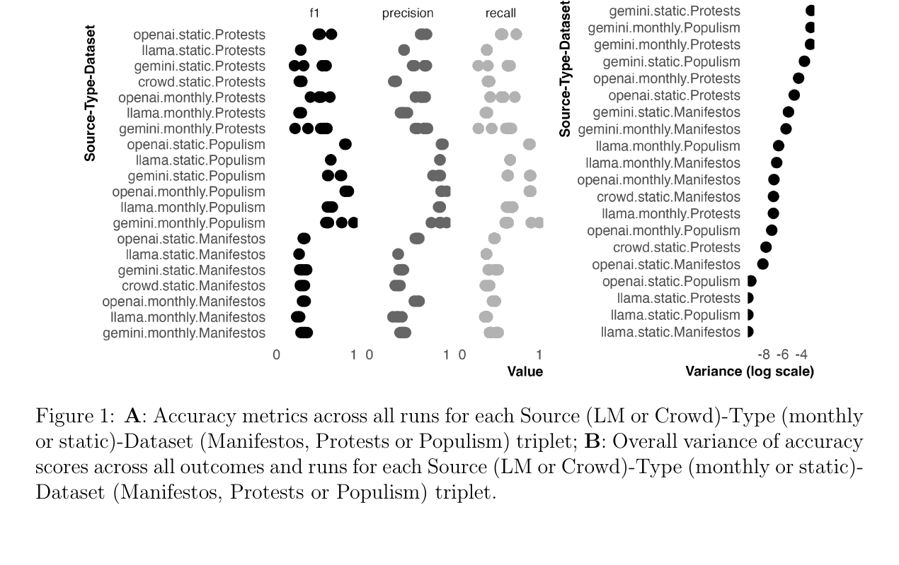</div>

<div class="figure-reading"><b>Panel A:</b> F1, precision and recall. <b>Panel B:</b> variation in those measures across repeated runs. A source can perform well on average and still move between runs.</div>

<p class="citation">Barrie, Palmer & Spirling (2025), Figure 1.</p>

::: {.notes}
[Sources]
- Barrie, Palmer and Spirling (2025), Figure 1 | Local source: literature/source_pdfs/session01/barrie_palmer_spirling_2025_replication.pdf, p. 24 | Accessed: 2026-08-26
[/Sources]
:::

---

## Variation in labels changes later statistical results

<div class="wide-evidence-slide bps-downstream">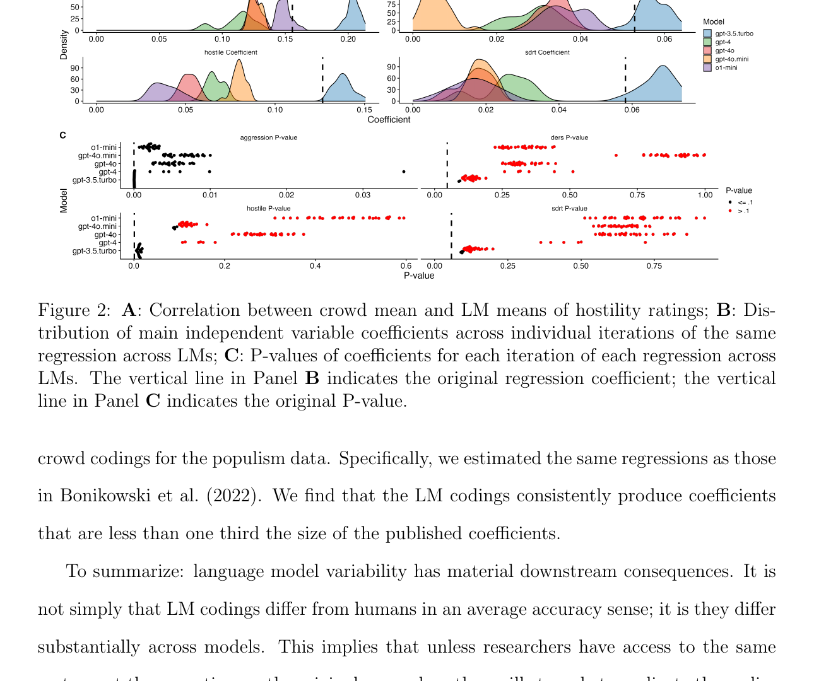</div>

<div class="figure-reading"><b>Panel B:</b> repeated model codings produce distributions of regression coefficients. <b>Panel C:</b> the corresponding p-values can cross conventional thresholds.</div>

<p class="citation">Barrie, Palmer & Spirling (2025), Figure 2.</p>

::: {.notes}
[Sources]
- Barrie, Palmer and Spirling (2025), Figure 2 | Local source: literature/source_pdfs/session01/barrie_palmer_spirling_2025_replication.pdf, p. 27 | Accessed: 2026-08-26
[/Sources]
:::

---

## A local model changes the problem; it does not remove it

<table class="closed-table access-tradeoffs"><thead><tr><th></th><th>Hosted model</th><th>Locally versioned model</th></tr></thead><tbody><tr><td>Model control</td><td>Provider may update or retire it</td><td>Weights can be retained</td></tr><tr><td>Data movement</td><td>Requests leave the machine</td><td>Requests can remain local</td></tr><tr><td>Hardware</td><td>Provider supplies compute</td><td>Your RAM, GPU and storage set limits</td></tr><tr><td>Environment</td><td>Some provider details remain hidden</td><td>Runtime and dependencies must be preserved</td></tr></tbody></table>

<div class="semantic-line">Barrie, Palmer and Spirling recommend locally versioned open models when replication is a priority. The record still needs the model files, runtime and settings.</div>

---

## What would another researcher need from our trust example?

<div class="record-question-grid"><div>exact source text</div><div>task and scale</div><div>system and user messages</div><div>model, provider and date</div><div>settings and schema</div><div>raw and parsed response</div><div>validation cases</div><div>call code</div></div>

<div class="semantic-line">These fields map onto a published reporting standard.</div>

---

## GUIDE-LLM is a reporting checklist for behavioural science

<div class="paper-intro-layout">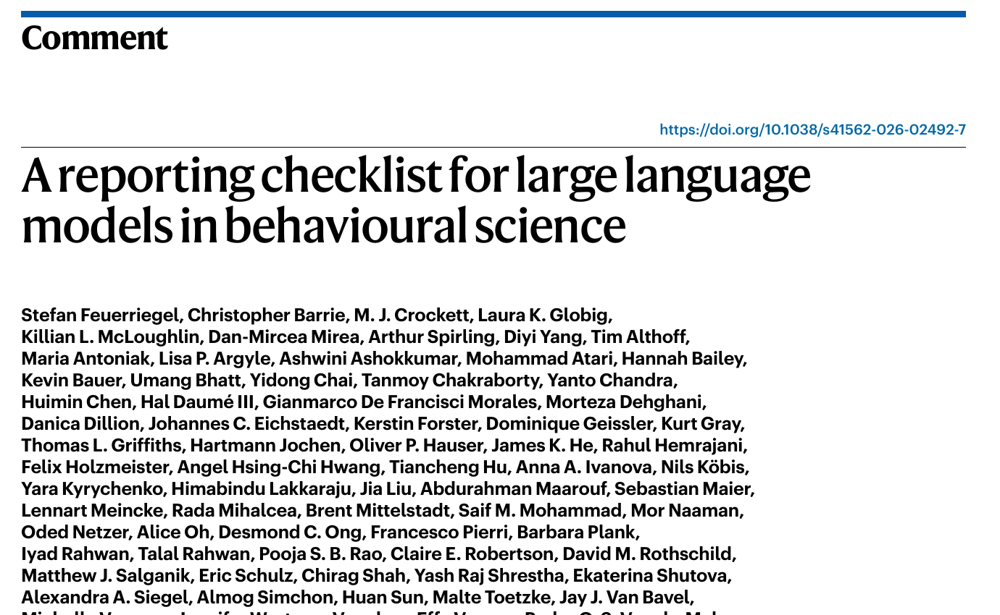<div><p><b>Type of paper:</b> consensus-based reporting guidance.</p><p><b>Development:</b> a preregistered, two-round Delphi process with 121 experts.</p><p><b>Purpose:</b> improve transparency, reproducibility and ethical accountability when LLM use is integral to a study.</p></div></div>

<p class="citation">Feuerriegel, Barrie, Crockett et al. (2026), “A reporting checklist for large language models in behavioural science,” <i>Nature Human Behaviour</i> 10:1182-1186. https://doi.org/10.1038/s41562-026-02492-7.</p>

::: {.notes}
[Sources]
- Feuerriegel et al. (2026), version of record | Local source: literature/source_pdfs/session01/s41562-026-02492-7.pdf | Accessed: 2026-08-26
[/Sources]
:::

---

## The published checklist covers the whole model-use record

<div class="guide-checklist-pair">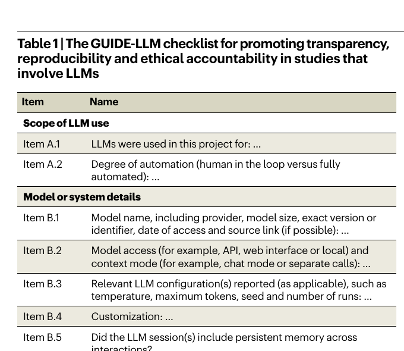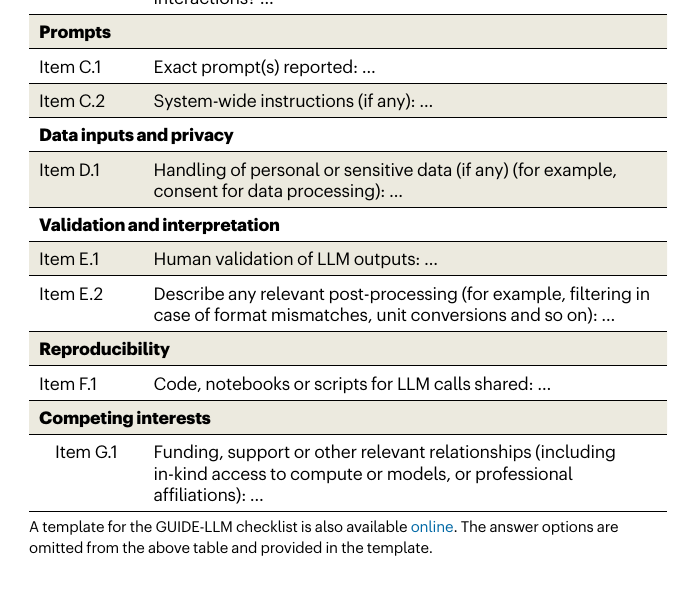</div>

<p class="citation">Feuerriegel et al. (2026), Table 1.</p>

---

## A completed checklist starts with the model's role and inputs

<table class="closed-table completed-checklist"><thead><tr><th>Item</th><th>Completed course example</th></tr></thead><tbody><tr><td>A.1 Role</td><td>Propose a 0-2 generalized-trust code for one text.</td></tr><tr><td>A.2 Automation</td><td>Model proposes; researcher defines the scale and reviews the score.</td></tr><tr><td>B.1 Model</td><td><code>openai/gpt-5.2</code>, accessed through OpenRouter on 2 September 2026.</td></tr><tr><td>B.2 Access</td><td>One separate API call from Python; no retained chat history.</td></tr><tr><td>B.3 Settings</td><td><code>temperature=0.2</code>, <code>max_tokens=80</code>, one run.</td></tr><tr><td>C.1-C.2</td><td>Exact system instruction, user instruction, scale and source text saved.</td></tr></tbody></table>

<p class="citation">Instructor-completed teaching example using GUIDE-LLM core items A-C.</p>

---

## The remaining rows record checking, processing and materials

<table class="closed-table completed-checklist"><thead><tr><th>Item</th><th>Completed course example</th></tr></thead><tbody><tr><td>D.1 Privacy</td><td>Public survey wording; no participant record sent to the provider.</td></tr><tr><td>E.1 Validation</td><td>Not yet completed; later compare with independently coded cases.</td></tr><tr><td>E.2 Processing</td><td>JSON string converted to a Python dictionary; score retrieved without alteration.</td></tr><tr><td>F.1 Code</td><td>Script, environment information, raw responses and records retained.</td></tr><tr><td>G.1 Interests</td><td>Course access supported through a shared OpenRouter account; disclose material support.</td></tr></tbody></table>

<p class="citation">Instructor-completed teaching example using GUIDE-LLM core items D-G.</p>

---

## Reporting, reproducibility and validity answer different questions

<div class="three-standards sourced-standards"><div><b>Reporting</b><span>Can another researcher see what was done?</span><small>GUIDE-LLM</small></div><div><b>Reproducibility</b><span>What survives a justified repetition?</span><small>Barrie, Palmer & Spirling</small></div><div><b>Validity</b><span>Does the operation support the intended claim?</span><small>Davidson & Karell</small></div></div>

<div class="semantic-line">A well-documented output can still be unstable. A stable output can still measure the wrong concept.</div>

---

## The course workflow comes from those three standards

<div class="workflow-five"><div><b>1</b><span>State the model's role and intended claim.</span><small>Davidson-Karell; GUIDE A</small></div><div><b>2</b><span>Preserve inputs and exact instructions.</span><small>GUIDE C</small></div><div><b>3</b><span>Record model, access and settings.</span><small>GUIDE B</small></div><div><b>4</b><span>Keep raw output, processing and validation.</span><small>GUIDE D-E</small></div><div><b>5</b><span>Share materials and test repetition.</span><small>GUIDE F; Barrie et al.</small></div></div>

---

## Break {.section-slide}

<div class="lead">After the break, we will reconstruct the opening model call as Python objects.</div>

---

## A chat window handles many decisions for you

<div class="chat-program-layout"><div class="chat-window"><div class="chat-top">ChatGPT</div><div class="chat-user">Score this text for social trust...</div><div class="chat-assistant">The score is 0.</div><div class="chat-input">Message ChatGPT</div></div><div><p>The interface manages credentials, request formatting and display.</p><p>It may retain conversation history and provide tools.</p><p>Copying the visible answer does not preserve the full research procedure.</p></div></div>

---

## A Python program makes the request visible

<div class="terminal-window large-terminal"><div class="terminal-bar"><span></span><span></span><span></span><b>Terminal</b></div><pre><span class="prompt">$</span> python trust_example.py
source_text: 'You can never be too careful...'
type(source_text): &lt;class 'str'&gt;

Sending 2 messages to openai/gpt-5.2...

raw_output: {"trust_score":0,"reason":"The text advises caution."}
type(raw_output): &lt;class 'str'&gt;
trust_score: 0
type(trust_score): &lt;class 'int'&gt;
<span class="prompt">$</span> <span class="cursor">█</span></pre></div>

<div class="caption">Illustrative terminal output. A live output may differ and should be saved exactly as returned.</div>

---

## One call passes through several layers

<div class="pipeline-full"><div><b>Python values</b><span>text, messages, settings</span></div><i>→</i><div><b>SDK client</b><span>builds the request</span></div><i>→</i><div><b>API service</b><span>authenticates and routes</span></div><i>→</i><div><b>Model</b><span>generates tokens</span></div><i>→</i><div><b>Response</b><span>text plus metadata</span></div></div>

<div class="pipeline-second"><span>extract</span><i>→</i><span>parse</span><i>→</i><span>validate</span><i>→</i><span>save the research record</span></div>

---

## The same notebook can reach models through different routes

<table class="closed-table route-table"><thead><tr><th>Route</th><th>Notebook contacts</th><th>Inference runs</th><th>Example</th></tr></thead><tbody><tr><td>Direct provider</td><td>Provider SDK or API</td><td>Provider's computers</td><td>OpenAI SDK → OpenAI model</td></tr><tr><td>Router</td><td>OpenRouter SDK and API</td><td>Selected hosted provider</td><td><code>model="openai/gpt-5.2"</code></td></tr><tr><td>Local runtime</td><td>Ollama on <code>localhost</code></td><td>Your computer</td><td><code>ollama run llama3.2</code></td></tr></tbody></table>

<div class="semantic-line">The messages can look similar. Privacy, cost, version control, speed and hardware do not.</div>

---

## OpenRouter and Ollama expose the same basic request idea

<div class="two-col access-choice-real"><div class="terminal-window small-terminal"><div class="terminal-bar"><span></span><span></span><span></span><b>Python → OpenRouter</b></div><pre>response = client.chat.send(
    model="openai/gpt-5.2",
    messages=messages,
)</pre></div><div class="terminal-window small-terminal"><div class="terminal-bar"><span></span><span></span><span></span><b>Terminal → Ollama</b></div><pre><span class="prompt">$</span> ollama list
NAME          SIZE
llama3.2:3b   2.0 GB

<span class="prompt">$</span> ollama run llama3.2:3b</pre></div></div>

<div class="semantic-line">OpenRouter gives the class one SDK for hosted models. Ollama provides a service running on the student's machine.</div>

::: {.notes}
[Sources]
- OpenRouter Python SDK overview | Source: https://openrouter.ai/docs/client-sdks/python/overview | Accessed: 2026-08-26
- Ollama CLI documentation | Source: https://docs.ollama.com/cli | Accessed: 2026-08-26
[/Sources]
:::

---

## A model call can involve more than messages and settings

<div class="call-components-expanded"><div><b>Before the model</b><span>credentials, SDK, router, provider selection, instructions, retrieved material, tools, output schema</span></div><div><b>During generation</b><span>model version, context window, sampling settings, safety systems and provider runtime</span></div><div><b>After generation</b><span>response metadata, parsing, retries, filtering, human review, logging and storage</span></div></div>

<div class="semantic-line">Week 1 concentrates on one direct text call. Later weeks add retrieval, multimodal inputs, tools and agents.</div>

---

## We are learning Python by inspecting this research operation

<div class="python-scope"><div><div class="kicker">Today</div><p>values and types</p><p>variables</p><p>dictionaries and lists</p><p>imports and clients</p><p>one method call</p><p>saved objects</p></div><div><div class="kicker">Not today</div><p>every parameter</p><p>model architecture</p><p>loops and custom functions</p><p>asynchronous calls</p><p>agent tools</p></div></div>

<div class="semantic-line">On every code slide: what object exists before this line, and what object exists afterward?</div>

---

## Step 1: store and inspect the source text

<div class="walkthrough-step"><b>Input</b><span>survey sentence</span><i>→</i><b>Operation</b><span>assign it to a name</span><i>→</i><b>Output</b><span>Python string</span></div>

```python
source_text = "You can never be too careful when dealing with people."

print(source_text)
print(type(source_text))
```

```text
You can never be too careful when dealing with people.
<class 'str'>
```

---

## Step 2: settings are values with different types

```python
MODEL_NAME = "openai/gpt-5.2"  # str
temperature = 0.2              # float
max_tokens = 80                # int
stream = False                 # bool
validation = None              # NoneType
```

<table class="closed-table type-meaning-table"><thead><tr><th>Value</th><th>Meaning here</th></tr></thead><tbody><tr><td><code>0.2</code></td><td>a decimal generation setting</td></tr><tr><td><code>80</code></td><td>an output-token limit</td></tr><tr><td><code>False</code></td><td>return one completed response</td></tr><tr><td><code>None</code></td><td>validation has not been recorded</td></tr></tbody></table>

---

## Step 3: dictionaries name fields; a list preserves order

```python
system_message = {
    "role": "system",
    "content": "Apply the scale. Do not infer beyond the text.",
}

user_message = {
    "role": "user",
    "content": f"Score social trust from 0 to 2. Text: {source_text}",
}

messages = [system_message, user_message]
```

<div class="trace-line"><code>messages</code> is a list containing two dictionaries. <code>messages[0]</code> retrieves the first dictionary.</div>

---

## Step 4: create the client, then send the request

```python
import os
from openrouter import OpenRouter

api_key = os.getenv("OPENROUTER_API_KEY")
client = OpenRouter(api_key=api_key)

response = client.chat.send(
    model=MODEL_NAME,
    messages=messages,
    response_format=response_format,
    temperature=temperature,
    max_tokens=max_tokens,
    stream=stream,
)
```

<div class="semantic-line warning">Creating <code>client</code> does not contact a model. <code>client.chat.send(...)</code> is the line that sends the request.</div>

::: {.notes}
[Sources]
- OpenRouter Python SDK overview and chat method | Source: https://openrouter.ai/docs/client-sdks/python/overview | Accessed: 2026-08-26
[/Sources]
:::

---

## The output schema states the fields and allowed types

```python
response_format = {
    "type": "json_schema",
    "json_schema": {
        "name": "trust_classification",
        "strict": True,
        "schema": {
            "type": "object",
            "properties": {
                "trust_score": {"type": "integer", "enum": [0, 1, 2]},
                "reason": {"type": "string"},
            },
            "required": ["trust_score", "reason"],
            "additionalProperties": False,
        },
    },
}
```

<div class="semantic-line">The schema requires an integer score from 0 to 2 and a string reason.</div>

---

## Step 5: inspect the response before extracting one value

<div class="two-col response-inspection"><div>

```python
print(type(response))
print(response.choices)
```

<p>The response contains generated choices and metadata such as token use and the stopping reason.</p></div><div class="output-box"><div class="object-label">Simplified view</div><pre>response
└── choices     # list
    └── [0]     # first choice
        └── message
            └── content</pre></div></div>

---

## Step 6: extract the JSON string, then parse it

```python
import json

raw_output = response.choices[0].message.content
parsed_output = json.loads(raw_output)
trust_score = parsed_output["trust_score"]
```

<div class="conversion-trace"><div><pre>'{"trust_score":0,"reason":"..."}'</pre><span>string (<code>str</code>)</span></div><i>json.loads →</i><div><pre>{"trust_score": 0, "reason": "..."}</pre><span>dictionary (<code>dict</code>)</span></div><i>["trust_score"] →</i><div><pre>0</pre><span>integer (<code>int</code>)</span></div></div>

<div class="semantic-line">Parsing changes the Python object. It does not validate the sociological meaning of the score.</div>

---

## Step 7: save the objects in one research record

```python
record = {
    "source_text": source_text,
    "messages": messages,
    "model": MODEL_NAME,
    "access_route": "OpenRouter",
    "settings": {
        "temperature": temperature,
        "max_tokens": max_tokens,
    },
    "raw_output": raw_output,
    "trust_score": trust_score,
    "validation": None,
}
```

<div class="semantic-line"><code>record</code> keeps the input, procedure, raw output, parsed score and unfinished validation together.</div>

---

## We build the dictionary explicitly before writing a function

<div class="two-col function-later"><div><div class="kicker">Today</div><pre>record = {
    "source_text": source_text,
    ...
}</pre><p>Every value is visible and can be explained.</p></div><div><div class="kicker">Later</div><pre>record = build_research_record(
    source_text,
    messages,
    response,
)</pre><p>A function packages an operation students already understand.</p></div></div>

<div class="semantic-line">A function should reduce repetition. It should not hide where the values came from.</div>

---

## The saved record answers some questions and leaves others open

<table class="closed-table record-limits-table"><thead><tr><th>The record establishes</th><th>The record does not establish</th></tr></thead><tbody><tr><td>the exact text and messages</td><td>that the scale measures generalized trust</td></tr><tr><td>the model identifier and settings</td><td>that another model would behave similarly</td></tr><tr><td>the raw and parsed output</td><td>that the score agrees with human coders</td></tr><tr><td>that validation is currently absent</td><td>that a group comparison would be valid</td></tr></tbody></table>

---

## Your task is to explain the call before evaluating the claim

<div class="task-sequence"><div><b>1</b><span>Identify every input value and Python type.</span></div><div><b>2</b><span>Predict the output of each inspection line.</span></div><div><b>3</b><span>Run the supplied call and preserve the raw response.</span></div><div><b>4</b><span>Build the explicit research-record dictionary.</span></div><div><b>5</b><span>State one claim the score cannot yet support.</span></div></div>

<div class="semantic-line warning">For the oral component, you must explain every name, bracket and type in four consecutive lines of code.</div>

---

## We can report the output; we cannot yet claim that it measures trust

<div class="closing-resolution"><div><pre>{"trust_score": 0}</pre></div><div><p><b>We know</b> what the model received and returned.</p><p><b>We have recorded</b> the model, settings, route and processing.</p><p><b>We still need</b> a defensible measurement rule, validation cases and evidence about variation.</p></div></div>

<div class="caption">Next week: using LLMs for annotation and measurement.</div>
