## Today we will build one variable from twelve comments

<div class="opening-layout">
<div class="opening-comment">“I want lower rents, but I cannot support the proposal unless the affordability rules become much stronger.”</div>
<div class="opening-question"><b>Research question</b><p>What share of speakers explicitly supports adopting the rezoning proposal as written?</p><b>What we need</b><p>One stance label for each comment, plus evidence that those labels measure what we intend.</p></div>
</div>

::: {.notes}
Session 1 made a model call inspectable. Today asks when the returned value can be used in a sociological analysis. Keep this comment visible in students' notes; it returns throughout the lecture.
:::

---

## The label depends on the question we are asking

<div class="marked-comment large-marked">
<span class="cue favourable">I want lower rents</span>, <span class="cue condition">but I cannot support the proposal unless</span> the affordability rules become much stronger.
</div>

<table class="closed-table question-table"><thead><tr><th>If we ask…</th><th>The relevant label is…</th></tr></thead><tbody><tr><td>Does this speaker support adopting the proposal as written?</td><td><b>UNCLEAR</b> — support is conditional on changing it.</td></tr><tr><td>Is this speaker open to policies intended to reduce rents?</td><td><b>OPEN</b> — the opening clause supplies evidence.</td></tr></tbody></table>

<p class="caption">The text has not changed. The construct has.</p>

---

## Sociologists have long turned written accounts into variables

<div class="paper-intro-layout">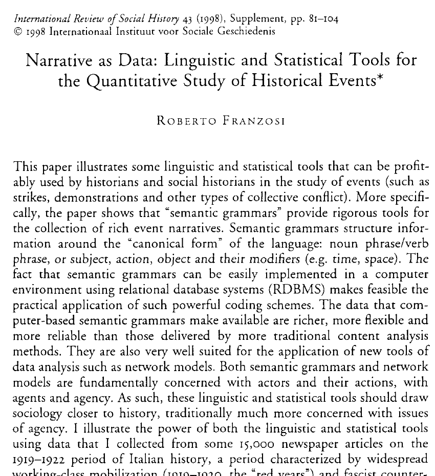<div><p><b>Material:</b> newspaper reports of strikes, demonstrations and other collective conflict.</p><p><b>Task:</b> record actors, actions, objects, time and place from narrative accounts.</p><p><b>Purpose:</b> analyse historical processes without reducing stories to word counts alone.</p></div></div>

<p class="citation">Franzosi, R. (1998). “Narrative as Data: Linguistic and Statistical Tools for the Quantitative Study of Historical Events.” <em>International Review of Social History</em> 43(S6):81–104. https://doi.org/10.1017/S002085900011510X.</p>

::: {.notes}
[Sources]
- Franzosi (1998), published article, first page and abstract. Local PDF: `literature/source_pdfs/session02/franzosi_1998_narrative_as_data.pdf`.
[/Sources]
This is part of the sociological prehistory of text as data: a research team defines what counts as an actor and action, then systematically records those features.
:::

---

## Franzosi used coding rules to recover relations among actors

<div class="figure-side-layout franzosi-figure">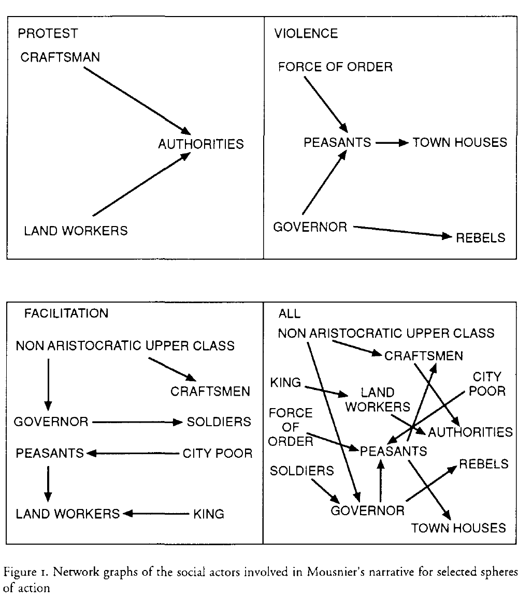<div><p>The published figure is an output of the coding process.</p><p>Names and actions in narrative sources were represented as actors and directed relations.</p><p>The analytic object—a network—depended on earlier decisions about what to record and how to group actors.</p></div></div>

<p class="citation">Franzosi (1998), Figure 1.</p>

::: {.notes}
[Sources]
- Franzosi (1998), p. 90, Figure 1.
[/Sources]
Use the figure to make the craft visible: the network was not discovered ready-made in the newspaper page.
:::

---

## A codebook links a sociological idea to a repeatable decision

<div class="codebook-sheet">
<div><b>Construct</b><span>Explicit support for adopting the proposal as written</span></div>
<div><b>Unit</b><span>One public comment from one speaker</span></div>
<div><b>Allowed values</b><span>SUPPORT · OPPOSE · UNCLEAR</span></div>
<div><b>Boundary rule</b><span>Conditional approval is UNCLEAR unless the speaker also endorses the current proposal</span></div>
<div><b>Evidence</b><span>Save the words that determine the decision</span></div>
</div>

<p class="caption">A construct is the concept we want to measure. The codebook states how evidence in a text becomes a recorded value.</p>

::: {.notes}
[Sources]
- Franzosi (1989, 1990, 1998) on coding narrative data; Neuendorf (2017), <em>The Content Analysis Guidebook</em>, on units, categories, reliability and validity.
[/Sources]
These are the terms students need before seeing any model call.
:::

---

## Human coders apply the same rules to many cases

<div class="coding-desk">
<div class="desk-codebook"><b>Codebook excerpt</b><p>Count SUPPORT only when the speaker endorses the proposal in its current form.</p></div>
<div class="desk-case"><b>Comment 03</b><p>“I want lower rents, but I cannot support the proposal unless…”</p><div class="coder-choice"><span>SUPPORT</span><span>OPPOSE</span><span class="selected">UNCLEAR</span></div></div>
</div>

<div class="plain-statement">Training, duplicate coding and adjudication make disagreements visible. They do not remove judgment from the task.</div>

---

## Crowdworker platforms made coding easier to distribute

<div class="crowd-images"><figure>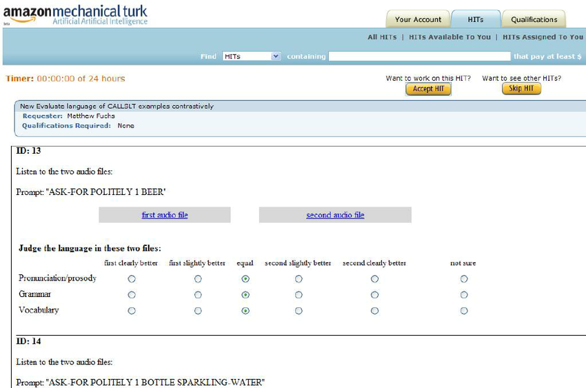<figcaption>An MTurk Human Intelligence Task</figcaption></figure><figure>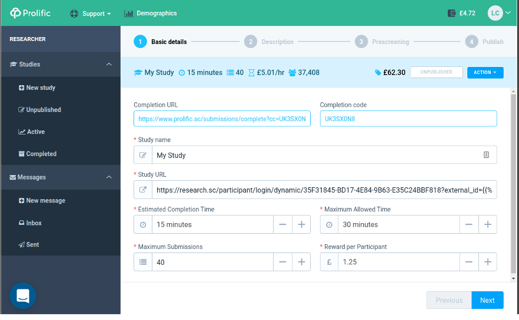<figcaption>A Prolific study setup screen</figcaption></figure></div>

<p class="caption">Researchers could send the same instructions and cases to many paid workers. Recruitment, pay, worker selection and quality control became part of the research design.</p>

<p class="citation">Interface images: Cordite Poetry Review, “Mechanical Turk Essay”; Cowen (2017), Prolific researcher walkthrough.</p>

::: {.notes}
[Sources]
- MTurk interface image: https://media.cordite.org.au/mechanical-turk-essay/essayImg/amazonInterface1.png.
- Prolific interface image: https://www.lauracowen.co.uk/assets/uploads/2017/11/Prolific-create-study-75pc.png.
- Amazon MTurk requester templates and HIT description: https://requester.mturk.com/.
- Prolific Taskflow annotation documentation: https://researcher-help.prolific.com/en/articles/445143-taskflow-ai-dataset-annotation.
[/Sources]
Distinguish recruitment for surveys from paid annotation work. The next slide asks whether these workers could reproduce expert coding rather than merely complete tasks cheaply.
:::

---

## Aggregated crowd judgments could match expert coding

<div class="benoit-evidence">
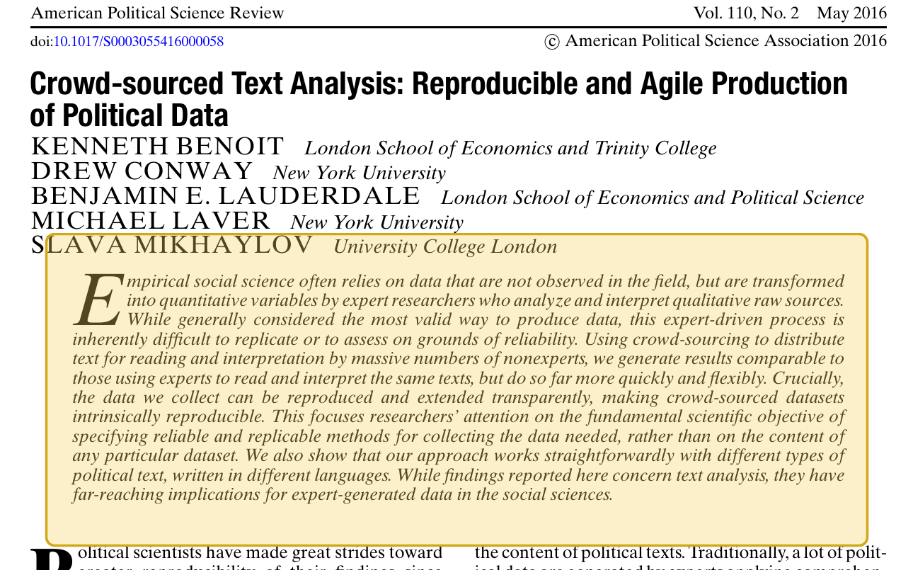
<div><p>Benoit and colleagues divided text coding into small tasks completed by many nonexpert workers.</p><p>After aggregating their judgments, the results were comparable to expert coding but could be produced more quickly and flexibly.</p><p><b>Researchers no longer had to depend on a small pool of experts or trained research assistants for every evaluation.</b></p></div>
</div>

<p class="citation">Benoit, K., D. Conway, B. E. Lauderdale, M. Laver, and S. Mikhaylov. (2016). “Crowd-sourced Text Analysis: Reproducible and Agile Production of Political Data.” <em>American Political Science Review</em> 110(2):278–295. https://doi.org/10.1017/S0003055416000058.</p>

::: {.notes}
[Sources]
- Benoit et al. (2016), published article and abstract. Local PDF: `literature/source_pdfs/session02/benoit_et_al_2016_crowdsourced_text_analysis.pdf`.
[/Sources]
Stress aggregation. The paper does not claim that every individual crowd worker performs like an expert; it compares the results obtained after combining many nonexpert judgments.
:::

---

## Crowdsourcing changes the workforce, not the coding question

<table class="closed-table crowd-table"><thead><tr><th>The researcher still decides</th><th>The platform adds</th><th>The study must report</th></tr></thead><tbody><tr><td>construct, unit and categories</td><td>access to paid workers</td><td>who was eligible to code</td></tr><tr><td>instructions and examples</td><td>parallel task distribution</td><td>pay, training and exclusions</td></tr><tr><td>how disagreement is handled</td><td>worker and task metadata</td><td>agreement and adjudication</td></tr></tbody></table>

<div class="case-return"><b>For our comment:</b> each worker would still need a rule for conditional support. More workers cannot repair an undefined category.</div>

<p class="citation">See Wazny (2020), “Enhancing Big Data in the Social Sciences with Crowdsourcing,” <em>PLOS ONE</em> 15(6):e0233154.</p>

---

## Supervised classifiers learned from the labels people produced

<div class="training-example">
<div><b>Human-labelled examples</b><pre>01  SUPPORT
02  OPPOSE
03  UNCLEAR
...</pre></div>
<div><b>Fitted classifier</b><p>The program learns patterns that distinguish the recorded categories.</p></div>
<div><b>Predictions on new texts</b><pre>101  SUPPORT
102  UNCLEAR
103  OPPOSE</pre></div>
</div>

<div class="plain-statement">The training labels are the model's examples of the construct. Errors or ambiguities in those labels travel into later predictions.</div>

---

## An LLM can apply the written rules without task-specific training

<div class="annotation-call">
<div class="annotation-input"><b>Input</b><p><span>Research task</span> Code stance toward adopting this proposal.</p><p><span>Codebook</span> SUPPORT, OPPOSE or UNCLEAR; conditional approval is UNCLEAR.</p><p><span>Comment</span> “I want lower rents, but I cannot support…”</p></div>
<div class="annotation-output"><b>Returned record</b><pre>{
  "label": "UNCLEAR",
  "evidence": "cannot support ... unless",
  "reason": "support is conditional"
}</pre></div>
</div>

<p class="caption">This is the specific use of an LLM in today's class: one text enters; one proposed label and its supporting evidence come back.</p>

---

## Our target is explicit support for the current proposal

<div class="target-definition"><div><b>Unit</b><span>one comment</span></div><div><b>Construct</b><span>stance toward adoption as written</span></div><div><b>Values</b><span>SUPPORT · OPPOSE · UNCLEAR</span></div><div><b>Quantity</b><span>share of comments coded SUPPORT</span></div></div>

<div class="marked-comment"><span class="cue favourable">I want lower rents</span>, <span class="cue condition">but I cannot support the proposal unless</span> the affordability rules become much stronger.</div>

<p class="caption">The red clause governs the stance label. The blue clause is relevant to a different question about policy goals.</p>

---

## The codebook resolves the difficult cases before model selection

<table class="closed-table definition-table"><thead><tr><th>Label</th><th>Use it when…</th><th>Example</th></tr></thead><tbody><tr><td><b>SUPPORT</b></td><td>the speaker endorses adopting the proposal in its current form</td><td>“The council should pass this plan.”</td></tr><tr><td><b>OPPOSE</b></td><td>the speaker rejects adopting it</td><td>“I oppose this proposal.”</td></tr><tr><td><b>UNCLEAR</b></td><td>there is no stance, mixed evidence or conditional approval only</td><td>“I could support it if the affordability rule changes.”</td></tr></tbody></table>

<p class="caption">These definitions are instructor-created for the synthetic exercise. They are not claimed to be the only defensible way to study housing comments.</p>

---

## The prompt turns those decisions into a request

<div class="prompt-anatomy"><div class="prompt-part"><b>Task</b><span>Classify the speaker's stance toward adopting the proposal as written.</span></div><div class="prompt-part"><b>Rules</b><span>Use SUPPORT, OPPOSE or UNCLEAR. Conditional approval alone is UNCLEAR.</span></div><div class="prompt-part"><b>Evidence</b><span>Return the shortest phrase that determines the label.</span></div><div class="prompt-part"><b>Format</b><span>Return JSON with <code>label</code>, <code>evidence</code> and <code>reason</code>.</span></div><div class="prompt-part full"><b>Current case</b><span>“I want lower rents, but I cannot support the proposal unless…”</span></div></div>

<p class="caption">The model receives all five parts together. The output format makes the response easier to inspect and store.</p>

---

## The exercise uses transparent toy data

<table class="closed-table toy-origin"><thead><tr><th>Object</th><th>What it contains</th><th>Who made it</th></tr></thead><tbody><tr><td>12 comments</td><td>short statements about one fictional rezoning proposal</td><td>instructor-authored</td></tr><tr><td>reference labels</td><td>labels produced from the displayed codebook</td><td>instructor-authored</td></tr><tr><td>model outputs</td><td>twelve illustrative JSON responses, including two deliberate errors</td><td>instructor-authored</td></tr><tr><td>prompt variants</td><td>three reasonable formulations and their illustrative labels</td><td>instructor-authored</td></tr></tbody></table>

<p class="caption">Nothing here estimates opinion in a real city. The small dataset lets us inspect every decision and every error.</p>

---

## Two conditional comments account for both errors

<div class="error-examples"><div><b>Comment 03</b><p>“I want lower rents, <mark>but I cannot support</mark> the proposal unless…”</p><small>Reference: UNCLEAR · Model: SUPPORT</small></div><div><b>Comment 11</b><p>“I <mark>could accept</mark> additional housing <mark>if</mark> the city first guarantees…”</p><small>Reference: UNCLEAR · Model: SUPPORT</small></div></div>

<div class="rate-comparison"><div><b>Reference labels</b><span>4 of 12 SUPPORT</span><strong>33%</strong></div><div><b>Model labels</b><span>6 of 12 SUPPORT</span><strong>50%</strong></div></div>

<p class="caption">The model treats favourable language as current support and overlooks the condition that qualifies it.</p>

---

## We now need evidence about three parts of the measure

<div class="three-questions"><div><b>Definition</b><p>Do the categories and boundary rule represent explicit support?</p></div><div><b>Application</b><p>Do reasonable prompts and independent coders apply the rule consistently?</p></div><div><b>Use</b><p>Do the remaining errors change the quantity or comparison we want to report?</p></div></div>

<div class="case-return">Every part will be evaluated using the same twelve comments and the same support estimate.</div>

---

## Stuhler and colleagues make the annotation task concrete

<div class="paper-intro-layout">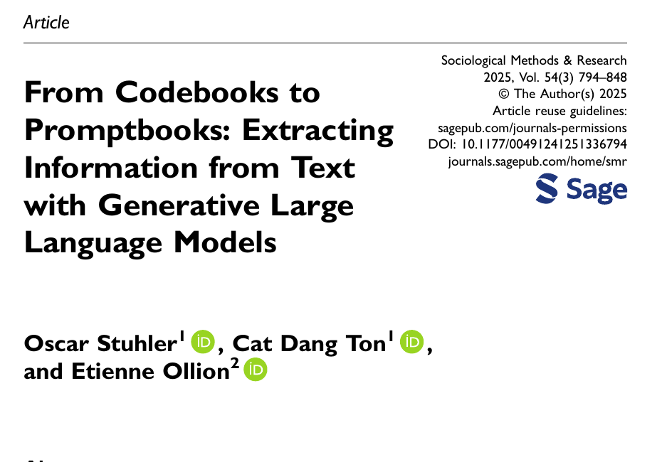<div><p><b>Material:</b> about 80,000 <em>New York Times</em> obituaries published from 1980 to March 2024.</p><p><b>Task:</b> extract twelve biographical variables, including age, military service, education, religion and occupation.</p><p><b>Comparison:</b> open-source Llama models versus manually coded test cases.</p></div></div>

<p class="citation">Stuhler, O., C. Dang Ton, and E. Ollion. (2025). “From Codebooks to Promptbooks: Extracting Information from Text with Generative Large Language Models.” <em>Sociological Methods & Research</em> 54(3):794–848. https://doi.org/10.1177/00491241251336794.</p>

::: {.notes}
[Sources]
- Published version-of-record PDF supplied by instructor: `literature/source_pdfs/session02/stuhler_et_al_2025_promptbooks_published.pdf`.
[/Sources]
Make clear this is information extraction, not only sentiment classification.
:::

---

## Information extraction fills named fields from unstructured text

<div class="wide-paper-figure information-extraction-figure">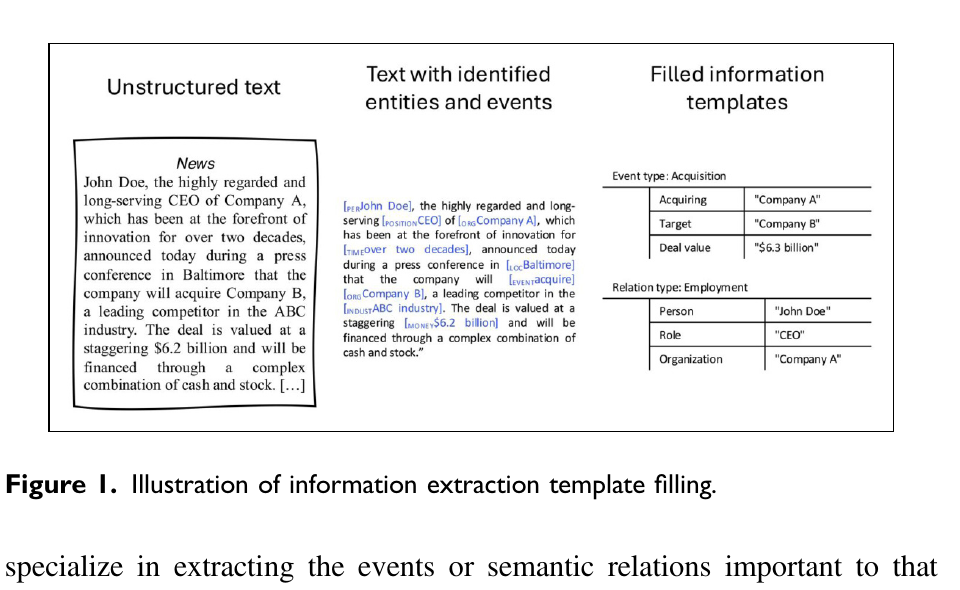</div>

<div class="plain-statement compact-statement">The output fields are chosen before the document is processed. In our exercise, the field is <code>stance</code> and its permitted values come from the codebook.</div>

<p class="citation">Stuhler, Dang Ton, and Ollion (2025), Figure 1.</p>

---

## The promptbook adds instructions written for the model

<div class="wide-paper-figure promptbook-table">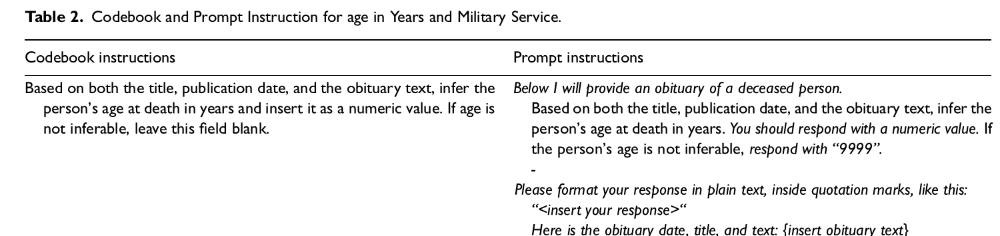</div>

<div class="promptbook-notes"><span>The prompt repeats the substantive rule.</span><span>It adds the input placeholder.</span><span>It specifies what to return when age is missing.</span><span>It specifies the response format.</span></div>

<p class="citation">Stuhler, Dang Ton, and Ollion (2025), Table 2, age-in-years row.</p>

---

## Different variables require different kinds of reading

<table class="closed-table stuhler-task-table"><thead><tr><th>Variable</th><th>What must be found or inferred?</th><th>Why it may fail</th></tr></thead><tbody><tr><td>Age</td><td>an explicit number, usually near the beginning</td><td>unusual title or missing date</td></tr><tr><td>Military service</td><td>a sparse fact anywhere in the obituary</td><td>passing references or advisory roles</td></tr><tr><td>Education</td><td>institutions attended and the highest level completed</td><td>workplaces can be mistaken for attendance</td></tr><tr><td>Religion</td><td>explicit affiliation without imputing from associations</td><td>the model may supply a plausible but unsupported answer</td></tr></tbody></table>

<p class="citation">Stuhler, Dang Ton, and Ollion (2025), Table 1 and pp. 825–827.</p>

---

## Performance differs across tasks and model sizes

<div class="wide-paper-figure accuracy-figure">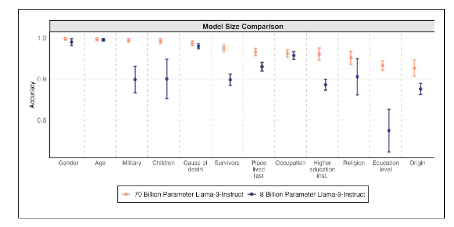</div>

<div class="figure-reading"><b>Read across the x-axis:</b> the 70B model performs very well on explicit facts, while accuracy is lower for variables requiring more contextual inference. The 8B model falls much further on education level.</div>

<p class="citation">Stuhler, Dang Ton, and Ollion (2025), Figure 2. Orange: Llama 3 70B Instruct; blue: Llama 3 8B Instruct.</p>

---

## Our boundary rule also asks the model to use context

<div class="context-comparison"><div><b>Easy lexical cue</b><p>“I support the proposal.”</p><span>SUPPORT</span></div><div><b>Context changes the decision</b><p>“I support more housing, <mark>but not this proposal</mark>.”</p><span>OPPOSE</span></div><div><b>Condition changes the decision</b><p>“I could support it <mark>if the plan changes</mark>.”</p><span>UNCLEAR</span></div></div>

<p class="caption">Finding positive words is not the task. The label depends on what those words are attached to and whether support is current or conditional.</p>

---

## Three reasonable prompts disagree on the conditional cases

<table class="closed-table prompt-results"><thead><tr><th>Comment</th><th>Direct instruction</th><th>Explicit boundary rule</th><th>Question form</th></tr></thead><tbody><tr><td>01 · clear support</td><td>SUPPORT</td><td>SUPPORT</td><td>SUPPORT</td></tr><tr class="unstable"><td>03 · cannot support unless…</td><td><b>SUPPORT</b></td><td>UNCLEAR</td><td>UNCLEAR</td></tr><tr><td>04 · clear opposition</td><td>OPPOSE</td><td>OPPOSE</td><td>OPPOSE</td></tr><tr class="unstable"><td>11 · could accept if…</td><td><b>SUPPORT</b></td><td>UNCLEAR</td><td><b>SUPPORT</b></td></tr></tbody></table>

<p class="caption">The displayed outputs are synthetic. The disagreement is deliberately concentrated in the two boundary cases.</p>

---

## Prompt stability compares reasonable versions of the same instruction

<div class="paper-intro-layout pss-intro">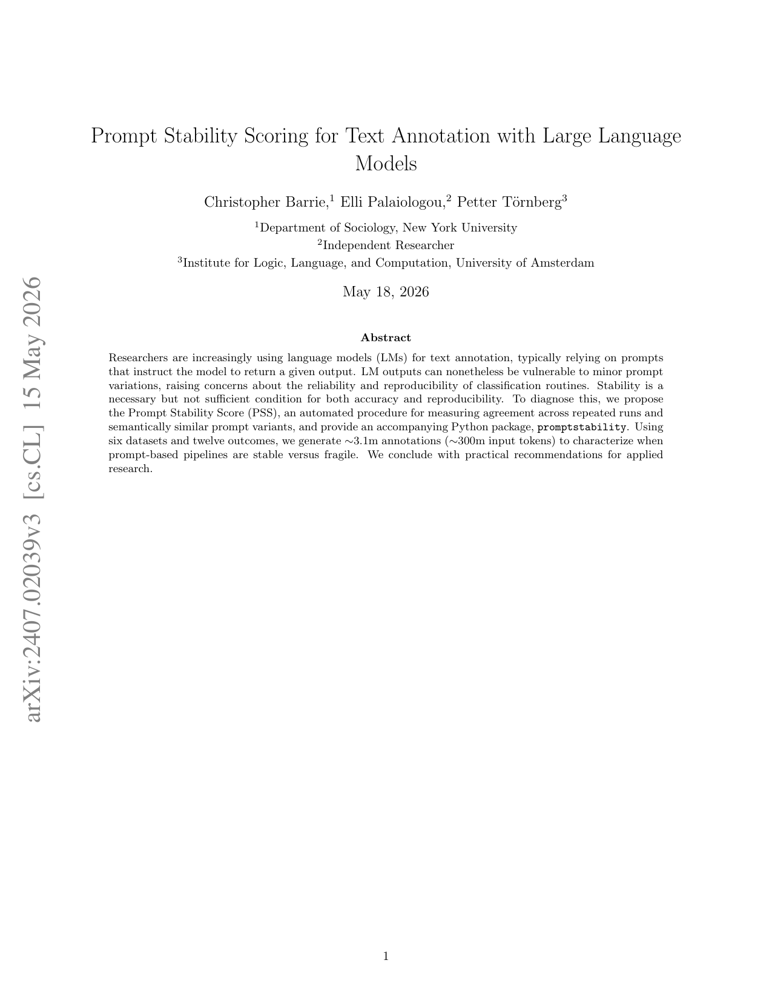<div><p><b>Intra-prompt stability:</b> repeat the same prompt on the same texts.</p><p><b>Inter-prompt stability:</b> use substantively equivalent formulations on the same texts.</p><p>The paper adapts coder-reliability ideas to model-generated annotations.</p></div></div>

<p class="citation">Barrie, C., E. Palaiologou, and P. Törnberg. (2024). “Prompt Stability Scoring for Text Annotation with Large Language Models.” arXiv:2407.02039. https://doi.org/10.48550/arXiv.2407.02039.</p>

::: {.notes}
[Sources]
- Barrie, Palaiologou, and Törnberg (2024), local PDF: `literature/source_pdfs/session02/barrie_palaiologou_tornberg_2024_prompt_stability.pdf`.
[/Sources]
State that this is the instructor's work with Elli Palaiologou and Petter Törnberg.
:::

---

## Repetition and rewording diagnose different problems

<div class="stability-pairs"><div><b>Repeat the direct prompt three times</b><pre>03  SUPPORT
03  SUPPORT
03  UNCLEAR</pre><p>Sampling or service variation changes the label.</p></div><div><b>Use three equivalent formulations once</b><pre>03  SUPPORT
03  UNCLEAR
03  UNCLEAR</pre><p>The wording of the instrument changes the label.</p></div></div>

<p class="caption">Both examples use the same comment and the same intended construct.</p>

---

## Prompt sensitivity varies across annotation tasks

<div class="wide-paper-figure pss-figure">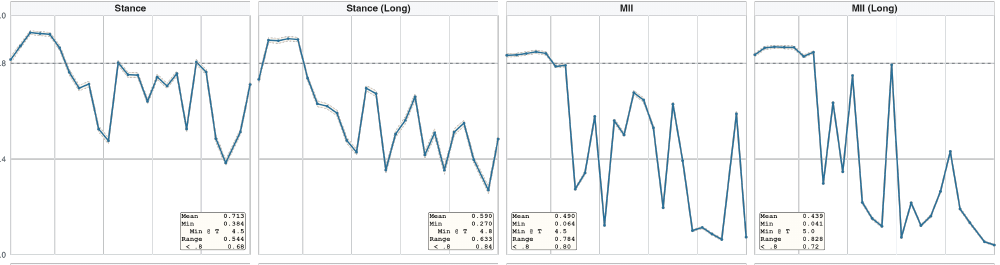</div>

<div class="figure-reading">The same prompting strategy can be stable for one dataset and outcome but fragile for another. Stability must be checked for the actual task.</div>

<p class="citation">Barrie, Palaiologou, and Törnberg (2024), selected panels from Figure 2.</p>

---

## The disagreement table tells us which rule needs attention

<div class="diagnostic-layout"><div class="diagnostic-record"><b>Comment 03</b><p>Direct: SUPPORT</p><p>Boundary rule: UNCLEAR</p><p>Question form: UNCLEAR</p></div><div><h3>What to inspect</h3><p>Does the direct prompt leave “support” underspecified?</p><p>Does the question form still invite the model to focus on general openness?</p><p>Should conditional support receive its own category?</p></div></div>

<p class="caption">Instability is useful because it directs attention to a construct or instruction problem. A stability score alone cannot decide how the rule should change.</p>

---

## A stable wrong label is still wrong for this codebook

<div class="stable-wrong"><div><b>Three runs</b><pre>SUPPORT
SUPPORT
SUPPORT</pre></div><div><b>Reference rule</b><p>Conditional approval only → UNCLEAR</p></div><div><b>Conclusion</b><p>The output is stable but disagrees with the intended boundary rule.</p></div></div>

<p class="caption">Reliability and agreement with an independent reference answer different questions.</p>

---

## The two errors change the quantity we planned to report

<div class="estimate-problem"><div><b>Record-level result</b><strong>10 / 12</strong><span>model labels match the reference</span></div><div><b>Substantive quantity</b><strong>50%</strong><span>model-labelled support</span></div><div><b>Reference quantity</b><strong>33%</strong><span>reference-labelled support</span></div></div>

<div class="plain-statement">A classifier can look fairly accurate while moving the quantity the study was built to estimate.</div>

---

## Egami and colleagues study what happens after annotation

<div class="paper-intro-layout">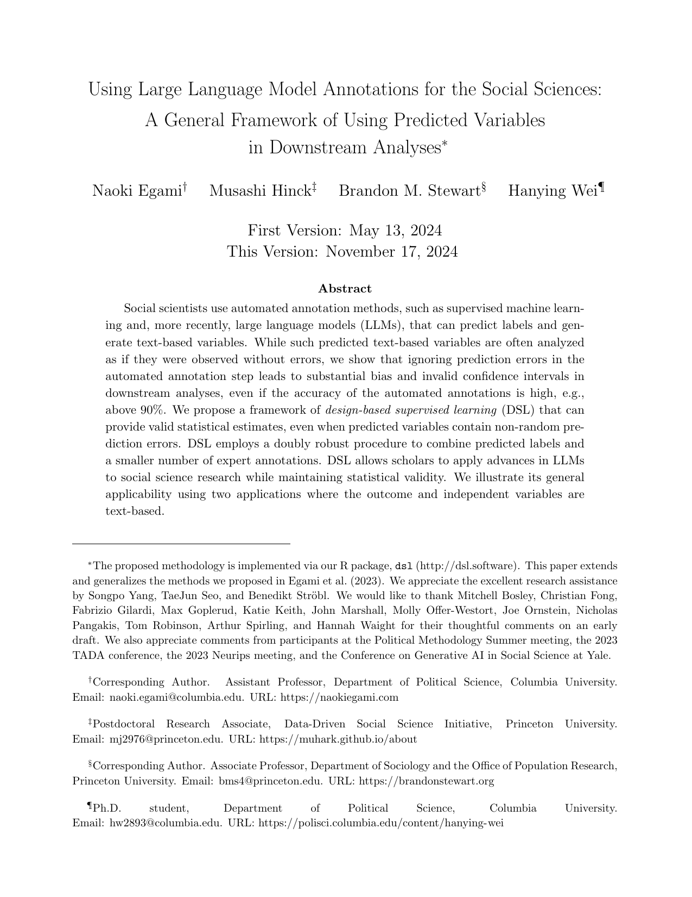<div><p><b>Problem:</b> predicted labels are often analysed as if they were observed without error.</p><p><b>Finding:</b> accuracy above 90% or 95% can still accompany biased estimates and confidence intervals with poor coverage.</p><p><b>Design response:</b> combine large-scale predictions with an independently labelled probability sample.</p></div></div>

<p class="citation">Egami, N., M. Hinck, B. M. Stewart, and H. Wei. (2026). “Using Large Language Model Annotations for the Social Sciences: A General Framework of Using Predicted Variables in Downstream Analyses.” Working paper.</p>

::: {.notes}
[Sources]
- Egami et al., local PDF supplied by instructor: `literature/source_pdfs/session02/egami_hinck_stewart_wei_dsl.pdf`.
[/Sources]
Do not teach the estimator here. Teach why the validation sample and downstream estimand matter.
:::

---

## Egami et al. add independent labels from a probability sample

<div class="figure-side-layout egami-design">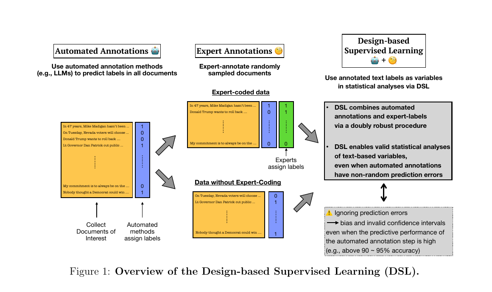<div><p>Automated labels cover the larger corpus.</p><p>Experts independently code a probability sample of documents.</p><p>The sampled labels are used to account for prediction error in the final estimate and its uncertainty.</p></div></div>

<p class="citation">Egami, Hinck, Stewart, and Wei (2026), Figure 1.</p>

---

## In our example, both mistakes move the estimate in one direction

<div class="error-to-estimate"><div class="error-list"><b>False positives</b><p>03 · “cannot support … unless”</p><p>11 · “could accept … if”</p><span>Both conditional comments are added to SUPPORT.</span></div><div class="fraction-change"><span>Reference</span><strong>4 / 12</strong><small>33%</small></div><div class="fraction-change model"><span>Model</span><strong>6 / 12</strong><small>50%</small></div></div>

<p class="caption">The error pattern matters because it changes the numerator of the quantity we planned to report.</p>

---

## What we can claim is narrower than “half support the proposal”

<div class="claim-revision"><div><b>Supported by this exercise</b><p>The illustrative classifier matches 10 of 12 reference labels but codes two conditional comments as SUPPORT, raising the toy support rate from 33% to 50%.</p></div><div><b>Not supported</b><p>Half of speakers in any real population support a rezoning proposal.</p></div><div><b>Needed for a population claim</b><p>A sampling design, independent validation sample and analysis that carries annotation error into the estimate.</p></div></div>

---

## Break {.section-slide}

<div class="lead">After the break, we will implement this exact annotation task as one connected Python workflow.</div>

---

## The program has one research job

<div class="program-job"><div><b>It will</b><p>apply the displayed stance codebook to each toy comment, preserve the model response, compare labels with the reference and calculate the toy support rate.</p></div><div><b>It will not</b><p>decide whether the construct is theoretically adequate or support an estimate about a real population.</p></div></div>

<p class="caption">We will trace comment 03 through every step before asking Python to repeat the operation.</p>

---

## First see the whole workflow in ordinary language

<div class="pseudocode-flow"><pre>FOR each comment in the list:
    get the comment text
    combine the codebook and text in a request
    send the request to the model
    parse the returned JSON
    save the comment ID, label, evidence and prompt name

COMPARE saved labels with the reference labels
INSPECT the disagreements
CALCULATE the support rate</pre></div>

<p class="caption">The next slides open these lines one at a time. They are parts of this single workflow, not separate exercises.</p>

---

## The two starting objects are comments and a codebook

<div class="two-code-objects"><div><b><code>comments</code> is a list</b><pre>comments = [
  {
    "id": "03",
    "text": "I want lower rents, but I cannot support...",
    "reference_label": "UNCLEAR"
  },
  ...
]</pre></div><div><b><code>codebook</code> is a dictionary</b><pre>codebook = {
  "SUPPORT": "endorses adoption as written",
  "OPPOSE": "rejects adoption",
  "UNCLEAR": "no stance, mixed, or conditional only"
}</pre></div></div>

<div class="io-line"><b>Research meaning:</b> one object stores the cases; the other stores the decision rule applied to them.</div>

---

## We inspect one record before writing a loop

```python
comment = comments[2]

print(comment["id"])
# 03

print(comment["text"])
# I want lower rents, but I cannot support...

print(type(comment))
# <class 'dict'>
```

<div class="io-line"><b>Input:</b> the list <code>comments</code> and index <code>2</code>. <b>Output:</b> the dictionary for comment 03.</div>

---

## The prompt string contains the rule and the current text

```python
comment_text = comment["text"]

user_prompt = f"""
Use these labels: {codebook}

Classify this comment:
{comment_text}
"""
```

<div class="code-trace"><div><b><code>comment_text</code></b><span>string retrieved from the current dictionary</span></div><div><b><code>f"""..."""</code></b><span>one new string with the dictionary and text inserted</span></div></div>

<p class="caption">The model has not been contacted yet. Python has only assembled the request text.</p>

---

## The messages list gives each string a role

```python
messages = [
    {
        "role": "system",
        "content": "Return one JSON annotation."
    },
    {
        "role": "user",
        "content": user_prompt
    }
]
```

<div class="nested-object"><b>Outer object:</b> a list with two items. <b>Each item:</b> a dictionary. <b>Each <code>content</code> value:</b> a string.</div>

---

## One line sends those messages to the selected model

```python
response = client.chat.send(
    model="openai/gpt-5.2",
    messages=messages,
    temperature=0.2,
    max_tokens=100,
)
```

<div class="call-explanation"><p><code>model</code> selects the hosted model.</p><p><code>messages</code> supplies the exact input we just built.</p><p><code>temperature</code> and <code>max_tokens</code> are generation settings.</p><p><code>response</code> stores the returned SDK object.</p></div>

<p class="caption">OpenRouter is the access route used in class. A cached response with the same structure remains available if the network or key fails.</p>

---

## The returned content is a JSON string

<div class="response-inspection"><div class="object-type">str</div><pre>{
  "label": "SUPPORT",
  "evidence": "I want lower rents",
  "reason": "The speaker favours the policy goal."
}</pre></div>

```python
raw_output = response.choices[0].message.content
print(type(raw_output))  # <class 'str'>
```

<p class="caption">This illustrative output is deliberately wrong under our boundary rule. Its JSON format makes the fields readable; it does not establish that the label is appropriate.</p>

---

## Parsing gives us named fields we can store

```python
parsed = json.loads(raw_output)

print(type(parsed))        # <class 'dict'>
print(parsed["label"])     # SUPPORT
print(parsed["evidence"])  # I want lower rents
```

<div class="conversion-view"><div><b>Before</b><span>one JSON-formatted string</span></div><div><b><code>json.loads</code></b><span>reads the JSON syntax</span></div><div><b>After</b><span>one Python dictionary</span></div></div>

<p class="caption">The operation changes how Python represents the response. The disagreement with the codebook remains visible in the stored values.</p>

---

## One annotation record keeps the case and procedure together

```python
annotation = {
    "comment_id": comment["id"],
    "prompt_name": "boundary_rule_v1",
    "model": "openai/gpt-5.2",
    "model_label": parsed["label"],
    "evidence": parsed["evidence"],
    "reference_label": comment["reference_label"],
}
```

<div class="io-line"><b>Output:</b> one dictionary connecting the original case, exact prompt name, model, proposed label, evidence and independently stored reference label.</div>

---

## The loop repeats the operation and appends each record

```python
annotations = []

for comment in comments:
    raw_output = annotate(comment, codebook)
    parsed = json.loads(raw_output)
    annotation = make_record(comment, parsed)
    annotations.append(annotation)
```

<div class="loop-trace"><div><b>First pass</b><span><code>comment</code> is record 01; one annotation is appended.</span></div><div><b>Third pass</b><span><code>comment</code> is record 03; the SUPPORT output is appended.</span></div><div><b>After twelve passes</b><span><code>annotations</code> contains twelve dictionaries.</span></div></div>

<p class="caption">The helper functions contain the request and record-building lines already inspected. Students need to explain their inputs and outputs, not write an SDK wrapper from memory.</p>

---

## The resulting list is the annotation dataset

<table class="closed-table annotation-data"><thead><tr><th>comment_id</th><th>model_label</th><th>reference_label</th><th>evidence</th></tr></thead><tbody><tr><td>01</td><td>SUPPORT</td><td>SUPPORT</td><td>“pass this plan”</td></tr><tr class="unstable"><td>03</td><td><b>SUPPORT</b></td><td>UNCLEAR</td><td>“want lower rents”</td></tr><tr><td>04</td><td>OPPOSE</td><td>OPPOSE</td><td>“oppose this proposal”</td></tr><tr class="unstable"><td>11</td><td><b>SUPPORT</b></td><td>UNCLEAR</td><td>“could accept additional housing”</td></tr></tbody></table>

<p class="caption">Four rows are shown. The complete Python list contains one dictionary for each of the twelve toy comments.</p>

---

## A Boolean comparison identifies the error for comment 03

```python
same_label = (
    annotation["model_label"]
    == annotation["reference_label"]
)

print(same_label)
# False
```

<div class="comparison-trace"><span><code>"SUPPORT"</code></span><b>==</b><span><code>"UNCLEAR"</code></span><strong>False</strong></div>

<div class="io-line"><b>Research meaning:</b> the model and reference procedure assign different values to this case.</div>

---

## Counting SUPPORT reproduces the two toy estimates

```python
model_support = sum(
    row["model_label"] == "SUPPORT"
    for row in annotations
)

reference_support = sum(
    row["reference_label"] == "SUPPORT"
    for row in annotations
)

print(model_support, reference_support)
# 6 4
```

<div class="io-line"><b>Each comparison returns</b> <code>True</code> or <code>False</code>. <code>sum</code> counts the <code>True</code> values.</div>

---

## The final calculation returns proportions, not population estimates

```python
n_comments = len(annotations)  # 12

model_rate = model_support / n_comments
reference_rate = reference_support / n_comments

print(model_rate)      # 0.50
print(reference_rate)  # 0.333...
```

<div class="rate-comparison code-rates"><div><b>Model-labelled rate</b><strong>0.50</strong></div><div><b>Reference-labelled rate</b><strong>0.33</strong></div></div>

<p class="caption">These numbers describe the twelve instructor-authored comments. No sampling step connects them to a city or population.</p>

---

## Prompt variants add one field to the same record structure

```python
variant_annotation = {
    "comment_id": "03",
    "prompt_name": "direct_v1",
    "model_label": "SUPPORT",
}
```

<table class="closed-table mini-variant"><thead><tr><th>comment_id</th><th>prompt_name</th><th>model_label</th></tr></thead><tbody><tr><td>03</td><td>direct_v1</td><td>SUPPORT</td></tr><tr><td>03</td><td>boundary_rule_v1</td><td>UNCLEAR</td></tr><tr><td>03</td><td>question_form_v1</td><td>UNCLEAR</td></tr></tbody></table>

<p class="caption">The extra field lets us compare outputs without losing which instruction produced each label.</p>

---

## The supplied comparison code finds the unstable IDs

```python
unstable_ids = find_prompt_disagreements(
    variant_annotations
)

print(unstable_ids)
# ['03', '11']

pss = inter_prompt_pss(variant_annotations)
print(round(pss, 3))
# 0.835
```

<div class="io-line"><b>Student responsibility:</b> explain the input list, the returned list of IDs and what the PSS float summarizes. The statistical implementation is supplied.</div>

---

## The complete workflow answers a specific set of questions

<table class="closed-table workflow-results"><thead><tr><th>Question</th><th>Object or result</th><th>What it tells us</th></tr></thead><tbody><tr><td>What was the intended variable?</td><td><code>codebook</code></td><td>construct, categories and boundary rule</td></tr><tr><td>What did the model see?</td><td><code>messages</code></td><td>exact request for one case</td></tr><tr><td>What did it return?</td><td><code>raw_output</code> and <code>annotation</code></td><td>proposed label and evidence with provenance</td></tr><tr><td>Where did prompts disagree?</td><td><code>unstable_ids</code> and PSS</td><td>conditional cases are fragile</td></tr><tr><td>What changed in the analysis?</td><td><code>model_rate</code> versus <code>reference_rate</code></td><td>two false positives raise the toy estimate</td></tr></tbody></table>

---

## Further reading: model influence can enter before validation

<div class="further-reading"><div><b>Human annotations</b><p>Schroeder, Roy, and Kabbara study how model suggestions can influence human annotators and their confidence.</p></div><div><b>Source texts</b><p>Agarwal, Naaman, and Vashistha show that autocomplete can make participants' writing styles more similar.</p></div></div>

<p class="caption">These papers extend the provenance question: was the reference label or source text produced independently of the model?</p>

<p class="citation">Schroeder, Roy, and Kabbara (2025); Agarwal, Naaman, and Vashistha (2025), CHI. Optional reading for this week.</p>

---

## Your task uses the same objects and the same two difficult cases

<div class="task-list"><div><b>1</b><span>Predict the label for comment 03 from the codebook.</span></div><div><b>2</b><span>Complete the line that retrieves the current comment text.</span></div><div><b>3</b><span>Complete the Boolean label comparison.</span></div><div><b>4</b><span>Calculate the two support rates and inspect comments 03 and 11.</span></div><div><b>5</b><span>Explain one code block using input, type, operation, output and research meaning.</span></div></div>

<p class="caption">Weekly work receives a completion mark. AI use is permitted with disclosure, but you must be able to explain every submitted line orally.</p>

---

## We can now say exactly what happened in this example

<div class="closing-layout"><div class="marked-comment"><span class="cue favourable">I want lower rents</span>, <span class="cue condition">but I cannot support the proposal unless</span> the affordability rules become much stronger.</div><div><p>Under the displayed codebook, the reference label is <b>UNCLEAR</b>.</p><p>The illustrative model output <b>SUPPORT</b> is a false positive.</p><p>One correct output would still require checks of prompt stability, independent reference agreement and the consequences for the intended analysis.</p></div></div>

<div class="final-line">Before using LLM labels in an analysis, save the definition and procedure, compare them with independent labels, and check whether the errors change the result.</div>
