## We begin with an interview, not an AI tool

<small>T01_A · first interview segment</small>“The grocery deliveries got us through the last week of the month. At that point I did not know who organized them.”

<b>Study</b>
Interviews with tenants involved in mutual-aid networks after a period of rent increases.
<b>Research question</b>
How do residents distinguish emergency help from political solidarity?
<b>Today's problem</b>
How could we move from this account to a defensible interpretation?

All tenant interviews in this class are instructor-authored synthetic material.

---

## The source record tells us how to read the passage

<b>Source information</b>Participant: T01Excerpt: T01_APosition: early in interviewBefore: discussion of a rent increaseAfter: later account of childcare exchanges and tenant meetings

“The grocery deliveries got us through the last week of the month. At that point I did not know who organized them.”

The speaker received practical help before knowing the people behind it. Whether this later became solidarity is still an open question.

---

## Qualitative analysis connects accounts, contexts, and concepts

<b>Meaning in context</b>
What does the passage mean within this interview and social setting?

<b>Comparison</b>
How does this case resemble or differ from other cases and moments?

<b>Explanation</b>
What process or relationship does the comparison help us understand?

Coding helps organize the material. The larger aim is a sociological account that remains grounded in what participants said and did.

Deterding and Waters (2021); Timmermans and Tavory (2012, 2022); Stuart and Laryea (2026).

::: {.notes}
[Sources]
- Deterding, N. M., and M. C. Waters. 2021. “Flexible Coding of In-depth Interviews.” Sociological Methods & Research 50(2):708–739. https://doi.org/10.1177/0049124118799377.
- Timmermans, S., and I. Tavory. 2012. “Theory Construction in Qualitative Research.” Sociological Theory 30(3):167–186. https://doi.org/10.1177/0735275112457914.
- Stuart, F., and K. Laryea. 2026. “What Do I Do with All of These Data?” Qualitative Sociology 49:241–268. https://doi.org/10.1007/s11133-025-09625-w.
[/Sources]
:::

---

## Flexible coding separates broad indexing from analytic coding

<table class="closed-table"><thead><tr><th>First pass: index coding</th><th>Second pass: analytic coding</th></tr></thead><tbody><tr><td>Organize material by broad topics connected to the interview guide.</td><td>Compare indexed passages to develop more interpretive categories.</td></tr><tr><td>Applied across the full interview in a relatively consistent way.</td><td>Can change as researchers compare cases and refine the argument.</td></tr><tr><td>Example: <code>RECEIVING_HELP</code></td><td>Example: <code>HELP_BEFORE_RELATIONSHIP</code></td></tr></tbody></table>

Deterding and Waters developed this approach for large in-depth interview projects in which teams need both consistency and room for interpretation.

Deterding, N. M., and M. C. Waters. (2021). “Flexible Coding of In-depth Interviews: A Twenty-first-century Approach.” <em>Sociological Methods & Research</em> 50(2):708–739. https://doi.org/10.1177/0049124118799377.

---

## Index coding gives us a reliable route back to the material

<small>T01_A</small>“The grocery deliveries got us through the last week of the month.”

RECEIVING_HELP
This broad code gathers passages about receiving food, childcare, repairs, or emergency funds.

It answers: <b>where should we look?</b>

The index code does not yet tell us what receiving help meant to this participant.

---

## Analytic coding asks what is happening across cases

<table class="closed-table"><thead><tr><th>Excerpt</th><th>What happens?</th><th>Developing analytic code</th></tr></thead><tbody><tr><td><code>T01_A</code></td><td>Help arrives before the recipient knows the organizers.</td><td><code>HELP_BEFORE_RELATIONSHIP</code></td></tr><tr><td><code>T01_B</code></td><td>Repeated childcare exchanges precede meeting attendance.</td><td><code>REPEATED_EXCHANGE_TO_PARTICIPATION</code></td></tr><tr><td><code>T02_A</code></td><td>Emergency support is kept separate from politics.</td><td><code>HELP_WITHOUT_IDENTIFICATION</code></td></tr></tbody></table>

The code changes because the comparison changes what the researcher notices.

---

## Tavory and Timmermans treat surprise as analytically useful

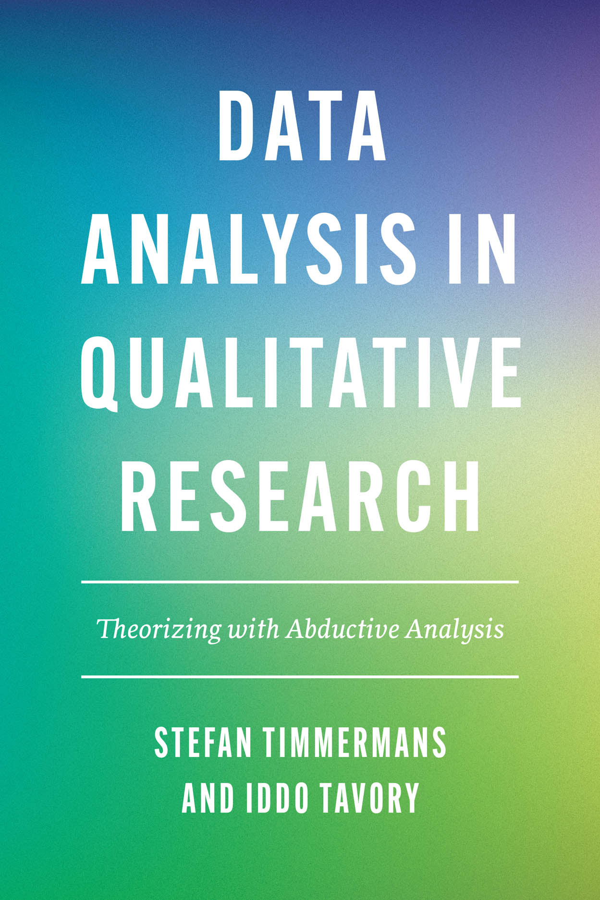

Abductive analysis begins when an observation does not fit what the researcher expected.

The researcher revisits the material, asks what assumptions made the case surprising, and compares alternative ways of understanding it.

For our study, the useful case may be the tenant who accepts help but explicitly rejects political identification.

Timmermans, S., and I. Tavory. (2022). <em>Data Analysis in Qualitative Research: Theorizing with Abductive Analysis</em>. University of Chicago Press.

::: {.notes}
[Sources]
- University of Chicago Press book page and official cover: https://press.uchicago.edu/ucp/books/book/chicago/D/bo133273407.html.
- Timmermans and Tavory (2012), official journal abstract and methods discussion.
[/Sources]
:::

---

## Abductive analysis gives us three concrete moves

<b>Revisit</b>
Return to earlier passages after a later case changes the question.

<b>Defamiliarize</b>
Question the concepts that made one interpretation seem obvious.

<b>Compare alternatives</b>
Ask what else could explain the same material.

These moves are drawn from Timmermans and Tavory's account of abductive theory construction, not a generic checklist for using AI.

Timmermans and Tavory (2012), pp. 179–182; Timmermans and Tavory (2022), chapters 1, 5–9.

---

## Stuart and Laryea ask how coding becomes explanation

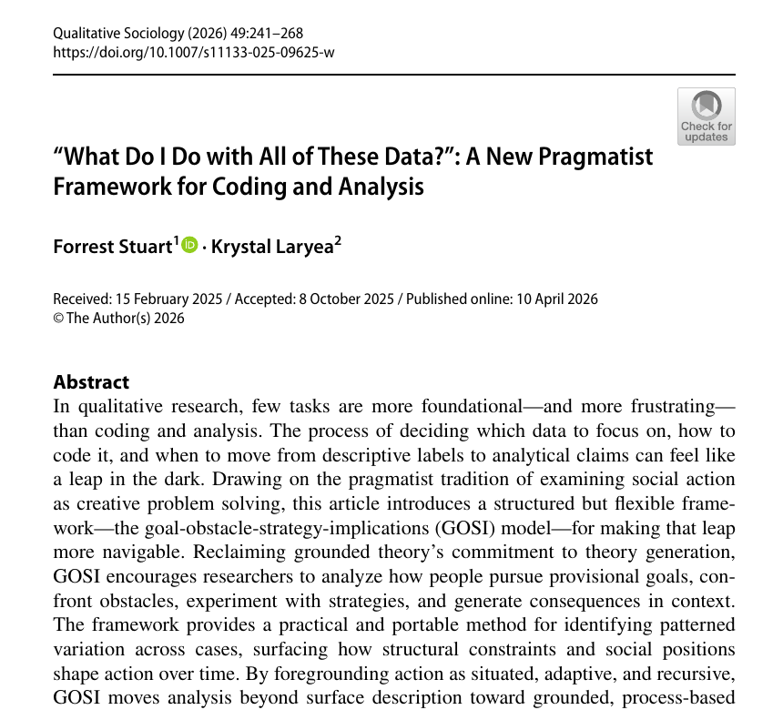

<b>Problem:</b> researchers can finish with categories that describe recurring content but do not explain action.

<b>Their framework:</b> examine actors' goals, obstacles, strategies, and the implications that follow.

<b>Why it matters here:</b> “mutual aid” is a topic. We still need to explain how practical exchange relates to identification, obligation, or withdrawal.

Stuart, F., and K. Laryea. (2026). “What Do I Do with All of These Data? A New Pragmatist Framework for Coding and Analysis.” <em>Qualitative Sociology</em> 49:241–268. https://doi.org/10.1007/s11133-025-09625-w.

::: {.notes}
[Sources]
- Published open-access PDF: `literature/source_pdfs/session03/stuart_laryea_2026.pdf`.
[/Sources]
:::

---

## The same passage can support description or explanation

<table class="closed-table"><thead><tr><th>Analytic move</th><th>What we could say about T03_A</th></tr></thead><tbody><tr><td>Topic</td><td>The participant discusses mutual aid.</td></tr><tr><td>Code</td><td><code>WITHDRAWAL_AFTER_OBLIGATION</code></td></tr><tr><td>Pattern</td><td>Some exchanges create participation; others produce distance.</td></tr><tr><td>Process explanation</td><td>When help becomes an enforceable obligation, preserving autonomy may become more important than remaining in the group.</td></tr></tbody></table>

The final row makes a stronger claim and therefore requires comparison with more passages, cases, and alternatives.

---

## Qualitative analysis repeatedly returns to earlier material

<b>Read and index</b>
Locate passages relevant to the question.

<b>Compare and code</b>
Ask what varies within and across cases.

<b>Write a memo</b>
Develop a possible relationship or explanation.

<b>Test the account</b>
Seek contrary cases and other explanations.

A later passage can change an earlier code, memo, or interpretation.

Deterding and Waters (2021); Timmermans and Tavory (2022); Stuart and Laryea (2026).

---

## An LLM can assist with parts of this work

<table class="closed-table loss-table"><thead><tr><th>Research activity</th><th>Possible model contribution</th><th>What the workflow must preserve</th></tr></thead><tbody><tr><td>Finding passages</td><td>Retrieve likely relevant excerpts.</td><td>Speaker, sequence, and surrounding text.</td></tr><tr><td>Applying a defined code</td><td>Suggest codes under explicit rules.</td><td>The code definition and cases where it fails.</td></tr><tr><td>Comparing cases</td><td>Place similarities and differences side by side.</td><td>Which cases were included or omitted.</td></tr><tr><td>Developing an account</td><td>Propose a candidate relationship or alternative.</td><td>Researcher memos, counterevidence, and revision history.</td></tr></tbody></table>

Fluent themes are easy to produce. The methodological question is whether the researcher preserves the source material, comparisons, memos, and revisions needed to assess them.

---

## A context window is not the same as analytic memory

<b>Context window</b>
The text included in one model call: instructions, excerpts, and earlier messages that the application sends again.

A separate API call does not automatically contain material from an earlier call.

<b>Memory system</b>
An application stores earlier material, selects what seems relevant, and places it back into a later context.

What is indexed, summarized, retrieved, or dropped is a methodological decision.

Liu et al. (2024); Wu et al. (2025).

---

## Long context does not guarantee equal attention to every passage

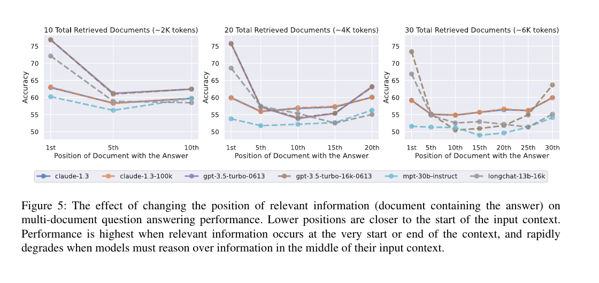

Liu and colleagues found that answer-relevant information was often used less reliably when it appeared in the middle of a long input. Supplying the full corpus is not evidence that every passage influenced the response equally.

Liu, N. F., K. Lin, J. Hewitt, et al. (2024). “Lost in the Middle: How Language Models Use Long Contexts.” <em>TACL</em> 12:157–173, selected Figure 5. https://doi.org/10.1162/tacl_a_00638.

::: {.notes}
[Sources]
- Published paper: `literature/source_pdfs/session03/liu_et_al_2024_lost_in_middle.pdf`.
[/Sources]
:::

---

## Long-term memory systems decide what the model sees again

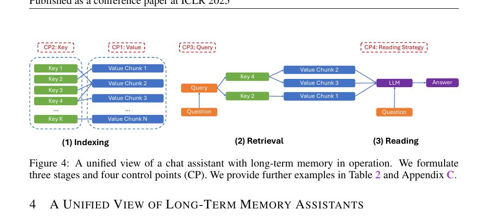

LongMemEval separates memory into indexing, retrieval, and reading. Each stage can omit or compress material. In qualitative analysis, those choices can determine which case appears relevant later.

Wu, D., H. Wang, W. Yu, et al. (2025). “LongMemEval: Benchmarking Chat Assistants on Long-Term Interactive Memory.” ICLR, Figure 4.

::: {.notes}
[Sources]
- ICLR 2025 paper: `literature/source_pdfs/session03/wu_et_al_2025_longmemeval.pdf`.
[/Sources]
:::

---

## Our worked example keeps the corpus deliberately small

<table class="closed-table"><thead><tr><th>Study element</th><th>Course example</th></tr></thead><tbody><tr><td>Setting</td><td>Tenants involved in neighbourhood mutual-aid networks after rent increases.</td></tr><tr><td>Material</td><td>Eight short interview excerpts from six participants.</td></tr><tr><td>Research question</td><td>How do residents distinguish emergency help from political solidarity?</td></tr><tr><td>Stored context</td><td>Participant ID, sequence, surrounding event, and excerpt text.</td></tr></tbody></table>

The data are synthetic. The purpose is to inspect the full analytical process, not make claims about real tenants.

---

## We give the model a specific and limited task

<b>INPUT</b>
The research question and all eight labelled excerpts.
<b>REQUEST</b>
Propose one candidate pattern. Cite the excerpt IDs that led to it. Return JSON containing <code>candidate_theme</code>, <code>supporting_excerpt_ids</code>, and <code>reasoning</code>.
<b>OUTPUT STATUS</b>
A suggestion for the researcher to investigate—not the study's finding.

---

## The model proposes a relationship among the excerpts

<b>CACHED SYNTHETIC MODEL OUTPUT</b>
“Mutual aid transforms practical dependence into political solidarity.”

The output cites <code>T01_B</code>, <code>T04_A</code>, and <code>T06_A</code>. We will check the passages, compare other cases, and decide whether the claim should be revised.

---

## Two of the cited passages make the proposal plausible

<small>T01_B · months after T01_A</small>“After a few months of taking turns with childcare, I started going to the tenants' meetings. The first time I spoke was about the broken elevator.”

<small>T04_A · repair exchanges</small>“Fixing things together meant we already trusted one another when the eviction notices arrived. Six of us wrote the petition and delivered it together.”

These passages support a possible link between repeated exchange and collective action. They do not show that the transformation occurs across the corpus.

---

## Mehta and colleagues provide a simple empirical warning

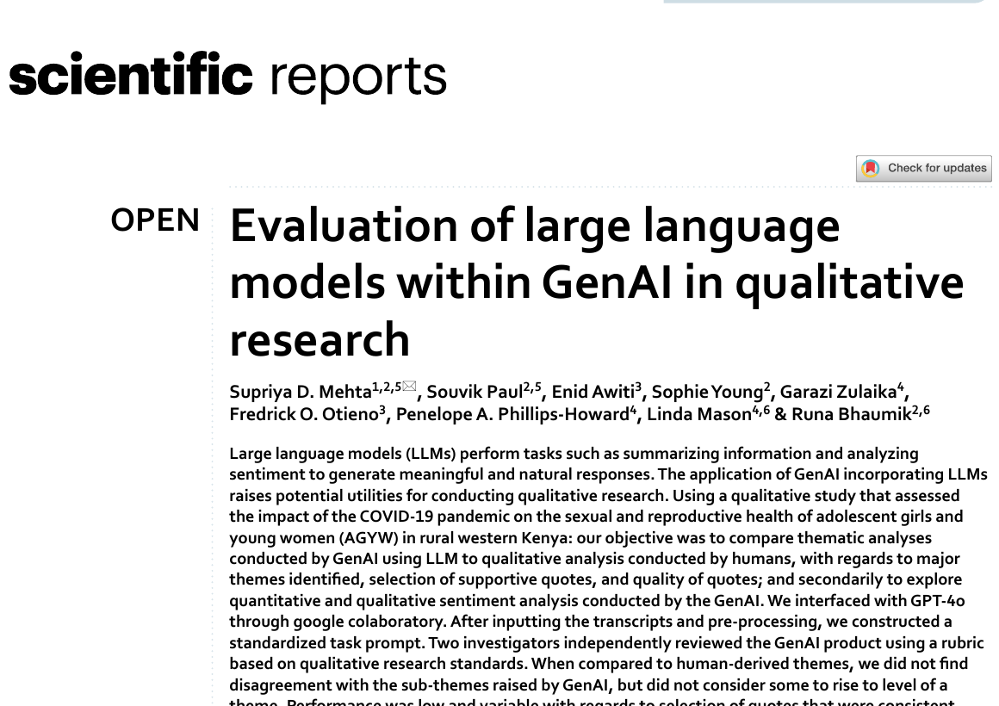

<b>Material:</b> focus groups on sexual and reproductive health during COVID-19 in rural western Kenya.

<b>Comparison:</b> human thematic analysis and GPT-4o output.

<b>Finding:</b> broad subthemes were often relevant, but selected quotations were unreliable and sometimes altered.

<b>Why it comes first:</b> before debating interpretation, we can check whether the evidence was reproduced correctly.

Mehta, S. D., S. Paul, E. Awiti, et al. (2025). “Evaluation of Large Language Models within GenAI in Qualitative Research.” <em>Scientific Reports</em> 15:34993. https://doi.org/10.1038/s41598-025-18969-w.

::: {.notes}
[Sources]
- Published open-access PDF: `literature/source_pdfs/session03/mehta_et_al_2025_scientific_reports.pdf`.
[/Sources]
:::

---

## Their published examples show why quotations must be checked

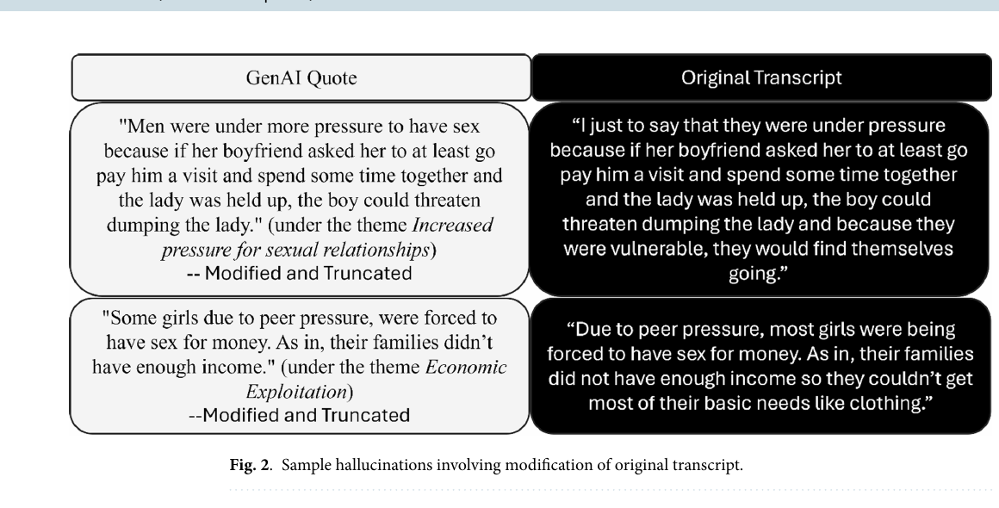

The generated quotations changed or truncated wording in ways that altered meaning. An exact-source check is therefore an essential first step.

Mehta et al. (2025), Figure 2.

---

## A correct quotation still leaves interpretive questions

<table class="closed-table"><thead><tr><th>Question</th><th>What a passing check establishes</th><th>What remains open</th></tr></thead><tbody><tr><td>Does the excerpt ID exist?</td><td>The cited record is in the corpus.</td><td>Whether it supports the claim.</td></tr><tr><td>Is the wording exact?</td><td>The quotation was not altered.</td><td>Whether surrounding context changes its meaning.</td></tr><tr><td>Were all eight excerpts supplied?</td><td>The model could receive the full small corpus.</td><td>Whether it used the cases evenly.</td></tr></tbody></table>

We will perform the source check in Python, then return to the qualitative work of comparison and revision.

---

## Than and colleagues test a bounded coding workflow

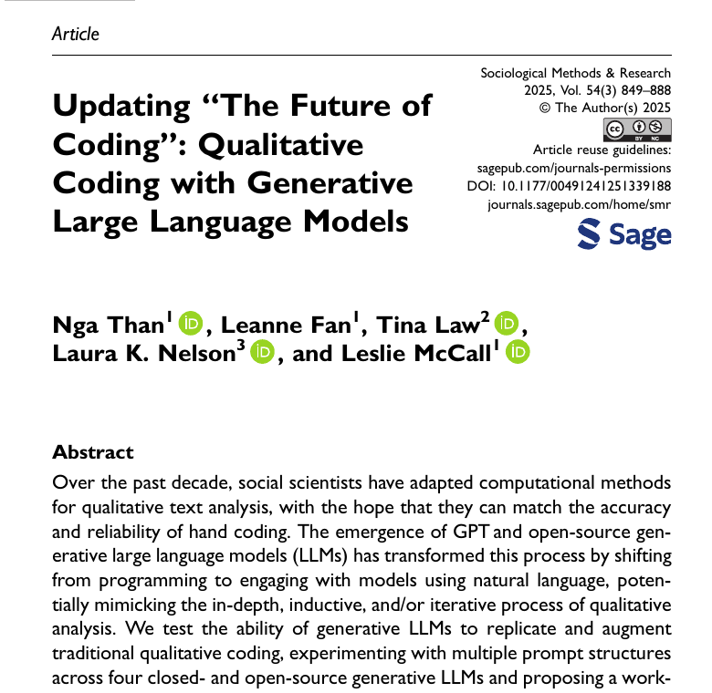

<b>Material:</b> 1,253 U.S. newsweekly articles published between 1980 and 2012.

<b>Task:</b> decide whether inequality is substantively central to each complete article.

<b>Models:</b> GPT-4 and three open models, compared with existing hand coding.

<b>Scope:</b> the study evaluates contextual classification inside a researcher-led qualitative coding workflow.

Than, N., L. Fan, T. Law, L. K. Nelson, and L. McCall. (2025). “Updating ‘The Future of Coding’: Qualitative Coding with Generative Large Language Models.” <em>Sociological Methods & Research</em> 54(3):849–888. https://doi.org/10.1177/00491241251339188.

::: {.notes}
[Sources]
- Published PDF supplied by instructor: `literature/source_pdfs/session03/than_et_al_2025_published.pdf`.
[/Sources]
:::

---

## Their example requires reading beyond a keyword

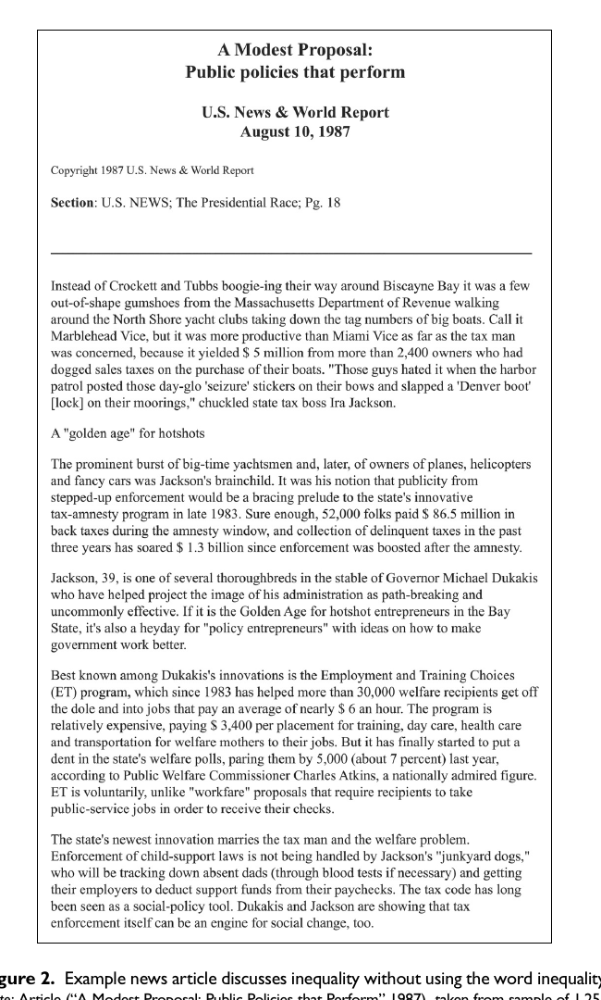

The article never uses the word <em>inequality</em>.

Human coders classified it as implicitly about inequality because it discusses tax enforcement, welfare policy, and economic distribution.

The model must apply a defined concept to a whole document—not merely retrieve a word.

Than et al. (2025), Figure 2.

---

## Than et al. retain researcher judgment at several points

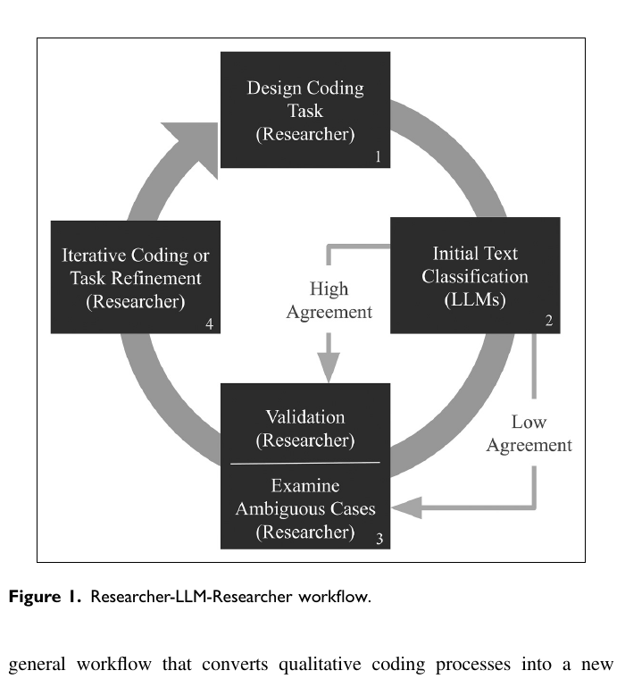

Than et al. (2025), Figure 1.

---

## Their workflow uses disagreement to target review

<b>Researchers</b>
Define and refine the coding task from substantive reading and an existing guide.

<b>Models classify</b>
Agreement can pass to validation. Disagreement identifies ambiguous cases.

<b>Researchers return</b>
Inspect cases, validate output, and revise the task or coding guide where needed.

Our worked example borrows this division of labour but asks for a candidate pattern rather than a final classification.

---

## The worked example follows five visible steps

<b>1 · Ask</b>
Send the research question and eight excerpts.

<b>2 · Save</b>
Store the proposed pattern and cited IDs.

<b>3 · Check</b>
Retrieve each cited passage from the corpus.

<b>4 · Compare</b>
Read support, countercases, and sequence.

<b>5 · Revise</b>
Write a narrower account and record why.

If a countercase changes the account, the researcher returns to the excerpts and the working codes.

---

## The model output gives us three inspectable fields

~~~json
{
  "candidate_theme": "Mutual aid transforms practical dependence into political solidarity.",
  "supporting_excerpt_ids": ["T01_B", "T04_A", "T06_A"],
  "reasoning": "Repeated exchange is followed by meeting attendance and petitioning."
}
~~~

<b>Theme</b>A proposed relationship to test.

<b>Source IDs</b>A route back to the cited passages.

<b>Reasoning</b>A claim about why those passages were selected.

The output is instructor-authored synthetic material.

---

## The corpus contains evidence that does not fit

<small>T02_A · emergency rent support</small>“I was grateful for the emergency fund, but I kept it separate from politics. I did not attend meetings and I still do not think of myself as an organizer.”

<small>T03_A · after initially helping</small>“Once the delivery rota became a requirement, it stopped feeling like help. I missed two shifts, people kept messaging me, and I left the group.”

One participant rejects political identification; another withdraws when help feels like obligation.

---

## Sequence changes what the first case can support

<small>T01_A · first encounter</small>“The grocery deliveries got us through the last week of the month. At that point I did not know who organized them.”

<small>T01_B · several months later</small>“After a few months of taking turns with childcare, I started going to the tenants' meetings.”

The shift follows repeated interaction. A single delivery is not enough to support the transformation claim.

---

## The evidence supports a narrower working interpretation

<b>Model proposal</b>
Mutual aid transforms practical dependence into political solidarity.

<b>Researcher revision</b>
Repeated mutual-aid exchanges sometimes created opportunities for political identification. Practical reliance could also remain separate from politics or produce withdrawal when help was experienced as obligation.

The wording changes because the countercases and chronology change what the evidence can support.

---

## Ibrahim and Voyer make the interaction part of the method

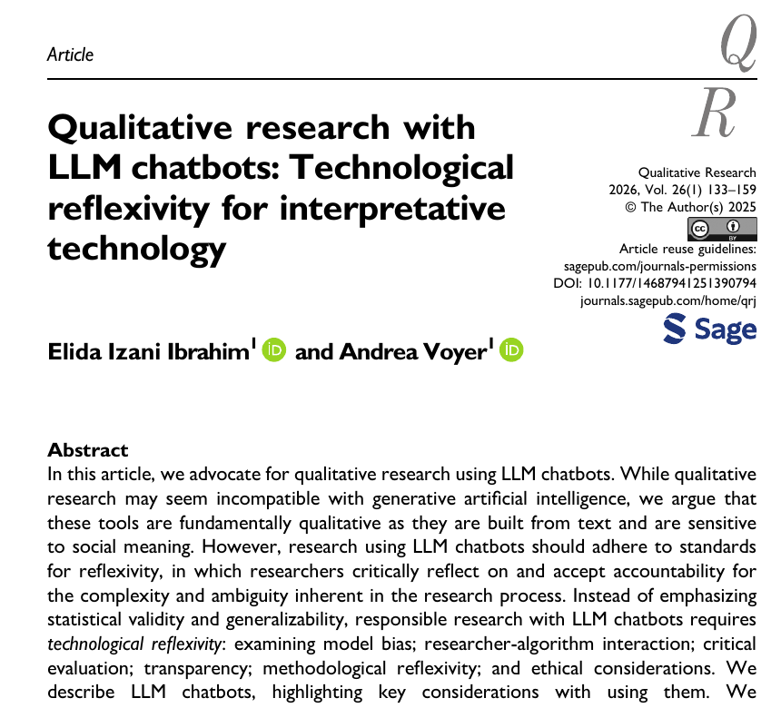

<b>Examples:</b> deductive coding of Twitter bios and inductive analysis of etiquette texts.

<b>Argument:</b> prompts express researchers' assumptions, while model responses can redirect subsequent analysis.

<b>Proposal:</b> technological reflexivity should cover model bias, researcher–algorithm interaction, evaluation, transparency, epistemic reflection, and ethics.

Ibrahim, E. I., and A. Voyer. (2026). “Qualitative Research with LLM Chatbots: Technological Reflexivity for Interpretative Technology.” <em>Qualitative Research</em> 26(1):133–159. https://doi.org/10.1177/14687941251390794.

::: {.notes}
[Sources]
- Published PDF supplied by instructor: `literature/source_pdfs/session03/ibrahim_voyer_2026_published.pdf`.
[/Sources]
:::

---

## Their checklist specifies what reflexivity covers

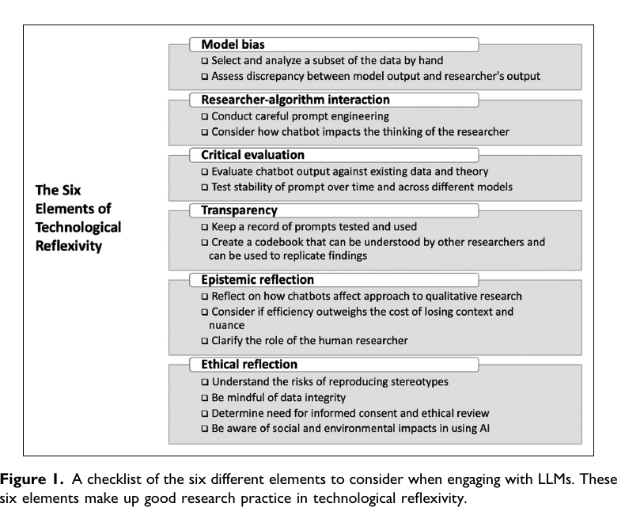

Ibrahim and Voyer (2026), Figure 1.

---

## They ask researchers to analyse the chat as a timeline

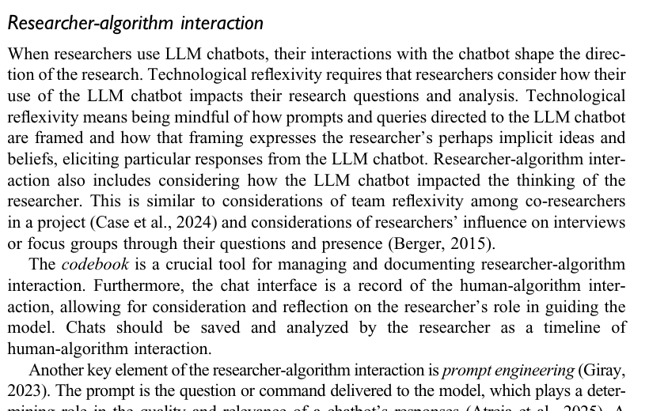

The prompt reflects the researcher's definitions and assumptions.

The response may make some patterns easier to notice and others easier to ignore.

Saving the chat preserves the exchange. A researcher memo is still needed to explain how it affected the next analytic decision.

Ibrahim and Voyer (2026), pp. 142–143.

---

## Their first prompt exposed an unstated coding rule

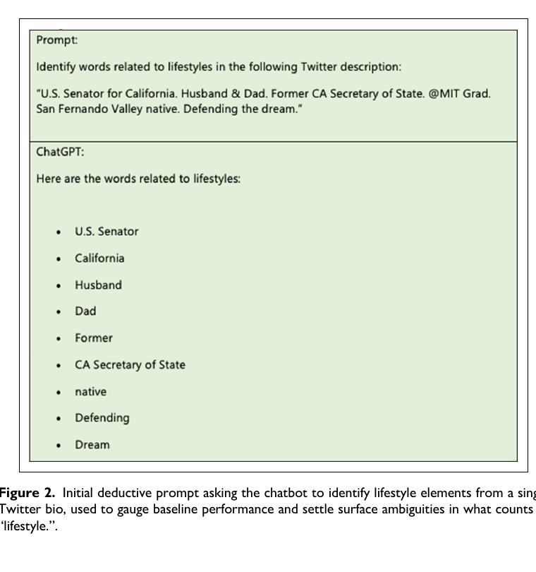

The model treated offices, locations, and status words as “lifestyle” because the researchers had not supplied their fuller definition.

Comparing the output with hand coding made the implicit rule visible.

The researchers then expanded the definition and updated the codebook.

Ibrahim and Voyer (2026), Figure 2 and accompanying text.

---

## Their inductive example uses a continuing chat

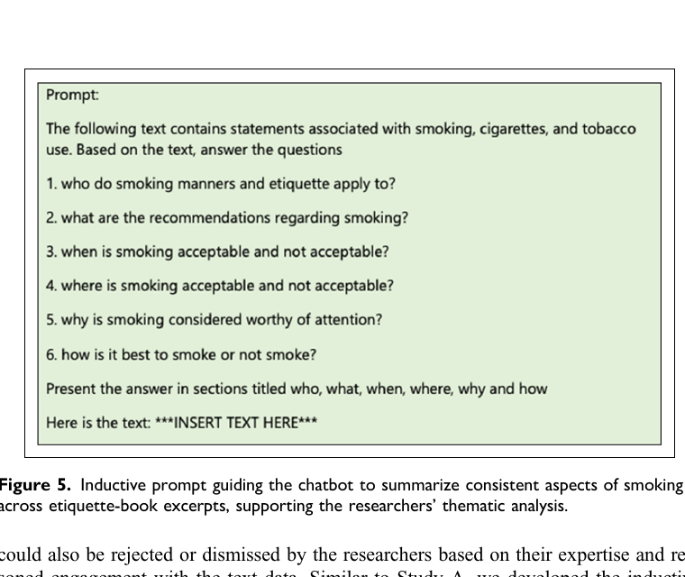

The model receives a substantive question and the relevant etiquette-book text.

Follow-up questions occur in the same chat, so earlier prompts and outputs remain part of the immediate context.

The researchers retain or reject suggestions using their own reading and expertise.

Ibrahim and Voyer (2026), Figure 5 and pp. 145–146.

---

## This is the interaction we will record in the example

<b>Before the model</b>
Researcher memo: practical help and political identity may remain separate.

<b>Model request</b>
Research question plus eight labelled excerpts.

<b>Model proposal</b>
Mutual aid transforms dependence into solidarity.

<b>Researcher response</b>
Check sources, inspect countercases, and revise the claim.

The research record should preserve all four stages, including what the researcher had already noticed.

---

## There are no settled standards for this work yet

<b>Tasks vary</b>
Studies use LLMs for retrieval, coding, theme proposals, quotation selection, and interpretation.

<b>Evidence varies</b>
Some compare with human coding; others document an iterative collaboration.

<b>Models change</b>
Access routes, context limits, and underlying models can change during a project.

This is a fast-moving methodological area. Researchers need to state exactly what the model did, what it saw, how output was checked, and which decisions remained human.

Than et al. (2025); Mehta et al. (2025); Ibrahim and Voyer (2026).

---

## After the break, we will follow one analysis record in Python {.section-slide}

The code reproduces the same sequence: excerpts → model request → saved proposal → source check → researcher comparison → revised claim.

---

## First see the complete program in ordinary language

<pre>1. Store the research question and interview excerpts.
2. Build one request containing those exact inputs.
3. Send the request, or load the cached response.
4. Parse the returned JSON into a Python dictionary.
5. Retrieve every excerpt cited by the model.
6. Add counterexamples, context and an alternative interpretation.
7. Save what the researcher decided and why.</pre>

Every following slide advances this same record by one operation.

---

## The setup creates a client but does not contact a model

~~~python
import json
import os
from openrouter import OpenRouter

api_key = os.environ["OPENROUTER_API_KEY"]
client = OpenRouter(api_key=api_key)
~~~

<b>Objects now available</b><pre>json
module for reading JSON text

api_key
string read from the environment

client
OpenRouter client object</pre>

No interview text has left the computer. The network request occurs later, when the program calls <code>client.chat.send(...)</code>.

---

## The starting inputs are the research question and excerpt records

~~~python
research_question = (
    "How do residents distinguish emergency help "
    "from political solidarity?"
)

excerpts = [
    {
        "excerpt_id": "T01_A",
        "participant_id": "T01",
        "sequence": 1,
        "text": "The grocery deliveries got us through..."
    },
    # seven more records
]
~~~

<b>Objects created</b><pre>research_question
type: str

excerpts
type: list

excerpts[0]
type: dict</pre>

---

## One dictionary keeps a passage with its source context

~~~python
excerpt = excerpts[0]

print(excerpt["excerpt_id"])
print(excerpt["text"])
~~~

<b>Output</b><pre>T01_A
The grocery deliveries got us
through the last week...</pre>

<b>Input</b><code>excerpt</code>, one dictionary.

<b>Operation</b>Retrieve two values by their keys.

<b>Research meaning</b>The quoted text remains tied to a stable source ID.

---

## The prompt contains the question, task, and excerpts

~~~python
prompt = f"""
Research question:
{research_question}

Task:
Propose one candidate pattern.
Cite supporting excerpt IDs.
Return JSON.

Excerpts:
{json.dumps(excerpts)}
"""
~~~

<b>Output</b><pre>one string containing:

• the research question
• the bounded request
• all eight source records
• the required response format</pre>

The prompt shows exactly what the model receives. It does not include earlier researcher memos unless we deliberately add them.

---

## The messages list assigns a role to each string

~~~python
messages = [
    {
        "role": "system",
        "content": "You assist a sociologist with qualitative analysis."
    },
    {
        "role": "user",
        "content": prompt
    }
]
~~~

<b>Input</b>Two strings.

<b>Output</b>One list containing two dictionaries.

<b>Why</b>The SDK sends this structured conversation to the model.

---

## The model call returns one response object

~~~python
response = client.chat.send(
    model="openai/gpt-5.2",
    messages=messages,
    temperature=0.2,
    max_tokens=300
)
~~~

<b>What each argument does</b><pre>model
selects the hosted model

messages
supplies the inputs above

temperature, max_tokens
set generation conditions

response
stores the returned SDK object</pre>

The workbook can load a cached response with the same structure when a key or network connection is unavailable.

---

## We retrieve the returned text and parse its JSON

~~~python
raw_output = response.choices[0].message.content
proposal = json.loads(raw_output)

print(type(raw_output))
print(type(proposal))
~~~

<b>Output</b><pre>&lt;class 'str'&gt;
&lt;class 'dict'&gt;</pre>

Parsing changes the Python representation from one string to named fields. It does not establish that the proposed theme is sound.

---

## The proposal dictionary stores exactly what the model suggested

~~~python
print(proposal["candidate_theme"])
print(proposal["supporting_excerpt_ids"])
~~~

<b>Output</b><pre>Mutual aid transforms practical
dependence into political solidarity.

["T01_B", "T04_A", "T06_A"]</pre>

The theme is a string. The citations are a list of strings that can be matched to the source records.

---

## An index lets us retrieve any cited passage by ID

~~~python
excerpt_by_id = {}

for excerpt in excerpts:
    excerpt_id = excerpt["excerpt_id"]
    excerpt_by_id[excerpt_id] = excerpt
~~~

<b>After the first pass</b><pre>{
  "T01_A": {
    "excerpt_id": "T01_A",
    "participant_id": "T01",
    "sequence": 1,
    "text": "The grocery..."
  }
}</pre>

The loop reorganizes records already stored in Python. It does not call the model.

---

## The source check follows each cited ID back to the corpus

~~~python
found_excerpts = []
missing_ids = []

for excerpt_id in proposal["supporting_excerpt_ids"]:
    if excerpt_id in excerpt_by_id:
        found_excerpts.append(excerpt_by_id[excerpt_id])
    else:
        missing_ids.append(excerpt_id)
~~~

<b>Input</b>A list of three cited IDs and the source index.

<b>Operation</b>Test whether each ID is a dictionary key.

<b>Output</b>Found records and any missing IDs.

---

## The first loop iteration retrieves T01_B

<code>excerpt_id</code><code>"T01_B"</code>

<code>excerpt_id in excerpt_by_id</code><code>True</code>

<code>operation</code>Append the complete <code>T01_B</code> dictionary to <code>found_excerpts</code>.

<code>research meaning</code>The cited passage exists and can now be read with its participant and sequence fields.

---

## A successful source check has a narrow result

~~~python
source_check = {
    "source_traceable": len(missing_ids) == 0,
    "found_excerpts": found_excerpts,
    "missing_ids": missing_ids
}
~~~

<b>Output</b><pre>{
  "source_traceable": true,
  "found_excerpts": [
    "T01_B", "T04_A", "T06_A"
  ],
  "missing_ids": []
}</pre>

All three citations exist. We still need to decide whether they represent the corpus and support the proposed relationship.

---

## The researcher adds the comparisons that changed the claim

~~~python
review = {
    "supporting_excerpt_ids": ["T01_B", "T04_A"],
    "counterexample_ids": ["T02_A", "T03_A"],
    "sequence_note": (
        "T01_B follows months of repeated exchange; "
        "T01_A alone does not show political identification."
    ),
    "alternative_interpretation": (
        "Mutual aid creates opportunities for political "
        "identification without reliably producing it."
    )
}
~~~

These values come from the researcher's comparison of the stored passages, not from the source-checking loop.

---

## We also record how the model affected the analysis

~~~python
interaction_log = {
    "pre_model_memo": (
        "Practical help and political identity may remain separate."
    ),
    "model_proposal": proposal["candidate_theme"],
    "researcher_response": (
        "The proposal directed attention to conversion stories. "
        "I then searched explicitly for refusal and withdrawal."
    )
}
~~~

This is the classroom implementation of Ibrahim and Voyer's researcher–algorithm interaction: what the researcher thought before, what the model proposed, and what changed next.

---

## The final record joins the source check and researcher review

~~~python
analysis_record = {
    "research_question": research_question,
    "model_request": prompt,
    "raw_model_output": raw_output,
    "source_check": source_check,
    "researcher_review": review,
    "interaction_log": interaction_log,
    "revised_claim": (
        "Repeated exchanges sometimes created opportunities "
        "for political identification, but reliance could remain "
        "separate from politics or produce withdrawal."
    )
}
~~~

Another reader can see the inputs, generated proposal, cited evidence, countercases, analytic response, and revised wording.

---

## A short check reports which parts of the record are missing

~~~python
required_fields = [
    "research_question",
    "model_request",
    "raw_model_output",
    "source_check",
    "researcher_review",
    "interaction_log",
    "revised_claim"
]

missing = [
    name for name in required_fields
    if not analysis_record.get(name)
]
~~~

<b>Output</b><pre>missing = []</pre>

The output means that the seven expected fields are present. It says nothing about whether the researcher made the best interpretation.

---

## The Python workflow now matches the methodological argument

<table class="closed-table"><thead><tr><th>Operation</th><th>What Python returns</th><th>What the researcher still decides</th></tr></thead><tbody><tr><td>Build the request</td><td>The exact text supplied to the model</td><td>Whether the question and material are appropriate</td></tr><tr><td>Parse the response</td><td>Named fields in a dictionary</td><td>Whether the proposed relationship is useful</td></tr><tr><td>Trace cited IDs</td><td>Found records and missing IDs</td><td>Whether the passages support the claim</td></tr><tr><td>Save the review</td><td>Countercases, alternatives, memo, and revision</td><td>What interpretation best explains the material</td></tr></tbody></table>

---

## The three empirical papers answer different questions

<table class="closed-table"><thead><tr><th>Paper</th><th>Contribution to this class</th></tr></thead><tbody><tr><td>Mehta et al. (2025)</td><td>Check that quotations and source support have not been altered.</td></tr><tr><td>Than et al. (2025)</td><td>Give the model a defined task inside a researcher-led coding and validation workflow.</td></tr><tr><td>Ibrahim and Voyer (2026)</td><td>Document how researchers shape the model and how its output redirects the analysis.</td></tr></tbody></table>

Together they provide a usable starting point, not a settled standard for every qualitative tradition.

---

## We can now explain exactly why the claim changed

<small>INITIAL MODEL PROPOSAL</small>“Mutual aid transforms practical dependence into political solidarity.”

<b>Source check:</b> the cited passages exist.

<b>Comparison:</b> T02_A separates help from politics.

<b>Sequence:</b> T01_B follows repeated exchange, not one delivery.

<b>Counterprocess:</b> T03_A links obligation to withdrawal.

<b>Revision:</b> mutual aid can create opportunities for identification without reliably producing it.

The LLM supplied a candidate relationship. The analysis comes from checking it against cases, context, sequence, alternatives, and the researcher's developing account.

