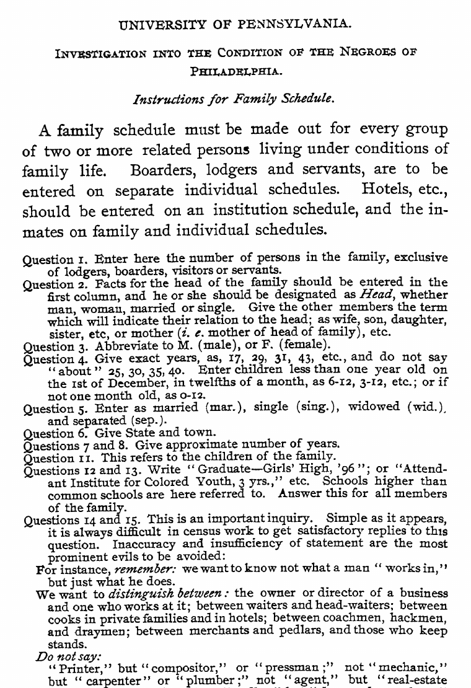
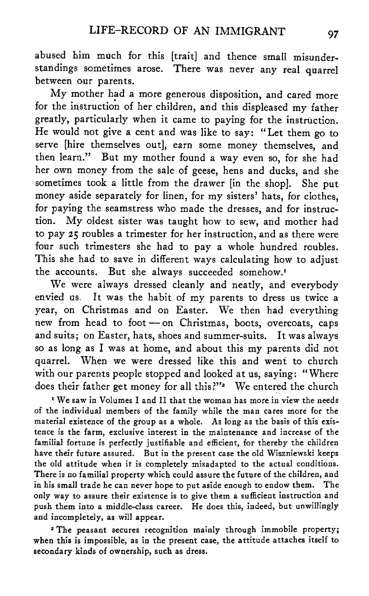
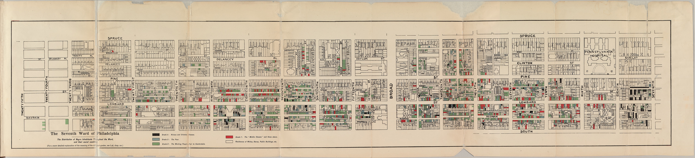
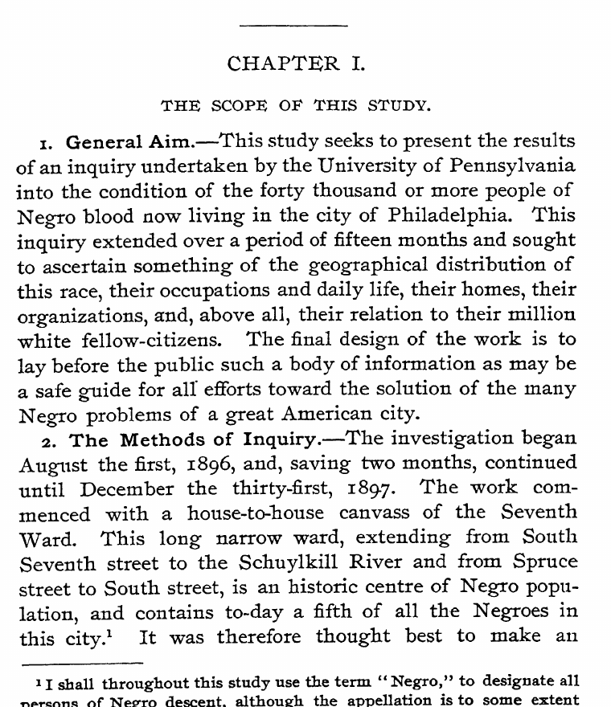
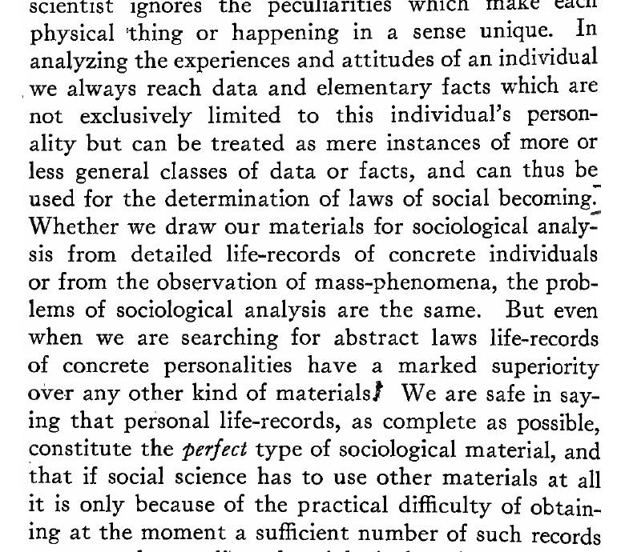
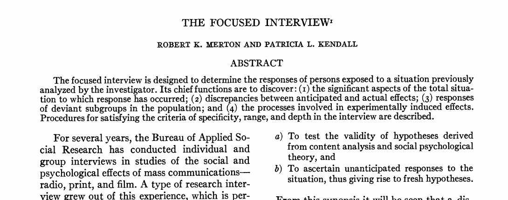
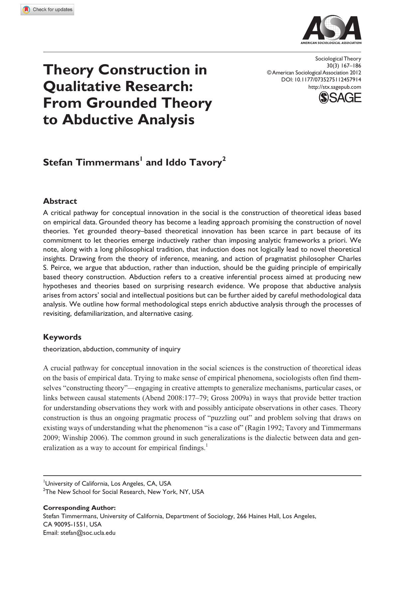
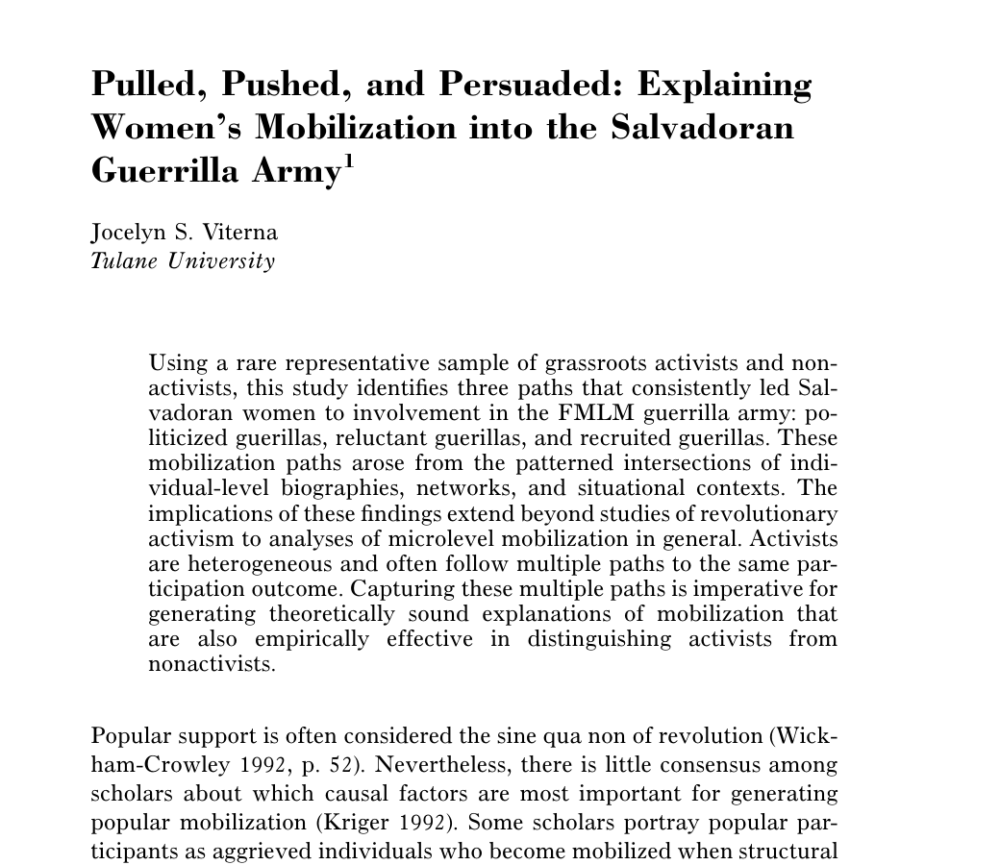
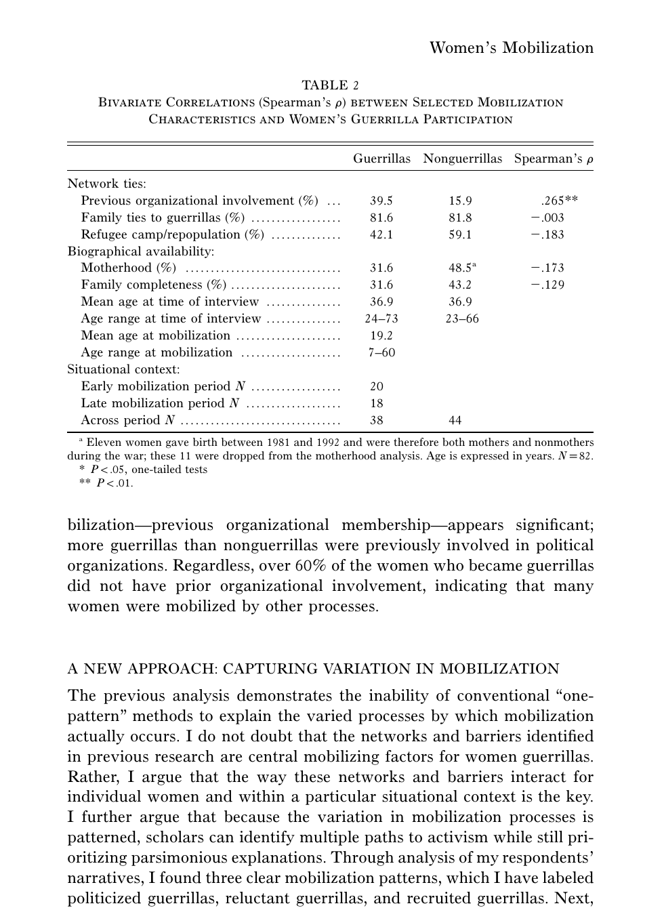
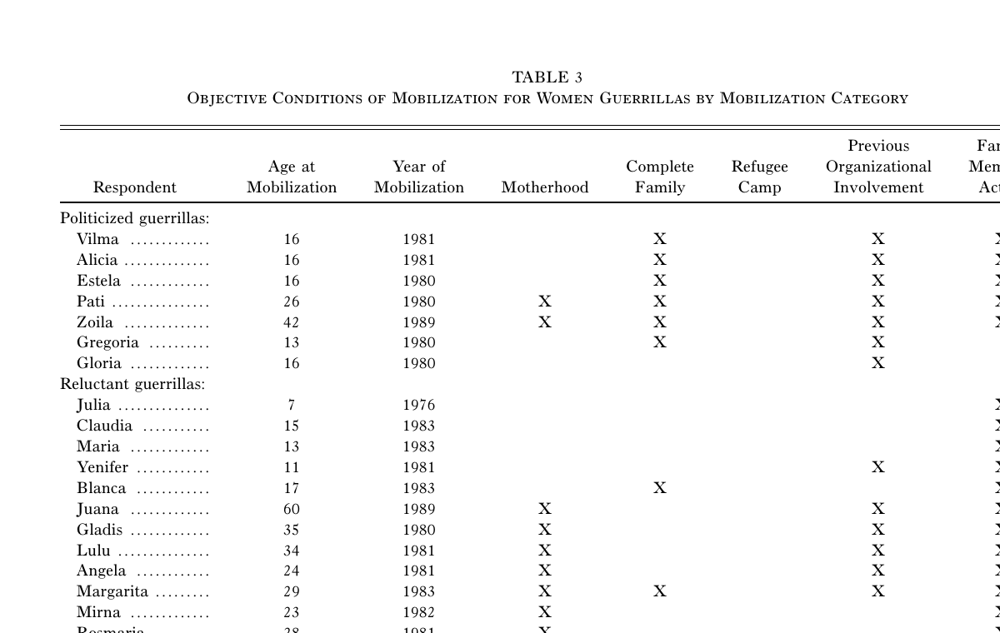

## Where qualitative evidence comes from

OBSERVATION
Researchers watch conduct, interaction and routine in a social setting.

PARTICIPATION
Access develops through relationships and time spent in the field.

INTERVIEW
Researchers ask questions and decide when an answer needs a follow-up.

PERSONAL DOCUMENT
Letters, diaries and life histories preserve accounts produced for different audiences.

These sources do not arrive ready for analysis. Sociologists decide what to observe, what to ask, what to record and how to compare it.

Du Bois (1899); Thomas and Znaniecki (1919); Whyte (1943); Merton and Kendall (1946).

---

## Three questions for today

1<b>How was the evidence made?</b>
What happened before a transcript, image, life history or fieldnote became available for analysis?

2<b>What does the researcher know that is not contained in one extract?</b>
Relationships, chronology, setting, prior observations and the conditions under which something was said.

3<b>What part of the research process is the model performing?</b>
Finding material, applying a code, comparing cases, suggesting an interpretation or shaping what happens next.

Questions developed from the methodological problems raised by Whyte (1943); Merton and Kendall (1946); Deterding and Waters (2021); Timmermans and Tavory (2012); Than et al. (2025); Ibrahim and Voyer (2026).

---

## Du Bois mapped the social organization of Philadelphia's Seventh Ward

<b>The Seventh Ward, 1896</b>The map records where Black residents lived and classifies their social condition block by block. It formed part of a study that also used household visits, schedules, historical records and direct observation.

W. E. B. Du Bois. (1899). <em>The Philadelphia Negro: A Social Study</em>. University of Pennsylvania. Map held by Widener Library, Harvard University; public-domain scan via Wikimedia Commons.

---

## The study began with fifteen months of empirical work

Du Bois describes a house-to-house canvass conducted from August 1896 to December 1897.

The investigation covered residence, occupation, daily life, homes, organizations and relations with white Philadelphians.

The eventual book joined these observations to maps, schedules, tables and historical evidence.

Du Bois (1899), “The Scope of This Study,” pp. 1–2.

---

## The schedule defined what investigators would record

The family schedule specified who belonged on the same record and how investigators should describe age, family relationships, education and occupation.

The instructions ask for exact ages and precise occupations. Categories were part of the research design rather than clerical work completed afterwards.

Du Bois (1899), Appendix A, “Instructions for Family Schedule,” p. 402.

---

## Thomas and Znaniecki made individual lives central to sociological explanation

<em>The Polish Peasant</em> used letters, autobiographical material and a long life record to study migration, family relations and social change.

The authors argued that a life record could connect an individual's experiences to more general social processes.

The claim was ambitious. It also established personal documents as material that sociologists could compare and interpret.

W. I. Thomas and F. Znaniecki. (1919). <em>The Polish Peasant in Europe and America</em>, vol. 3, pp. 5–8.

---

## A life history preserves chronology as well as topics

This page records disagreements about children's education, the mother's efforts to save money and the family's concern with dress and respectability.

Those details acquire meaning through their place in a longer biography. Extracting “education” or “family conflict” as themes would not reproduce that chronology.

Thomas and Znaniecki (1919), <em>Life-Record of an Immigrant</em>, p. 97.

---

## Whyte entered Cornerville through Doc

Whyte called the Italian neighbourhood he studied in Boston's North End <b>“Cornerville.”</b>

<b>Doc was Ernest Pecci</b>, the leader of the Norton Street group. He introduced Whyte to people he knew, vouched for him and helped him enter settings where an unknown outsider would not have been welcome.

This was not simply a way to recruit participants. Whyte's access began inside Doc's network, and that relationship shaped what he could observe and how other people understood his presence.

William Foote Whyte. (1943). <em>Street Corner Society: The Social Structure of an Italian Slum</em>. University of Chicago Press. Cover shown: 4th ed.

---

## He found organization where outsiders often saw disorder

<b>The corner groups had a social structure.</b>Who led, who followed and how members responded to one another formed a relatively stable hierarchy.

<b>Position in the group helped explain conduct.</b>Leadership rested on reciprocal obligations, and leaders represented their groups in dealings with others.

<b>The street corner was connected to wider institutions.</b>Corner groups, clubs, rackets and ward politics were parts of the same local social world.

<b>What did participant observation add?</b>By returning to the same people and following relationships across settings, Whyte could compare what people said with how they interacted, identify recurring patterns of rank and obligation, and trace connections that no single interview or brief visit would have revealed.

William Foote Whyte. (1941). “Corner Boys: A Study of Clique Behavior.” <em>American Journal of Sociology</em> 46(5):647–664; Whyte (1943), <em>Street Corner Society</em>. Photograph: Boston Public Library, file 08_02_002080.

---

## Merton and Kendall turned from observed conduct to reported experience

<b>Whyte observed relationships as they unfolded.</b>Merton and Kendall asked how an interview could reconstruct a person's experience of a situation the researcher had already studied.

The starting point might be a film, radio programme or other situation that the research team had analysed in advance.

The interviewer could therefore ask about particular moments while remaining open to responses the researchers had not anticipated.

The interview produced a different kind of evidence from participant observation: a detailed account of what the participant noticed, felt and understood.

Follow-up questions were crucial for establishing specificity, range and depth.

Robert K. Merton and Patricia L. Kendall. (1946). “The Focused Interview.” <em>American Journal of Sociology</em> 51(6):541–557.

---

## Each method produces a different record of social life

<b>Du Bois</b>
<strong>Encounter:</strong> a fifteen-month investigation including household visits.

<strong>Record:</strong> schedules, maps, tables and observations.

<strong>Not contained in one schedule:</strong> the wider social organization assembled across these sources.

<b>Thomas and Znaniecki</b>
<strong>Encounter:</strong> collecting letters and an extended life history.

<strong>Record:</strong> personal documents written for particular audiences.

<strong>Not contained in one extract:</strong> the longer biography and changing social circumstances.

<b>Whyte</b>
<strong>Encounter:</strong> access through Doc and repeated participation.

<strong>Record:</strong> observations combined into an ethnographic account.

<strong>Not contained in one passage:</strong> rapport, tacit knowledge and unrecorded encounters.

<b>Merton and Kendall</b>
<strong>Encounter:</strong> a focused interview about an already studied situation.

<strong>Record:</strong> questions, answers and follow-up probes.

<strong>Not contained in one answer:</strong> the question and prior analysis that made it meaningful.

If a model receives only the finished record, how much of the process that produced it can the model reconstruct?

---

## Our interview example

<small>T01_A · first interview segment</small>“The grocery deliveries got us through the last week of the month. At that point I did not know who organized them.”

<b>Study</b>
Interviews with tenants involved in mutual-aid networks after a period of rent increases.
<b>Research question</b>
How do residents distinguish emergency help from political solidarity?
<b>Today's problem</b>
How could we move from this account to a defensible interpretation?

All tenant interviews in this class are instructor-authored synthetic material.

---

## The source record tells us how to read the passage

<b>Source information</b>Participant: T01Excerpt: T01_APosition: early in interviewBefore: discussion of a rent increaseAfter: later account of childcare exchanges and tenant meetings

“The grocery deliveries got us through the last week of the month. At that point I did not know who organized them.”

The speaker received practical help before knowing the people behind it. Whether this later became solidarity is still an open question.

---

## Qualitative analysis connects accounts, contexts, and concepts

<b>Meaning in context</b>
What does the passage mean within this interview and social setting?

<b>Comparison</b>
How does this case resemble or differ from other cases and moments?

<b>Explanation</b>
What process or relationship does the comparison help us understand?

Coding helps organize the material. The larger aim is a sociological account that remains grounded in what participants said and did.

Deterding and Waters (2021); Timmermans and Tavory (2012); Viterna (2006).

::: {.notes}
[Sources]
- Deterding, N. M., and M. C. Waters. 2021. “Flexible Coding of In-depth Interviews.” Sociological Methods & Research 50(2):708–739. https://doi.org/10.1177/0049124118799377.
- Timmermans, S., and I. Tavory. 2012. “Theory Construction in Qualitative Research.” Sociological Theory 30(3):167–186. https://doi.org/10.1177/0735275112457914.
- Viterna, J. S. 2006. “Pulled, Pushed, and Persuaded.” American Journal of Sociology 112(1):1–45. https://doi.org/10.1086/502690.
[/Sources]
:::

---

## A first pass finds passages; a second pass compares them

FIRST PASS · WORK THROUGH EVERY INTERVIEW<h3>Find passages about receiving help</h3>

<small>T01_A</small>“The <mark>grocery deliveries</mark> got us through the last week of the month.”

<small>T01_B</small>“After a few months of taking turns with <mark>childcare</mark>…”

<small>T02_A</small>“I was grateful for the <mark>emergency fund</mark>…”

RECEIVING_HELP
The broad code tells us where to look again.

Return to the indexed passages<b>→</b>

SECOND PASS · READ THE PASSAGES TOGETHER<h3>Compare what receiving help meant</h3>

<small>T01</small><strong>Repeated exchange precedes meeting attendance</strong>EXCHANGE_TO_PARTICIPATION

<small>T02</small><strong>Emergency support remains separate from politics</strong>HELP_WITHOUT_IDENTIFICATION

The comparison gives us a more specific analytic question.

Deterding and Waters distinguish consistent, broad index coding from the more interpretive coding that develops as researchers compare passages and cases.

Deterding, N. M., and M. C. Waters. (2021). “Flexible Coding of In-depth Interviews: A Twenty-first-century Approach.” <em>Sociological Methods & Research</em> 50(2):708–739. https://doi.org/10.1177/0049124118799377.

---

## Index coding gives us a reliable route back to the material

<small>T01_A</small>“The grocery deliveries got us through the last week of the month.”

RECEIVING_HELP
This broad code gathers passages about receiving food, childcare, repairs, or emergency funds.

It answers: <b>where should we look?</b>

The index code does not yet tell us what receiving help meant to this participant.

---

## Analytic coding asks what is happening across cases

<table class="closed-table"><thead><tr><th>Excerpt</th><th>What happens?</th><th>Developing analytic code</th></tr></thead><tbody><tr><td><code>T01_A</code></td><td>Help arrives before the recipient knows the organizers.</td><td><code>HELP_BEFORE_RELATIONSHIP</code></td></tr><tr><td><code>T01_B</code></td><td>Repeated childcare exchanges precede meeting attendance.</td><td><code>REPEATED_EXCHANGE_TO_PARTICIPATION</code></td></tr><tr><td><code>T02_A</code></td><td>Emergency support is kept separate from politics.</td><td><code>HELP_WITHOUT_IDENTIFICATION</code></td></tr></tbody></table>

The code changes because the comparison changes what the researcher notices.

---

## Timmermans and Tavory explain how surprise can lead to theory

<b>Starting point:</b> an observation does not fit what the researcher expected.

<b>Analytic work:</b> revisit the evidence, question the concepts that made it surprising, and compare alternative explanations.

<b>Our case:</b> a tenant accepts help but explicitly rejects political identification. That case may require us to revise what we mean by participation.

Timmermans, S., and I. Tavory. (2012). “Theory Construction in Qualitative Research: From Grounded Theory to Abductive Analysis.” <em>Sociological Theory</em> 30(3):167–186. https://doi.org/10.1177/0735275112457914.

::: {.notes}
[Sources]
- Published article: `literature/source_pdfs/session03/timmermans_tavory_2012_abductive_analysis.pdf`.
[/Sources]
:::

---

## Abductive analysis gives us three concrete moves

<b>Revisit</b>
Return to earlier passages after a later case changes the question.

<b>Defamiliarize</b>
Question the concepts that made one interpretation seem obvious.

<b>Compare alternatives</b>
Ask what else could explain the same material.

These moves are drawn from Timmermans and Tavory's account of abductive theory construction, not a generic checklist for using AI.

Timmermans and Tavory (2012), pp. 179–182.

---

## Viterna shows why a list of themes is not enough

Viterna asks why women entered the Salvadoran guerrilla army through different routes.

Her evidence combines a rare sample of activists and non-activists with detailed life histories.

The substantive result is not simply that biographies, networks and repression all matter. Their patterned intersections produce different pathways into the same outcome.

Viterna, J. S. (2006). “Pulled, Pushed, and Persuaded: Explaining Women's Mobilization into the Salvadoran Guerrilla Army.” <em>American Journal of Sociology</em> 112(1):1–45. https://doi.org/10.1086/502690.

---

## Her analysis moves from variables back to lives and sequences

A variable-by-variable comparison finds only limited differences between guerrillas and non-guerrillas.

Viterna then returns to respondents' narratives and identifies three paths: politicized, reluctant and recruited guerrillas.

The move matters: the same factor can have a different meaning depending on when it appears and what else accompanies it.

Viterna (2006), pp. 18–20, especially Table 2 and “A New Approach: Capturing Variation in Mobilization.”

---

## The comparison is made case by case, not only theme by theme

Each row is a woman and each column records part of her life history. Grouping cases by pathway makes the comparison visible.

Viterna (2006), Table 3, pp. 22–23.

---

## What has “context” meant in these studies?

<b>Position in a record</b>
What comes before and after a passage.
<small>Deterding and Waters</small>

<b>Chronology</b>
When something happens within a life or sequence.
<small>Thomas and Znaniecki; Viterna</small>

<b>Relationships</b>
Who knows whom, who provides access and how positions change.
<small>Whyte</small>

<b>Elicitation</b>
Which question, stimulus or interaction produced an answer.
<small>Merton and Kendall</small>

<b>Expectation and surprise</b>
What the researcher expected and why an observation is anomalous.
<small>Timmermans and Tavory</small>

<b>Comparison and countercases</b>
Which other cases support, qualify or contradict the account.
<small>Deterding and Waters; Viterna</small>

Which of these can be stored in a prompt or metadata field? Which depend on repeated engagement with the material and the setting?

---

## Qualitative analysis repeatedly returns to earlier material

<b>Read and index</b>
Locate passages relevant to the question.

<b>Compare and code</b>
Ask what varies within and across cases.

<b>Write a memo</b>
Develop a possible relationship or explanation.

<b>Test the account</b>
Seek contrary cases and other explanations.

A later passage can change an earlier code, memo, or interpretation.

Deterding and Waters (2021); Timmermans and Tavory (2012); Viterna (2006).

---

## We need to specify which part of the research process the model enters

<table class="closed-table loss-table"><thead><tr><th>Research activity</th><th>Possible model contribution</th><th>What the workflow must preserve</th></tr></thead><tbody><tr><td>Finding passages</td><td>Retrieve likely relevant excerpts.</td><td>Speaker, sequence, and surrounding text.</td></tr><tr><td>Applying a defined code</td><td>Suggest codes under explicit rules.</td><td>The code definition and cases where it fails.</td></tr><tr><td>Comparing cases</td><td>Place similarities and differences side by side.</td><td>Which cases were included or omitted.</td></tr><tr><td>Developing an account</td><td>Propose a candidate relationship or alternative.</td><td>Researcher memos, counterevidence, and revision history.</td></tr></tbody></table>

Fluent themes are easy to produce. The methodological question is whether the researcher preserves the source material, comparisons, memos, and revisions needed to assess them.

---

## A context window is not the same as analytic memory

<b>Context window</b>
The text included in one model call: instructions, excerpts, and earlier messages that the application sends again.

A separate API call does not automatically contain material from an earlier call.

<b>Memory system</b>
An application stores earlier material, selects what seems relevant, and places it back into a later context.

What is indexed, summarized, retrieved, or dropped is a methodological decision.

Liu et al. (2024); Wu et al. (2025).

---

## Long context does not guarantee equal attention to every passage

Liu and colleagues found that answer-relevant information was often used less reliably when it appeared in the middle of a long input. Supplying the full corpus is not evidence that every passage influenced the response equally.

Liu, N. F., K. Lin, J. Hewitt, et al. (2024). “Lost in the Middle: How Language Models Use Long Contexts.” <em>TACL</em> 12:157–173, selected Figure 5. https://doi.org/10.1162/tacl_a_00638.

::: {.notes}
[Sources]
- Published paper: `literature/source_pdfs/session03/liu_et_al_2024_lost_in_middle.pdf`.
[/Sources]
:::

---

## Long-term memory systems decide what the model sees again

LongMemEval separates memory into indexing, retrieval, and reading. Each stage can omit or compress material. In qualitative analysis, those choices can determine which case appears relevant later.

Wu, D., H. Wang, W. Yu, et al. (2025). “LongMemEval: Benchmarking Chat Assistants on Long-Term Interactive Memory.” ICLR, Figure 4.

::: {.notes}
[Sources]
- ICLR 2025 paper: `literature/source_pdfs/session03/wu_et_al_2025_longmemeval.pdf`.
[/Sources]
:::

---

## Our worked example keeps the corpus deliberately small

<table class="closed-table"><thead><tr><th>Study element</th><th>Course example</th></tr></thead><tbody><tr><td>Setting</td><td>Tenants involved in neighbourhood mutual-aid networks after rent increases.</td></tr><tr><td>Material</td><td>Eight short interview excerpts from six participants.</td></tr><tr><td>Research question</td><td>How do residents distinguish emergency help from political solidarity?</td></tr><tr><td>Stored context</td><td>Participant ID, sequence, surrounding event, and excerpt text.</td></tr></tbody></table>

The data are synthetic. The purpose is to inspect the full analytical process, not make claims about real tenants.

---

## We give the model a specific and limited task

<b>INPUT</b>
The research question and all eight labelled excerpts.
<b>REQUEST</b>
Propose one candidate pattern. Cite the excerpt IDs that led to it. Return JSON containing <code>candidate_theme</code>, <code>supporting_excerpt_ids</code>, and <code>reasoning</code>.
<b>OUTPUT STATUS</b>
A suggestion for the researcher to investigate—not the study's finding.

---

## The model proposes a relationship among the excerpts

<b>CACHED SYNTHETIC MODEL OUTPUT</b>
“Mutual aid transforms practical dependence into political solidarity.”

The output cites <code>T01_B</code>, <code>T04_A</code>, and <code>T06_A</code>. We will check the passages, compare other cases, and decide whether the claim should be revised.

---

## Two of the cited passages make the proposal plausible

<small>T01_B · months after T01_A</small>“After a few months of taking turns with childcare, I started going to the tenants' meetings. The first time I spoke was about the broken elevator.”

<small>T04_A · repair exchanges</small>“Fixing things together meant we already trusted one another when the eviction notices arrived. Six of us wrote the petition and delivered it together.”

These passages support a possible link between repeated exchange and collective action. They do not show that the transformation occurs across the corpus.

---

## Mehta et al.: can the model reproduce the evidence?

<b>Material:</b> focus groups on sexual and reproductive health during COVID-19 in rural western Kenya.

<b>Comparison:</b> human thematic analysis and GPT-4o output.

<b>Finding:</b> broad subthemes were often relevant, but selected quotations were unreliable and sometimes altered.

<b>Why it comes first:</b> before debating interpretation, we can check whether the evidence was reproduced correctly.

Mehta, S. D., S. Paul, E. Awiti, et al. (2025). “Evaluation of Large Language Models within GenAI in Qualitative Research.” <em>Scientific Reports</em> 15:34993. https://doi.org/10.1038/s41598-025-18969-w.

::: {.notes}
[Sources]
- Published open-access PDF: `literature/source_pdfs/session03/mehta_et_al_2025_scientific_reports.pdf`.
[/Sources]
:::

---

## Their published examples show why quotations must be checked

The generated quotations changed or truncated wording in ways that altered meaning. An exact-source check is therefore an essential first step.

Mehta et al. (2025), Figure 2.

---

## A correct quotation still leaves interpretive questions

<table class="closed-table"><thead><tr><th>Question</th><th>What a passing check establishes</th><th>What remains open</th></tr></thead><tbody><tr><td>Does the excerpt ID exist?</td><td>The cited record is in the corpus.</td><td>Whether it supports the claim.</td></tr><tr><td>Is the wording exact?</td><td>The quotation was not altered.</td><td>Whether surrounding context changes its meaning.</td></tr><tr><td>Were all eight excerpts supplied?</td><td>The model could receive the full small corpus.</td><td>Whether it used the cases evenly.</td></tr></tbody></table>

We will perform the source check in Python, then return to the qualitative work of comparison and revision.

---

## Than et al.: can the model apply a bounded concept?

<b>Material:</b> 1,253 U.S. newsweekly articles published between 1980 and 2012.

<b>Task:</b> decide whether inequality is substantively central to each complete article.

<b>Models:</b> GPT-4 and three open models, compared with existing hand coding.

<b>Scope:</b> the study evaluates contextual classification inside a researcher-led qualitative coding workflow.

Than, N., L. Fan, T. Law, L. K. Nelson, and L. McCall. (2025). “Updating ‘The Future of Coding’: Qualitative Coding with Generative Large Language Models.” <em>Sociological Methods & Research</em> 54(3):849–888. https://doi.org/10.1177/00491241251339188.

::: {.notes}
[Sources]
- Published PDF supplied by instructor: `literature/source_pdfs/session03/than_et_al_2025_published.pdf`.
[/Sources]
:::

---

## Their example requires reading beyond a keyword

The article never uses the word <em>inequality</em>.

Human coders classified it as implicitly about inequality because it discusses tax enforcement, welfare policy, and economic distribution.

The model must apply a defined concept to a whole document—not merely retrieve a word.

Than et al. (2025), Figure 2.

---

## Than et al. retain researcher judgment at several points

Than et al. (2025), Figure 1.

---

## Their workflow uses disagreement to target review

<b>Researchers</b>
Define and refine the coding task from substantive reading and an existing guide.

<b>Models classify</b>
Agreement can pass to validation. Disagreement identifies ambiguous cases.

<b>Researchers return</b>
Inspect cases, validate output, and revise the task or coding guide where needed.

Our worked example borrows this division of labour but asks for a candidate pattern rather than a final classification.

---

## The worked example follows five visible steps

<b>1 · Ask</b>
Send the research question and eight excerpts.

<b>2 · Save</b>
Store the proposed pattern and cited IDs.

<b>3 · Check</b>
Retrieve each cited passage from the corpus.

<b>4 · Compare</b>
Read support, countercases, and sequence.

<b>5 · Revise</b>
Write a narrower account and record why.

If a countercase changes the account, the researcher returns to the excerpts and the working codes.

---

## The model output gives us three inspectable fields

~~~json
{
  "candidate_theme": "Exchange can precede political action.",
  "supporting_excerpt_ids": ["T01_B", "T04_A", "T06_A"],
  "reasoning": "Repeated exchange is followed by meetings."
}
~~~

<b>Theme</b>A proposed relationship to test.

<b>Source IDs</b>A route back to the cited passages.

<b>Reasoning</b>A claim about why those passages were selected.

The output is instructor-authored synthetic material.

---

## The corpus contains evidence that does not fit

<small>T02_A · emergency rent support</small>“I was grateful for the emergency fund, but I kept it separate from politics. I did not attend meetings and I still do not think of myself as an organizer.”

<small>T03_A · after initially helping</small>“Once the delivery rota became a requirement, it stopped feeling like help. I missed two shifts, people kept messaging me, and I left the group.”

One participant rejects political identification; another withdraws when help feels like obligation.

---

## Sequence changes what the first case can support

<small>T01_A · first encounter</small>“The grocery deliveries got us through the last week of the month. At that point I did not know who organized them.”

<small>T01_B · several months later</small>“After a few months of taking turns with childcare, I started going to the tenants' meetings.”

The shift follows repeated interaction. A single delivery is not enough to support the transformation claim.

---

## The evidence supports a narrower working interpretation

<b>Model proposal</b>
Mutual aid transforms practical dependence into political solidarity.

<b>Researcher revision</b>
Repeated mutual-aid exchanges sometimes created opportunities for political identification. Practical reliance could also remain separate from politics or produce withdrawal when help was experienced as obligation.

The wording changes because the countercases and chronology change what the evidence can support.

---

## Ibrahim and Voyer: how does the model alter the analysis?

<b>Examples:</b> deductive coding of Twitter bios and inductive analysis of etiquette texts.

<b>Argument:</b> prompts express researchers' assumptions, while model responses can redirect subsequent analysis.

<b>Proposal:</b> technological reflexivity should cover model bias, researcher–algorithm interaction, evaluation, transparency, epistemic reflection, and ethics.

Ibrahim, E. I., and A. Voyer. (2026). “Qualitative Research with LLM Chatbots: Technological Reflexivity for Interpretative Technology.” <em>Qualitative Research</em> 26(1):133–159. https://doi.org/10.1177/14687941251390794.

::: {.notes}
[Sources]
- Published PDF supplied by instructor: `literature/source_pdfs/session03/ibrahim_voyer_2026_published.pdf`.
[/Sources]
:::

---

## Their checklist specifies what reflexivity covers

Ibrahim and Voyer (2026), Figure 1.

---

## They ask researchers to analyse the chat as a timeline

The prompt reflects the researcher's definitions and assumptions.

The response may make some patterns easier to notice and others easier to ignore.

Saving the chat preserves the exchange. A researcher memo is still needed to explain how it affected the next analytic decision.

Ibrahim and Voyer (2026), pp. 142–143.

---

## Their first prompt exposed an unstated coding rule

The model treated offices, locations, and status words as “lifestyle” because the researchers had not supplied their fuller definition.

Comparing the output with hand coding made the implicit rule visible.

The researchers then expanded the definition and updated the codebook.

Ibrahim and Voyer (2026), Figure 2 and accompanying text.

---

## Their inductive example uses a continuing chat

The model receives a substantive question and the relevant etiquette-book text.

Follow-up questions occur in the same chat, so earlier prompts and outputs remain part of the immediate context.

The researchers retain or reject suggestions using their own reading and expertise.

Ibrahim and Voyer (2026), Figure 5 and pp. 145–146.

---

## Suggestions can influence a person's later judgment

WRITING TASK
Participants wrote about contested issues including the death penalty, voting rights, fracking and genetically modified crops.

RANDOMIZED ASSISTANCE
<b>No suggestions</b><small>control</small>

<b>Biased AI autocomplete</b><small>suggestions favoured one position</small>

AFTER WRITING
Reported attitudes moved toward the position favoured by the AI suggestions.

Most participants did not recognize the bias or report being influenced by it.

Across two preregistered experiments with 2,582 participants, warnings given before or after the task did not remove the shift.

Williams-Ceci, S., Jakesch, M., Bhat, A., Kadoma, K., Zalmanson, L., and M. Naaman. (2026). “Biased AI Writing Assistants Shift Users' Attitudes on Societal Issues.” <em>Science Advances</em> 12(11):eadw5578. https://doi.org/10.1126/sciadv.adw5578.

---

## The study is not about qualitative analysis—but it changes our workflow

<b>What the experiment establishes</b>
Suggestions affected people's reported attitudes during a writing task, often without their awareness.

The interactive suggestions had a stronger effect than presenting similar arguments as static text.

<b>What it does not establish</b>
The participants were not qualitative researchers assessing evidence.

The study does not show that every model-generated code or interpretation produces the same effect.

<b>What we should do differently</b>
Write down an initial interpretation before consulting the model. Afterwards, record what the suggestion made easier to notice—and actively search for evidence that does not fit it.

Methodological implication developed from Williams-Ceci et al. (2026) and Ibrahim and Voyer (2026).

---

## This is the interaction we will record in the example

<b>1 · Independent first pass</b>
Memo: practical help and political identity may remain separate.

<b>2 · Model proposal</b>
Mutual aid transforms dependence into solidarity.

<b>3 · Compare before and after</b>
What did the suggestion make more noticeable? What did the initial memo contain that it omitted?

<b>4 · Look for trouble</b>
Inspect sources, chronology and cases that contradict the proposed relationship.

The record preserves the researcher's initial reading as well as the model's proposal and the later revision.

---

## Different model contributions require different checks

<table class="closed-table standards-table"><thead><tr><th>Model contribution</th><th>The first question to ask</th><th>Literature used here</th></tr></thead><tbody><tr><td>Transcription or quotation</td><td>Does the output reproduce the source accurately?</td><td>Mehta et al.</td></tr><tr><td>Retrieval or classification</td><td>Does it apply the specified concept, and where does it disagree with human coding?</td><td>Than et al.</td></tr><tr><td>Comparison or interpretation</td><td>Are chronology, countercases and alternative explanations preserved?</td><td>Viterna; Timmermans and Tavory</td></tr><tr><td>Shaping the next research step</td><td>How did the suggestion change what the researcher asked, noticed or analysed next?</td><td>Merton and Kendall; Ibrahim and Voyer</td></tr></tbody></table>

There is no single accuracy score that evaluates all four tasks.

---

## Return to question 1: what happened before the model saw the record?

<b>Du Bois</b>Schedules, maps and observations record households and spatial patterns.

<b>Thomas and Znaniecki</b>Letters and life histories preserve chronology and accounts addressed to particular audiences.

<b>Whyte</b>A published ethnography draws together repeated observation across relationships and settings.

<b>Merton and Kendall</b>An interview transcript records answers and the questions that elicited them.

The model receives whichever text, image, audio, video, map or metadata the researcher supplies. It does not directly encounter the people, relationships or events from which those records came.

---

## Return to question 3: what part of the research process is the model performing?

<b>Prepare material</b>
Transcribe audio, identify speakers, translate text or divide a long document into passages for review.

<b>Find evidence</b>
Retrieve passages relevant to a concept even when they do not contain the same keyword.

<b>Compare cases and moments</b>
Set accounts beside one another, follow chronology and locate cases that do not fit a working explanation.

<b>Develop an interpretation</b>
Suggest codes, relationships, mechanisms or alternative readings for the researcher to test against the material.

<b>Plan what to examine next</b>
Draft an interview probe, identify missing evidence or suggest another document or observation to seek.

<b>Document and audit</b>
Link claims and quotations to source IDs, retain prompts and compare how outputs change across runs.

Examples and methodological principles drawn from Merton and Kendall (1946); Deterding and Waters (2021); Than et al. (2025); Mehta et al. (2025); Ibrahim and Voyer (2026).

---

## Return to question 2: what counts as context?

INTERVIEW
T01 describes moving from grocery deliveries to tenant meetings.
IMAGE OR VIDEO
A dated recording shows who attended and what visibly happened.
TIMELINE
Rent increases, deliveries and meetings are placed in chronological order.
DOCUMENT
Flyers and meeting notes show how the group described its purpose.

<small>WORKING CLAIM</small><b>Mutual aid drew tenants into political organizing.</b>
Ask the model to identify supporting and conflicting evidence, cite every source ID, distinguish observation from interpretation and state what remains unknown.

<b>A useful response might show that…</b>
<strong>T01 supports a sequence,</strong> but one account does not establish a general process.

<strong>The video establishes attendance,</strong> but not why somebody attended.

<strong>A document supplies institutional context,</strong> but not how residents understood it.

<strong>Contradictory cases</strong> narrow the claim or point to another interview question.

Supplying several kinds of material is not enough by itself. The researcher still decides which context is sociologically relevant and whether the records justify the connection.

---

## Some context may never be fully contained in the research record

<b>What a supplied record may show</b><ul><li>words in a transcript or fieldnote;</li><li>visible conduct in selected images or video;</li><li>tone and timing in an audio recording;</li><li>dates, locations and other metadata.</li></ul>

<b>What may remain outside the record</b><ul><li>why people trusted or avoided the researcher;</li><li>tacit expectations understood by those present;</li><li>sensations, atmosphere and embodied knowledge;</li><li>events the researcher did not see or record.</li></ul>

Adding an image or audio clip gives the model another piece of evidence. It does not turn the model into a participant observer.

---

## Questions that remain open

1
Can social context be represented adequately in prompts and metadata, or does some of it depend on participating in the setting?
<small>Whyte</small>

2
Do images, audio and video improve contextual understanding, or simply provide more selected records?
<small>Du Bois; Whyte</small>

3
If the model supplies the first interpretation, can the researcher still evaluate it independently?
<small>Williams-Ceci et al.; Ibrahim and Voyer</small>

4
How can we preserve surprising and contradictory cases rather than smoothing them into a plausible summary?
<small>Timmermans and Tavory; Viterna</small>

5
What counts as validation when qualitative researchers can reasonably disagree about an interpretation?
<small>Deterding and Waters; Than et al.</small>

6
What must be saved so another researcher can understand how the analysis developed?
<small>Mehta et al.; Ibrahim and Voyer</small>

---

## The Python exercise tests one small part of this larger problem

WHAT WE SUPPLY<b>Eight interview excerpts</b>
Each passage has a participant ID, position in the interview and brief source context.

WHAT WE REQUEST<b>One candidate pattern</b>
The model must name the relevant excerpts and explain why it selected them.

WHAT WE CHECK<b>Sources, chronology and countercases</b>
We return to the interviews before deciding whether or how the claim should change.

This does not recreate the interview encounter. It demonstrates how a model suggestion can remain connected to the records on which it is based.

---

## After the break, we will follow one analysis record in Python {.section-slide}

The code reproduces the same sequence: excerpts → model request → saved proposal → source check → researcher comparison → revised claim.

---

## First see the complete program in ordinary language

<pre>1. Store the research question and interview excerpts.
2. Build one request containing those exact inputs.
3. Send the request, or load the cached response.
4. Parse the returned JSON into a Python dictionary.
5. Retrieve every excerpt cited by the model.
6. Add counterexamples, context and an alternative interpretation.
7. Save what the researcher decided and why.</pre>

Every following slide advances this same record by one operation.

---

## The setup creates a client but does not contact a model

~~~python
import json
import os
from openrouter import OpenRouter

api_key = os.environ["OPENROUTER_API_KEY"]
client = OpenRouter(api_key=api_key)
~~~

<b>Objects now available</b><pre>json
module for reading JSON text

api_key
string read from the environment

client
OpenRouter client object</pre>

No interview text has left the computer. The network request occurs later, when the program calls <code>client.chat.send(...)</code>.

---

## The starting inputs are the research question and excerpt records

~~~python
research_question = (
    "How do residents distinguish emergency help "
    "from political solidarity?"
)

excerpts = [
    {
        "excerpt_id": "T01_A",
        "participant_id": "T01",
        "sequence": 1,
        "text": "The grocery deliveries got us through..."
    },
    # seven more records
]
~~~

<b>Objects created</b><pre>research_question
type: str

excerpts
type: list

excerpts[0]
type: dict</pre>

---

## One dictionary keeps a passage with its source context

~~~python
excerpt = excerpts[0]

print(excerpt["excerpt_id"])
print(excerpt["text"])
~~~

<b>Output</b><pre>T01_A
The grocery deliveries got us
through the last week...</pre>

<b>Input</b><code>excerpt</code>, one dictionary.

<b>Operation</b>Retrieve two values by their keys.

<b>Research meaning</b>The quoted text remains tied to a stable source ID.

---

## The prompt contains the question, task, and excerpts

~~~python
prompt = f"""
Research question:
{research_question}

Task:
Propose one candidate pattern.
Cite supporting excerpt IDs.
Return JSON.

Excerpts:
{json.dumps(excerpts)}
"""
~~~

<b>Output</b><pre>one string containing:

• the research question
• the bounded request
• all eight source records
• the required response format</pre>

The prompt shows exactly what the model receives. It does not include earlier researcher memos unless we deliberately add them.

---

## The messages list assigns a role to each string

~~~python
messages = [
    {
        "role": "system",
        "content": "You assist a sociologist with qualitative analysis."
    },
    {
        "role": "user",
        "content": prompt
    }
]
~~~

<b>Input</b>Two strings.

<b>Output</b>One list containing two dictionaries.

<b>Why</b>The SDK sends this structured conversation to the model.

---

## The model call returns one response object

~~~python
response = client.chat.send(
    model="openai/gpt-5.2",
    messages=messages,
    temperature=0.2,
    max_tokens=300
)
~~~

<b>What each argument does</b><pre>model
selects the hosted model

messages
supplies the inputs above

temperature, max_tokens
set generation conditions

response
stores the returned SDK object</pre>

The workbook can load a cached response with the same structure when a key or network connection is unavailable.

---

## We retrieve the returned text and parse its JSON

~~~python
raw_output = response.choices[0].message.content
proposal = json.loads(raw_output)

print(type(raw_output))
print(type(proposal))
~~~

<b>Output</b><pre>&lt;class 'str'&gt;
&lt;class 'dict'&gt;</pre>

Parsing changes the Python representation from one string to named fields. It does not establish that the proposed theme is sound.

---

## The proposal dictionary stores exactly what the model suggested

~~~python
print(proposal["candidate_theme"])
print(proposal["supporting_excerpt_ids"])
~~~

<b>Output</b><pre>Mutual aid transforms practical
dependence into political solidarity.

["T01_B", "T04_A", "T06_A"]</pre>

The theme is a string. The citations are a list of strings that can be matched to the source records.

---

## An index lets us retrieve any cited passage by ID

~~~python
excerpt_by_id = {}

for excerpt in excerpts:
    excerpt_id = excerpt["excerpt_id"]
    excerpt_by_id[excerpt_id] = excerpt
~~~

<b>After the first pass</b><pre>{
  "T01_A": {
    "excerpt_id": "T01_A",
    "participant_id": "T01",
    "sequence": 1,
    "text": "The grocery..."
  }
}</pre>

The loop reorganizes records already stored in Python. It does not call the model.

---

## The source check follows each cited ID back to the corpus

~~~python
found_excerpts = []
missing_ids = []

for excerpt_id in proposal["supporting_excerpt_ids"]:
    if excerpt_id in excerpt_by_id:
        found_excerpts.append(excerpt_by_id[excerpt_id])
    else:
        missing_ids.append(excerpt_id)
~~~

<b>Input</b>A list of three cited IDs and the source index.

<b>Operation</b>Test whether each ID is a dictionary key.

<b>Output</b>Found records and any missing IDs.

---

## The first loop iteration retrieves T01_B

<code>excerpt_id</code><code>"T01_B"</code>

<code>excerpt_id in excerpt_by_id</code><code>True</code>

<code>operation</code>Append the complete <code>T01_B</code> dictionary to <code>found_excerpts</code>.

<code>research meaning</code>The cited passage exists and can now be read with its participant and sequence fields.

---

## A successful source check has a narrow result

~~~python
source_check = {
    "source_traceable": len(missing_ids) == 0,
    "found_excerpts": found_excerpts,
    "missing_ids": missing_ids
}
~~~

<b>Output</b><pre>{
  "source_traceable": true,
  "found_excerpts": [
    "T01_B", "T04_A", "T06_A"
  ],
  "missing_ids": []
}</pre>

All three citations exist. We still need to decide whether they represent the corpus and support the proposed relationship.

---

## The researcher adds the comparisons that changed the claim

~~~python
review = {
    "supporting_excerpt_ids": ["T01_B", "T04_A"],
    "counterexample_ids": ["T02_A", "T03_A"],
    "sequence_note": (
        "T01_B follows months of repeated exchange; "
        "T01_A alone does not show political identification."
    ),
    "alternative_interpretation": (
        "Mutual aid creates opportunities for political "
        "identification without reliably producing it."
    )
}
~~~

These values come from the researcher's comparison of the stored passages, not from the source-checking loop.

---

## We also record how the model affected the analysis

~~~python
interaction_log = {
    "pre_model_memo": (
        "Practical help and political identity may remain separate."
    ),
    "model_proposal": proposal["candidate_theme"],
    "researcher_response": (
        "The proposal directed attention to conversion stories. "
        "I then searched explicitly for refusal and withdrawal."
    )
}
~~~

The pre-model memo lets us compare what the researcher noticed independently with what became salient after the suggestion. That comparison responds to the influence documented by Williams-Ceci et al. (2026) and the reflexive record proposed by Ibrahim and Voyer (2026).

---

## The final record joins the source check and researcher review

~~~python
analysis_record = {
    "research_question": research_question,
    "model_request": prompt,
    "raw_model_output": raw_output,
    "source_check": source_check,
    "researcher_review": review,
    "interaction_log": interaction_log,
    "revised_claim": (
        "Repeated exchanges sometimes created opportunities "
        "for political identification, but reliance could remain "
        "separate from politics or produce withdrawal."
    )
}
~~~

Another reader can see the inputs, generated proposal, cited evidence, countercases, analytic response, and revised wording.

---

## A short check reports which parts of the record are missing

~~~python
required_fields = [
    "research_question",
    "model_request",
    "raw_model_output",
    "source_check",
    "researcher_review",
    "interaction_log",
    "revised_claim"
]

missing = [
    name for name in required_fields
    if not analysis_record.get(name)
]
~~~

<b>Output</b><pre>missing = []</pre>

The output means that the seven expected fields are present. It says nothing about whether the researcher made the best interpretation.

---

## The Python workflow now matches the methodological argument

<table class="closed-table"><thead><tr><th>Operation</th><th>What Python returns</th><th>What the researcher still decides</th></tr></thead><tbody><tr><td>Build the request</td><td>The exact text supplied to the model</td><td>Whether the question and material are appropriate</td></tr><tr><td>Parse the response</td><td>Named fields in a dictionary</td><td>Whether the proposed relationship is useful</td></tr><tr><td>Trace cited IDs</td><td>Found records and missing IDs</td><td>Whether the passages support the claim</td></tr><tr><td>Save the review</td><td>Countercases, alternatives, memo, and revision</td><td>What interpretation best explains the material</td></tr></tbody></table>

---

## The assigned readings have different jobs

<table class="closed-table"><thead><tr><th>Reading</th><th>What it contributes</th></tr></thead><tbody><tr><td>Timmermans and Tavory (2012)</td><td>A method for developing explanations from surprising evidence and alternative cases.</td></tr><tr><td>Viterna (2006)</td><td>A substantive example in which life histories and sequences distinguish different paths to the same outcome.</td></tr><tr><td>Than et al. (2025)</td><td>A contemporary test of where an LLM can enter a researcher-led coding workflow.</td></tr></tbody></table>

Together they provide a usable starting point, not a settled standard for every qualitative tradition.

---

## We can now explain exactly why the claim changed

<small>INITIAL MODEL PROPOSAL</small>“Mutual aid transforms practical dependence into political solidarity.”

<b>Source check:</b> the cited passages exist.

<b>Comparison:</b> T02_A separates help from politics.

<b>Sequence:</b> T01_B follows repeated exchange, not one delivery.

<b>Counterprocess:</b> T03_A links obligation to withdrawal.

<b>Revision:</b> mutual aid can create opportunities for identification without reliably producing it.

The LLM supplied a candidate relationship. The code shows how it was checked against cases, context, sequence and alternatives. It does not recover how the interviews were produced or everything the researcher knew about the setting.

