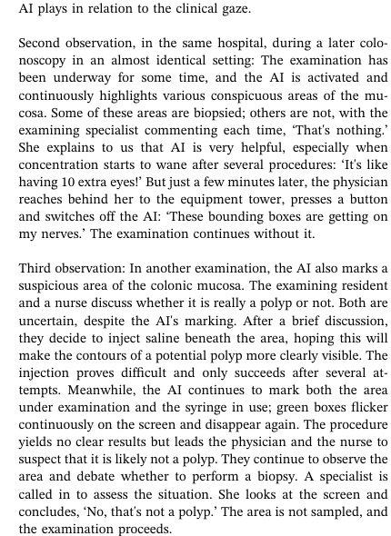
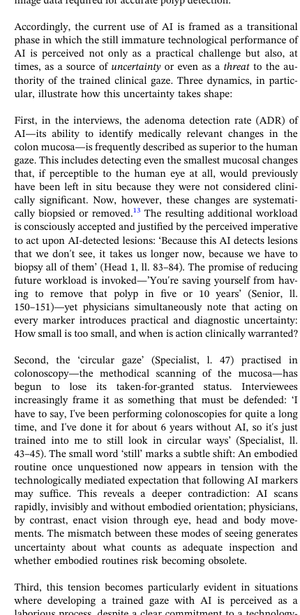
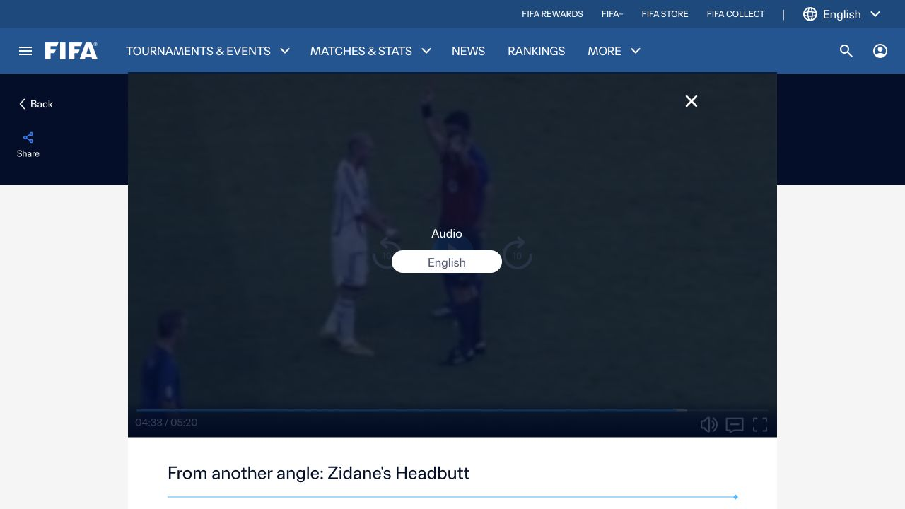

## One incident, several possible records

<div class="hero-case">

<div>
<p class="lead">In the 2006 World Cup final, Zinedine Zidane head-butted Marco Materazzi.</p>
<p>Millions watched the same broadcast. They did not necessarily see the same event.</p>
</div>
</div>

<div class="source-line">Video: FIFA, “Zidane headbutt: What Materazzi really said.” Official FIFA YouTube channel.</div>

::: {.notes}
Open with the empirical problem, not the course map. The thumbnail itself already calls the incident a “moment of madness”; return to that wording later.
:::

---

## What exactly did the cameras record?

<div class="three-questions">
<div><b>What is visible?</b><span>Bodies, spacing, gestures, movement and the response of other players.</span></div>
<div><b>What is audible?</b><span>Stadium sound—but not a usable recording of the exchange between the players.</span></div>
<div><b>What must be inferred?</b><span>The words spoken, how they were understood, and why Zidane turned back.</span></div>
</div>

<p class="bottom-question">This is the problem for today: how does a recorded situation become sociological evidence?</p>

---

## A second camera changes what we can inspect

<div class="compare-images">
<figure><figcaption><b>Broadcast view</b><br>Faces and upper-body movement are easier to see.</figcaption></figure>
<figure><figcaption><b>Tactical camera</b><br>The incident can be placed within the wider organization of the pitch.</figcaption></figure>
</div>

<div class="source-line">Official FIFA footage, close broadcast and tactical-camera versions.</div>

---

## The recording is already a selection

<div class="plain-grid two">
<div><h3>The camera includes</h3><p>one angle, a bounded field of view, a particular time span, and the sound available to the broadcaster.</p></div>
<div><h3>The camera excludes</h3><p>other positions, unrecorded speech, bodily sensation, prior history, and much of what participants remember.</p></div>
</div>

<p class="takeaway">Before we ask an LLM to describe a scene, we need to understand the record we are giving it.</p>

---

## Sociologists were studying these problems long before digital video

<div class="reading-shelf">
<div><b>Simmel</b><span>What do the senses allow people to know about one another?</span></div>
<div><b>Mead</b><span>How does a gesture acquire meaning through another person’s response?</span></div>
<div><b>Goffman</b><span>How is a face-to-face situation organized?</span></div>
<div><b>Goodwin</b><span>How do professional practices teach us what to see?</span></div>
</div>

---

## Simmel makes sensory access part of the social relation

<div class="paper-and-text">
<figure class="simmel-portrait"><figcaption>Georg Simmel</figcaption></figure>
<div>
<p><b>Sight</b> allows mutual recognition at a distance.</p>
<p><b>Hearing</b> brings people into a shared acoustic space.</p>
<p><b>Proximity</b> changes what bodies can perceive and how quickly they can respond.</p>
</div>
</div>

<div class="source-line">Simmel, Georg. 1997 [1907]. “Sociology of the Senses.” In <i>Simmel on Culture</i>, edited by D. Frisby and M. Featherstone.</div>

---

## The football footage gives us sight without the crucial speech

<div class="evidence-split">

<div>
<p class="visible"><b>Visible:</b> Materazzi and Zidane move apart; Zidane turns.</p>
<p class="missing"><b>Not recorded:</b> a clear audio track of their words.</p>
<p><b>Consequence:</b> later accounts of the insult cannot be read directly from the footage.</p>
</div>
</div>

---

## Mead asks us to follow gesture and response together

<div class="sequence-strip simple">
<div><span>1</span><b>Gesture</b><small>An action is directed toward another person.</small></div>
<div><span>2</span><b>Response</b><small>The other person acts in relation to it.</small></div>
<div><span>3</span><b>Meaning</b><small>The social act is understood through this unfolding relation.</small></div>
</div>

<p class="case-application">For this case, a still of the head-butt is insufficient. We need the preceding movements and the responses that follow.</p>

<div class="source-line">Mead, George Herbert. 1934. <i>Mind, Self, and Society</i>. Chicago: University of Chicago Press.</div>

---

## Goffman directs attention to the situation around the act

<div class="annotated-pitch">

<span class="tag t1">players</span><span class="tag t2">officials</span><span class="tag t3">audience</span><span class="tag t4">rules of the match</span>
</div>

<p class="caption">The interaction takes place before teammates, officials, cameras and a stadium audience. Those people and rules are part of the situation.</p>

<div class="source-line">Goffman, Erving. 1983. “The Interaction Order.” <i>American Sociological Review</i> 48(1):1–17.</div>

---

## Sequence analysis asks what happened next—and what made that response relevant

<div class="transcript-like">
<div><b>01</b><span>Materazzi moves behind Zidane and places an arm across his chest.</span></div>
<div><b>02</b><span>He releases him; Zidane looks toward Materazzi.</span></div>
<div><b>03</b><span>They move downfield while appearing to speak.</span></div>
<div><b>04</b><span>Zidane moves ahead, turns and steps back toward Materazzi.</span></div>
<div><b>05</b><span>Zidane lowers his head and makes contact with Materazzi’s chest.</span></div>
</div>

<div class="source-line">Sequence summarized from OpenLearn, “Starting with psychology,” §6.3, using the broadcast footage as the observable record.</div>

---

## Goodwin shows how an observer learns what to notice

<div class="paper-focus">

<div>
<p>Goodwin studies archaeologists and courtroom lawyers at work.</p>
<p>In both settings, people use shared practices to make some features of a complex visual field relevant and leave others in the background.</p>
<p><b>His term is professional vision.</b></p>
</div>
</div>

<div class="source-line">Goodwin, Charles. 1994. “Professional Vision.” <i>American Anthropologist</i> 96(3):606–633.</div>

---

## An archaeological colour chart organizes perception

<div class="large-paper">

<div><p>The Munsell chart supplies a shared coding scheme for soil colour.</p><p>An archaeologist compares a patch of dirt with the chart, names it using an established category, and produces an observation that colleagues can use.</p></div>
</div>

<div class="source-line">Goodwin (1994), pp. 608–610. Screenshot from the published article.</div>

---

## In the Rodney King trial, the same movement was coded in opposing ways

<div class="large-paper landscape">

<div><p>The prosecution and defence did not simply replay the tape. They selected frames, named movements and placed them inside opposing accounts of the encounter.</p><p>Terms such as <b>aggressive</b> and <b>nonaggressive</b> told the jury how a movement should count as evidence.</p></div>
</div>

<div class="source-line">Goodwin (1994), pp. 619–621. Screenshot from the published article.</div>

---

## The white lines outlined King’s body—not a mark on the ground

<div class="large-paper landscape">

<div><p>The defence enlarged individual frames, pasted them into a long sequence and placed transparent overlays on top.</p><p>The white lines traced King’s body. This made him the most conspicuous moving figure while the officers receded into the background.</p><p>Counsel then described the sequence as movement “from the ground to a charge.” Image and language worked together.</p></div>
</div>

<div class="source-line">Goodwin (1994), pp. 623–625. Screenshot from the published article.</div>

---

## Goodwin’s argument is more specific than “people see things differently”

<div class="goodwin-argument">
<div><b>Coding</b><span>Established categories make an event recognizable as a particular kind of thing.</span></div>
<div><b>Highlighting</b><span>Material devices make selected features more salient than their surroundings.</span></div>
<div><b>Representation</b><span>Charts, frame sequences and talk turn what is seen into evidence others can inspect.</span></div>
</div>

<p class="takeaway">Professional vision is a socially organized way of seeing. It is neither a neutral view nor simply an individual opinion.</p>

---

## Heinlein studies what happens when the highlight appears live

<div class="heinlein-slide">

<div>
<p>Heinlein observed colonoscopies and interviewed gastroenterologists using commercial AI systems.</p>
<p>The software places intermittent green boxes around areas it classifies as suspicious.</p>
<p>Unlike the courtroom overlays, these marks appear while practitioners are still deciding where to look and what to do.</p>
</div>
</div>

<div class="source-line">Heinlein, Michael. 2026. “Artificial Intelligence and the Clinical Gaze: Visual Practices of AI-Assisted Colonoscopy.” <i>Sociology of Health & Illness</i> 48:e70144. https://doi.org/10.1111/1467-9566.70144.</div>

---

## Clinicians did not respond to the boxes in one uniform way

<div class="heinlein-evidence">

<div>
<p><b>Follow:</b> a marker directs attention to tissue that is inspected and removed.</p>
<p><b>Override:</b> a team discusses a marked area and decides it is not a polyp.</p>
<p><b>Switch off:</b> repeated boxes interrupt concentration and the clinician deactivates the system.</p>
</div>
</div>

<div class="source-line">Heinlein (2026), pp. 3–4. Screenshot from the published article.</div>

---

## The interface may also change how expertise is learned

<div class="heinlein-evidence reverse">

<div>
<p>Experienced clinicians describe a <b>“circular gaze”</b>: scanning the whole visual field before concentrating on a suspicious area.</p>
<p>Heinlein reports concern that less experienced users may stare at the centre and wait for a box to appear.</p>
<p><b>The issue is therefore not only diagnostic accuracy. It is how an interface redistributes attention, judgement and authority.</b></p>
</div>
</div>

<div class="source-line">Heinlein (2026), pp. 4 and 6. Screenshot from the published article.</div>

---

## These traditions give us four questions for any recorded scene

<div class="four-questions numbered">
<div><b>1. Access</b><span>What could this observer or device perceive? <i>(Simmel)</i></span></div>
<div><b>2. Sequence</b><span>What action preceded the response? <i>(Mead; sequence analysis)</i></span></div>
<div><b>3. Situation</b><span>Which people, rules and audiences organized the encounter? <i>(Goffman)</i></span></div>
<div><b>4. Representation</b><span>How were features selected, coded and highlighted? <i>(Goodwin; Heinlein)</i></span></div>
</div>

---

## We now need a method for reconstructing what the recording preserves

<div class="paper-focus wide">

<div>
<p>Nassauer studies escalation by reconstructing interactions moment by moment.</p>
<p>This turns the opening problem into a method: establish duration, angle, resolution and sound before drawing conclusions from the sequence.</p>
</div>
</div>

<div class="source-line">Nassauer, Anne. 2022. “Video Data Analysis as a Tool for Studying Escalation Processes: The Case of Police Use of Force.” <i>Historical Social Research</i> 47(1):36–57. https://doi.org/10.12759/hsr.47.2022.02.</div>

---

## Different cameras answer different questions

<div class="figure-slide">

<div><p><b>Wide view:</b> spatial organization and surrounding actors.</p><p><b>Close view:</b> gesture, posture and contact.</p><p><b>Multiple angles:</b> checking whether an apparent action is an artefact of position.</p></div>
</div>

<div class="source-line">Nassauer (2022), Figure 1. Screenshot from the published article.</div>

---

## The analytic object is an ordered interaction

<div class="figure-slide">

<div><p>Nassauer codes when actions occur and reconstructs their order.</p><p>This permits comparison of timing, turn-taking, escalation and de-escalation across cases.</p></div>
</div>

<div class="source-line">Nassauer (2022), Figure 2. Screenshot from the published article.</div>

---

## For our case, the source record should come before interpretation

<div class="record-card">
<div><b>Source</b><span>Official FIFA broadcast and tactical-camera clips</span></div>
<div><b>Event</b><span>France v. Italy, World Cup final, 9 July 2006</span></div>
<div><b>Segment</b><span>Exchange preceding the head-butt and immediate aftermath</span></div>
<div><b>Available</b><span>moving image, camera-selected sound, timestamps</span></div>
<div><b>Missing</b><span>clear recording of the players’ words; bodily experience</span></div>
</div>

---

## A public clip is not a neutral sample of social life

<div class="selection-funnel">
<div>all interactions in the match</div><div>actions captured by a camera</div><div>moments selected for broadcast</div><div>clips edited and uploaded</div><div>frames given to a model</div>
</div>

<p class="caption">At every step, some material becomes easier to study and other material disappears.</p>

<div class="source-line">Nassauer, Anne, and Nicolas M. Legewie. 2021 [online first 2018]. “Video Data Analysis: A Methodological Frame for a Novel Research Trend.” <i>Sociological Methods & Research</i> 50(1):135–174; Nassauer (2022), <i>Historical Social Research</i> 47(1):36–57.</div>

---

## Nassauer gives us a method; Collins gives us a question to investigate

<div class="collins-opening">
<div class="collins-question"><span>Why does most face-to-face confrontation</span><strong>not become effective violence?</strong></div>
<div class="collins-answer">
<p>Collins shifts attention away from a violent type of person and towards the interaction itself.</p>
<p>Confrontation usually produces tension and fear. The question is how particular situations get around that barrier.</p>
</div>
</div>

<div class="source-line">Collins, Randall. 2008. <i>Violence: A Micro-sociological Theory</i>. Princeton University Press.</div>

---

## His comparison starts with situations, not types of people

<div class="quote-crop">

<div><p>Collins compares violent and nonviolent encounters to identify emotional dynamics and turning points.</p><p>The “barrier” of confrontational tension and fear is an empirical problem to explain.</p></div>
</div>

<div class="source-line">Collins (2008), Chapter 1, pp. 8–10. Screenshot from the published book chapter.</div>

---

## Collins identifies several routes around that barrier

<div class="quote-crop">

<div><p>Examples include attacking a weak victim, staged fights oriented to an audience, and a sudden shift that gives one side emotional dominance.</p><p>These are comparative propositions—not labels that can be read automatically from a frame.</p></div>
</div>

<div class="source-line">Collins (2008), Chapter 1, pp. 9–11. Screenshot from the published book chapter.</div>

---

## “Tunnel of violence” refers to a more extended altered state

<div class="plain-grid two">
<div><h3>Collins’s claim</h3><p>In some violent episodes, participants describe altered time, narrowed vision, changed sound and a diminished sense of self.</p></div>
<div><h3>What our clip establishes</h3><p>A brief sequence of movement and contact. The footage alone does not establish that Zidane entered such a state.</p></div>
</div>

<div class="source-line">Collins, Randall. 2013. “Entering and Leaving the Tunnel of Violence.” <i>Current Sociology</i> 61(2):132–151.</div>

---

## The theoretical question is narrower than “why did he do it?”

<div class="major-question compact">What changed in the interaction immediately before physical contact?</div>

<p class="supporting">We can inspect timing, distance, orientation, gesture and response. Claims about insult, intention, masculinity or emotion require additional evidence.</p>

---

## We can now inspect the sequence without naming motives

<div class="frame-row four">
<figure><figcaption>players close together</figcaption></figure>
<figure><figcaption>movement downfield</figcaption></figure>
<figure><figcaption>Zidane turns</figcaption></figure>
<figure><figcaption>camera follows the action</figcaption></figure>
</div>

<div class="source-line">Frames from official FIFA broadcast footage. Descriptions state only what is visible in each selected frame.</div>

---

## A frame-by-frame record still needs continuous video

<div class="evidence-split">

<div>
<p><b>A still can show:</b> position, posture, visible contact and who is in frame.</p>
<p><b>It cannot show by itself:</b> duration, speed, trajectory or the order between adjacent movements.</p>
<p><b>Method:</b> inspect the clip, then use frames to document particular moments.</p>
</div>
</div>

---

## Observation and interpretation should be recorded separately

<table class="evidence-table">
<thead><tr><th>Statement</th><th>Status</th><th>What would support it?</th></tr></thead>
<tbody>
<tr><td>Zidane turns and moves toward Materazzi.</td><td class="observed">Observed</td><td>Ordered video frames</td></tr>
<tr><td>Materazzi says something during the exchange.</td><td class="observed">Partly observed</td><td>Visible speech; words unavailable</td></tr>
<tr><td>The insult caused the head-butt.</td><td class="inferred">Causal interpretation</td><td>Participant accounts plus sequence</td></tr>
<tr><td>The exchange crossed Collins’s barrier of confrontational tension and fear.</td><td class="inferred">Collins-style interpretation</td><td>Sequence evidence plus comparison with confrontations that do not become violent</td></tr>
</tbody>
</table>

---

## Published accounts make different claims from different evidence

<div class="paper-cards three">
<div><b>Interactional situation</b><p>Collins asks how confrontational dynamics make violence possible or inhibit it.</p><small>Collins 2008</small></div>
<div><b>Masculinity and habitus</b><p>Morrissey reads the incident through Elias and Bourdieu, using Zidane’s biography and public meaning.</p><small>Morrissey 2009</small></div>
<div><b>Strategic anger</b><p>Experimental work asks whether anger after provocation can affect subsequent performance.</p><small>Furley et al. 2014</small></div>
</div>

<p class="small-note">These explanations are not interchangeable. Each requires evidence beyond a single image.</p>

---

## A deliberately strong interpretation for us to discuss

<div class="morrissey-quote">“draws on the work of Norbert Elias and Pierre Bourdieu and argues that Materazzi’s insults acted as a catalyst, causing divergent aspects of Zidane’s fractured habitus to clash, and the dispositions of the Franco-Kabyle habitus to override the ‘civilized’ habitus demanded by the illusion generated by the professional football field”</div>

<div class="discussion-question">What evidence would we need before accepting this explanation?</div>

<div class="source-line">Morrissey, Sean. 2009. “‘Un homme avant tout’: Zinedine Zidane and the Sociology of a Head-butt.” <i>Soccer & Society</i> 10(2):210–225. Abstract.</div>

---

## Even the official thumbnail tells viewers how to see the act

<div class="thumbnail-analysis">

<div><p>The phrase <b>“moments of madness”</b> supplies an interpretation before the video starts.</p><p>Goodwin’s point is useful here: text, cropping and repetition organize attention.</p></div>
</div>

---

## The model is another way of organizing attention

<div class="task-card">
<div class="task-number">1</div><div><b>Constrain what should count</b><span>The prompt asks for visible change and explicitly excludes identity, motive and remembered event knowledge.</span></div>
<div class="task-number">2</div><div><b>Constrain how it is represented</b><span>The schema separates observable change, visible evidence and interpretation withheld.</span></div>
<div class="task-number">3</div><div><b>Inspect what it nevertheless makes salient</b><span>The researcher checks every returned claim against the source frames.</span></div>
</div>

<p class="caption">This applies Goodwin’s question to an LLM: how do the prompt, schema and interface shape the model’s “professional vision”?</p>

---

## The routine starts with two frames we can inspect ourselves

<div class="two-frame-input">
<figure><figcaption><code>frame_1</code></figcaption></figure>
<figure><figcaption><code>frame_2</code></figcaption></figure>
</div>

```python
frame_1 = ROOT / "slides" / "session04" / "images" / "zidane_fine2_168.png"
frame_2 = ROOT / "slides" / "session04" / "images" / "zidane_fine2_169.png"
```

<p class="caption">Each variable is a <code>Path</code>: it stores a file location. It does not yet contain a model description.</p>

---

## The prompt states the evidentiary boundary

```python
prompt = (
    "Compare these ordered frames. Describe only visible change. "
    "Do not name people, infer motive, or use remembered event knowledge."
)
```

<div class="boundary-grid">
<div><b>Permitted</b><span>position, orientation, contact and change across the two frames</span></div>
<div><b>Withheld</b><span>names, speech, intention, emotion and causal explanation</span></div>
</div>

<p class="caption"><code>prompt</code> is a string. Its wording is part of the research design, not background decoration.</p>

---

## The schema keeps observation and interpretation apart

```python
schema = {
    "type": "object",
    "properties": {
        "observable_change": {"type": "string"},
        "visible_evidence": {"type": "array", "items": {"type": "string"}},
        "interpretation_withheld": {"type": "string"},
    },
    "required": ["observable_change", "visible_evidence",
                 "interpretation_withheld"],
}
```

<div class="type-key"><span><b>{ } dictionary</b> gives values names</span><span><b>[ ] list</b> keeps required fields in order</span><span><b>schema</b> constrains form, not truth</span></div>

---

## OpenRouter and Ollama receive the same research instruction differently

<div class="route-compare">
<div><b>OpenRouter</b><span>The image paths are converted to data URLs and sent to a hosted model over the internet.</span><code>image_to_data_url(frame_1)</code></div>
<div><b>Ollama</b><span>The local Ollama server reads the image files from this machine.</span><code>"images": [str(frame_1), str(frame_2)]</code></div>
</div>

<p class="takeaway">The transport changes. The frames, prompt, schema and methodological check stay the same.</p>

---

## The OpenRouter branch sends text, images and the schema

```python
from openrouter import OpenRouter

messages = [{"role": "user", "content": [
    {"type": "text", "text": prompt},
    {"type": "image_url", "image_url": {"url": image_to_data_url(frame_1)}},
    {"type": "image_url", "image_url": {"url": image_to_data_url(frame_2)}},
]}]

with OpenRouter(api_key=os.environ["OPENROUTER_API_KEY"]) as client:
    response = client.chat.send(
        model=HOSTED_MODEL, messages=messages, temperature=0,
        response_format={"type": "json_schema", "json_schema": {
            "name": "visible_sequence", "strict": True, "schema": schema}},
    )
```

<p class="caption"><code>HOSTED_MODEL</code> comes from the course configuration. The key is entered privately and never printed.</p>

---

## The Ollama branch reads the same two local files

```python
import ollama

messages = [{
    "role": "user",
    "content": prompt,
    "images": [str(frame_1), str(frame_2)],
}]

response = ollama.chat(
    think=False,
    model=LOCAL_MODEL,
    messages=messages,
    format=schema,
    options={"temperature": 0},
)
```

<p class="caption"><code>LOCAL_MODEL</code> also comes from the course configuration. Ollama performs the model inference on the local machine.</p>

---

## First preserve the raw return; then turn it into a dictionary

```python
if ROUTE == "openrouter":
    raw_output = response.choices[0].message.content
else:
    raw_output = response.message.content

print("Raw JSON text:", raw_output)

description = json.loads(raw_output)
print(description["observable_change"])
print(description["visible_evidence"])
print(description["interpretation_withheld"])
```

<div class="object-map"><span><code>raw_output</code><small>JSON string returned by the model</small></span><i>→</i><span><code>json.loads(...)</code><small>conversion operation</small></span><i>→</i><span><code>description</code><small>Python dictionary</small></span></div>

---

## The researcher checks the named claims against the frames

<div class="review-record">
<div><b>Observable change</b><p>Can the claimed change be seen across both displayed frames?</p></div>
<div><b>Visible evidence</b><p>Does every item refer to something actually present in the pixels?</p></div>
<div><b>Interpretation withheld</b><p>Did the model really avoid identity, motive, speech and remembered event knowledge?</p></div>
</div>

<p class="caption">Structured output makes claims easier to inspect. It does not make them accurate.</p>

---

## One changed frame lets us test what the description depends on

```python
frame_2 = ROOT / "slides" / "session04" / "images" / "zidane_fine2_170.png"
```

<div class="before-after">
<div><b>Held fixed</b><p>first frame, prompt, schema, route, model and temperature</p></div>
<div><b>Changed</b><p>only the second image supplied to the model</p></div>
</div>

<p class="takeaway">Rerun the same call and ask which claims changed, which remained, and whether either return imports knowledge that is absent from the images.</p>

---

## What this workflow can and cannot do

<table class="evidence-table">
<thead><tr><th>It can help us…</th><th>It cannot establish by itself…</th></tr></thead>
<tbody>
<tr><td>describe visible features consistently</td><td>what unrecorded words were spoken</td></tr>
<tr><td>compare adjacent frames</td><td>how participants experienced the exchange</td></tr>
<tr><td>flag uncertain observations for review</td><td>the cause or moral meaning of the act</td></tr>
<tr><td>save model output beside human corrections</td><td>whether Collins, Morrissey or another account is right</td></tr>
</tbody>
</table>

---

## What to take from today

<div class="closing-points">
<div><b>Recorded situations are partial.</b><span>Camera position, duration, sound and selection determine what is available.</span></div>
<div><b>Sequence matters.</b><span>A still records a moment; explanations usually require ordered action and response.</span></div>
<div><b>Ways of seeing are learned.</b><span>Codes, highlights, theory and interface design direct attention.</span></div>
<div><b>LLM descriptions need a source record.</b><span>Save the image, prompt, model output, uncertainty and researcher correction together.</span></div>
</div>

---

## Optional: how technical work is extending the problem

<div class="paper-cards three">
<div><b>ImageBind</b><p>Places images, text, audio and other modalities in a shared representation space.</p><small>Girdhar et al. 2023</small></div>
<div><b>V-JEPA 2</b><p>Learns from video by predicting latent representations of what comes next.</p><small>Assran et al. 2025</small></div>
<div><b>World models</b><p>Try to represent dynamics across time, but prediction is not the same as a sociological explanation.</p><small>Further reading</small></div>
</div>

<p class="bottom-question">The technical frontier makes today’s methodological question more important, not less: what social experience is actually available to the model?</p>
