## One incident, several possible records

<div class="hero-case">
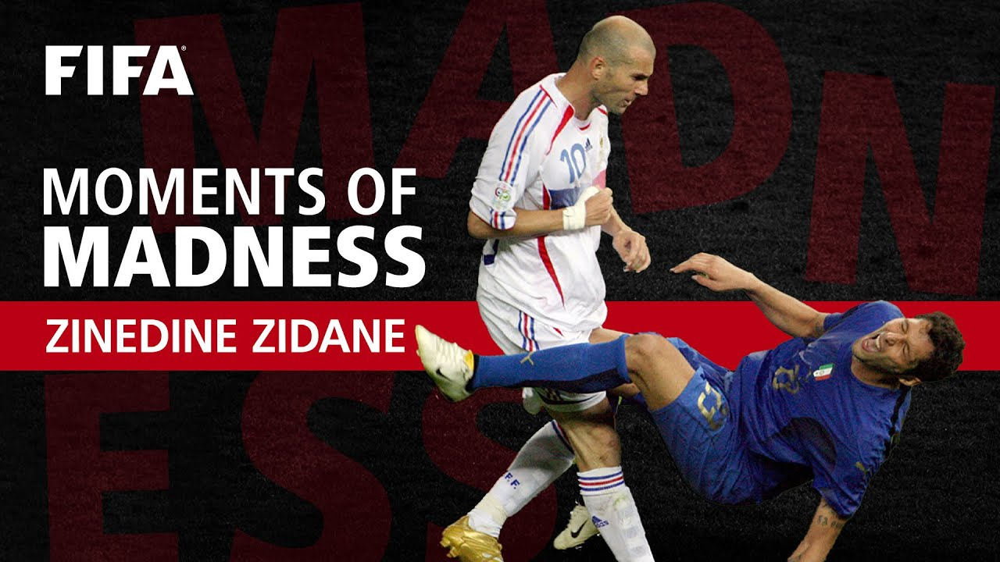
<div>
<p class="lead">In the 2006 World Cup final, Zinedine Zidane head-butted Marco Materazzi.</p>
<p>Millions watched the same broadcast. They did not necessarily see the same event.</p>
</div>
</div>

<div class="source-line">Video: FIFA, “Zidane headbutt: What Materazzi really said.” Official FIFA YouTube channel.</div>

::: {.notes}
Open with the empirical problem, not the course map. The thumbnail itself already calls the incident a “moment of madness”; return to that wording later.
:::

---

## What exactly did the cameras record?

<div class="three-questions">
<div><b>What is visible?</b><span>Bodies, spacing, gestures, movement and the response of other players.</span></div>
<div><b>What is audible?</b><span>Stadium sound—but not a usable recording of the exchange between the players.</span></div>
<div><b>What must be inferred?</b><span>The words spoken, how they were understood, and why Zidane turned back.</span></div>
</div>

<p class="bottom-question">This is the problem for today: how does a recorded situation become sociological evidence?</p>

---

## A second camera changes what we can inspect

<div class="compare-images">
<figure>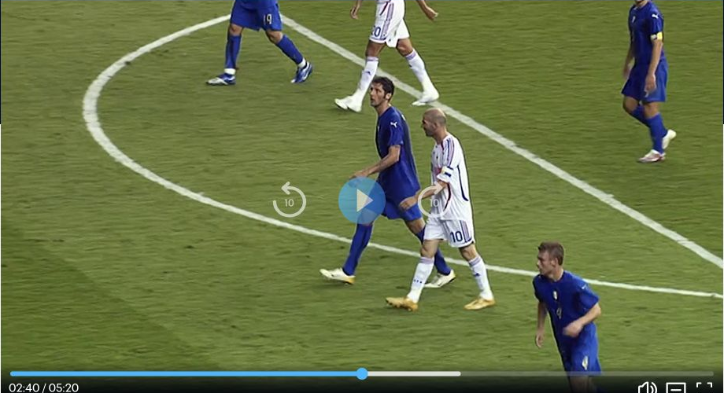<figcaption><b>Broadcast view</b><br>Faces and upper-body movement are easier to see.</figcaption></figure>
<figure>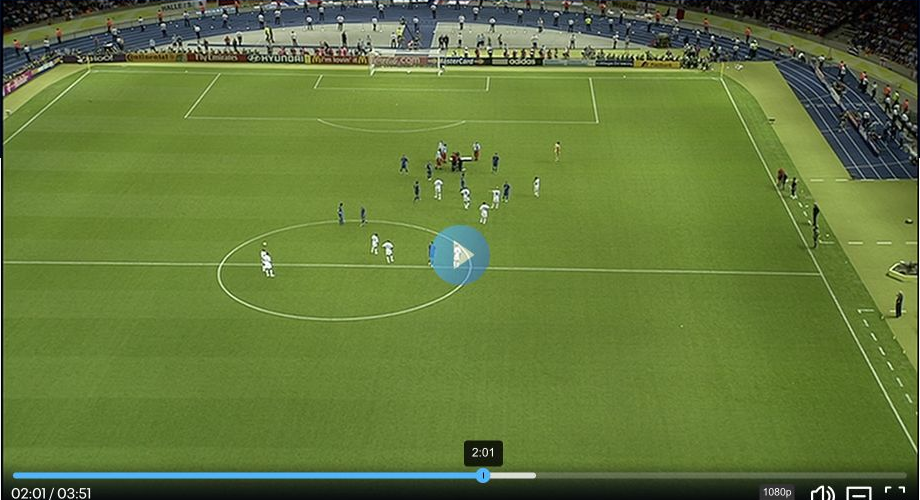<figcaption><b>Tactical camera</b><br>The incident can be placed within the wider organization of the pitch.</figcaption></figure>
</div>

<div class="source-line">Official FIFA footage, close broadcast and tactical-camera versions.</div>

---

## The recording is already a selection

<div class="plain-grid two">
<div><h3>The camera includes</h3><p>one angle, a bounded field of view, a particular time span, and the sound available to the broadcaster.</p></div>
<div><h3>The camera excludes</h3><p>other positions, unrecorded speech, bodily sensation, prior history, and much of what participants remember.</p></div>
</div>

<p class="takeaway">Before we ask an LLM to describe a scene, we need to understand the record we are giving it.</p>

---

## Sociologists were studying these problems long before digital video

<div class="reading-shelf">
<div><b>Simmel</b><span>What do the senses allow people to know about one another?</span></div>
<div><b>Mead</b><span>How does a gesture acquire meaning through another person’s response?</span></div>
<div><b>Goffman</b><span>How is a face-to-face situation organized?</span></div>
<div><b>Goodwin</b><span>How do professional practices teach us what to see?</span></div>
</div>

---

## Simmel makes sensory access part of the social relation

<div class="paper-and-text">
<figure class="simmel-portrait">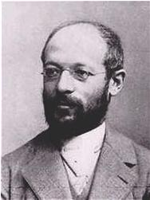<figcaption>Georg Simmel</figcaption></figure>
<div>
<p><b>Sight</b> allows mutual recognition at a distance.</p>
<p><b>Hearing</b> brings people into a shared acoustic space.</p>
<p><b>Proximity</b> changes what bodies can perceive and how quickly they can respond.</p>
</div>
</div>

<div class="source-line">Simmel, Georg. 1997 [1907]. “Sociology of the Senses.” In <i>Simmel on Culture</i>, edited by D. Frisby and M. Featherstone.</div>

---

## The football footage gives us sight without the crucial speech

<div class="evidence-split">
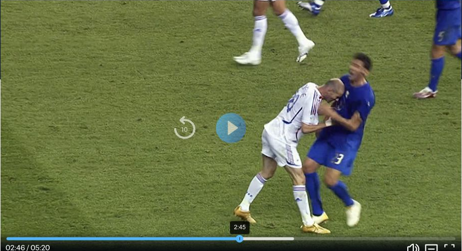
<div>
<p class="visible"><b>Visible:</b> Materazzi and Zidane move apart; Zidane turns.</p>
<p class="missing"><b>Not recorded:</b> a clear audio track of their words.</p>
<p><b>Consequence:</b> later accounts of the insult cannot be read directly from the footage.</p>
</div>
</div>

---

## Mead asks us to follow gesture and response together

<div class="sequence-strip simple">
<div><span>1</span><b>Gesture</b><small>An action is directed toward another person.</small></div>
<div><span>2</span><b>Response</b><small>The other person acts in relation to it.</small></div>
<div><span>3</span><b>Meaning</b><small>The social act is understood through this unfolding relation.</small></div>
</div>

<p class="case-application">For this case, a still of the head-butt is insufficient. We need the preceding movements and the responses that follow.</p>

<div class="source-line">Mead, George Herbert. 1934. <i>Mind, Self, and Society</i>. Chicago: University of Chicago Press.</div>

---

## Goffman directs attention to the situation around the act

<div class="annotated-pitch">

<span class="tag t1">players</span><span class="tag t2">officials</span><span class="tag t3">audience</span><span class="tag t4">rules of the match</span>
</div>

<p class="caption">The interaction takes place before teammates, officials, cameras and a stadium audience. Those people and rules are part of the situation.</p>

<div class="source-line">Goffman, Erving. 1983. “The Interaction Order.” <i>American Sociological Review</i> 48(1):1–17.</div>

---

## Sequence analysis asks what happened next—and what made that response relevant

<div class="transcript-like">
<div><b>01</b><span>Materazzi moves behind Zidane and places an arm across his chest.</span></div>
<div><b>02</b><span>He releases him; Zidane looks toward Materazzi.</span></div>
<div><b>03</b><span>They move downfield while appearing to speak.</span></div>
<div><b>04</b><span>Zidane moves ahead, turns and steps back toward Materazzi.</span></div>
<div><b>05</b><span>Zidane lowers his head and makes contact with Materazzi’s chest.</span></div>
</div>

<div class="source-line">Sequence summarized from OpenLearn, “Starting with psychology,” §6.3, using the broadcast footage as the observable record.</div>

---

## Goodwin shows how an observer learns what to notice

<div class="paper-focus">
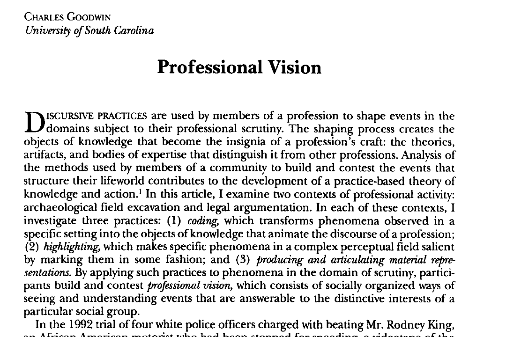
<div>
<p>Goodwin studies archaeologists and courtroom lawyers.</p>
<p>In both settings, people use established practices to turn a complex visual field into professionally relevant evidence.</p>
<p><b>His term is professional vision.</b></p>
</div>
</div>

<div class="source-line">Goodwin, Charles. 1994. “Professional Vision.” <i>American Anthropologist</i> 96(3):606–633.</div>

---

## An archaeological colour chart organizes perception

<div class="large-paper">
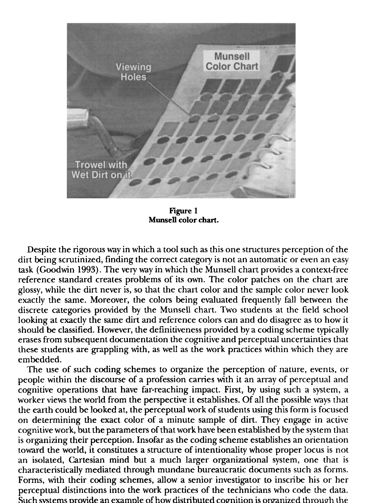
<div><p>The Munsell chart provides a shared set of categories for describing soil colour.</p><p>It does not merely store a perception. It helps archaeologists produce a comparable observation.</p></div>
</div>

<div class="source-line">Goodwin (1994), pp. 608–610. Screenshot from the published article.</div>

---

## In the Rodney King trial, the same movement was coded in opposing ways

<div class="large-paper landscape">
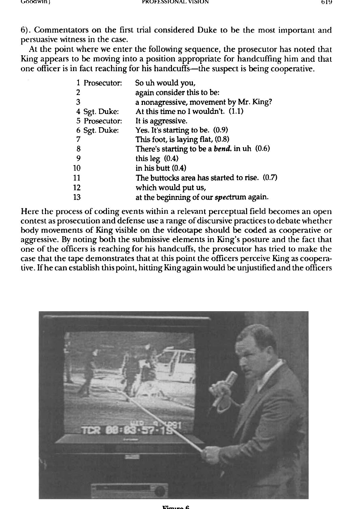
<div><p>The prosecution and defence organized attention to different parts of the video.</p><p>Terms such as <b>aggressive</b> and <b>nonaggressive</b> made the movement legible within competing accounts.</p></div>
</div>

<div class="source-line">Goodwin (1994), pp. 619–621. Screenshot from the published article.</div>

---

## Highlighting can make one feature appear decisive

<div class="large-paper landscape">
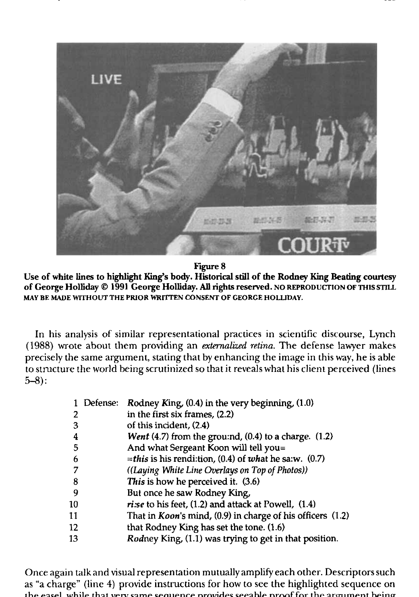
<div><p>The defence repeatedly highlighted a white line beneath King’s foot.</p><p>Cropping and highlighting altered the figure–ground relation: one movement became central while surrounding action receded.</p></div>
</div>

<div class="source-line">Goodwin (1994), pp. 623–625. Screenshot from the published article.</div>

---

## Heinlein follows professional vision into AI-assisted colonoscopy

<div class="heinlein-slide">
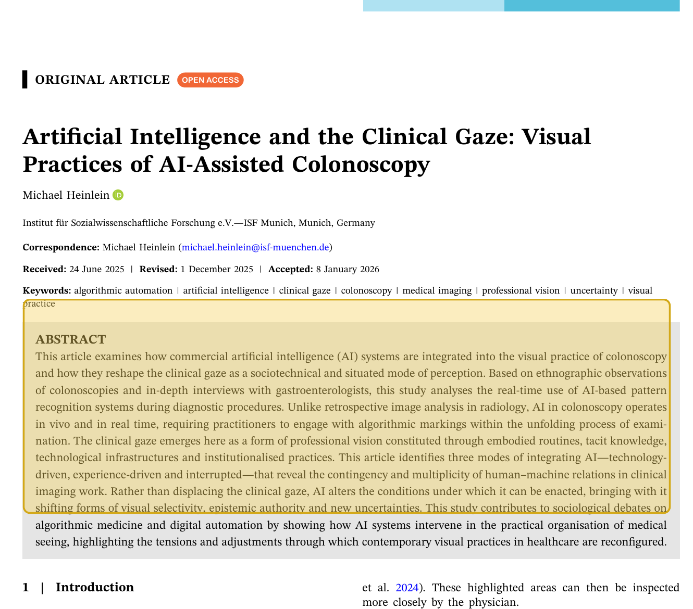
<div>
<p>Heinlein observed colonoscopies and interviewed gastroenterologists using commercial AI systems.</p>
<p>The software marks possible polyps on screen in real time. Clinicians may follow, override or be interrupted by those markings.</p>
<p><b>The sociological question is how an algorithm changes what becomes noticeable and authoritative during the procedure.</b></p>
</div>
</div>

<div class="source-line">Heinlein, Michael. 2026. “Artificial Intelligence and the Clinical Gaze: Visual Practices of AI-Assisted Colonoscopy.” <i>Sociology of Health & Illness</i> 48:e70144. https://doi.org/10.1111/1467-9566.70144.</div>

---

## These traditions give us three questions for any recorded scene

<div class="three-questions numbered">
<div><b>1. Access</b><span>What could this observer or device perceive? <i>(Simmel)</i></span></div>
<div><b>2. Sequence</b><span>What action preceded the response? <i>(Mead; sequence analysis)</i></span></div>
<div><b>3. Representation</b><span>How were features selected, coded and highlighted? <i>(Goodwin)</i></span></div>
</div>

<p class="small-note">Goffman adds a fourth reminder: the people, rules and audiences around the action are part of the situation.</p>

---

## Video sequence analysis begins with the quality of the record

<div class="paper-focus wide">
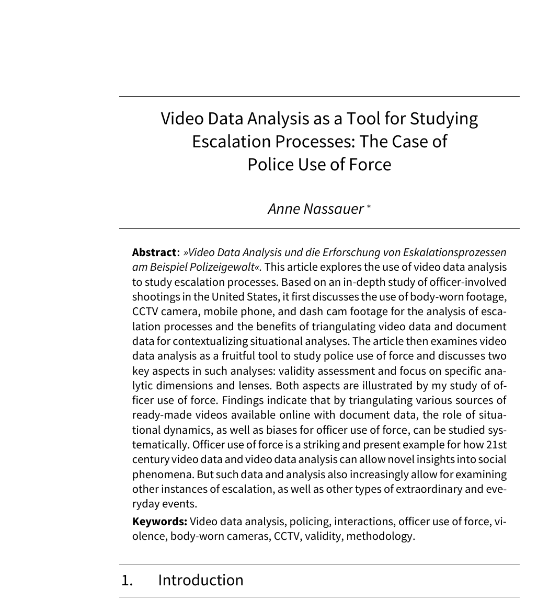
<div>
<p>Nassauer studies escalation by reconstructing interactions moment by moment.</p>
<p>The method depends on whether video adequately captures the relevant duration, camera angle, resolution and sound.</p>
</div>
</div>

<div class="source-line">Nassauer, Anne. 2022. “Video Data Analysis as a Tool for Studying Escalation Processes: The Case of Police Use of Force.” <i>Historical Social Research</i> 47(1):36–57. https://doi.org/10.12759/hsr.47.2022.02.</div>

---

## Different cameras answer different questions

<div class="figure-slide">
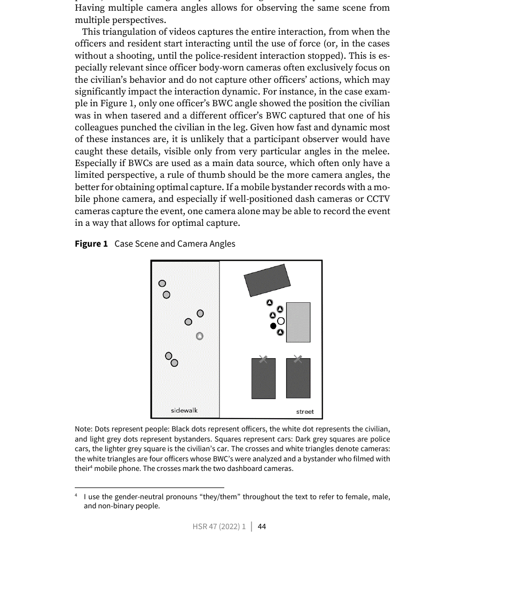
<div><p><b>Wide view:</b> spatial organization and surrounding actors.</p><p><b>Close view:</b> gesture, posture and contact.</p><p><b>Multiple angles:</b> checking whether an apparent action is an artefact of position.</p></div>
</div>

<div class="source-line">Nassauer (2022), Figure 1. Screenshot from the published article.</div>

---

## The analytic object is an ordered interaction

<div class="figure-slide">
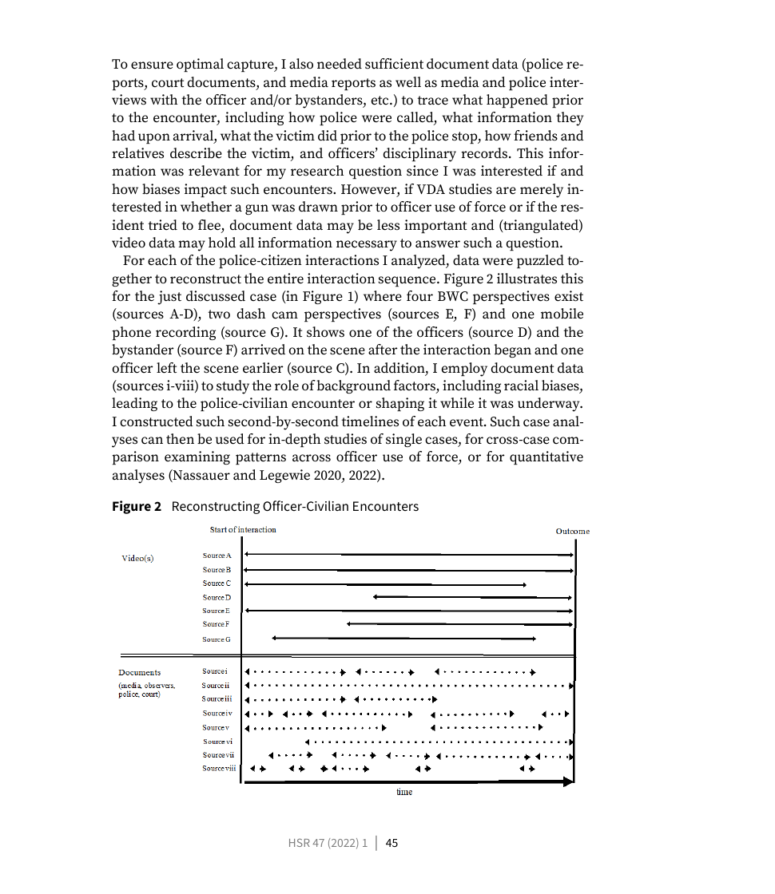
<div><p>Nassauer codes when actions occur and reconstructs their order.</p><p>This permits comparison of timing, turn-taking, escalation and de-escalation across cases.</p></div>
</div>

<div class="source-line">Nassauer (2022), Figure 2. Screenshot from the published article.</div>

---

## For our case, the source record should come before interpretation

<div class="record-card">
<div><b>Source</b><span>Official FIFA broadcast and tactical-camera clips</span></div>
<div><b>Event</b><span>France v. Italy, World Cup final, 9 July 2006</span></div>
<div><b>Segment</b><span>Exchange preceding the head-butt and immediate aftermath</span></div>
<div><b>Available</b><span>moving image, camera-selected sound, timestamps</span></div>
<div><b>Missing</b><span>clear recording of the players’ words; bodily experience</span></div>
</div>

---

## A public clip is not a neutral sample of social life

<div class="selection-funnel">
<div>all interactions in the match</div><div>actions captured by a camera</div><div>moments selected for broadcast</div><div>clips edited and uploaded</div><div>frames given to a model</div>
</div>

<p class="caption">At every step, some material becomes easier to study and other material disappears.</p>

<div class="source-line">Nassauer, Anne, and Nicolas M. Legewie. 2021 [online first 2018]. “Video Data Analysis: A Methodological Frame for a Novel Research Trend.” <i>Sociological Methods & Research</i> 50(1):135–174; Nassauer (2022), <i>Historical Social Research</i> 47(1):36–57.</div>

---

## Collins asks why confrontations so often fail to become violence

<div class="collins-opening">
<div class="collins-question"><span>Why does most face-to-face confrontation</span><strong>not become effective violence?</strong></div>
<div class="collins-answer">
<p>Collins shifts attention away from a violent type of person and towards the interaction itself.</p>
<p>Confrontation usually produces tension and fear. The question is how particular situations get around that barrier.</p>
</div>
</div>

<div class="source-line">Collins, Randall. 2008. <i>Violence: A Micro-sociological Theory</i>. Princeton University Press.</div>

---

## His comparison starts with situations, not types of people

<div class="quote-crop">
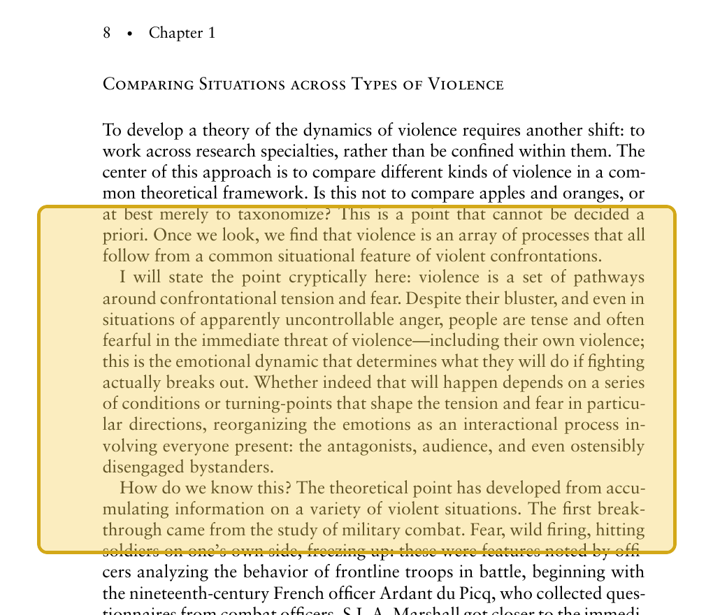
<div><p>Collins compares violent and nonviolent encounters to identify emotional dynamics and turning points.</p><p>The “barrier” of confrontational tension and fear is an empirical problem to explain.</p></div>
</div>

<div class="source-line">Collins (2008), Chapter 1, pp. 8–10. Screenshot from the published book chapter.</div>

---

## Collins identifies several routes around that barrier

<div class="quote-crop">
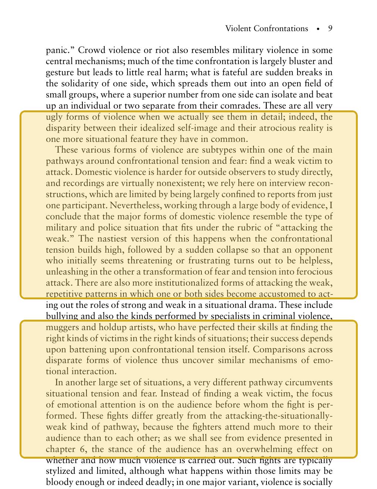
<div><p>Examples include attacking a weak victim, staged fights oriented to an audience, and a sudden shift that gives one side emotional dominance.</p><p>These are comparative propositions—not labels that can be read automatically from a frame.</p></div>
</div>

<div class="source-line">Collins (2008), Chapter 1, pp. 9–11. Screenshot from the published book chapter.</div>

---

## “Tunnel of violence” refers to a more extended altered state

<div class="plain-grid two">
<div><h3>Collins’s claim</h3><p>In some violent episodes, participants describe altered time, narrowed vision, changed sound and a diminished sense of self.</p></div>
<div><h3>What our clip establishes</h3><p>A brief sequence of movement and contact. The footage alone does not establish that Zidane entered such a state.</p></div>
</div>

<div class="source-line">Collins, Randall. 2013. “Entering and Leaving the Tunnel of Violence.” <i>Current Sociology</i> 61(2):132–151.</div>

---

## The theoretical question is narrower than “why did he do it?”

<div class="major-question compact">What changed in the interaction immediately before physical contact?</div>

<p class="supporting">We can inspect timing, distance, orientation, gesture and response. Claims about insult, intention, masculinity or emotion require additional evidence.</p>

---

## We can now inspect the sequence without naming motives

<div class="frame-row four">
<figure>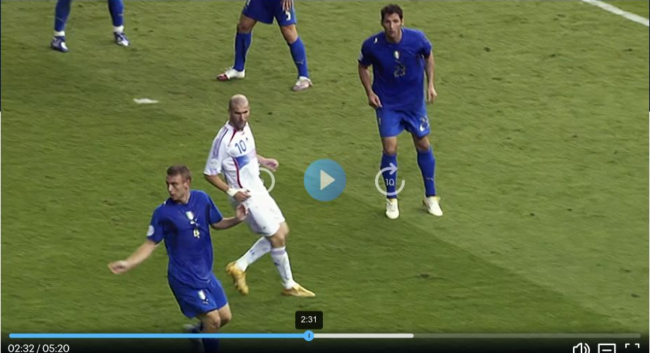<figcaption>players close together</figcaption></figure>
<figure><figcaption>movement downfield</figcaption></figure>
<figure><figcaption>Zidane turns</figcaption></figure>
<figure>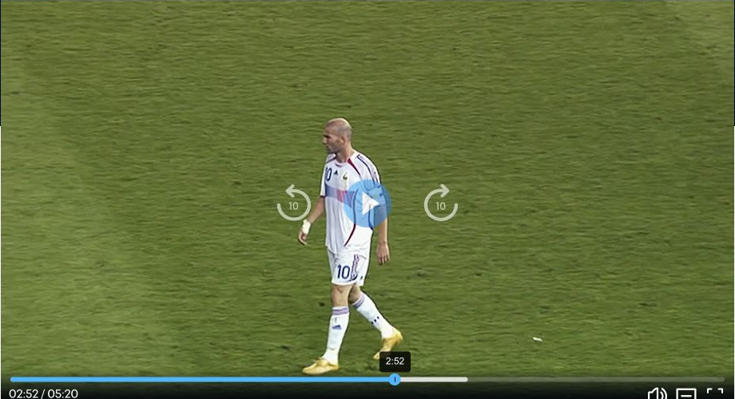<figcaption>camera follows the action</figcaption></figure>
</div>

<div class="source-line">Frames from official FIFA broadcast footage. Descriptions state only what is visible in each selected frame.</div>

---

## A frame-by-frame record still needs continuous video

<div class="evidence-split">
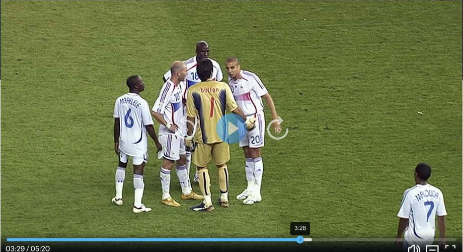
<div>
<p><b>A still can show:</b> position, posture, visible contact and who is in frame.</p>
<p><b>It cannot show by itself:</b> duration, speed, trajectory or the order between adjacent movements.</p>
<p><b>Method:</b> inspect the clip, then use frames to document particular moments.</p>
</div>
</div>

---

## Observation and interpretation should be recorded separately

<table class="evidence-table">
<thead><tr><th>Statement</th><th>Status</th><th>What would support it?</th></tr></thead>
<tbody>
<tr><td>Zidane turns and moves toward Materazzi.</td><td class="observed">Observed</td><td>Ordered video frames</td></tr>
<tr><td>Materazzi says something during the exchange.</td><td class="observed">Partly observed</td><td>Visible speech; words unavailable</td></tr>
<tr><td>The insult caused the head-butt.</td><td class="inferred">Causal interpretation</td><td>Participant accounts plus sequence</td></tr>
<tr><td>The exchange crossed Collins’s barrier of confrontational tension and fear.</td><td class="inferred">Collins-style interpretation</td><td>Sequence evidence plus comparison with confrontations that do not become violent</td></tr>
</tbody>
</table>

---

## Published accounts make different claims from different evidence

<div class="paper-cards three">
<div><b>Interactional situation</b><p>Collins asks how confrontational dynamics make violence possible or inhibit it.</p><small>Collins 2008</small></div>
<div><b>Masculinity and habitus</b><p>Morrissey reads the incident through Elias and Bourdieu, using Zidane’s biography and public meaning.</p><small>Morrissey 2009</small></div>
<div><b>Strategic anger</b><p>Experimental work asks whether anger after provocation can affect subsequent performance.</p><small>Furley et al. 2014</small></div>
</div>

<p class="small-note">These explanations are not interchangeable. Each requires evidence beyond a single image.</p>

---

## A deliberately strong interpretation for us to discuss

<div class="morrissey-quote">“draws on the work of Norbert Elias and Pierre Bourdieu and argues that Materazzi’s insults acted as a catalyst, causing divergent aspects of Zidane’s fractured habitus to clash, and the dispositions of the Franco-Kabyle habitus to override the ‘civilized’ habitus demanded by the illusion generated by the professional football field”</div>

<div class="discussion-question">What evidence would we need before accepting this explanation?</div>

<div class="source-line">Morrissey, Sean. 2009. “‘Un homme avant tout’: Zinedine Zidane and the Sociology of a Head-butt.” <i>Soccer & Society</i> 10(2):210–225. Abstract.</div>

---

## Even the official thumbnail tells viewers how to see the act

<div class="thumbnail-analysis">

<div><p>The phrase <b>“moments of madness”</b> supplies an interpretation before the video starts.</p><p>Goodwin’s point is useful here: text, cropping and repetition organize attention.</p></div>
</div>

---

## We will use an LLM as another observer of the record

<div class="task-card">
<div class="task-number">1</div><div><b>Give the model one frame</b><span>Ask only for visible actions and explicit uncertainty.</span></div>
<div class="task-number">2</div><div><b>Add an adjacent frame</b><span>See which claims change when sequence is available.</span></div>
<div class="task-number">3</div><div><b>Check the response</b><span>Compare each claim with the frame and source record.</span></div>
</div>

---

## First input: one image and a deliberately narrow instruction

:::: {.input-output .input-only}


::: {.prompt-box}
**Prompt**

Describe only visible positions and actions. Do not infer speech, intention or emotion. For anything uncertain, write `uncertain`. Return JSON with the keys `visible_actions` and `limits`.
:::
::::

---

## Example output: useful, but still open to checking

**`visible_actions`**

- Two players are moving in the same direction.
- The player in white turns his upper body toward the player in blue.

**`limits`**

- The image does not show what either player said.
- Intention and emotion cannot be determined from this frame.

**Three checks:** Does every action appear in the frame? · Has the model added a motive? · What does one still fail to show?

---

## More context helps—but it can also invite outside knowledge

::::: {.input-output}
::: {.mini-frames}


:::

::: {.prompt-box}
**New prompt**

Compare these frames in order. Describe only a change that is visible across them. Do not infer why it occurred.

**Unconstrained response**

“Zidane turns back toward Materazzi.”

The identification may be correct, but it comes from the model’s prior knowledge rather than these pixels alone.

**Constrained response**

“The player in white changes from moving downfield to turning his body toward the player in blue.”
:::
:::::

---

## The researcher records corrections next to the model response

<div class="review-record">
<div><b>Model description</b><p>“The player in white turns toward the player in blue.”</p></div>
<div><b>Researcher check</b><p>Supported across frames 2–3. Direction of gaze is unclear at this resolution.</p></div>
<div><b>Source detail</b><p>FIFA broadcast clip; selected adjacent frames; speech unavailable.</p></div>
</div>

<p class="caption">Keeping all three entries lets another reader see the source, the model’s proposal and the human revision.</p>

---

## The Python section builds that record one piece at a time

<div class="code-roadmap">
<div><b>A path</b><span>where the image file is</span></div>
<div><b>A string</b><span>the instruction sent with it</span></div>
<div><b>A list</b><span>the ordered messages and frames</span></div>
<div><b>A dictionary</b><span>one returned observation</span></div>
<div><b>A loop</b><span>repeat the same check across frames</span></div>
</div>

---

## Start with the two inputs we can inspect ourselves

```python
from pathlib import Path

image_path = Path("images/zidane_close_3.png")

prompt = (
    "Describe only visible positions and actions. "
    "Do not infer speech, intention or emotion."
)
```

<div class="code-explain"><p><code>image_path</code> is a <b>Path object</b>: it points to a file.</p><p><code>prompt</code> is a <b>string</b>: Python’s type for text.</p></div>

---

## The image must be converted into data the API can send

```python
import base64

image_bytes = image_path.read_bytes()
encoded = base64.b64encode(image_bytes).decode("utf-8")
image_url = f"data:image/png;base64,{encoded}"
```

<div class="line-notes">
<div><code>read_bytes()</code><span>reads the image file as bytes</span></div>
<div><code>b64encode(...)</code><span>turns those bytes into safe text</span></div>
<div><code>image_url</code><span>adds a label telling the API that the text represents a PNG</span></div>
</div>

---

## A message can contain both text and an image

```python
messages = [
    {
        "role": "user",
        "content": [
            {"type": "text", "text": prompt},
            {"type": "image_url",
             "image_url": {"url": image_url}},
        ],
    }
]
```

<div class="type-key"><span><b>[ ] list</b> keeps items in order</span><span><b>{ } dictionary</b> gives each value a name</span><span><b>" " string</b> stores text</span></div>

---

## OpenRouter sends the same message format to different models

```python
from openai import OpenAI
import os

client = OpenAI(
    base_url="https://openrouter.ai/api/v1",
    api_key=os.environ["OPENROUTER_API_KEY"],
)

response = client.chat.completions.create(
    model="openai/gpt-4.1-mini",
    messages=messages,
)
```

<div class="code-explain"><p><code>client</code> stores how to reach the service.</p><p><code>create(...)</code> sends the model name and our messages. Other settings—temperature, output format and token limits—can also be supplied.</p></div>

---

## The response object contains more than the answer text

```python
answer_text = response.choices[0].message.content
print(answer_text)
```

<div class="object-map">
<span><code>response</code><small>whole returned object</small></span><i>→</i>
<span><code>choices[0]</code><small>first generated answer</small></span><i>→</i>
<span><code>message.content</code><small>answer text</small></span>
</div>

<p class="small-note">The full response also contains model identifiers and token-use information that belong in the research record.</p>

---

## JSON lets Python recover named parts of the answer

```python
import json

observation = json.loads(answer_text)

print(observation["visible_actions"])
print(observation["limits"])
```

<div class="code-explain"><p><code>json.loads()</code> converts JSON text into Python objects.</p><p>Here, <code>observation</code> is a dictionary; its values are two lists.</p></div>

---

## We add the human check to the same dictionary

```python
observation["researcher_check"] = {
    "supported": True,
    "correction": "Direction of gaze is unclear",
    "source": "FIFA broadcast, frame 3",
}
```

<div class="before-after">
<div><b>Before</b><p>model description + stated limits</p></div>
<div><b>After</b><p>model description + limits + researcher correction + source</p></div>
</div>

---

## A list preserves observations in frame order

```python
sequence_record = []

sequence_record.append(observation_frame_2)
sequence_record.append(observation_frame_3)
```

<div class="array-view"><span>index 0<br><b>frame 2</b></span><span>index 1<br><b>frame 3</b></span></div>

<p class="caption"><code>append()</code> adds one dictionary to the end. The order matters because our question concerns change across time.</p>

---

## A loop repeats the same operation across several files

```python
frame_paths = [
    Path("images/zidane_close_1.png"),
    Path("images/zidane_close_2.png"),
    Path("images/zidane_close_3.png"),
]

sequence_record = []

for frame_path in frame_paths:
    observation = describe_frame(frame_path, prompt)
    sequence_record.append(observation)
```

<div class="line-notes"><div><code>for ... in ...</code><span>takes one path at a time, in order</span></div><div><code>describe_frame(...)</code><span>runs the image-and-prompt routine we just unpacked</span></div><div><code>append(...)</code><span>saves each returned dictionary</span></div></div>

---

## The saved record should expose the full chain

| field | saved value |
|---|---|
| source | FIFA broadcast clip · frame 3 |
| prompt | Describe only visible positions and actions… |
| model | openai/gpt-4.1-mini |
| model description | The player in white turns… |
| researcher correction | Direction of gaze is unclear. |
| missing evidence | speech · intention · emotion |

<p class="takeaway">Python keeps the pieces together. It does not decide whether the sociological interpretation is convincing.</p>

---

## What this workflow can and cannot do

<table class="evidence-table">
<thead><tr><th>It can help us…</th><th>It cannot establish by itself…</th></tr></thead>
<tbody>
<tr><td>describe visible features consistently</td><td>what unrecorded words were spoken</td></tr>
<tr><td>compare adjacent frames</td><td>how participants experienced the exchange</td></tr>
<tr><td>flag uncertain observations for review</td><td>the cause or moral meaning of the act</td></tr>
<tr><td>save model output beside human corrections</td><td>whether Collins, Morrissey or another account is right</td></tr>
</tbody>
</table>

---

## What to take from today

<div class="closing-points">
<div><b>Recorded situations are partial.</b><span>Camera position, duration, sound and selection determine what is available.</span></div>
<div><b>Sequence matters.</b><span>A still records a moment; explanations usually require ordered action and response.</span></div>
<div><b>Ways of seeing are learned.</b><span>Codes, highlights, theory and interface design direct attention.</span></div>
<div><b>LLM descriptions need a source record.</b><span>Save the image, prompt, model output, uncertainty and researcher correction together.</span></div>
</div>

---

## Optional: how technical work is extending the problem

<div class="paper-cards three">
<div><b>ImageBind</b><p>Places images, text, audio and other modalities in a shared representation space.</p><small>Girdhar et al. 2023</small></div>
<div><b>V-JEPA 2</b><p>Learns from video by predicting latent representations of what comes next.</p><small>Assran et al. 2025</small></div>
<div><b>World models</b><p>Try to represent dynamics across time, but prediction is not the same as a sociological explanation.</p><small>Further reading</small></div>
</div>

<p class="bottom-question">The technical frontier makes today’s methodological question more important, not less: what social experience is actually available to the model?</p>
