## What might an experimental treatment look like?

<div class="opening-treatment-grid">
<figure>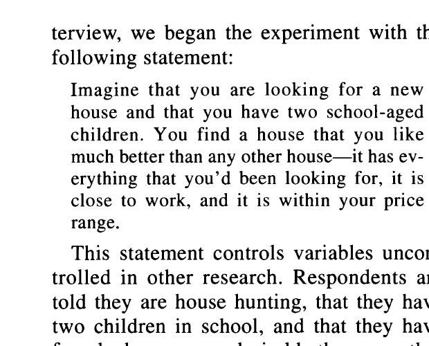<figcaption>A description of a neighbourhood</figcaption></figure>
<figure>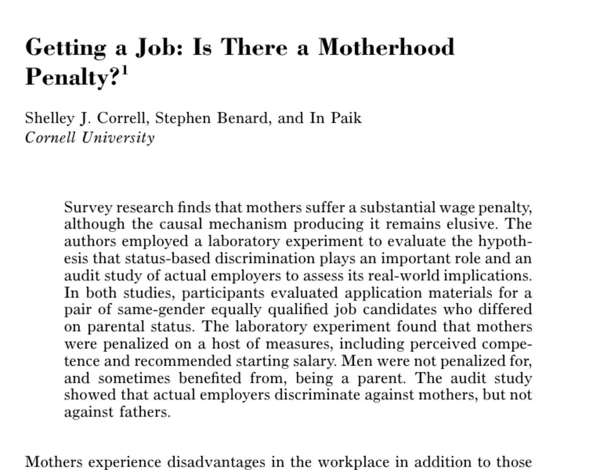<figcaption>A matched job application</figcaption></figure>
<figure>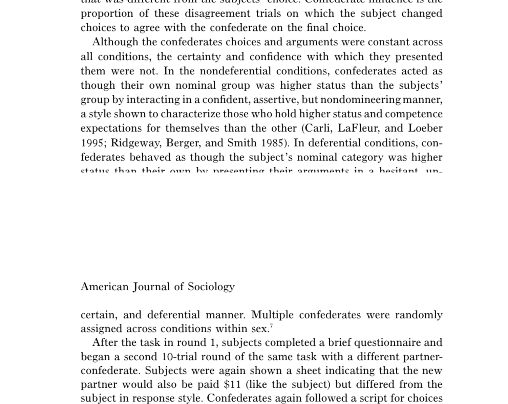<figcaption>A confederate's performance</figcaption></figure>
<figure>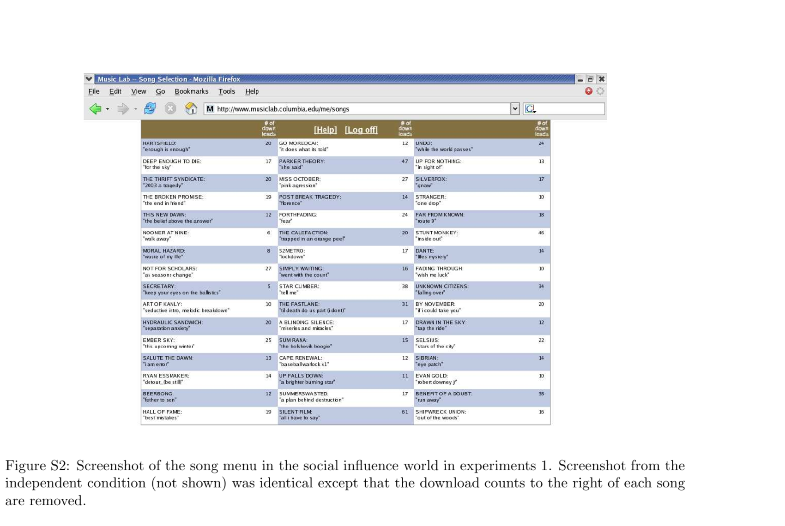<figcaption>An online social setting</figcaption></figure>
</div>

The material can be text, an image, a person's behaviour, or the interface through which participants encounter other people.

<div class="source-line">Images: Emerson, Yancey, and Chai (2001); Correll, Benard, and Paik (2007); Ridgeway and Erickson (2000); Salganik, Dodds, and Watts (2006).</div>

## Today we are studying LLMs as tools for making experimental materials

<div class="llm-treatment-jobs">
<div><b>Write candidates</b><span>Produce several possible vignettes, messages, profiles, or survey items.</span></div>
<div><b>Vary a feature</b><span>Change a specified part while trying to keep the rest comparable.</span></div>
<div><b>Build an adaptive instrument</b><span>Turn participant input into new items while a survey is running.</span></div>
</div>

The main question is not simply whether the output looks plausible. We need to know what participants encounter, what differs across conditions, and how the material was produced and checked.

## Three questions for the morning

<div class="morning-questions">
<div><span>1</span><p>What exactly is the treatment?</p></div>
<div><span>2</span><p>What else changes when we vary it?</p></div>
<div><span>3</span><p>What should we save and check before fieldwork?</p></div>
</div>

We will answer them first with published experiments, then with a small framing example that we can inspect by hand and in Python.

## Sociologists have built treatments in several different ways

<div class="treatment-four">
<div><b>Vignette</b><p>A respondent reads about a neighbourhood with specified crime, schools, prices, and racial composition.</p></div>
<div><b>Matched application</b><p>Two employers receive equivalent CVs, but one signals motherhood and the other does not.</p></div>
<div><b>Confederate</b><p>A trained actor makes the same argument while performing a deferential or nondeferential style.</p></div>
<div><b>Interface</b><p>Listeners see the same songs with or without information about other people's downloads.</p></div>
</div>

These examples differ in medium, but each requires researchers to specify what participants will encounter and what comparison it is meant to create.

## Emerson and colleagues used a neighbourhood vignette on segregation

<div class="paper-with-claim">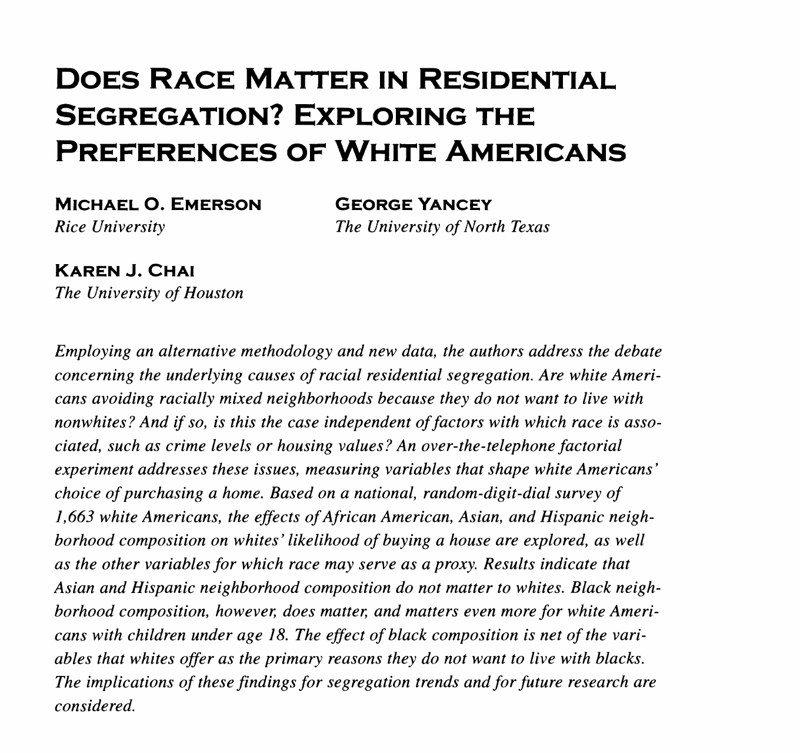<p>White respondents judged a possible home purchase. The factorial description varied features of the neighbourhood, including its racial composition.</p></div>

<div class="source-line">Emerson, Yancey, and Chai (2001), “Does Race Matter in Residential Segregation?” <em>American Sociological Review</em> 66(6): 922–935.</div>

## The paper shows exactly what respondents were asked to imagine

<div class="vignette-source">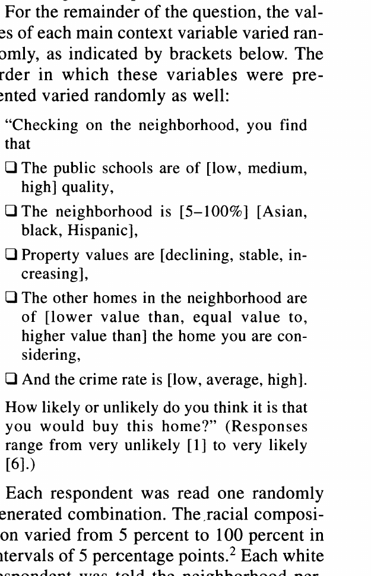</div>

The house was held attractive, affordable, and convenient. Schools, racial composition, property values, neighbouring home values, and crime were then varied at random. The outcome was a six-point likelihood of buying the home.

<div class="source-line">Emerson, Yancey, and Chai (2001), experimental design and vignette wording.</div>

## The study was about segregation, not whether people liked a paragraph

The researchers wanted to know whether white respondents avoided racially mixed neighbourhoods <strong>after accounting for other features that shape a housing decision</strong>.

<div class="logic-box"><b>The substantive problem</b><span>Race, crime, schools, and property values are entangled in real housing markets. A factorial vignette varies them systematically so their associations with the stated choice can be separated.</span></div>

## A factorial vignette gives each feature a set of possible values

<div class="level-grid">
<div><b>Racial composition</b><p>Different proportions of Black and white residents</p></div>
<div><b>Crime</b><p>Lower or higher reported crime</p></div>
<div><b>Schools</b><p>Different descriptions of school quality</p></div>
<div><b>Housing market</b><p>Different property-value conditions</p></div>
</div>

One level from each dimension is combined into a complete neighbourhood description. The respondent then makes a judgment about that description.

## The design creates a universe of possible descriptions

<div class="two-col">
<div><h3>What the design gains</h3><p>Many combinations allow the researcher to estimate how each dimension is associated with the response while averaging over the others.</p></div>
<div><h3>What still needs checking</h3><p>Some combinations may sound implausible. A stated response to a fictional neighbourhood is also not the same as an observed home purchase.</p></div>
</div>

## Audit studies place matched cases into a real decision process

<div class="paper-with-claim"><p>Correll and colleagues sent equivalent applications that varied parental status. The theory concerned motherhood as a devalued workplace status; the applications made that status visible.</p></div>

<div class="source-line">Correll, Benard, and Paik (2007), “Getting a Job: Is There a Motherhood Penalty?” <em>American Journal of Sociology</em> 112(5): 1297–1338.</div>

## “Matched” means more than putting the same job title on two CVs

<div class="match-table">
<div class="head">Held comparable</div><div class="head">Varied deliberately</div><div class="head">Outcome observed</div>
<div>Qualifications, experience, accomplishments, job, timing</div><div>A cue that the applicant was or was not a parent</div><div>Evaluation and employer response</div>
</div>

If the applications also differ in education or experience, random assignment cannot tell us which difference produced the response.

## Confederate experiments construct a social performance

<div class="paper-with-claim">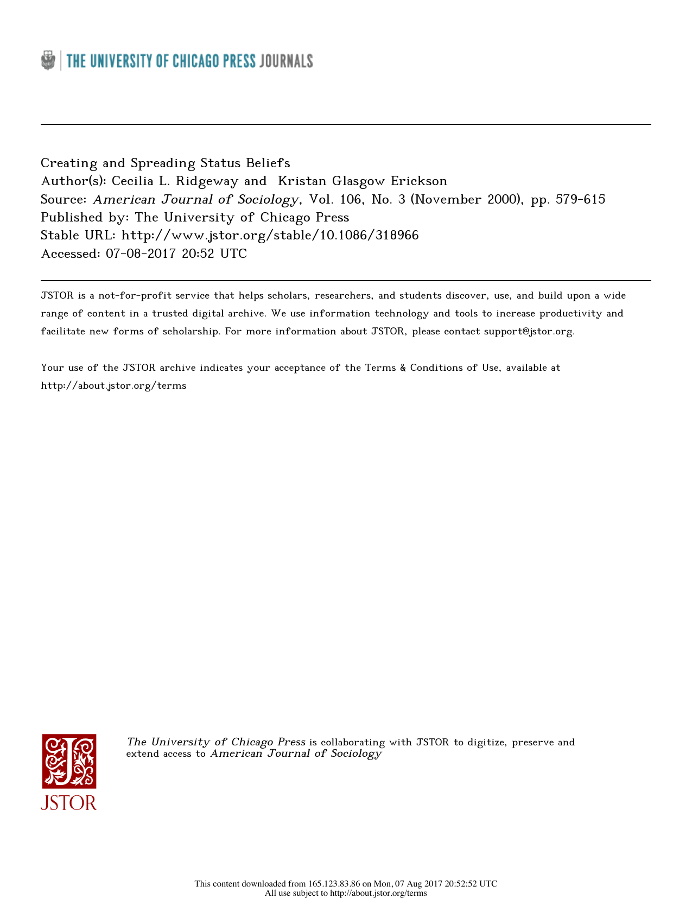<p>The participant worked with a trained confederate in an audio task. The experiment varied how that partner performed status in the interaction.</p></div>

<div class="source-line">Ridgeway and Erickson (2000), “Creating and Spreading Status Beliefs,” <em>American Journal of Sociology</em> 106(3): 579–615.</div>

## What changed was the way the confederate delivered the argument

<div class="paper-evidence highlighted-paper"><div class="image-highlight-wrap"><span class="ridge-highlight-one"></span><span class="ridge-highlight-two"></span></div><p>The confederates used the same choices and arguments. What changed was their confidence and whether they spoke deferentially. Several confederates were assigned across conditions.</p></div>

<div class="source-line">Ridgeway and Erickson (2000), methods section, pp. 590–591.</div>

## Music Lab made the interface part of the treatment

<div class="paper-evidence"><p>Participants encountered the same 48 songs. In the social-influence condition shown here, the interface displayed previous download counts; the independent condition removed those counts.</p></div>

<div class="source-line">Salganik, Dodds, and Watts (2006), “Experimental Study of Inequality and Unpredictability in an Artificial Cultural Market,” <em>Science</em> 311: 854–856, Figure S2.</div>

## The condition name is only a shorthand

“Racial composition,” “parental status,” “interaction style,” and “social influence” name the comparison. Participants encounter a complete description, application, performance, or interface.

<div class="match-table four-rows">
<div class="head">Theoretical condition</div><div class="head">What the participant encounters</div><div class="head">What must be checked</div>
<div>Racial composition</div><div>A complete neighbourhood description</div><div>Plausibility and unintended inferences</div>
<div>Parental status</div><div>A complete application</div><div>Equivalence of qualifications</div>
<div>Interaction style</div><div>A trained performance</div><div>Fidelity across actors and encounters</div>
<div>Social influence</div><div>An interface with popularity information</div><div>Everything else in the interface</div>
</div>

The checking problem therefore depends on the material: plausible combinations for a vignette, matched qualifications for an application, consistent delivery for a confederate, and a controlled display for an interface.

## Bloemraad, Silva, and Voss tested three movement frames

<div class="paper-with-claim bloemraad-title">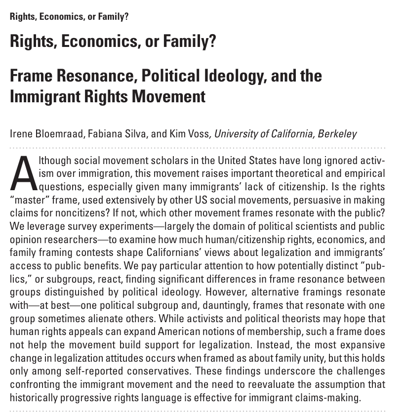<p>The study asked whether rights, economics, or family language changes support for legal status and access to public benefits for undocumented immigrants.</p></div>

<div class="source-line">Bloemraad, Silva, and Voss (2016), “Rights, Economics, or Family?” <em>Social Forces</em> 94(4): 1647–1674.</div>

## The article prints the exact three framing contests

<div class="paper-evidence treatment-evidence">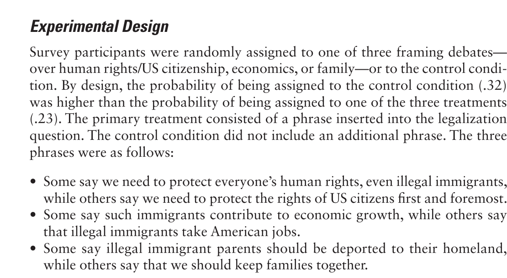<p>The crop ends after the three complete treatment phrases. Each presented an argument and counterargument within one domain; the control omitted the additional phrase.</p></div>

<div class="source-line">Bloemraad, Silva, and Voss (2016), experimental design, pp. 1658–1659.</div>

## A framing contest is not the same as a one-sided persuasive message

<div class="frame-three">
<div><small>RIGHTS</small><p>Human rights for everyone versus priority for the rights of US citizens.</p></div>
<div><small>ECONOMICS</small><p>Economic contribution and growth versus jobs and public costs.</p></div>
<div><small>FAMILY</small><p>Keeping families together versus enforcing removal of parents.</p></div>
</div>

The structure matters: both sides of the dispute remain within the same domain.

## The frames resonated differently across political groups

<div class="paper-evidence">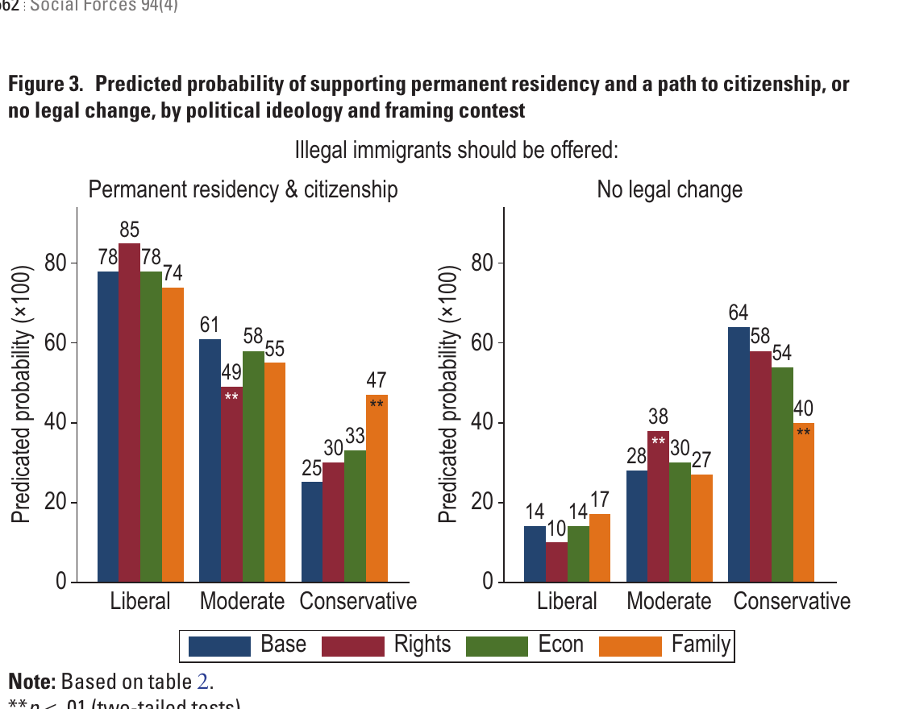<p>The family contest increased support for permanent residency and citizenship among conservatives, while the rights contest reduced support among moderates. The economic contest changed little.</p></div>

<div class="source-line">Bloemraad, Silva, and Voss (2016), Figure 3.</div>

## Today’s hands-on example uses the same three domains

<div class="design-strip five">
<div><small>QUESTION</small><b>How does a framing contest affect support for legal status?</b></div>
<div><small>CONDITION A</small><b>Rights</b><span>human rights and citizenship</span></div>
<div><small>CONDITION B</small><b>Economics</b><span>contributions, jobs, and costs</span></div>
<div><small>CONDITION C</small><b>Family</b><span>unity and enforcement</span></div>
<div><small>OUTCOME</small><b>Preferred legal status</b></div>
</div>

We will create and screen new candidate messages. The substantive question stays visible throughout: whether rights, economic, or family arguments change support for legal status.

## Some wording differences are part of the intended frame

<div class="frame-three annotated">
<div><small>RIGHTS</small><p><mark class="frame-token">human dignity</mark> versus the <mark class="frame-token">claims of citizens</mark></p></div>
<div><small>ECONOMICS</small><p><mark class="frame-token">work and tax contributions</mark> versus <mark class="frame-token">jobs and public costs</mark></p></div>
<div><small>FAMILY</small><p><mark class="frame-token">family unity</mark> versus <mark class="frame-token">enforcement that separates relatives</mark></p></div>
</div>

## Other differences could become causal confounds

<div class="frame-three annotated">
<div><small>RIGHTS</small><p><mark class="confound-token">fundamental</mark> rights should apply to everyone.</p></div>
<div><small>ECONOMICS</small><p>Legal status would <mark class="confound-token">strengthen the economy</mark>.</p></div>
<div><small>FAMILY</small><p>Children would be <mark class="confound-token">torn away</mark> from their parents.</p></div>
</div>

Moral intensity, unsupported factual claims, emotional imagery, and terminology can vary even when every message has been given a plausible frame label.

## Random assignment identifies the effect of the complete wording

<div class="causal-box">
<p><b>What we can estimate:</b> differences between participants assigned to the complete rights, economics, and family texts.</p>
<p><b>What we cannot isolate automatically:</b> the effect of the frame apart from tone, factual claims, terminology, length, or any other feature that differs across those texts.</p>
</div>

## Dafoe and colleagues call this an information-equivalence problem

<div class="paper-with-claim">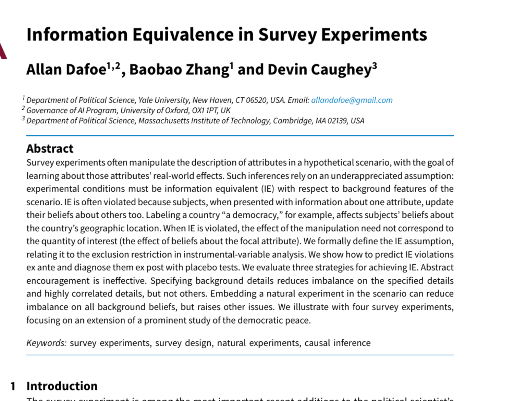<p>A manipulation may change respondents' beliefs about background facts as well as the focal concept. The treatment groups then differ in more information than the researcher intended.</p></div>

<div class="source-line">Dafoe, Zhang, and Caughey (2018), “Information Equivalence in Survey Experiments,” <em>Political Analysis</em> 26(4): 399–416.</div>

## Consider the inference produced by one extra phrase

<div class="message-pair annotated">
<div><small>VERSION 1</small><p>Some people say undocumented immigrants contribute through work, spending, and taxes.</p></div>
<div><small>VERSION 2</small><p>Some people say undocumented immigrants contribute through work, spending, and taxes, <mark class="confound-token">adding billions each year</mark>.</p></div>
</div>

If responses differ, the added numerical claim—not economic framing alone—may be responsible. The claim also requires evidence.

## Let us interrogate the two versions together

<div class="compact-example-review">
<div class="mini-message"><small>VERSION 1</small><p>Some people say undocumented immigrants contribute through work, spending, and taxes.</p></div>
<div class="mini-message"><small>VERSION 2</small><p>Some people say undocumented immigrants contribute through work, spending, and taxes, <mark class="confound-token">adding billions each year</mark>.</p></div>
<div class="review-questions"><ol><li>Which words carry the intended economic frame?</li><li>What additional claim appears in Version 2?</li><li>What might that claim lead a respondent to infer?</li><li>What pretest question could reveal that inference?</li></ol></div>
</div>

## A pretest asks what people perceive before assignment

<div class="pretest-grid">
<div><b>Intended frame</b><span>How strongly does the text emphasize its assigned domain?</span></div>
<div><b>Competing frames</b><span>How strongly does it invoke either of the other two domains?</span></div>
<div><b>Other meanings</b><span>How warm, threatening, factual, credible, or partisan does it seem?</span></div>
<div><b>Open response</b><span>What is the main reason this message gives for supporting the policy?</span></div>
</div>

## Pretesting happens before the main experiment

<div class="experiment-stages"><div><b>1. Candidate pool</b><span>Generate several possible messages.</span></div><div><b>2. Pretest</b><span>Ask a separate sample what each message conveys.</span></div><div><b>3. Selection</b><span>Revise, reject, or retain using stated rules.</span></div><div><b>4. Main experiment</b><span>Randomly assign participants to the frozen materials.</span></div></div>

The same people should not normally both pretest a message and provide the main outcome for it.

## What changes when a model can produce many candidates quickly?

Producing text becomes cheaper. The study still needs decisions about:

<div class="mini-evidence-grid"><div><b>Generation</b><span>prompt, model, parameters, original output</span></div><div><b>Selection</b><span>who retained which message, using what rule</span></div><div><b>Validation</b><span>who rated it, which question, and with what result</span></div></div>

These are separate stages and should remain separate in the research record.

## A useful generation request states the construct and the constraints

```text
Write four short framing contests about permanent legal status for
undocumented immigrants.

In each text, keep ECONOMICS as the shared domain: contribution and
growth on one side; jobs or public costs on the other.

Represent both sides in parallel language. Do not invent statistics.
Do not use dehumanizing or stigmatizing terminology. Use no more than
55 words. Return four separately numbered texts.
```

The prompt produces candidates. It does not certify that the candidates followed the request.

## One prompt gives us a set of alternatives to inspect

<div class="candidate-gallery">
<div><b>econ_01</b><span>work and taxes · jobs and public resources</span></div>
<div><b>econ_02</b><span>workers · families · jobs and costs</span></div>
<div><b>econ_03</b><span>employment and taxes · fiscal obligations</span></div>
<div><b>econ_04</b><span>wages and purchases · programmes and competition</span></div>
</div>

Variation is useful only if we keep a record of where every alternative came from.

## Generating many candidates is not the same as randomizing participants

<div class="match-table">
<div class="head">Stage</div><div class="head">Unit</div><div class="head">Question answered</div>
<div>Generation</div><div>Possible messages</div><div>What text did this production procedure create?</div>
<div>Selection / pretest</div><div>Candidate messages and raters</div><div>Which candidates fit the design?</div>
<div>Main experiment</div><div>Participants</div><div>What happens when people are assigned to the retained treatments?</div>
</div>

## Bai et al. compared three ways of producing persuasive messages

<div class="paper-with-claim">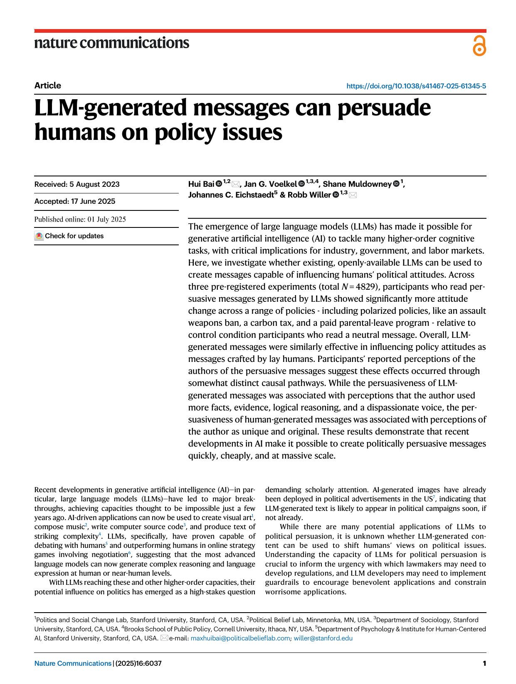<p>The studies compared messages written by people, messages generated by an LLM, and LLM messages selected in a separate human-in-the-loop procedure.</p></div>

<div class="source-line">Bai et al. (2025), “LLM-Generated Messages Can Persuade Humans on Policy Issues,” <em>Nature Communications</em> 16: 6037.</div>

## The three production procedures were not simply “AI versus human”

<div class="treatment-three">
<div><b>Human</b><p>A lay participant wrote a persuasive message.</p></div>
<div><b>LLM</b><p>The model generated the message used in the experiment.</p></div>
<div><b>Human-in-the-loop</b><p>A person selected one message from five LLM-generated alternatives.</p></div>
</div>

Generation and selection both form part of the treatment-production procedure.

## Participants read one message drawn from a larger pool

In the first two studies, the researchers used pools of 50 human-written and 50 LLM-generated messages. A participant encountered one message, not an average message.

<div class="logic-box"><b>Why this matters</b><span>If only one unusually strong message drives the result, a claim about “LLM messages” is too broad. The set of messages is part of the evidence.</span></div>

## All three persuasive-message conditions outperformed the control

<div class="paper-evidence">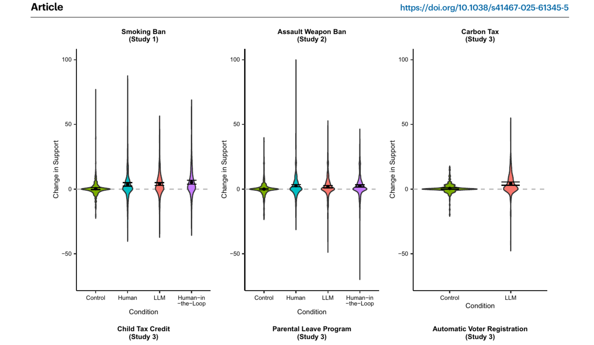<p>Compared with the neutral control, LLM messages significantly increased support in all three studies. Human and human-selected LLM messages also beat the control in Studies 1 and 2. The direct LLM-versus-human differences were not statistically significant.</p></div>

<div class="source-line">Bai et al. (2025), Figure 1 and policy-support results. Effects are changes on a 0–100 scale with 95% confidence intervals.</div>

## Why that result is not an isolated effect of “AI authorship”

Participants were randomly assigned to <strong>complete messages produced in different ways</strong>. Those messages also differed in length, tone, argument structure, factual detail, and storytelling. The experiment therefore estimates the effect of each production procedure as implemented, not the effect of an authorship label while holding the wording fixed.

<div class="causal-box"><p><b>Supported:</b> the LLM-produced message pool changed policy support relative to the neutral control.</p><p><b>Not isolated:</b> which linguistic differences between the human and LLM pools account for any persuasive effect.</p></div>

## Slater, Peter, and Valkenburg ask what messages the claim covers

<div class="message-population">
<div><small>NARROW CLAIM</small><b>These messages</b><span>The exact texts used in this experiment.</span></div>
<div><small>BROADER CLAIM</small><b>This production procedure</b><span>Other outputs from the same prompt, model, and selection rule.</span></div>
<div><small>THEORETICAL CLAIM</small><b>This kind of frame</b><span>A much wider population of possible messages.</span></div>
</div>

Using several messages reduces dependence on one unusually strong wording. It does not by itself show that the pool represents every way the frame could be expressed.

<div class="source-line">Slater, Peter, and Valkenburg (2015), “Message Variability and Heterogeneity: A Core Challenge for Communication Research,” <em>Communication Yearbook</em> 39: 3–31.</div>

## Generated images create the same selection problem

<div class="paper-with-claim">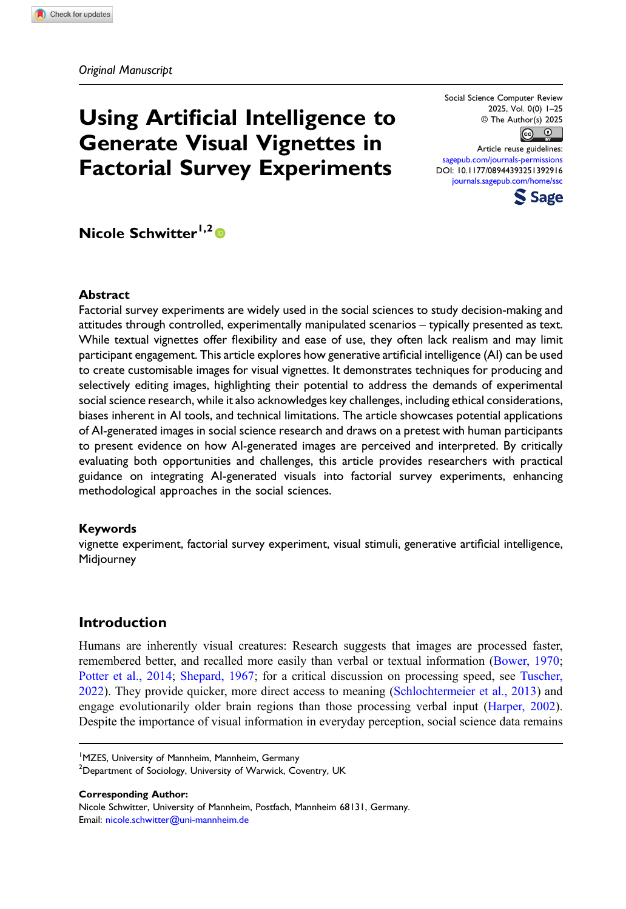<p>Schwitter used generated images in factorial surveys. The image makes intended dimensions visible, but it can also introduce faces, hands, lighting, text, posture, and background details the design never specified.</p></div>

<div class="source-line">Schwitter (2025), “Using Artificial Intelligence to Generate Visual Vignettes in Factorial Survey Experiments,” <em>Social Science Computer Review</em>, OnlineFirst. doi:10.1177/08944393251392916.</div>

## Schwitter generated, edited, and pretested the images

<div class="paper-evidence">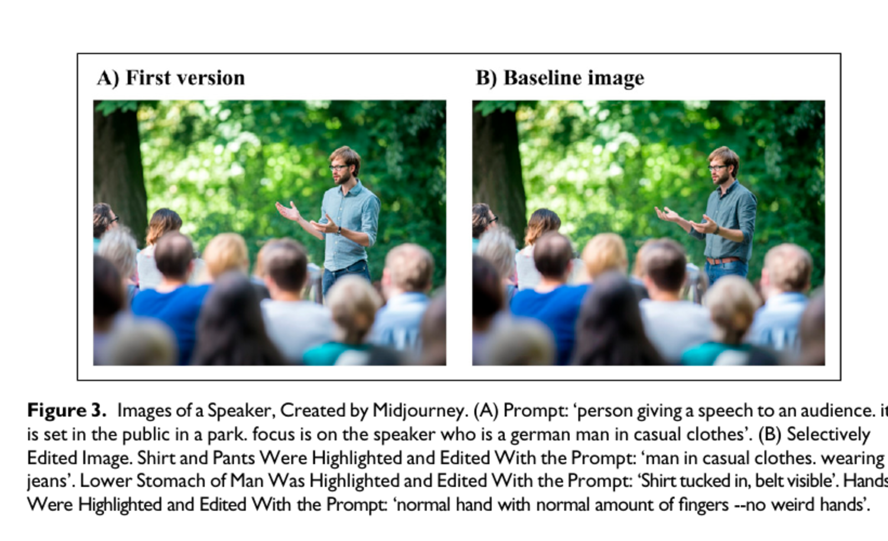<p>The first image was not treated as a finished treatment. Selective editing changed clothing and repaired the hands before the images were pretested.</p></div>

<div class="source-line">Schwitter (2025), Figure 3.</div>

## A visual pretest checks intended and unintended attributes

<div class="pretest-grid">
<div><b>Manipulation</b><span>Do raters perceive the intended age, gender, occupation, or setting?</span></div>
<div><b>Realism</b><span>Does the image look like a plausible photograph or scene?</span></div>
<div><b>Nuisance features</b><span>Do lighting, clothing, expression, or background vary systematically?</span></div>
<div><b>Artifacts</b><span>Are hands, faces, edges, reflections, or written text visibly wrong?</span></div>
</div>

## LinkedOut validated generated profile photographs before fieldwork

<div class="paper-with-claim">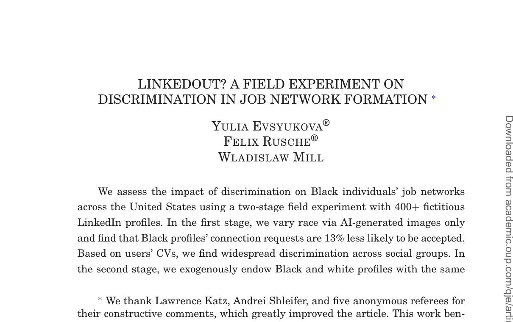<p>The field experiment studied discrimination in professional networking. Generated profile images were candidates that had to be narrowed, rated, and matched before use.</p></div>

<div class="source-line">Evsyukova, Rusche, and Mill (2025), “LinkedOut? A Field Experiment on Discrimination in Job Network Formation,” <em>Quarterly Journal of Economics</em> 140(1): 283–334.</div>

## One hundred thousand generated faces became a much smaller study set

<div class="paper-evidence pipeline-full">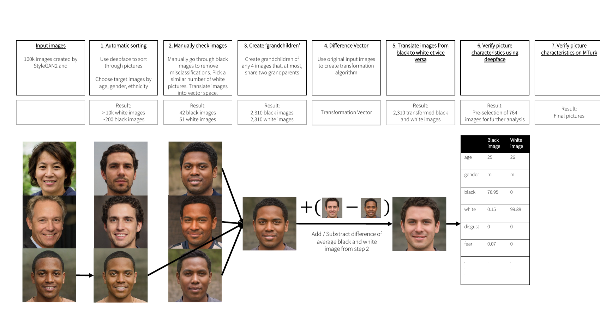<p>The figure starts with 100,000 generated faces and ends with a much smaller validated set. Automated sorting, manual review, transformation, matching, and human ratings are separate decisions.</p></div>

<div class="source-line">Evsyukova, Rusche, and Mill (2025), Online Appendix, Figure B.1.</div>

## Raters checked both the intended race cue and other visible differences

<div class="match-table compact-rows">
<div class="head">Question for raters</div><div class="head">Why it was asked</div><div class="head">What a problem would mean</div>
<div>How likely is the profile to be perceived as Black or white?</div><div>Check whether the intended racial cue is legible</div><div>Weak or ambiguous perceptions would weaken the manipulation</div>
<div>How old does the person look, and how trustworthy, intelligent, authentic, and attractive do they appear?</div><div>Check other attributes that could affect accepting a connection request</div><div>Systematic differences between paired profiles would create rival explanations</div>
</div>

The authors used these ratings to select and match profiles before the field experiment. This is the same causal-inference problem as the framing example: the intended cue should not be bundled with a consistent difference in another persuasive attribute.

<div class="source-line">Evsyukova, Rusche, and Mill (2025), Online Appendix, image-validation measures and Figures F.2–F.5.</div>

## The examples so far freeze the treatment pool before fieldwork

<div class="comparison-band"><strong>Fixed pool</strong><span>Researchers generate, review, and freeze the messages or images before assignment.</span></div>
<div class="comparison-band"><strong>Adaptive instrument</strong><span>Participant input can add to or change what later participants are asked.</span></div>

Yamil Velez asks what happens when respondents help build the instrument itself.

## Velez introduces crowdsourced adaptive surveys

<div class="paper-with-claim">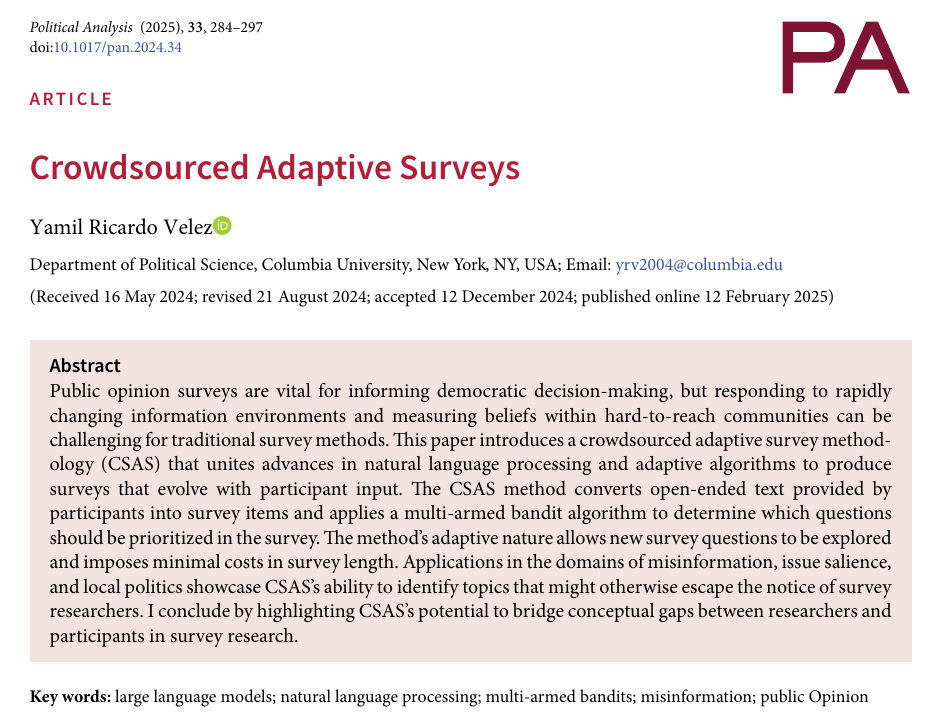<p>Participants answer an open-ended question. Their responses can become structured survey items that enter an evolving question bank.</p></div>

<div class="source-line">Velez (2025), “Crowdsourced Adaptive Surveys,” <em>Political Analysis</em> 33: 284–297.</div>

## The question bank changes while the survey is in the field

<div class="paper-evidence velez-process">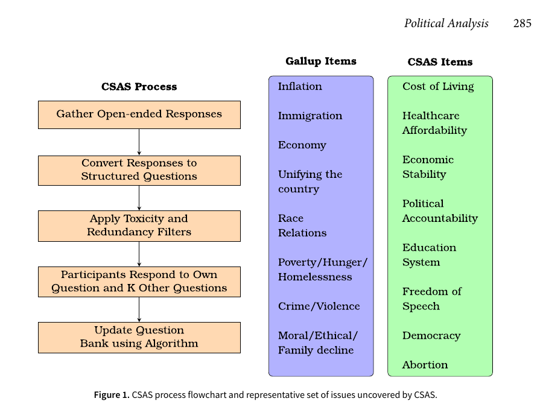<p>The LLM converts open-ended responses into structured questions. Filters remove toxic or redundant items; an adaptive algorithm then decides which questions later participants are more likely to receive.</p></div>

<div class="source-line">Velez (2025), Figure 1.</div>

## What makes the survey adaptive?

<div class="adaptive-cycle">
<div><b>1</b><span>A participant writes an open-ended response.</span></div>
<div><b>2</b><span>An LLM converts it into a structured survey item.</span></div>
<div><b>3</b><span>Toxic and redundant items are filtered.</span></div>
<div><b>4</b><span>A multi-armed bandit changes which items later participants are more likely to see.</span></div>
</div>

The adaptation happens across respondents through a shared question bank. It is not a free-form interview in which an LLM invents the next probe for the person currently answering.

## For the hands-on example, we return to a fixed message pool

Velez gives us a genuinely different way to construct a survey. Our coding task is narrower: screen a set of messages that has already been generated, record why each is retained or rejected, and compare the retained conditions before fieldwork.

<div class="fixed-return"><b>12 saved candidates</b><span>→</span><b>5 stated checks</b><span>→</span><b>retained and rejected records</b><span>→</span><b>pool comparison</b></div>

## The hands-on task: screen 12 candidate messages

<div class="pool-definition">
<div><b>Candidate</b><span>One possible message that has not yet been approved for assignment.</span></div>
<div><b>Starting pool</b><span>All 12 candidates: four rights, four economics, and four family framing contests.</span></div>
<div><b>Retained pool</b><span>The subset that passes the stated screening rules.</span></div>
</div>

Our goal is to apply the same checks to each message, preserve every rejection reason, and see whether the three retained conditions remain different in tone.

## Here is the complete starting pool

<div class="candidate-gallery twelve">
<div><b>rights_01</b><span>34 words</span></div><div class="flag"><b>rights_02</b><span>59 words · claims flagged</span></div><div><b>rights_03</b><span>35 words</span></div><div><b>rights_04</b><span>34 words</span></div>
<div><b>econ_01</b><span>30 words</span></div><div class="flag"><b>econ_02</b><span>33 words · frame drift</span></div><div><b>econ_03</b><span>33 words</span></div><div><b>econ_04</b><span>31 words</span></div>
<div><b>family_01</b><span>28 words</span></div><div class="flag"><b>family_02</b><span>34 words · terminology flag</span></div><div><b>family_03</b><span>33 words</span></div><div><b>family_04</b><span>30 words</span></div>
</div>

The three outlined messages contain problems that we will diagnose. The same checks will still run on all 12 records.

## What information do we have about each candidate?

<div class="provenance-map">
<div><b>Production record</b><span>Candidate ID, assigned frame, prompt version, and full text.</span></div>
<div><b>Review judgments</b><span>Scores for intended frame, competing frames, warmth, and factual density; flags for unsupported claims and terminology.</span></div>
<div><b>Calculated field</b><span>Python counts the words in the saved text.</span></div>
<div><b>Decision rules</b><span>The researcher states the thresholds used to retain or reject candidates.</span></div>
</div>

For this exercise, the review judgments are supplied with the file so that we can concentrate on how they enter a reproducible screening procedure.

## Why are we recording warmth as well as the intended frame?

<div class="rating-scale"><span><b>1</b><small>not at all warm</small></span><i></i><span><b>3</b><small>moderately warm</small></span><i></i><span><b>5</b><small>extremely warm</small></span></div>

The review question is: <strong>“How warm and caring does this message sound?”</strong> If family messages consistently sound warmer than economic messages, an experimental contrast would combine frame and tone. Warmth is therefore a possible confound, not a measure of whether the message is well written.

## The screening rules turn design decisions into explicit checks

<div class="rule-grid">
<div><b>≥ 4.0</b><span>intended-frame score</span></div><div><b>≤ 2.0</b><span>strongest competing-frame score</span></div><div><b>≤ 55</b><span>words, calculated from text</span></div><div><b>False</b><span>unsupported claim</span></div><div><b>False</b><span>stigmatizing terminology</span></div>
</div>

The cutoffs are researcher choices. Consistent code does not make them theoretically correct.

## We will check `rights_02` by hand before asking Python to do it

<div class="excerpt-card"><small>RIGHTS_02 · SYNTHETIC COURSE CANDIDATE</small>Human rights law guarantees that every undocumented immigrant must receive permanent residence in every case without exception, and decades of research prove that legalization always strengthens democracy. Others maintain that citizenship must remain the decisive basis for political membership and that extending status to people who entered without authorization would weaken the rights of citizens who followed the rules.</div>

## Two separate rules fail

<div class="check-table">
<div class="head">Check</div><div class="head">Observed value</div><div class="head">Rule</div><div class="head">Result</div>
<div>Word count</div><div>59, calculated from text</div><div>55 or fewer</div><div class="fail">FAIL</div>
<div>Unsupported claim</div><div>True: legal guarantee and universal democratic effect</div><div>Must be false</div><div class="fail">FAIL</div>
<div>Intended frame</div><div>4.8, saved review score</div><div>At least 4.0</div><div class="pass">PASS</div>
</div>

We do not stop after finding the first failure.

## The rejection record preserves every reason

```json
{
  "candidate_id": "rights_02",
  "condition": "rights",
  "reasons": [
    "word count exceeds the limit",
    "contains an unsupported claim"
  ]
}
```

The original message stays in the input file. The output records the decision without deleting the candidate.

## `family_02` shows why terminology is part of the treatment

<div class="message-pair">
<div><small>TEXT</small><p>Supporters say illegal immigrant parents should be allowed to stay so their children can grow up with them. Opponents say parents who broke immigration rules should face deportation even when that separates a family.</p></div>
<div><small>WHY IT FAILS</small><p>Bloemraad, Silva, and Voss (2016) used the phrase “illegal immigrants” in the published treatment. Our review rule flags it here because terminology can change how participants understand the people described.</p></div>
</div>

## After individual screening, we compare the retained pools

<div class="pool-output">
<div><b>Rights</b><span>rights_01 · rights_03 · rights_04</span><small>3 retained; rights_02 rejected</small></div>
<div><b>Economics</b><span>econ_01 · econ_03 · econ_04</span><small>3 retained; econ_02 rejected</small></div>
<div><b>Family</b><span>family_01 · family_03 · family_04</span><small>3 retained; family_02 rejected</small></div>
</div>

Passing individually does not guarantee that the three pools are comparable overall.

## The retained family messages still sound much warmer

<div class="pool-means"><div><small>ECONOMICS</small><b>2.10</b></div><div><small>RIGHTS</small><b>3.00</b></div><div class="warm"><small>FAMILY</small><b>4.40</b></div></div>

Each value is the average warmth score across the three retained messages in that condition. The 2.30-point gap between family and economics exceeds the 1.0-point warning threshold. The pools also differ in factual density.

## This is how the pool mean is calculated

<div class="mean-calculation">
<div><small>ECON_01</small><b>2.1</b></div><span>+</span><div><small>ECON_03</small><b>2.0</b></div><span>+</span><div><small>ECON_04</small><b>2.2</b></div><span>=</span><div><small>TOTAL</small><b>6.3</b></div><span>÷ 3 =</span><div class="answer"><small>POOL MEAN</small><b>2.10</b></div>
</div>

The unit being averaged is the <strong>message</strong>: add the three retained economics-message scores and divide by three.

## A real pretest would give us a distribution of participant responses

<div class="match-table four-rows">
<div class="head">Element</div><div class="head">What it means</div><div class="head">What we would report</div>
<div>Participants</div><div>A sample recruited to judge candidate messages</div><div>Who, how many, and recruitment criteria</div>
<div>Rating scale</div><div>The exact question and labelled response options</div><div>Full wording and anchors</div>
<div>Distribution</div><div>How responses vary, not just their average</div><div>Counts or proportions at 1–5; mean and spread</div>
<div>Decision</div><div>How those responses changed the stimulus pool</div><div>Retain, revise, or reject—with a reason</div>
</div>

## A pretest distribution shows disagreement that a mean would hide

<div class="distribution-layout">
<div class="bars">
<div><span>1</span><i style="height: 32%"></i><b>18%</b></div>
<div><span>2</span><i style="height: 79%"></i><b>44%</b></div>
<div><span>3</span><i style="height: 52%"></i><b>29%</b></div>
<div><span>4</span><i style="height: 14%"></i><b>8%</b></div>
<div><span>5</span><i style="height: 4%"></i><b>1%</b></div>
</div>
<div class="distribution-record"><small>EXAMPLE: ECON_01</small><p><b>Question:</b> How warm and caring does this message sound?</p><p><b>Scale:</b> 1 = not at all warm; 5 = extremely warm</p><p><b>n:</b> 80 ratings &nbsp; <b>mean:</b> 2.3</p><p><b>Decision:</b> retain; warmth lies within the planned range</p></div>
</div>

## What could we do about the warmth difference?

Possible responses include:

- rewrite the warmest family messages or the coldest economic messages;
- decide that warmth is part of the construct and state that explicitly;
- draw a better-matched subset and pretest it again;
- abandon the broad framing claim and describe the exact messages tested.

## What the Python section will do

<div class="python-roadmap">
<div><small>INPUT</small><b>Load 12 candidate records and 5 rules</b></div>
<span>→</span><div><small>FOR EACH CANDIDATE</small><b>Calculate word count and run every check</b></div>
<span>→</span><div><small>OUTPUT</small><b>Save retained records and every rejection reason</b></div>
<span>→</span><div><small>POOL CHECK</small><b>Compare warmth and factual density</b></div>
</div>

In pseudocode: <code>load → loop over candidates → calculate → compare → append → summarize</code>.

## Input 1 is the saved candidate pool; input 2 is the rules

```python
import json

with open("data/session05/immigrant_frame_candidates.json") as file:
    study = json.load(file)

candidates = study["candidates"]
rules = study["rules"]
```

`json.load(file)` reads the saved file and turns its JSON objects and arrays into Python dictionaries and lists. The exact outputs of these lines are `candidates`, a list of 12 dictionaries, and `rules`, one dictionary.

## The file also keeps the production record with each candidate

<div class="source-record"><small>ONE CANDIDATE'S SAVED RECORD</small><pre><code>candidate_id: econ_01
condition: economics
source: cached_course_generation
prompt_version: v3
model: [record in a real study]
raw_output: [save before editing]
edited_text: [save separately]
editor: [record who changed it]</code></pre></div>

Python can only use and preserve information that the researcher has saved. In a real study, these fields connect a candidate to its prompt, model, original output, and any later edit.

## Before any checks run, one candidate is already a complete record

```python
candidate = candidates[1]

candidate["candidate_id"]   # "rights_02"
candidate["text"]           # a string containing the message
candidate["warmth_score"]   # 2.6, a review judgment saved in the file
candidate["unsupported_claim"]  # True, a review flag
```

The square brackets retrieve values that are already stored in the file. The text came from the cached generation; the warmth score and claim flag came from the review record introduced earlier.

## Python calculates one new value: the word count

```python
words = candidate["text"].split()
word_count = len(words)
```

<div class="code-explain"><div><b>Input</b><span>one string: the full message text</span></div><div><b>Step 1</b><span><code>.split()</code> makes a list of whitespace-separated pieces</span></div><div><b>Step 2</b><span><code>len(...)</code> counts the items in that list</span></div><div><b>Output</b><span>the integer <code>59</code></span></div></div>

This simple rule is reproducible, though it is not a linguistically perfect definition of a word.

## The second input tells Python what counts as a failed check

```python
rules = {
    "min_intended_frame_score": 4.0,
    "max_competing_frame_score": 2.0,
    "max_word_count": 55,
    "allow_unsupported_claim": False,
    "allow_stigmatizing_language": False,
}
```

The dictionary does not discover good thresholds. It stores choices made by the researcher so the same choices are applied to every record.

## `review_candidates` starts with two inputs and two empty output lists

```python
def review_candidates(candidates, rules):
    accepted = []
    rejected = []
```

<div class="code-explain"><div><b>Input 1</b><span><code>candidates</code>: list of message dictionaries</span></div><div><b>Input 2</b><span><code>rules</code>: dictionary of thresholds</span></div><div><b>Initial state</b><span>two empty output lists</span></div></div>

At this point the exact state is `accepted = []` and `rejected = []`. No candidate has been checked and nothing has been classified.

## The loop repeats the review for each of the 12 dictionaries

```python
for candidate in candidates:
    word_count = len(candidate["text"].split())
    reviewed_candidate = dict(candidate)
    reviewed_candidate["word_count"] = word_count
    reasons = []
```

On the first pass, `candidate` refers to `rights_01`; on the second, it refers to `rights_02`. `dict(candidate)` makes a copy in which we store the calculated count. `reasons = []` resets the failure record for the current message, so a previous candidate's problems cannot carry over.

## For `rights_02`, two comparisons change `reasons`

```python
if word_count > rules["max_word_count"]:
    reasons.append("word count exceeds the limit")

if candidate["unsupported_claim"]:
    reasons.append("contains an unsupported claim")
```

<div class="state-trace"><div><b>Before the checks</b><code>reasons = []</code></div><div><b>After <code>59 &gt; 55</code></b><code>["word count exceeds the limit"]</code></div><div><b>After the claim check</b><code>["word count exceeds the limit", "contains an unsupported claim"]</code></div></div>

Separate `if` statements matter because one message can fail more than one rule.

## The same five checks run for every candidate

```python
if candidate["intended_frame_score"] < rules["min_intended_frame_score"]:
    reasons.append("intended frame score is too low")
if candidate["competing_frame_score"] > rules["max_competing_frame_score"]:
    reasons.append("competing frame score is too high")
if word_count > rules["max_word_count"]:
    reasons.append("word count exceeds the limit")
if candidate["unsupported_claim"] and not rules["allow_unsupported_claim"]:
    reasons.append("contains an unsupported claim")
if candidate["stigmatizing_language"] and not rules["allow_stigmatizing_language"]:
    reasons.append("uses stigmatizing terminology")
```

Each comparison produces `True` or `False`. A `True` result appends one reason. The frame scores, warmth score, and flags are review judgments stored in the JSON file; the word count is calculated from the text.

## A non-empty `reasons` list sends the record to `rejected`

```python
if reasons:
    rejected.append({
        "candidate_id": candidate["candidate_id"],
        "condition": candidate["condition"],
        "reasons": reasons,
    })
else:
    accepted.append(reviewed_candidate)
```

For `rights_02`, `reasons` contains two strings, so `if reasons:` is `True`. Python appends a short audit record to `rejected`. If the list had remained empty, the copied candidate would instead be appended to `accepted`.

## The function returns a retained pool and a rejection audit trail

```python
return accepted, rejected

accepted, rejected = review_candidates(candidates, rules)
```

The function returns a pair of lists. In this teaching dataset the exact result is nine retained candidate dictionaries and three rejected records. Every rejected record keeps its candidate ID, condition, and all failure reasons.

## Pool comparison is a separate question from candidate screening

```python
summary = summarize_pools(
    accepted,
    max_mean_difference=rules["max_pool_mean_difference"],
)
```

The input is only the nine retained messages. The supplied helper groups them into rights, economics, and family pools, calculates the same means we worked out by hand, and checks whether the largest difference exceeds the 1.0-point warning threshold.

## The pool summary uses the retained-message scores

```text
economics: 3 messages; mean warmth = 2.10
rights: 3 messages; mean warmth = 3.00
family: 3 messages; mean warmth = 4.40

WARNING: retained pools still differ in mean warmth
WARNING: retained pools still differ in mean factual density
ready_for_assignment = False
```

The summary groups the retained records by condition, averages their saved review scores, and compares the largest and smallest pool means with the warning threshold.

## Before we run it, predict the output for `family_02`

<div class="room-task"><p><b>Known inputs:</b> 34 words; intended-frame score 4.6; competing-frame score 1.4; no unsupported claim; stigmatizing-language flag is <code>True</code>.</p><ol><li>Which check returns <code>True</code>?</li><li>Which reason string is appended?</li><li>Which output list receives the record?</li></ol></div>

Be ready to explain the values, their types, and where each value came from.

## `family_02` is rejected for one reason

```text
check that returns True:
    candidate["stigmatizing_language"]

reason appended:
    "uses stigmatizing terminology"

output:
    rejected
```

The other four checks return `False`: the message is short enough, its intended frame is strong enough, its competing-frame score is low enough, and the unsupported-claim flag is `False`.

## The completion task uses the same logic on four records

You will predict the outputs, fill two `.append()` gaps, run the checks, and explain one decision using a course reading. The coding is deliberately short; the important part is being able to account for each input, comparison, and output.

## What the review produces

<div class="review-outputs">
<div><b>9 retained records</b><span>The complete messages that passed all five stated checks.</span></div>
<div><b>3 rejection records</b><span>Each keeps the candidate ID, condition, and every reason for rejection.</span></div>
<div><b>2 pool warnings</b><span>The retained conditions still differ in warmth and factual density.</span></div>
</div>

That is enough to show which materials need revision or a proper human pretest before they are frozen for an experiment.

## Next week the treatment will change during the interaction

This week, the researcher can inspect and freeze every message before assignment. In an adaptive conversation, the model generates later turns in response to what the participant says.

<div class="comparison-band"><strong>Fixed treatment</strong><span>Participant receives one pre-approved message from a retained pool.</span></div>
<div class="comparison-band"><strong>Adaptive treatment</strong><span>The condition shapes a conversation, but participants may receive different words, arguments, and amounts of interaction.</span></div>
