## Both interviews are fluent. Which gives us better evidence?

<div class="cols"><div class="transcript"><div class="turn"><span class="speaker">Interviewer:</span> Tell me about a moment when you considered speaking in a seminar but did not.</div><div class="turn"><span class="speaker">Participant:</span> Other people's comments sounded more developed.</div><div class="turn"><span class="speaker">Interviewer:</span> What made them seem more developed than yours?</div><div class="turn"><span class="speaker">Participant:</span> They connected the reading to other theorists. Mine felt too small.</div></div><div class="transcript"><div class="turn"><span class="speaker">Interviewer:</span> Tell me about a moment when you considered speaking in a seminar but did not.</div><div class="turn"><span class="speaker">Participant:</span> Other people's comments sounded more developed.</div><div class="turn"><span class="speaker">Interviewer:</span> So you were not confident. What happened after that?</div><div class="turn"><span class="speaker">Participant:</span> The discussion moved on.</div></div></div>

---

## What did you use to make that judgment?

The room may have used several standards without naming them:

<table class="tbl"><tr><th>Standard</th><th>Where it comes from</th><th>Question</th></tr><tr><td>Specificity and nondirection</td><td>Merton & Kendall (1946)</td><td>Did the probe obtain a concrete account without supplying it?</td></tr><tr><td>Procedural comparability</td><td>Fowler & Mangione (1990)</td><td>Did interviewer discretion vary across participants?</td></tr><tr><td>Relationship and reciprocity</td><td>Oakley (2016); Bourdieu (1996)</td><td>Who is asking, and what does the participant think this relationship is?</td></tr><tr><td>Claim–evidence fit</td><td>Jerolmack & Khan (2014)</td><td>What can this account actually establish?</td></tr></table>

<div class="citation">Merton & Kendall, 1946, <em>AJS</em> 51(6): 541–557; Fowler & Mangione, 1990, <em>Standardized Survey Interviewing</em>; Oakley, 2016, <em>Sociology</em> 50(1): 195–213; Bourdieu, 1996, <em>Theory, Culture & Society</em> 13(2): 17–37; Jerolmack & Khan, 2014, <em>Sociological Methods & Research</em> 43(2): 178–209.</div>

::: {.notes}
[Sources]
- Merton & Kendall (1946) | Source: https://doi.org/10.1086/219886 | Accessed: 2026-08-25
- Fowler & Mangione (1990) | Source: https://uk.sagepub.com/en-gb/eur/standardized-survey-interviewing/book2496 | Accessed: 2026-08-25
- Oakley (2016) | Source: https://doi.org/10.1177/0038038515580253 | Accessed: 2026-08-25
- Bourdieu (1996) | Source: https://doi.org/10.1177/026327696013002002 | Accessed: 2026-08-25
- Jerolmack & Khan (2014) | Source: https://doi.org/10.1177/0049124114523396 | Accessed: 2026-08-25
[/Sources]
:::

---

## There is no universal winner—and that is the point

<div class="cols"><div><h3>Interview A</h3><p>Better for learning what “more developed” meant to this participant. The probe asks for the participant's criterion.</p><p><strong>Risk:</strong> the follow-up creates a participant-specific path.</p></div><div><h3>Interview B</h3><p>Shorter and easier to compare with another interview using the same sequence.</p><p><strong>Risk:</strong> “not confident” is the interviewer's interpretation, not the participant's wording.</p></div></div>

<div class="criterion"><strong>The right answer depends on the claim.</strong> If the study concerns how students interpret intellectual worth, A currently gives better evidence. If it requires a standardized measure, neither exchange is an adequate instrument.</div>

---

## Three questions will let us make that judgment properly

<div class="route"><div class="route-item"><strong>Evidence</strong><br>What should the interview establish?</div><div class="route-arrow">→</div><div class="route-item"><strong>Discretion</strong><br>What may the interviewer do?</div><div class="route-arrow">→</div><div class="route-item"><strong>Relationship</strong><br>Who or what is asking?</div></div>

<div class="purpose">The first question clarifies the research purpose. The second lets us inspect the probe. The third asks how the encounter itself shapes the answer.</div>

---

## The two opening interviews already show what is new

<table class="tbl"><tr><th>Same before the answer</th><th>Different after the answer</th></tr><tr><td>Research question<br>Fixed opening question<br>Instructions about probing</td><td><strong>A:</strong> asks what “more developed” meant<br><strong>B:</strong> supplies “not confident” and moves on</td></tr></table>

<div class="purpose">Once the next question depends on the answer, the interview protocol is no longer a complete record of what each participant received.</div>

---

## This extends the treatment problem from last week

<table class="tbl"><tr><th></th><th>Set in advance</th><th>Can change</th></tr><tr><td>Fixed vignette</td><td>Wording and exposure</td><td>Participant response</td></tr><tr><td>Adaptive item bank</td><td>Pool and selection rule</td><td>Next item across respondents</td></tr><tr><td>Adaptive interview</td><td>Protocol and instructions</td><td>Next probe within a conversation</td></tr></table>
<div class="purpose">The guide or system prompt no longer completely describes the interview a participant received.</div>

---

## Early Chicago sociology connected biographies to social change

<div class="cols6040">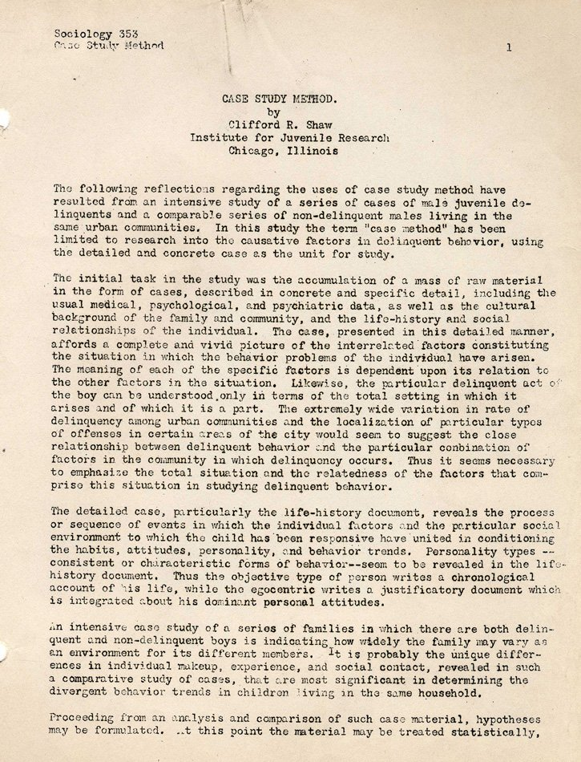<div><p>The University of Chicago archive describes life histories as interviews or autobiographical accounts used to connect a person's experience with a changing social world.</p><p>This student paper also shows that the researcher selected, organized and interpreted the life record.</p><div class="criterion"><strong>Question added:</strong> Is one interview adequate to the timescale and context of the claim?</div><div class="citation">C. R. Shaw student paper, Sociology 353, Ernest Watson Burgess Papers, University of Chicago Library.</div></div></div>

::: {.notes}
[Sources]
- University of Chicago Library, “Life History Method” and C. R. Shaw student paper | Source: https://www.lib.uchicago.edu/collex/exhibits/mapping-young-metropolis/life-history-method/ | Accessed: 2026-08-25
[/Sources]
:::

---

## A transcript is a record of a life, not the life itself

If our claim concerns how class, migration or institutional experience develops over time, a fluent twenty-minute account can still be too thin.

<div class="question">What would we need besides a transcript to understand a student's route into—and through—graduate education?</div>

---

## Merton and Kendall studied responses to situations the researchers already knew

<div class="cols6040">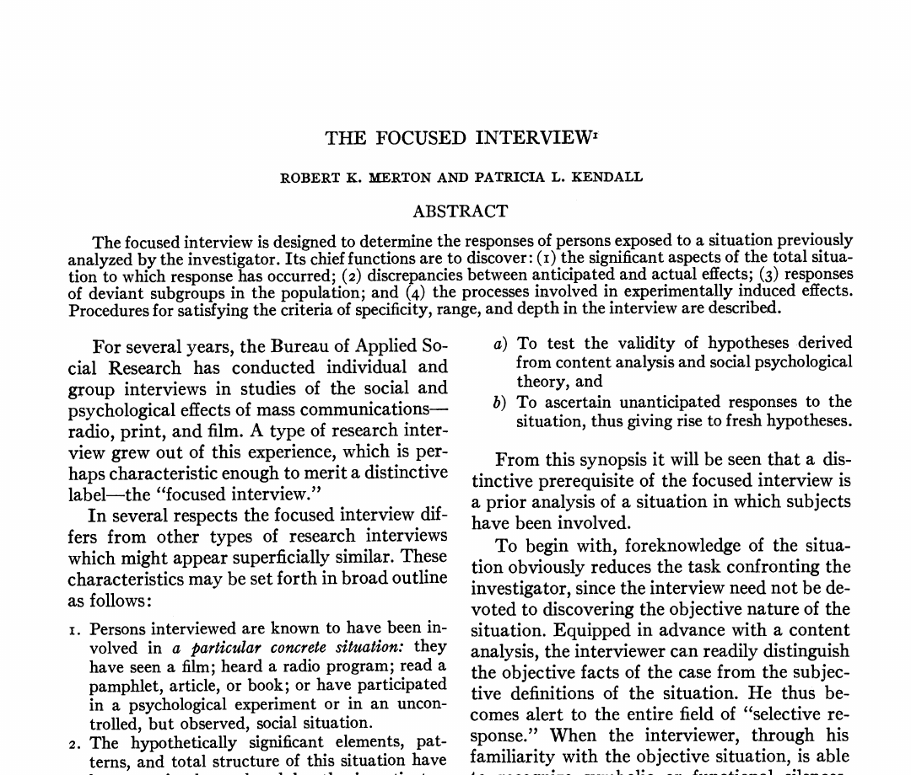<div><p>The focused interview developed from research on responses to analysed films, broadcasts and experimental situations.</p><p>The prior analysis gave interviewers expectations to investigate—but the interview still had to leave room for unanticipated responses.</p><div class="citation">Robert K. Merton & Patricia L. Kendall (1946), “The Focused Interview,” <em>American Journal of Sociology</em> 51(6): 541–557. https://doi.org/10.1086/219886</div></div></div>

::: {.notes}
[Sources]
- Merton & Kendall (1946), “The Focused Interview” | Source: https://doi.org/10.1086/219886 | Accessed: 2026-08-24
[/Sources]
:::

---

## These are Merton and Kendall's own four criteria

<div class="cols4060"><div><p>They call the criteria <strong>provisional</strong> and interrelated:</p><ol><li>nondirection;</li><li>specificity;</li><li>range;</li><li>depth and personal context.</li></ol><p>The formulation matters: “depth” is not a word-count metric. It concerns affective significance and personal context.</p></div>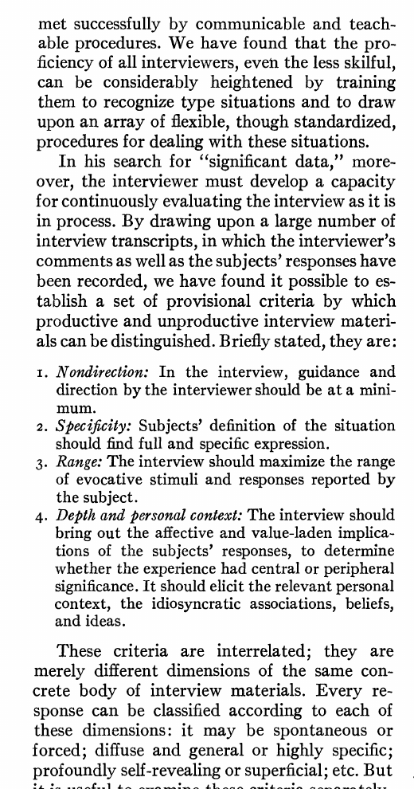</div>

<div class="citation">Merton & Kendall (1946), p. 545. Screenshot from the supplied published PDF.</div>

---

## The four criteria can pull the interviewer in different directions

<table class="tbl"><tr><th>The criterion</th><th>What the paper asks the interviewer to notice</th></tr><tr><td>Nondirection</td><td>Keep guidance to a minimum so the participant's own framing can appear.</td></tr><tr><td>Specificity</td><td>Obtain a full and specific definition of the situation.</td></tr><tr><td>Range</td><td>Cover anticipated and unanticipated responses and stimuli.</td></tr><tr><td>Depth and personal context</td><td>Distinguish central, affect-laden responses from peripheral ones and connect them to prior experience.</td></tr></table>

<div class="purpose">These are not four independent scores. The interviewer evaluates the conversation as it proceeds and adapts technique accordingly.</div>

::: {.notes}
[Sources]
- Merton & Kendall (1946), pp. 545, 552–555 | Source: https://doi.org/10.1086/219886 | Accessed: 2026-08-25
[/Sources]
:::

---

## A useful probe asks for evidence without supplying the answer

<div class="transcript"><div class="turn"><span class="speaker">Response:</span> “I found it uncomfortable.”</div><div class="turn"><span class="speaker">Probe A:</span> “Was there a particular moment when you began to feel uncomfortable?”</div><div class="turn"><span class="speaker">Probe B:</span> “Was it the speaker's dismissive tone that made you uncomfortable?”</div></div>
<p>This is an instructor-written example applying Merton and Kendall's distinction. Probe A requests specificity. Probe B introduces both a feature and an interpretation.</p>
<div class="criterion"><strong>Check:</strong> Does the probe obtain specificity or depth while keeping direction to a minimum?</div>

<div class="citation">Applied example based on Merton & Kendall (1946), especially pp. 545–551.</div>

---

## Survey interviewing gave the interviewer a different job

<div class="cols4060"><div>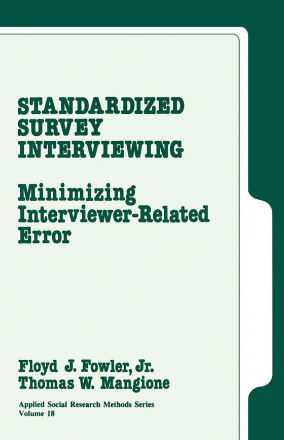</div><div><h3>Read as written</h3><p>Keep wording and order stable.</p><h3>Use standardized probes</h3><p>Do not improvise different explanations for different respondents.</p><h3>Follow skip logic and code consistently</h3><p>The interviewer's role is deliberately restricted.</p><div class="citation">Floyd J. Fowler Jr. & Thomas W. Mangione (1990), <em>Standardized Survey Interviewing: Minimizing Interviewer-Related Error</em>. SAGE.</div></div></div>

<div class="purpose">Standardization reduces one source of interviewer-related variation for a measurement task. It does not remove all interviewer effects or guarantee shared interpretation.</div>

---

## Identical wording does not guarantee identical meaning

<div class="transcript"><div class="turn"><span class="speaker">Interviewer:</span> In the last week, how many times did you exercise?</div><div class="turn"><span class="speaker">Respondent:</span> Does walking to work count?</div><div class="turn"><span class="speaker">Strict:</span> Whatever exercise means to you.</div><div class="turn"><span class="speaker">Clarifying:</span> Count walking if it lasted ten minutes and raised your breathing rate.</div></div>
<div class="purpose">The first preserves the standardized script. The second may improve the respondent's mapping to the intended concept, but changes the words this respondent hears.</div>

<div class="citation">Illustrative exercise based on Schober & Conrad (1997), “Does Conversational Interviewing Reduce Survey Measurement Error?”, <em>Public Opinion Quarterly</em> 61(4): 576–602.</div>

::: {.notes}
[Sources]
- Schober & Conrad (1997) | Source: https://faculty.isr.umich.edu/fredconrad/wp-content/uploads/2015/12/schober___conrad__1997.pdf | Accessed: 2026-08-25
[/Sources]
:::

---

## Depth and comparability are different research objectives

<table class="tbl"><tr><th>Interview job</th><th>Interviewer does</th><th>Main risk</th></tr><tr><td>Reconstruct a process</td><td>Follows chronology and context</td><td>Short accounts detach events from a life</td></tr><tr><td>Understand a response</td><td>Requests specificity and depth</td><td>The probe directs the answer</td></tr><tr><td>Produce comparable measures</td><td>Restricts discretion</td><td>Shared wording conceals different meanings</td></tr></table>

<div class="citation">Instructor synthesis of Thomas & Znaniecki's life-history tradition; Merton & Kendall (1946); Fowler & Mangione (1990); and Schober & Conrad (1997). The table is not reproduced from a single source.</div>

---

## Interviewing also involves trouble and repair

Respondents hesitate, challenge a category, answer a different question, or reveal that interviewer and respondent do not share the same definition.

<div class="question">The respondent's request—“Does walking count?”—shows why we now need to consider the exchange itself, not only the schedule.</div>

<div class="purpose">This is the bridge: standardization asks what the interviewer should keep fixed; interaction research asks what happens when shared meaning breaks down.</div>

::: {.notes}
[Sources]
- Suchman & Jordan (1990), “Interactional Troubles in Face-to-Face Survey Interviews” | Source: https://doi.org/10.1080/10510979009368218 | Accessed: 2026-08-25
- Schober & Conrad (1997) | Source: https://doi.org/10.1086/297818 | Accessed: 2026-08-25
[/Sources]
:::

---

## Repair makes the interviewer's contribution visible

When a respondent asks what a category means, the interviewer has to do something: repeat the words, provide a definition, improvise an explanation, defer, or move on.

<div class="cols"><div><h3>What the transcript records</h3><p>The exact clarification and the answer that followed it.</p></div><div><h3>What the methods section must explain</h3><p>Which clarifications were allowed, how interviewers were trained, and whether different respondents received different explanations.</p></div></div>

<div class="purpose">This is why interviewer behavior is part of the data-generating process rather than an incidental feature of delivery.</div>

---

## Oakley's argument came from interviewing women becoming mothers

<div class="cols6040">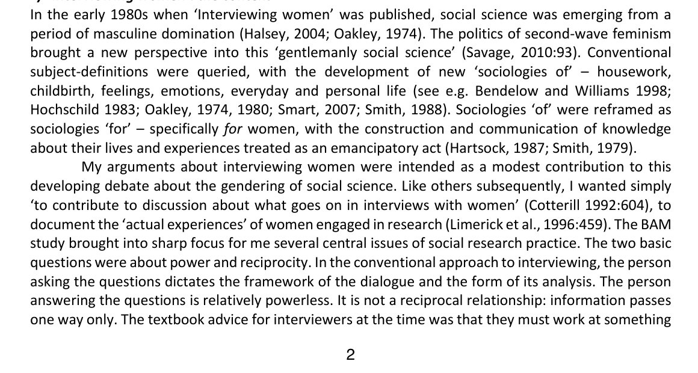<div><p>Oakley's original argument grew from the <em>Becoming a Mother</em> study: four interviews each with 55 women from pregnancy to five months after birth.</p><p>The participants asked Oakley hundreds of questions about pregnancy, childbirth and care. Conventional advice said that answering could bias the data; Oakley argued that refusing could be exploitative and counterproductive.</p><div class="citation">Ann Oakley (2016), “Interviewing Women Again: Power, Time and the Gift,” <em>Sociology</em> 50(1): 195–213. https://doi.org/10.1177/0038038515580253</div></div></div>

::: {.notes}
[Sources]
- Oakley (2016), “Interviewing Women Again” | Source: https://doi.org/10.1177/0038038515580253 | Accessed: 2026-08-24
[/Sources]
:::

---

## Oakley makes power and reciprocity part of the method

<div class="quote">“The two basic questions were about power and reciprocity.”</div>

The person asking questions ordinarily sets the framework and later controls the analysis. Information does not simply pass between equal parties. Rapport may also invite disclosures that create ethical obligations.

<div class="criterion"><strong>For AI interviews:</strong> removing the human interviewer changes the relationship; it does not remove institutional power, expectations about listening, or responsibility for what is disclosed.</div>

<div class="citation">Oakley (2016), pp. 197–199. Quotation contains 9 words.</div>

---

## Bourdieu begins from the same premise, but stresses social structure

<div class="source-highlight-wrap">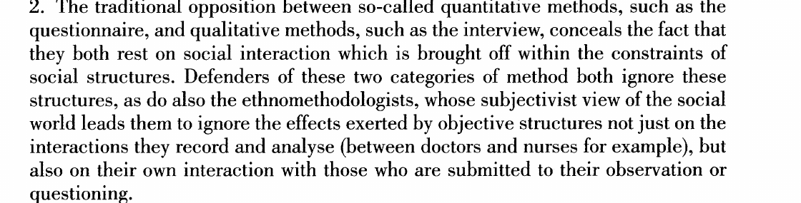<div class="highlight-note2" aria-hidden="true"></div></div>

The highlighted sentence is the source of the shortened quotation. The rest of the note is important: Bourdieu argues that objective structures shape both the interaction being studied and the researcher's own interaction with participants.

<div class="citation">Pierre Bourdieu (1996), “Understanding,” <em>Theory, Culture & Society</em> 13(2): 17–37, p. 34, note 2. https://doi.org/10.1177/026327696013002002. Screenshot from the published PDF.</div>

::: {.notes}
[Sources]
- Bourdieu (1996), “Understanding,” p. 34, note 2 | Local source: literature/source_pdfs/session06/bourdieu_1996_understanding.pdf | DOI: https://doi.org/10.1177/026327696013002002 | Accessed: 2026-08-25
[/Sources]
:::

---

## For Bourdieu, good listening requires active work

He describes verbal and bodily signs of attention—“yes,” “right,” nods, looks and smiles—as conditions for a conversation that flows. A moment of inattention can make the respondent lose the thread.

<div class="cols"><div><h3>What an AI system can imitate</h3><p>Acknowledgments, paraphrases, pauses and follow-up questions.</p></div><div><h3>What remains an empirical question</h3><p>Whether participants interpret those signals as attention, institutional surveillance, empty fluency or something else.</p></div></div>

<div class="citation">Bourdieu (1996), note 4; see also pp. 17–37 for the interviewing principles developed for <em>La Misère du Monde</em>.</div>

---

## The relationship affects the account—but the account still has limits

<div class="transcript">“When senior students are in the room, I decide not to speak because I assume their comments will be more sophisticated.”</div>

1. The participant <strong>described</strong> worrying about intellectual worth.
2. The account may help analyse how students <strong>understand</strong> participation.
3. It does not by itself show the participant <strong>always remains silent</strong> around senior students.

---

## Jerolmack and Khan call this the “attitudinal fallacy”

<div class="cols6040"><div class="source-highlight-wrap">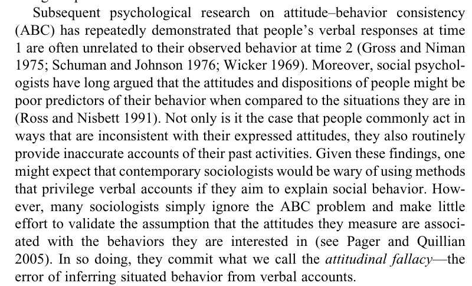<div class="source-mark highlight-fallacy" aria-hidden="true"></div></div><div><p>The mistake is not listening to an account. It is treating what someone says as evidence of how they behave in a particular situation, without showing that the two are linked.</p><div class="criterion"><strong>Criterion 4:</strong> Does the claim stay within what the interview evidence can establish?</div><p class="purpose"><strong>Their first example is LaPiere:</strong> did proprietors’ later answers match what happened when they actually encountered a Chinese couple?</p></div></div>

<div class="citation">Colin Jerolmack & Shamus Khan (2014), “Talk Is Cheap: Ethnography and the Attitudinal Fallacy,” <em>Sociological Methods & Research</em> 43(2): 178–209, p. 179. https://doi.org/10.1177/0049124114523396.</div>

::: {.notes}
[Sources]
- Jerolmack & Khan (2014), “Talk Is Cheap,” p. 179 | Local source: slides/session06/sources/jerolmack_khan_2014.pdf | DOI: https://doi.org/10.1177/0049124114523396 | Accessed: 2026-08-25
[/Sources]
:::

---

## LaPiere observed one pattern, then heard almost the reverse

<div class="cols6040"><div class="source-highlight-wrap">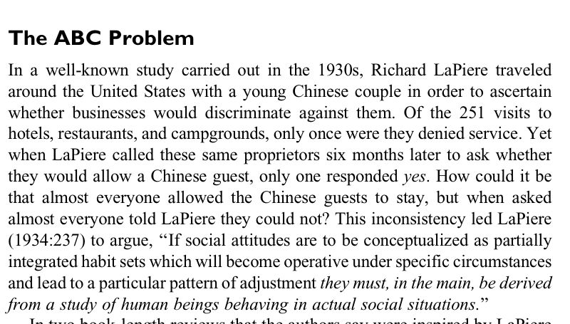<div class="source-mark highlight-lapiere" aria-hidden="true"></div></div><div><ol><li>LaPiere travelled with a young Chinese couple in the 1930s.</li><li>They were denied service only once in 251 visits.</li><li>Six months later, only one proprietor said they would admit a Chinese guest.</li></ol><p>The later answer did not predict conduct during the earlier encounter.</p></div></div>

<div class="citation">Jerolmack & Khan (2014), p. 182, discussing LaPiere (1934). Screenshot from the published article.</div>

::: {.notes}
[Sources]
- Jerolmack & Khan (2014), p. 182 | Local source: slides/session06/sources/jerolmack_khan_2014.pdf | DOI: https://doi.org/10.1177/0049124114523396 | Accessed: 2026-08-25
[/Sources]
:::

---

## The budgeting example shows why the discrepancy may be situational

<div class="cols6040"><div class="source-highlight-wrap">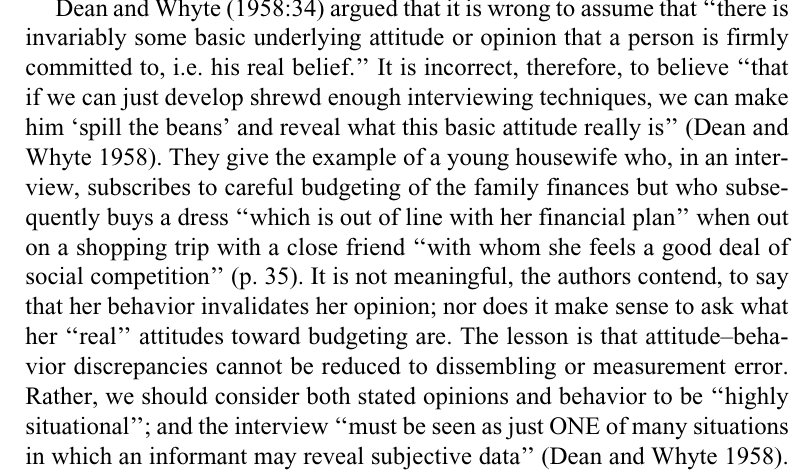<div class="source-mark highlight-budget-account" aria-hidden="true"></div></div><div><p><strong>In the interview:</strong> a woman endorses careful family budgeting.</p><p><strong>While shopping with a friend:</strong> she buys a dress outside the plan amid “social competition.”</p><p>Jerolmack and Khan’s point is not that one response reveals her “real” attitude. The interview and the shopping trip are different social situations.</p></div></div>

<div class="citation">Jerolmack & Khan (2014), p. 183, discussing Dean & Whyte (1958). Screenshot from the published article. Quoted phrases contain 5 words.</div>

::: {.notes}
[Sources]
- Jerolmack & Khan (2014), p. 183 | Local source: slides/session06/sources/jerolmack_khan_2014.pdf | DOI: https://doi.org/10.1177/0049124114523396 | Accessed: 2026-08-25
[/Sources]
:::

---

## Their argument is not that interviews are useless

<div class="cols6040"><div class="source-highlight-wrap">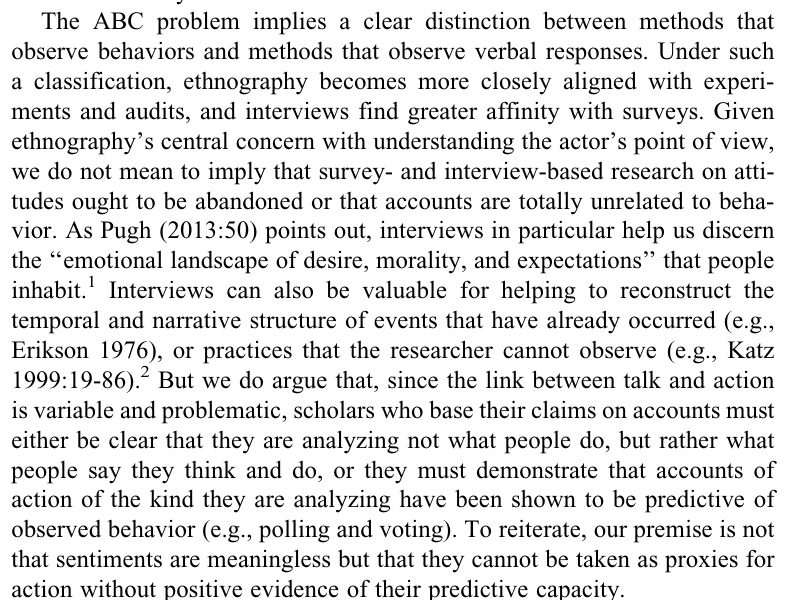<div class="source-mark highlight-uses-account" aria-hidden="true"></div><div class="source-mark highlight-uses-limit" aria-hidden="true"></div></div><div><h3>Interviews can tell us about</h3><p>meanings, expectations, retrospective narratives and practices that cannot be directly observed.</p><h3>A claim about action needs more</h3><p>Observation, triangulation, or evidence that this kind of account predicts the behaviour being claimed.</p></div></div>

<div class="citation">Jerolmack & Khan (2014), p. 180. Screenshot from the published article.</div>

::: {.notes}
[Sources]
- Jerolmack & Khan (2014), p. 180 | Local source: slides/session06/sources/jerolmack_khan_2014.pdf | DOI: https://doi.org/10.1177/0049124114523396 | Accessed: 2026-08-25
[/Sources]
:::

---

## A second question is how the interview was administered

<div class="bridge-questions"><div><h3>What can talk support?</h3><p>Jerolmack and Khan ask whether an interview account can support a claim about action.</p></div><div class="bridge-arrow">→</div><div><h3>How was the account elicited?</h3><p>Survey researchers ask whether an interviewer, a screen or a recorded voice changes what people report.</p></div></div>

These are different methodological questions. Both matter when we evaluate an AI-led interview.

---

## CAPI and CASI changed who presented the question

<div class="mode-compare"><div><div class="mode-label">CAPI</div><p><strong>Computer-assisted personal interviewing.</strong></p><p>A human interviewer reads the item from a computer and enters the answer. The software manages question order and skips.</p></div><div><div class="mode-label">CASI</div><p><strong>Computer-assisted self-interviewing.</strong></p><p>The participant reads the item and enters an answer without the interviewer seeing each response.</p></div></div>

<p class="plain-takeaway">The software changes administration and privacy. The next question is still selected from rules written in advance.</p>

<div class="citation">Tourangeau & Smith (1996), “Asking Sensitive Questions,” <em>Public Opinion Quarterly</em> 60(2): 275–304. https://doi.org/10.1086/297751</div>

---

## Audio-CASI added recorded speech to self-administration

<div class="cols6040">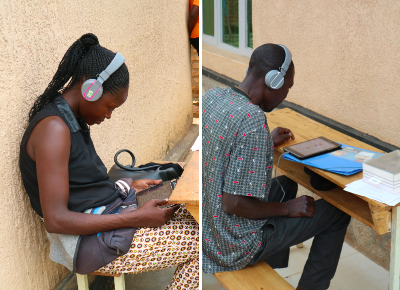<div><p>The participant hears a prerecorded question through headphones and selects an answer on the device.</p><p>This offers privacy without requiring every participant to read the questionnaire unaided. An enumerator may remain nearby for setup but does not administer each sensitive item.</p><div class="citation">Photograph: Oxford Mind & Behaviour Research Group, “Surveying on Sensitive Topics: Using Audio Computer Assisted Self-Interviewing.”</div></div></div>

::: {.notes}
[Sources]
- Oxford Mind & Behaviour Research Group, ACASI field photograph | Source: https://mbrg.bsg.ox.ac.uk/method/surveying-sensitive-topics-using-audio-computer-assisted-self-interviewing | Accessed: 2026-08-25
[/Sources]
:::

---

## The three modes create different experiences for the respondent

<table class="tbl"><tr><th>Mode</th><th>Question arrives through</th><th>Who can immediately observe the answer?</th><th>Branching</th></tr><tr><td>CAPI</td><td>Human interviewer</td><td>Interviewer</td><td>Written in advance</td></tr><tr><td>CASI</td><td>Text on screen</td><td>Participant</td><td>Written in advance</td></tr><tr><td>Audio-CASI</td><td>Recorded voice and screen</td><td>Participant</td><td>Written in advance</td></tr></table>

<div class="purpose">This gives us a baseline for deciding what is genuinely new about model-led interviewing.</div>

---

## Tourangeau and Smith tested whether mode changed sensitive reports

<div class="cols6040">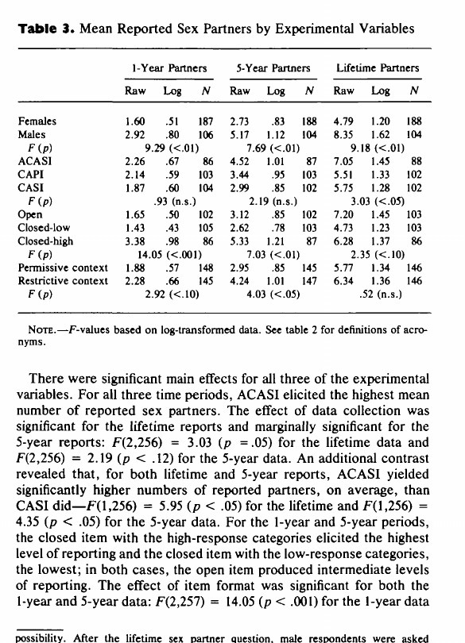<div class="compact"><p><strong>Study:</strong> 339 Cook County adults answered questions about sexual behavior and drug use using CAPI, CASI or audio-CASI.</p><p><strong>Finding:</strong> audio-CASI produced the highest mean reported number of sex partners. The mode effect was significant for lifetime reports; audio-CASI was also significantly higher than CASI for five-year and lifetime reports.</p><p><strong>Caution:</strong> higher reporting may indicate greater disclosure. It is not automatically proof of greater accuracy.</p><div class="citation">Roger Tourangeau & Tom W. Smith (1996), <em>POQ</em> 60(2): 275–304, Table 3, pp. 292–293.</div></div></div>

::: {.notes}
[Sources]
- Tourangeau & Smith (1996), “Asking Sensitive Questions” | Source: https://doi.org/10.1086/297751 | Accessed: 2026-08-24
[/Sources]
:::

---

## The new capability is making an interviewing decision from an open answer

Pre-LLM systems could present items, implement complex branching and reduce interviewer presence. The branches were generally written in advance.

<div class="crucial"><strong><em>An LLM can select or compose a substantive follow-up during the exchange.</em></strong></div>

---

## Break

When we return: what kinds of systems are called “AI interviews,” and what do current evaluations actually show?

---

## The phrase “AI interview” covers quite different arrangements

<table class="tbl"><tr><th>Who decides the next question?</th><th>Example in the literature</th><th>What must be recorded?</th></tr><tr><td>Script and authored branches</td><td>CASI and audio-CASI in Tourangeau & Smith (1996)</td><td>Questionnaire version and branch</td></tr><tr><td>Model suggests; human interviewer decides</td><td>Uses proposed by the interview researchers in Liu et al. (2025)</td><td>Suggestion, human edit and decision</td></tr><tr><td>Model writes and delivers the question</td><td>Wuttke et al. (2025); Cuevas et al. (2025); Geiecke & Jaravel (2026)</td><td>Conversation context, output, model and settings</td></tr></table>

::: {.notes}
[Sources]
- Liu et al. (2025), “Envisioning AI Support during Semi-Structured Interviews Across the Expertise Spectrum,” <em>Proceedings of the ACM on Human-Computer Interaction</em> 9(2): 1–29. https://doi.org/10.1145/3710909
- Wuttke et al. (2025), “AI Conversational Interviewing,” <em>LaTeCH-CLfL 2025</em>: 132–144. https://aclanthology.org/2025.latechclfl-1.17/
- Cuevas et al. (2025), “Collecting Social Data with Large Language Models,” <em>PACM HCI</em>. https://doi.org/10.1145/3710947
- Geiecke & Jaravel (2026), “The Rise of AI-Led Interviews in Social Science.” https://benjamin.geiecke.com/files/ai_interviews.pdf
[/Sources]
:::

---

## Liu et al. asked interview researchers what support they would use

<div class="liu-study">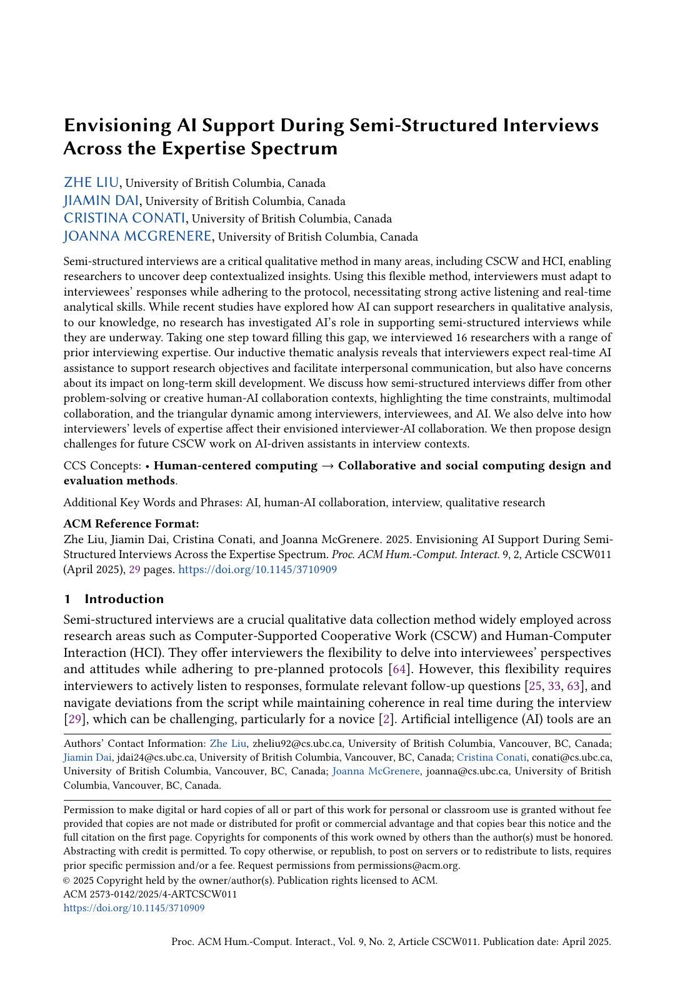<div><p><strong>Participants:</strong> 16 researchers with different levels of interviewing experience.</p><p><strong>Method:</strong> 50–80 minute semi-structured interviews, followed by inductive thematic analysis.</p><p><strong>Question:</strong> Where might AI help a human interviewer, and where might it create new problems?</p><p>This was a study of researchers' expectations. It did not test an AI assistant during field interviews.</p></div></div>

<div class="citation">Zhe Liu, Jiamin Dai, Cristina Conati & Joanna McGrenere (2025), “Envisioning AI Support During Semi-Structured Interviews Across the Expertise Spectrum,” <em>Proceedings of the ACM on Human-Computer Interaction</em> 9(2), Article CSCW011. https://doi.org/10.1145/3710909</div>

---

## The most common request was help choosing a follow-up

<div class="liu-findings">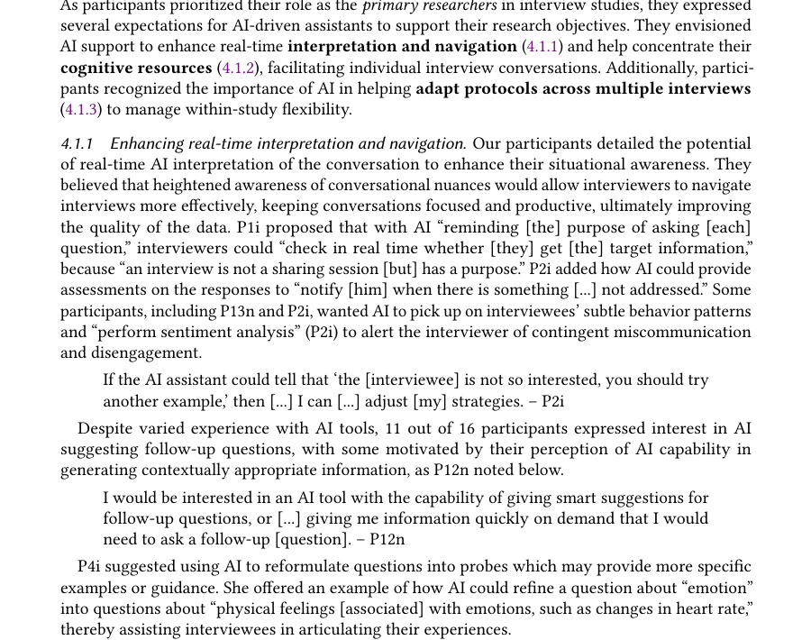<div><p><strong>11 of 16 researchers</strong> expressed interest in AI suggestions for follow-up questions.</p><p>Others wanted reminders about the purpose of a question, information that had not yet been covered, or a point worth revisiting.</p><p>Researchers also worried about distraction, over-reliance and whether the system could understand the interview well enough to help.</p></div></div>

<div class="citation">Liu et al. (2025), section 4.1.1, pp. 9–11. Screenshot from the published article.</div>

---

## An AI interviewer uses each answer to decide what to ask next

<div class="flow"><div><strong>Protocol</strong><br>research aims and required topics</div><div><strong>Conversation</strong><br>ordered questions and answers</div><div><strong>Model call</strong><br>instructions plus relevant context</div><div><strong>Next question</strong><br>generated text</div><div><strong>Decision record</strong><br>what was sent and returned</div></div>

<p class="plain-takeaway">Save the conversation sent to the model, the exact question it returned, and any human edit or approval. Otherwise we cannot reconstruct why this particular probe appeared here.</p>

---

## The same logic can sit behind several access routes

<div class="cards3"><div class="card"><h3>Direct API</h3><p>Your code calls one provider. Check its retention, region, model version and data-use settings.</p></div><div class="card"><h3>OpenRouter</h3><p>One SDK can call models from several providers. Record the selected provider as well as the model.</p></div><div class="card"><h3>Local / Ollama</h3><p>Inference can stay on controlled hardware, but the model must fit and local security still matters.</p></div></div>

<div class="purpose">A local interviewer is not fully local if audio is sent to a remote transcription or speech service.</div>

::: {.notes}
[Sources]
- OpenRouter, “Provider Routing,” “Data Collection” and “Zero Data Retention” | https://openrouter.ai/docs/guides/routing/provider-selection ; https://openrouter.ai/docs/guides/privacy/data-collection ; https://openrouter.ai/docs/guides/features/zdr | Accessed: 2026-08-25
- Ollama, “Hardware Support” | https://docs.ollama.com/gpu | Accessed: 2026-08-25
[/Sources]
:::

---

## “We do not store prompts” is not the end of the privacy review

<div class="cols"><div><h3>Follow the data</h3><ul><li>raw audio;</li><li>transcript;</li><li>conversation context;</li><li>generated question;</li><li>metadata and logs.</li></ul></div><div><h3>Ask who controls it</h3><ul><li>research team;</li><li>routing service;</li><li>model provider;</li><li>speech provider;</li><li>commercial interview platform.</li></ul></div></div>

<div class="criterion"><strong>For OpenRouter:</strong> prompt logging is opt-in, but requests still pass to a model provider and provider policies vary. Zero Data Retention routing and <code>data_collection: "deny"</code> narrow the eligible providers; they do not replace consent, a data-management plan or contractual review.</div>

<div class="citation">OpenRouter documentation and privacy policy, accessed 25 August 2026. For commercial platforms, check the study-specific contract: retention and access may be set by the commissioning organization.</div>

---

## Running a model locally keeps the data on your machine

<table class="tbl"><tr><th>Question</th><th>Remote service</th><th>Local model</th></tr><tr><td>Where does inference happen?</td><td>Provider infrastructure</td><td>Researcher's machine or server</td></tr><tr><td>What constrains model size?</td><td>Service offering and cost</td><td>RAM/VRAM and supported hardware</td></tr><tr><td>What affects speed?</td><td>Network, provider queue and model</td><td>Model size, quantization and GPU/CPU</td></tr><tr><td>Who maintains the stack?</td><td>Provider plus research team</td><td>Research team</td></tr></table>

<div class="purpose">CPU inference may be slow enough to disrupt a spoken interview. A smaller local model may respond quickly but behave differently from the remote model used in validation.</div>

---

## Geiecke and Jaravel evaluate both text and voice interviews

<div class="cols6040">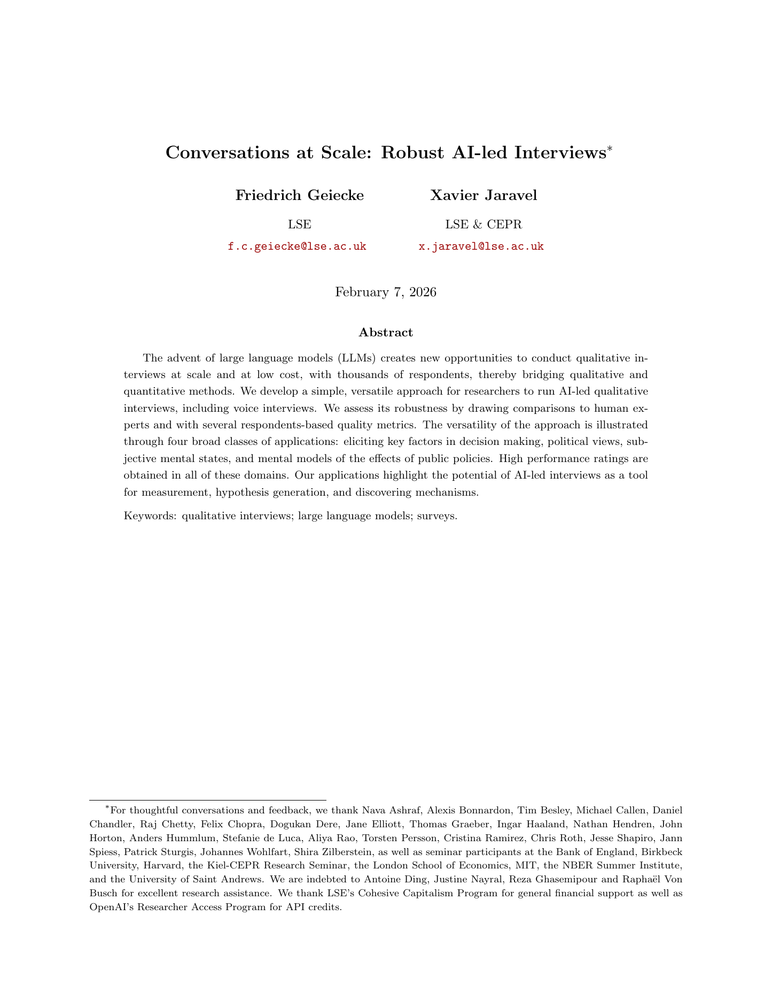<div><p>They build an AI-led interview platform and use it in several substantive applications. Their evaluation compares human and AI interviewers, text and voice input, prompts and models.</p><p>The paper therefore speaks to several design choices separately rather than treating “AI interviewing” as one condition.</p><div class="citation">Benjamin Geiecke & Xavier Jaravel (2026), “The Rise of AI-Led Interviews in Social Science,” working paper.</div></div></div>

::: {.notes}
[Sources]
- Geiecke & Jaravel (2026) | Source: https://benjamin.geiecke.com/files/ai_interviews.pdf | Accessed: 2026-08-24
[/Sources]
:::

---

## Their text interface sends the conversation back to the model after each answer

<div class="cols6040">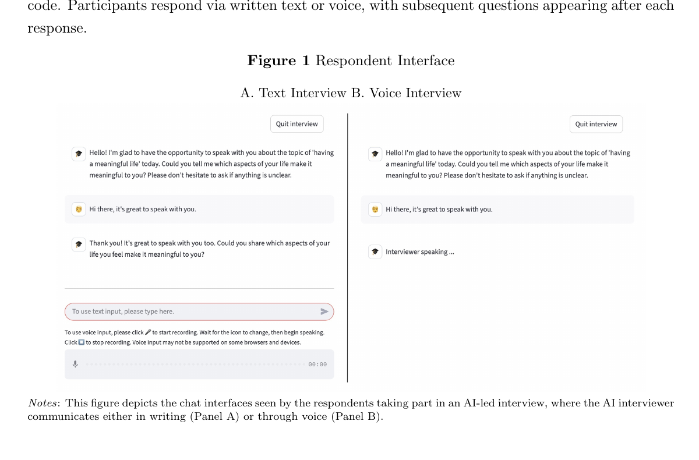<div><ol><li>Streamlit displays the chat.</li><li>The platform keeps the system prompt and chat history.</li><li>The participant's new answer is added.</li><li>The LLM generates the next question.</li><li>The new turn is displayed and logged.</li></ol></div></div>

<div class="purpose"><strong>Input to the model:</strong> instructions plus conversation so far. <strong>Output:</strong> the next interviewer question as text.</div>

---

## Voice can mean two different technical arrangements

<div class="cols"><div><h3>A modular pipeline</h3><p>Speech-to-text transcribes the answer; a text model writes a question; text-to-speech reads it aloud.</p><p>Each component can have a different provider, model and retention policy.</p></div><div><h3>A native audio model</h3><p>Audio enters and audio leaves one model, although a transcript may still be produced for display or analysis.</p><p>Voice, latency and prosody become part of the interviewer.</p></div></div>

<div class="citation">Geiecke & Jaravel (2026), section 3.4.2 and note 43. Their 2025 inflation study used Whisper for transcription and <code>gpt-4o-audio-preview-2024-12-17</code> with the “coral” voice for audio output.</div>

::: {.notes}
[Sources]
- Geiecke & Jaravel (2026), pp. 42–43 | Source: https://benjamin.geiecke.com/files/ai_interviews.pdf | Accessed: 2026-08-25
[/Sources]
:::

---

## Geiecke and Jaravel report higher grades when participants speak

<div class="cols4060"><div><p>Eight sociology PhD students graded transcripts against what a human expert might achieve.</p><p>With the same baseline prompt and GPT-4o, the mean grade was:</p><p class="callout">2.82 with typed answers<br>3.63 with spoken answers</p><p>The authors argue that speaking produced more information, which allowed more precise follow-up.</p></div>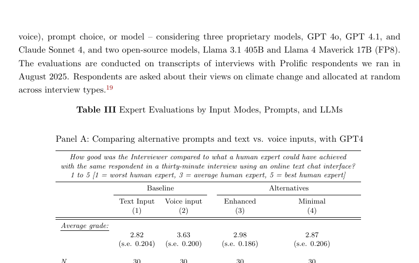</div>

<div class="citation">Geiecke & Jaravel (2026), Table III, Panel A. Thirty transcripts per condition; these are expert ratings, not a direct measure of truth or rapport.</div>

---

## The stronger voice result is informative, but it does not settle the method

<div class="cards3"><div class="card"><h3>What it shows</h3><p>Mode changed the information participants supplied and the transcripts sociologists evaluated.</p></div><div class="card"><h3>What it cannot show alone</h3><p>Whether accounts were more accurate, whether all topics benefit, or how voice changes disclosure.</p></div><div class="card"><h3>What to record</h3><p>Input and output mode, transcription model, voice model, voice setting, latency and participant edits.</p></div></div>

<div class="purpose">Voice is not merely a more convenient interface. It changes the interaction and possibly the evidence.</div>

---

## Wuttke and colleagues compare where AI and student interviewers go wrong

<div class="cols6040">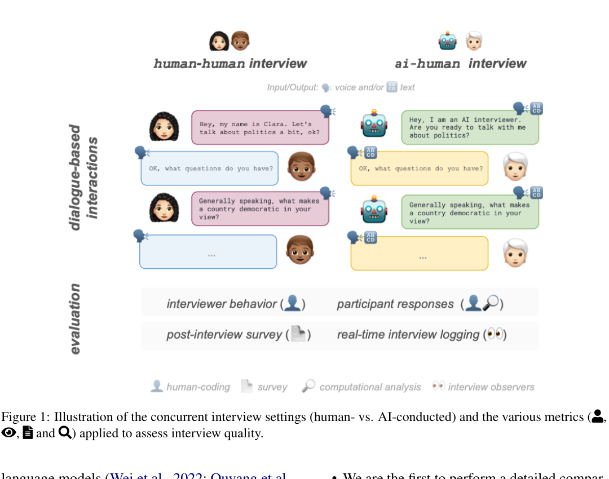<div><p>Participants discussed politics and democracy with either an AI or a human student interviewer.</p><p>The AI used GPT-4 Turbo in a Chainlit interface. Participants could choose text or voice for both input and output; speech recognition used Whisper.</p><p>The study included five AI-led and six human-led interviews, so the detailed error comparison is exploratory.</p><div class="citation">Alexander Wuttke et al. (2025), “AI Conversational Interviewing,” <em>LaTeCH-CLfL 2025</em>: 132–144.</div></div></div>

::: {.notes}
[Sources]
- Wuttke et al. (2025) | Source: https://aclanthology.org/2025.latechclfl-1.17/ | Accessed: 2026-08-24
[/Sources]
:::

---

## Human and AI interviewers missed different things

<div class="cols"><div><h3>AI interviewer</h3><ul><li>often failed to pursue surprising or unclear answers;</li><li>sometimes evaluated or praised responses;</li><li>produced longer turns and suffered latency/transcription problems.</li></ul></div><div><h3>Student interviewers</h3><ul><li>more often failed to show active listening;</li><li>sometimes guided the participant's answer;</li><li>were not an expert-interviewer benchmark.</li></ul></div></div>

<div class="criterion">The paper does not establish that one interviewer type is simply better. It identifies different failure patterns that training and system design would need to address.</div>

<div class="citation">Wuttke et al. (2025), pp. 137–140 and Table 1. Human coders judged response quality broadly similar in this small sample.</div>

---

## Jack, Cooper and Flower provide a larger sociological field example

<div class="cards3"><div class="card"><h3>Who?</h3><p>74 social scientists at a Swedish university.</p></div><div class="card"><h3>What?</h3><p>A chatbot interviewed them about their own use of generative AI.</p></div><div class="card"><h3>Follow-up?</h3><p>23 participants later described the experience by email.</p></div></div>

<p>This is an actual AI-mediated qualitative study, not only a benchmark or hypothetical system.</p>

<div class="citation">Tullia Jack, Alex Cooper & Lisa Flower (2026), “Automating the Qualitative Interview? Using Gen AI Chatbots in Social Science Research,” <em>Methodological Innovations</em>, advance online publication. https://doi.org/10.1177/20597991261448157</div>

---

## Finishing an interview is not the same as producing a good one

Jack and colleagues show that simultaneous adaptive interviews can elicit substantial text at scale. Participants' follow-up accounts also raised repetition, limited nuance and a weaker sense of interaction.

<div class="cols"><div><h3>Operational evidence</h3><p>Completion, length, duration and system logs show whether the interview ran.</p></div><div><h3>Methodological evidence</h3><p>Transcript review and participant follow-up show whether the exchange produced specificity, depth and a credible relationship.</p></div></div>

::: {.notes}
[Sources]
- Jack, Cooper & Flower (2026) | Source: https://journals.sagepub.com/doi/10.1177/20597991261448157 | Accessed: 2026-08-25
[/Sources]
:::

---

## Cuevas et al. randomly assigned 399 participants to three chatbot designs

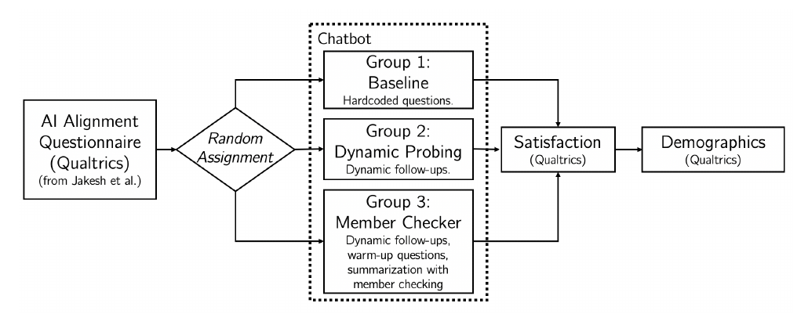

<div class="citation">Cuevas et al. (2025), Figure 2, “Collecting Social Data with Large Language Models,” <em>PACM HCI</em>. https://doi.org/10.1145/3710947</div>

::: {.notes}
[Sources]
- Cuevas et al. (2025), Figure 2 | Local source: slides/session06/sources/cuevas_2025.pdf | DOI: https://doi.org/10.1145/3710947 | Accessed: 2026-08-25
[/Sources]
:::

---

## Here is what the three conditions actually did

<table class="tbl"><tr><th>Condition</th><th>After each main answer</th><th>At the end</th></tr><tr><td><strong>Fixed baseline</strong></td><td>Asked the same two probes: “Can you elaborate?” and “Can you provide an example?”</td><td>Ended the conversation.</td></tr><tr><td><strong>Dynamic Prober</strong></td><td>GPT-3.5 Turbo read the participant's answer and wrote two follow-up questions for that answer.</td><td>Ended the conversation.</td></tr><tr><td><strong>Dynamic Prober + Member Checker</strong></td><td>Used the same generated follow-ups, with an additional warm-up question.</td><td>Generated a summary that the participant could confirm or contest.</td></tr></table>

<div class="purpose"><strong>What was compared:</strong> engagement, participant experience, conversational quality and qualitative richness. Both adaptive conditions used GPT-3.5 Turbo through Azure OpenAI; the 399 participants provided 4,308 open-ended responses.</div>

<div class="citation">Cuevas et al. (2025), Sections 3.3, 4.2, 5 and Appendix D.</div>

::: {.notes}
[Sources]
- Cuevas et al. (2025), Sections 3.3, 4.2, 5 and Appendix D | Local source: slides/session06/sources/cuevas_2025.pdf | DOI: https://doi.org/10.1145/3710947 | Accessed: 2026-08-25
[/Sources]
:::

---

## The adaptive chatbot improved follow-up without reliably producing depth

<div class="cols4060"><div><p>The Dynamic Prober improved the study's follow-up score. Across most other quality measures, the LLM conditions looked similar to the fixed baseline.</p><p>Responses were usually clear and relevant, yet often lacked:</p><ul><li><strong>palpable examples</strong> of experience;</li><li><strong>specificity</strong> about what happened;</li><li><strong>cognitive empathy</strong> showing the participant's perspective.</li></ul></div>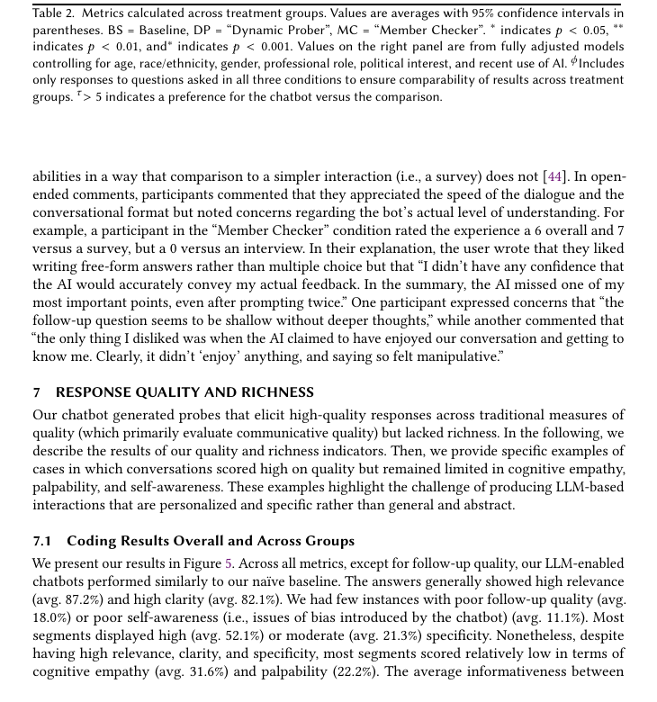</div>

<div class="citation">Cuevas et al. (2025), sections 6–8. The authors call these systems “adaptive surveyors, not automated interviewers.”</div>

---

## A participant objected when the bot claimed to enjoy the conversation

The Member Checker used friendly conversational language after the interview. One participant thought that wording attributed an emotional capacity to the system that it did not have.

<div class="quote">“Clearly, it didn’t ‘enjoy’ anything, and saying so felt manipulative.”</div>

This tells us how one participant interpreted the relationship the chatbot was performing. It does not tell us that every participant reacted in the same way.

<div class="citation">Cuevas et al. (2025), p. 14.</div>

---

## Panfilova and colleagues hold the interview design fixed and change the model

<div class="cols6040">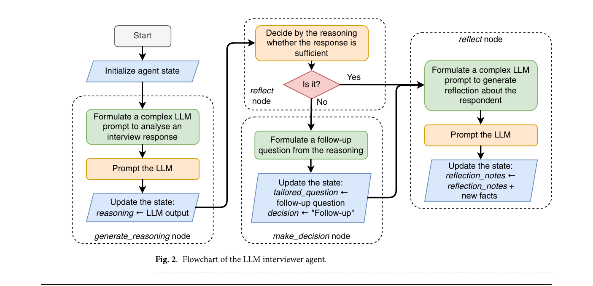<div><p>Six models received the same prompts, guardrails and interview workflow. Each processed the same baseline interview material, making model choice the main difference between conditions.</p><p>The follow-up answers came from a fixed simulated interviewee. This is a controlled benchmark, not evidence from interviews with people.</p></div></div>

<div class="citation">Panfilova et al. (2026), <em>Scientific Reports</em>. DOI: 10.1038/s41598-026-46517-7.</div>

---

## Model choice changed speed, follow-up rate and interviewer style

<div class="cols4060"><div><p>Across ten standardized interviews, models differed substantially in time and number of follow-ups.</p><p>For example, the reported average interview time ranged from about nine minutes for GPT-5 Chat to more than two hours for Qwen3-235B A22B.</p><p>Gemini 2.5 Pro more often used emphatic, appreciative phrasing. The paper treats this as a model-specific style—not proof that participants experienced greater empathy.</p></div>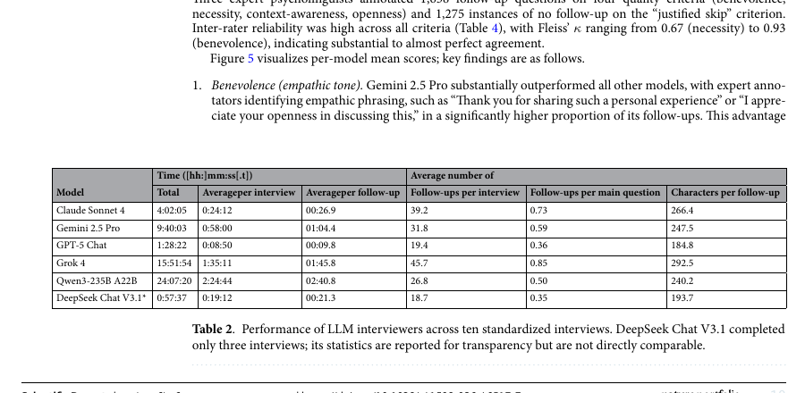</div>

<div class="citation">Panfilova et al. (2026), Table 2 and Results. DeepSeek completed only three interviews and is not directly comparable.</div>

---

## The studies use different evidence to answer different questions

<table class="tbl"><tr><th>Evidence and source</th><th>What it helps us assess</th><th>What it cannot settle alone</th></tr><tr><td>Protocol/error coding — Wuttke et al.</td><td>Missed probes, leading questions, active listening</td><td>Performance by expert interviewers</td></tr><tr><td>Sociologist transcript ratings — Geiecke & Jaravel</td><td>How evaluators judged resulting transcripts</td><td>Truth, rapport or behavioral validity</td></tr><tr><td>Participant experience — Jack et al.; Cuevas et al.</td><td>How the exchange felt and where it frustrated</td><td>Accuracy of the account</td></tr><tr><td>Richness coding — Cuevas et al.</td><td>Specificity, palpable examples, perspective</td><td>Whether these exhaust qualitative quality</td></tr><tr><td>Controlled model comparison — Panfilova et al.</td><td>Model-specific style, speed and follow-up behavior</td><td>Field interaction with human participants</td></tr></table>

---

## Remember the two interviews from the opening

<div class="opening-pair"><div><div class="pair-label">Interview A</div><p><strong>Participant:</strong> Their comments sounded much more developed.</p><p><strong>Interviewer:</strong> What made them seem more developed than yours?</p></div><div><div class="pair-label">Interview B</div><p><strong>Participant:</strong> Their comments sounded much more developed.</p><p><strong>Interviewer:</strong> So you were not confident. What happened after that?</p></div></div>

Interview A asks what “more developed” meant to this participant. Interview B introduces confidence as an explanation before the participant has done so. Which is preferable still depends on the research aim and the claim we later make.

---

## The worked example has one research aim and one probing rule

<div class="interview-brief"><div class="brief-aim"><span>Research aim</span><p>How do graduate students describe moments when they considered speaking in a seminar but stayed silent?</p></div><div class="brief-opener"><span>Fixed opening question</span><p>Tell me about a recent seminar when you thought about speaking but decided not to.</p></div><div class="brief-rule"><span>Rule for the next probe</span><p>Ask for a concrete episode, clarification or consequence. Do not name confidence, status, preparation or another cause unless the participant has already done so.</p></div></div>

The interview can help us understand how participants interpret these moments. It cannot by itself estimate how often they remain silent.

---

## Participant A's interview turns towards intellectual worth

<div class="transcript"><div class="turn"><span class="speaker">Participant:</span> Their comments sounded much more developed.</div><div class="turn"><span class="speaker">Adaptive probe:</span> What made their comments seem more developed than yours?</div><div class="turn"><span class="speaker">Participant:</span> They connected the reading to other theorists. Mine felt too small.</div></div>
<div class="purpose">The probe requests the participant's criterion. It does not name confidence, status or preparation as the cause.</div>

---

## Participant B's interview turns towards status and the interaction order

<div class="transcript"><div class="turn"><span class="speaker">Participant:</span> A senior student kept jumping in. It did not feel like there was space.</div><div class="turn"><span class="speaker">Adaptive probe:</span> When you say there was no space, what was the senior student doing?</div><div class="turn"><span class="speaker">Adaptive probe:</span> Did anyone else react when he spoke over the other student?</div></div>

---

## The same system produced different interview paths

<table class="tbl"><tr><th></th><th>A</th><th>B</th></tr><tr><td>Fixed questions</td><td>2</td><td>2</td></tr><tr><td>Adaptive probes</td><td>1</td><td>2</td></tr><tr><td>New topics</td><td>Intellectual worth</td><td>Status; interaction order</td></tr><tr><td>Inspect</td><td colspan="2">Exact wording, link to prior response, direction, relevance and stopping decision</td></tr></table>

---

## The Python task generates one probe and records where it came from

<div class="probe-route"><div><span>1</span><strong>Input</strong><p>Interview brief and ordered conversation turns</p></div><div><span>2</span><strong>Model call</strong><p>Ask for one follow-up that follows the probing rule</p></div><div><span>3</span><strong>Output</strong><p>The exact proposed question</p></div><div><span>4</span><strong>Record</strong><p>Append the question and link it to the answer it follows</p></div></div>

The model proposes the next question. We still inspect whether it follows the participant's words, avoids introducing a cause, and serves the research aim.

---

## First, turn the interview brief and conversation into model messages {.tight-code}

```python
INTERVIEW_PROTOCOL = """
Research aim: understand how students interpret moments
when they considered speaking in a seminar but stayed silent.
Ask one follow-up question. Request a concrete episode,
clarification, or consequence. Do not introduce a cause.
Return only the question.
"""

messages = [
    {"role": "system", "content": INTERVIEW_PROTOCOL},
    {"role": "user", "content": format_turns(turns)},
]
```

<div class="io-strip"><div><strong>Input</strong><br><code>INTERVIEW_PROTOCOL</code> is a string; <code>turns</code> is an ordered list.</div><div><strong>Output</strong><br><code>messages</code> is the list sent to the model.</div></div>

---

## Then ask the model for one adaptive probe {.tight-code}

```python
reply = client.chat.send(
    model=INTERVIEW_MODEL,
    messages=messages,
    temperature=0,
    stream=False,
)

next_probe = reply.choices[0].message.content.strip()
```

<div class="model-output"><span>Model output</span><p>What made their comments seem more developed than yours?</p></div>

<p class="plain-takeaway"><code>next_probe</code> is a string. Before using it, the interviewer or software should check it against the probing rule.</p>

---

## Store the generated question as the next turn

```python
probe_turn = {
    "role": "interviewer",
    "text": next_probe,
    "topic": None,
    "source": "adaptive_probe",
    "responds_to": len(turns),
}

turns.append(probe_turn)
```

<div class="io-strip"><div><strong>Before</strong><br><code>turns</code> ends with the participant's answer.</div><div><strong>After</strong><br><code>turns</code> also contains the generated probe and its link to that answer.</div></div>

---

## Each turn is one dictionary inside a list

```python
turns = [{
    "role": "interviewer",
    "text": next_probe,
    "topic": None,
    "source": "adaptive_probe",
    "responds_to": 2,
}]
```
<div class="purpose"><strong>List:</strong> preserves order. <strong>Dictionary:</strong> stores named fields for one turn. <code>topic</code> is still <code>None</code> because the researcher has not yet added an analytic label.</div>

---

## Read one record from left to right

<div class="flow"><div><code>role</code><br><span class="mini">transcript log<br>who spoke</span></div><div><code>text</code><br><span class="mini">transcript log<br>exact words</span></div><div><code>source</code><br><span class="mini">decision log<br>protocol or probe</span></div><div><code>responds_to</code><br><span class="mini">decision log<br>prior turn link</span></div><div><code>topic</code><br><span class="mini">researcher annotation<br>analytic label</span></div></div>

<div class="purpose"><code>topic</code> was added by the researcher for this exercise. The LLM did not generate it, and the audit function does not validate it.</div>

---

## Speech-to-text turns the recording into text the interviewer model can read

```python
with open("answer.wav", "rb") as audio_file:
    stt_result = speech_client.audio.transcriptions.create(
        model=STT_MODEL,
        file=audio_file,
    )

answer_text = stt_result.text
```

<div class="cols"><div><h3>Input</h3><p><code>answer.wav</code>: recorded participant audio.</p></div><div><h3>Output</h3><p><code>answer_text</code>: a string added to the conversation.</p></div></div>

<div class="purpose">Listen for errors in names, accents, code-switching, overlap and emotional speech. Allowing transcript correction may improve accuracy but changes the interview flow.</div>

---

## OpenRouter handles the text interviewer in our class setup

```python
messages.append({"role": "user", "content": answer_text})

reply = client.chat.send(
    model=INTERVIEW_MODEL,
    messages=messages,
    temperature=0,
    stream=False,
)

next_probe = reply.choices[0].message.content.strip()
```

<div class="purpose"><strong>Input:</strong> instructions and conversation including the new transcript. <strong>Output:</strong> one proposed interviewer turn. Store the selected provider, model identifier and exact output.</div>

---

## Text-to-speech makes that question audible {.tight-code}

```python
from pathlib import Path

with speech_client.audio.speech.with_streaming_response.create(
    model="gpt-4o-mini-tts",
    voice="coral",
    input=next_probe,
    instructions="Speak at a measured pace."
) as response:
    response.stream_to_file(Path("probe_coral.mp3"))
```

<div class="purpose"><strong>Input:</strong> <code>next_probe</code>, a voice name and delivery instructions. <strong>Output:</strong> <code>probe_coral.mp3</code>, an audio file that can be played to the participant.</div>

<div class="criterion">Voice and instructions are part of the interview stimulus. A warmer, faster or more authoritative delivery may change disclosure and perceived attention.</div>

::: {.notes}
[Sources]
- OpenAI Audio API reference, “Create speech” (used here only to show the TTS interface) | https://developers.openai.com/api/reference/resources/audio/subresources/speech/methods/create | Accessed: 2026-08-27
- The class text-model examples use OpenRouter. A speech API needs its own compatible endpoint/key, or the speech layers can run locally with tools such as Whisper and Piper.
[/Sources]
:::

---

## Test several voices while keeping the question fixed {.tight-code}

```python
voices = ["coral", "marin", "cedar"]

for voice in voices:
    output_file = Path(f"probe_{voice}.mp3")
    with speech_client.audio.speech.with_streaming_response.create(
        model="gpt-4o-mini-tts",
        voice=voice,
        input=next_probe,
        instructions="Speak at a measured pace.",
    ) as response:
        response.stream_to_file(output_file)
```

<div class="voice-files"><div><strong>probe_coral.mp3</strong></div><div><strong>probe_marin.mp3</strong></div><div><strong>probe_cedar.mp3</strong></div></div>

Because the wording and instruction stay fixed, the comparison isolates the selected voice. Ask what changes in perceived authority, warmth, patience or pressure.

<div class="citation">OpenAI Audio API, “Create speech,” accessed 27 August 2026. The demonstration uses no research data.</div>

---

## Start with an empty audit record

```python
def audit_interview(turns):
    audit = {
        "interviewer_turns": 0,
        "participant_turns": 0,
        "protocol_questions": 0,
        "adaptive_probes": 0,
        "topics": [],
        "probe_log": [],
    }
```
<div class="purpose"><code>turns</code> names the input. <code>audit</code> begins with four counters and two empty lists.</div>

---

## `enumerate` gives us a number and a turn

```python
for turn_number, turn in enumerate(turns, start=1):
```
<div class="state"><strong>First loop:</strong> <code>turn_number = 1</code><br><code>turn = {"role": "interviewer", ...}</code></div>
<p><code>start=1</code> makes the numbers match the human-readable transcript.</p>

---

## The role determines which speaker count changes

```python
if turn["role"] == "interviewer":
    audit["interviewer_turns"] += 1
elif turn["role"] == "participant":
    audit["participant_turns"] += 1
```
<div class="state"><strong>Before:</strong> <code>interviewer_turns = 0</code> → <strong>After:</strong> <code>interviewer_turns = 1</code></div>

---

## The source distinguishes fixed questions from adaptive probes

```python
if turn["source"] == "protocol":
    audit["protocol_questions"] += 1
elif turn["source"] == "adaptive_probe":
    audit["adaptive_probes"] += 1
```
<div class="purpose">This test is nested inside the interviewer branch. A participant response cannot be counted as a probe.</div>

---

## Preserve exact probe wording rather than hiding it behind a count

```python
audit["probe_log"].append({
    "turn_number": turn_number,
    "text": turn["text"],
    "responds_to": turn["responds_to"],
})
```
<div class="state"><strong>Before:</strong> <code>probe_log = []</code><br><strong>After:</strong> <code>[{"turn_number": 3, "text": "What made ...?", "responds_to": 2}]</code></div>

---

## Keep topics in the order they first appear

```python
topic = turn.get("topic")
if topic and topic not in audit["topics"]:
    audit["topics"].append(topic)
```
<div class="purpose"><code>.get()</code> returns the topic if present. The condition excludes empty and repeated topics.</div>

---

## `return` sends the completed record back

```python
return audit

result = audit_interview(interview_a["turns"])
```
<div class="purpose">The function returns one dictionary. We store it under the new name <code>result</code>.</div>

---

## The audit makes the two paths visible

<table class="tbl"><tr><th></th><th>A</th><th>B</th></tr><tr><td>Interviewer / participant</td><td>3 / 3</td><td>4 / 4</td></tr><tr><td>Protocol / adaptive</td><td>2 / 1</td><td>2 / 2</td></tr><tr><td>Topics</td><td>participation → intellectual worth → consequences</td><td>participation → status → interaction order → consequences</td></tr><tr><td>Probe links</td><td>Turn 3 → 2</td><td>Turns 3 → 2 and 5 → 4</td></tr></table>

---

## A software check states one narrow expectation

```python
assert result["adaptive_probes"] == 1
assert result["probe_log"][0]["responds_to"] == 2
```

A passing assertion shows that this function preserved the expected path for this input. It does not validate the topic annotation or sociological interpretation.

---

## The completion task is deliberately small

Complete the missing adaptive-probe branch, run the checks, and explain orally:

1. what one turn dictionary represents;
2. what `enumerate()` returns;
3. where `source` and `topic` come from;
4. what changes when a probe is encountered;
5. why the function does not measure interview depth.

---

## Build the source record while the interview runs

<div class="cards3"><div class="card"><h3>Before</h3><p>Research question, protocol, consent, system instructions, models, route, speech settings and escalation rules.</p></div><div class="card"><h3>During</h3><p>Ordered turns, exact prompts and outputs, probe links, human approvals/edits, latency and errors.</p></div><div class="card"><h3>After</h3><p>Validation evidence, transcript corrections, analysis decisions, retention, deletion and access.</p></div></div>

<div class="purpose">A transcript is one part of this record. It does not show how the system decided what to ask next.</div>

---

## What would you need to know before treating this transcript as sociological evidence?

1. What is the interview meant to establish?
2. Which decisions were fixed, selected, generated or human-approved?
3. What did this participant actually experience?
4. What evidence validates the interview for that research purpose?

<div class="purpose">Next week: whether models can stand in for people or populations.</div>
