## Two follow-up questions in Rivera's hiring study {.transcript-slide}

<div class="cols"><div class="transcript"><div class="turn"><span class="speaker">Interviewer:</span> Tell me about a recent candidate who seemed like a good fit for the firm.</div><div class="turn"><span class="speaker">Evaluator:</span> The conversation flowed. We had a surprising amount in common.</div><div class="turn"><span class="speaker">Interviewer:</span> What did you find you had in common?</div><div class="turn"><span class="speaker">Evaluator:</span> We had both rowed in college and talked about long training days.</div></div><div class="transcript"><div class="turn"><span class="speaker">Interviewer:</span> Tell me about a recent candidate who seemed like a good fit for the firm.</div><div class="turn"><span class="speaker">Evaluator:</span> The conversation flowed. We had a surprising amount in common.</div><div class="turn"><span class="speaker">Interviewer:</span> So their background matched the firm's culture?</div><div class="turn"><span class="speaker">Evaluator:</span> Yes, I suppose so.</div></div></div>

<div class="citation">Instructor-written comparison based on Rivera (2012), “Hiring as Cultural Matching,” <em>American Sociological Review</em> 77(6): 999–1022.</div>

---

## Why the first probe is more useful

<div class="cols"><div><h3>First probe</h3><p>It asks the evaluator to explain what “in common” meant in this case.</p><p>The answer gives us a concrete comparison that we can examine.</p></div><div><h3>Second probe</h3><p>It introduces “firm culture” before the evaluator has used that explanation.</p><p>The agreement may reflect the question rather than the evaluator's original account.</p></div></div>

<div class="criterion"><strong>Research question:</strong> How do evaluators construct cultural fit? A useful follow-up asks for evidence without supplying the explanation.</div>

---

## Rivera's evidence {.paper-slide}

<div class="cols6040">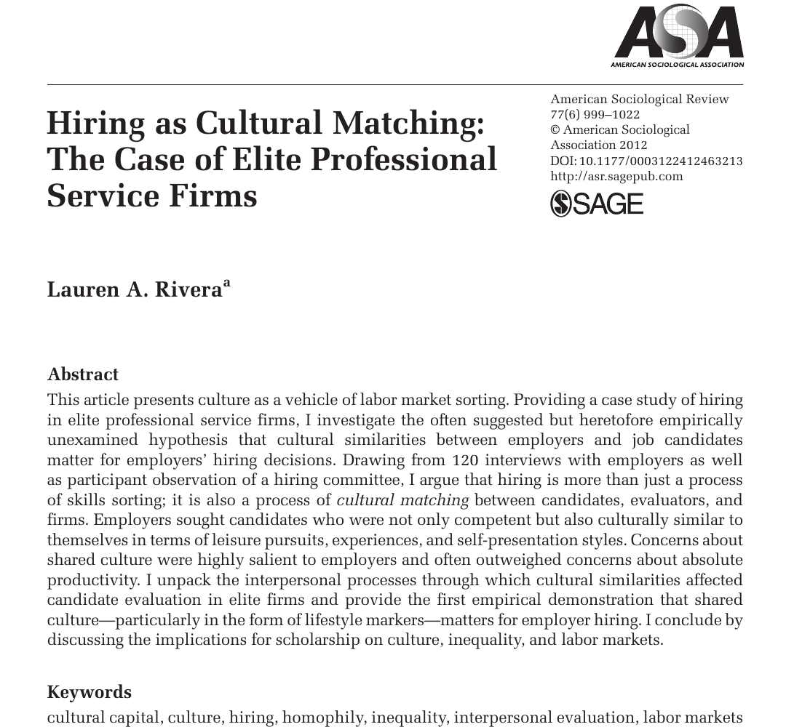<div><p>Rivera interviewed <strong>120 evaluators</strong> in elite professional-service firms and observed one hiring committee.</p><p>The interviews elicited evaluators' criteria and accounts of recently interviewed candidates.</p><p>The committee observation showed how evaluations were produced and contested in real time.</p></div></div>

<div class="citation">Lauren A. Rivera (2012), “Hiring as Cultural Matching,” <em>American Sociological Review</em> 77(6): 999–1022.</div>

---

## Life histories and social context {.paper-slide}

<div class="cols6040">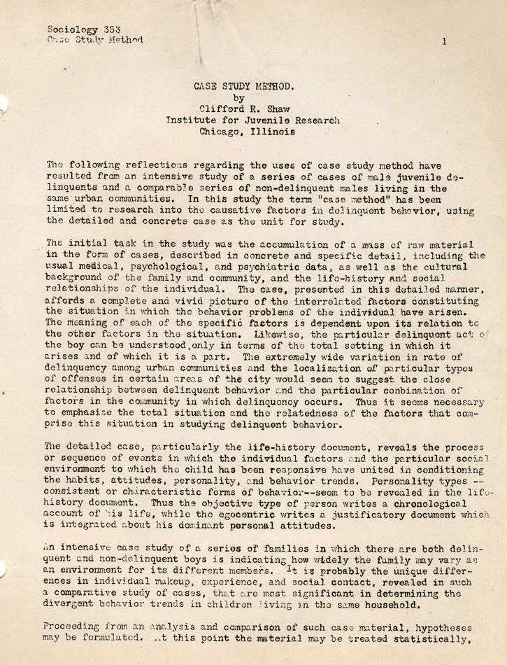<div><p>Chicago sociologists used interviews and autobiographical accounts to connect a person's experience to institutions and social change.</p><p>The researcher still selected, organized and interpreted the life record.</p><p><strong>Question:</strong> Is one short interview adequate to the timescale and context of the claim?</p><div class="citation">C. R. Shaw student paper, Sociology 353, Ernest Watson Burgess Papers, University of Chicago Library.</div></div></div>

---

## The focused interview {.paper-slide}

<div class="cols6040">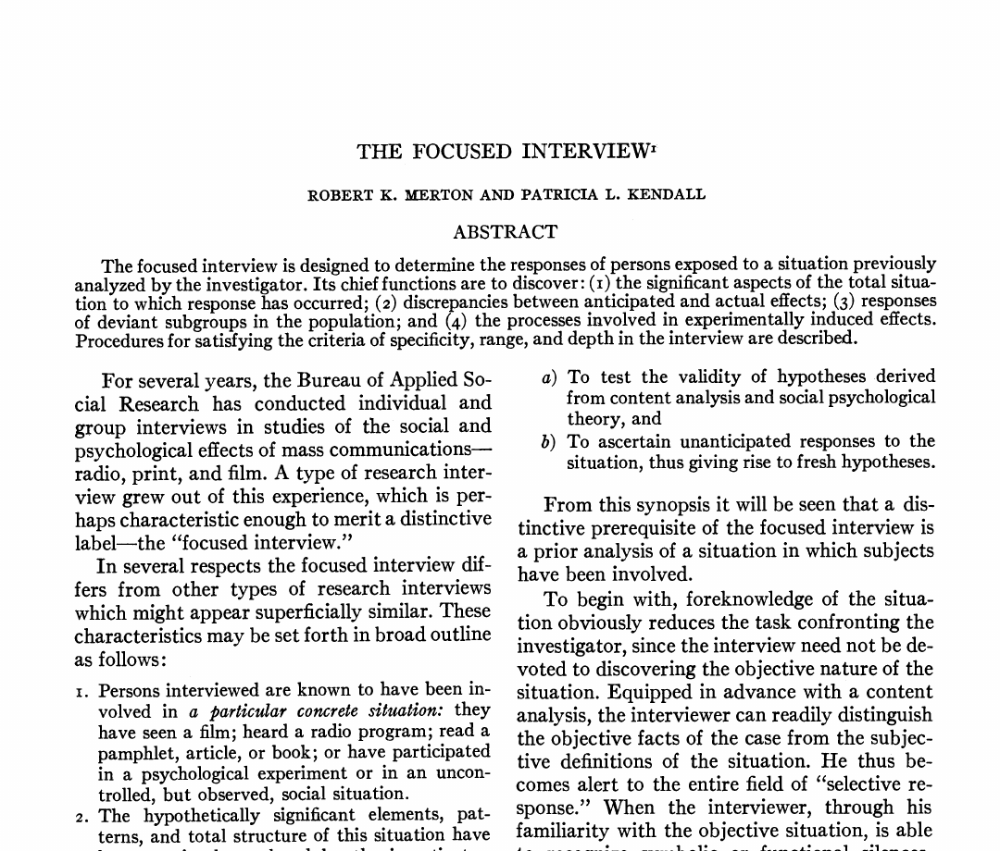<div><p>Merton and Kendall studied responses to films, broadcasts and experimental situations that the researchers had already analysed.</p><p>That prior analysis gave interviewers questions to pursue. Interviewers still had to leave participants room to describe an unexpected response.</p><p>The methodological problem was how to seek detail without dictating the account.</p></div></div>

<div class="citation">Robert K. Merton & Patricia L. Kendall (1946), “The Focused Interview,” <em>American Journal of Sociology</em> 51(6): 541–557.</div>

---

## Merton and Kendall's four criteria {.paper-slide}

<div class="cols4060"><div><ol class="large-list"><li>nondirection;</li><li>specificity;</li><li>range;</li><li>depth and personal context.</li></ol><p>They called these criteria provisional and interrelated.</p><p>For them, depth concerned affective significance and personal context.</p></div>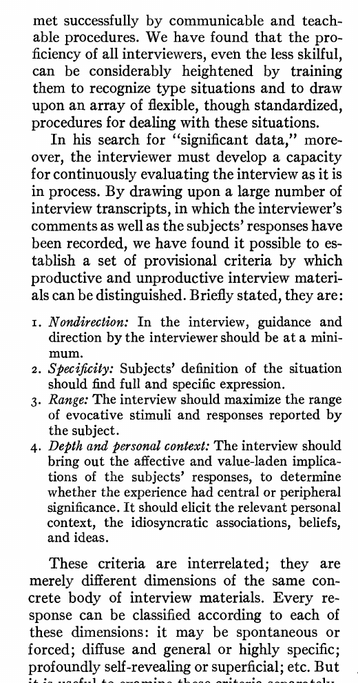</div>

<div class="citation">Merton & Kendall (1946), p. 545.</div>

---

## Specificity without leading {.transcript-slide}

<div class="transcript transcript-wide"><div class="turn"><span class="speaker">Response:</span> “I found it uncomfortable.”</div><div class="turn"><span class="speaker">Probe A:</span> “Was there a particular moment when you began to feel uncomfortable?”</div><div class="turn"><span class="speaker">Probe B:</span> “Was it the speaker's dismissive tone that made you uncomfortable?”</div></div>

<div class="cols"><div><h3>Probe A</h3><p>Requests a concrete moment.</p></div><div><h3>Probe B</h3><p>Introduces both a feature and an interpretation.</p></div></div>

<div class="citation">Instructor-written example based on Merton & Kendall (1946), especially pp. 545–551.</div>

---

## Standardized survey interviewing {.paper-slide}

<div class="cols4060">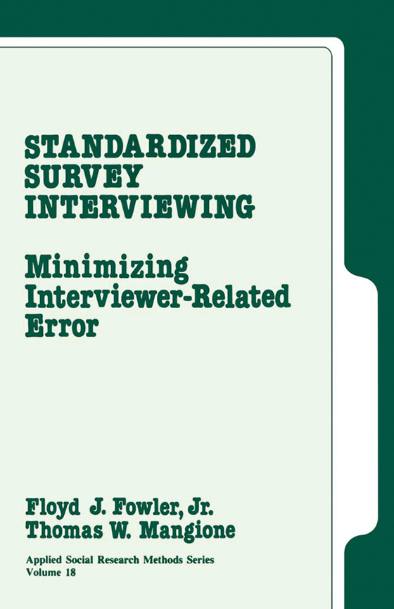<div><p><strong>Read questions as written.</strong></p><p><strong>Use agreed clarifications and probes.</strong></p><p><strong>Follow the same skip and coding rules.</strong></p><p>The interviewer's discretion is deliberately restricted because the aim is comparable measurement.</p><div class="citation">Floyd J. Fowler Jr. & Thomas W. Mangione (1990), <em>Standardized Survey Interviewing</em>. SAGE.</div></div></div>

---

## Standardization and clarification {.transcript-slide}

<div class="transcript transcript-wide"><div class="turn"><span class="speaker">Interviewer:</span> In the last week, how many times did you exercise?</div><div class="turn"><span class="speaker">Respondent:</span> Does walking to work count?</div><div class="turn"><span class="speaker">Strict response:</span> Whatever exercise means to you.</div><div class="turn"><span class="speaker">Clarification:</span> Count walking if it lasted ten minutes and raised your breathing rate.</div></div>

<p>The strict response preserves identical wording. The clarification may help the respondent use the intended definition, but it changes what this respondent hears.</p>

<div class="citation">Illustrative example based on Schober & Conrad (1997), “Does Conversational Interviewing Reduce Survey Measurement Error?”, <em>Public Opinion Quarterly</em> 61(4): 576–602.</div>

---

## The interviewer has to respond {.transcript-slide}

<div class="repair-question"><span>Respondent</span><p>“Does walking to work count as exercise?”</p></div>

<div class="repair-options"><div><h3>Repeat the question</h3><p>Preserves the wording but leaves the category unclear.</p></div><div><h3>Give the agreed definition</h3><p>Helps the respondent use the intended concept.</p></div><div><h3>Improvise an explanation</h3><p>May help in the moment but creates interviewer variation.</p></div></div>

<div class="repair-record"><strong>Record:</strong> the clarification and the answer that followed it. <strong>Report:</strong> which clarifications interviewers were allowed to give.</div>

<p class="plain-takeaway">A model must make the same kind of decision when a participant asks for help or gives an unclear answer.</p>

<div class="citation">Suchman & Jordan (1990), “Interactional Troubles in Face-to-Face Survey Interviews”; Schober & Conrad (1997).</div>

---

## Oakley on power and reciprocity {.paper-slide}

<div class="cols6040">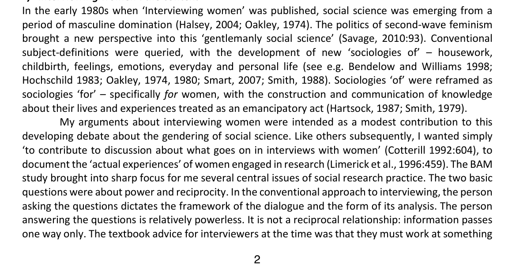<div><p>Oakley's argument grew from four interviews each with 55 women, from pregnancy to five months after birth.</p><p>Participants asked her hundreds of questions. Conventional advice said that answering could bias the data. Oakley argued that refusing could be exploitative.</p><div class="quote">“The two basic questions were about power and reciprocity.”</div></div></div>

<div class="citation">Ann Oakley (2016), “Interviewing Women Again: Power, Time and the Gift,” <em>Sociology</em> 50(1): 195–213, pp. 197–199.</div>

---

## Bourdieu on the interview relationship {.paper-slide}

<div class="source-highlight-wrap">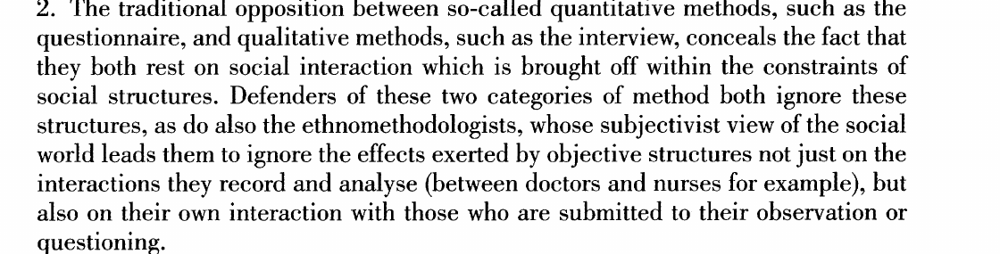<div class="highlight-note2" aria-hidden="true"></div></div>

<p>Bourdieu argues that social structures shape both the interaction being studied and the researcher's interaction with the participant.</p>

<div class="citation">Pierre Bourdieu (1996), “Understanding,” <em>Theory, Culture & Society</em> 13(2): 17–37, p. 34, note 2.</div>

---

## Signals of attention {.quote-slide}

<div class="attention-signals"><span>“yes”</span><span>“right”</span><span>a nod</span><span>a look</span><span>a smile</span></div>

<div class="attention-reading"><div><strong>Bourdieu's argument</strong><p>These small responses help the participant continue. Visible inattention can make someone lose the thread.</p></div><div><strong>For an AI interviewer</strong><p>The system can generate acknowledgments and paraphrases. We need to find out whether participants experience them as attention, empty fluency or surveillance.</p></div></div>

<div class="repair-record"><strong>Question for evaluation:</strong> Did the acknowledgment help the participant develop the account, or did it simply make the system sound attentive?</div>

<div class="citation">Bourdieu (1996), note 4 and pp. 17–37.</div>

---

## Accounts and conduct {.transcript-slide}

<div class="quote">“When senior students are in the room, I decide not to speak because I assume their comments will be more sophisticated.”</div>

<div class="evidence-levels"><div><strong>The participant said</strong><p>They worry about intellectual worth.</p></div><div><strong>The account may help explain</strong><p>How they understand participation.</p></div><div><strong>The account alone cannot show</strong><p>That they always remain silent around senior students.</p></div></div>

---

## The attitudinal fallacy {.paper-slide}

<div class="cols6040"><div class="source-highlight-wrap">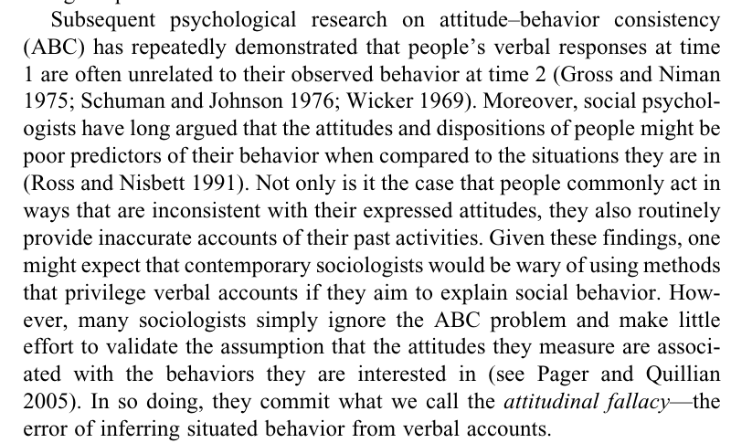<div class="source-mark highlight-abc" aria-hidden="true"></div><div class="source-mark highlight-fallacy" aria-hidden="true"></div></div><div><p><strong>ABC problem:</strong> verbal responses at one point often fail to predict observed behaviour later.</p><p>Jerolmack and Khan call the unsupported inference from talk to conduct the <strong>attitudinal fallacy</strong>.</p></div></div>

<div class="citation">Colin Jerolmack & Shamus Khan (2014), “Talk Is Cheap: Ethnography and the Attitudinal Fallacy,” <em>Sociological Methods & Research</em> 43(2): 178–209, p. 179.</div>

---

## LaPiere's study {.paper-slide}

<div class="cols6040"><div class="source-highlight-wrap">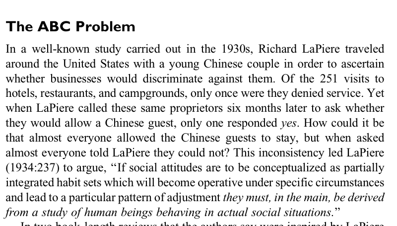<div class="source-mark highlight-lapiere" aria-hidden="true"></div></div><div><ol><li>LaPiere travelled with a young Chinese couple in the 1930s.</li><li>They were denied service once in 251 visits.</li><li>Six months later, only one proprietor said they would admit a Chinese guest.</li></ol><p>The survey answers poorly predicted conduct during the earlier encounters.</p></div></div>

<div class="citation">Jerolmack & Khan (2014), p. 182, discussing LaPiere (1934).</div>

---

## The situation matters {.paper-slide}

<div class="cols6040"><div class="source-highlight-wrap">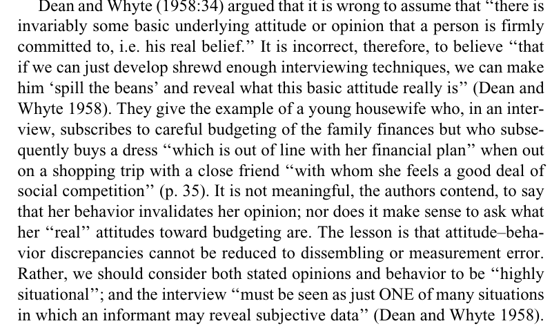<div class="source-mark highlight-budget-account" aria-hidden="true"></div></div><div><p><strong>In an interview:</strong> a woman endorses careful family budgeting.</p><p><strong>While shopping with a friend:</strong> she buys a dress outside the plan amid social competition.</p><p>Neither setting reveals a single “real” attitude. They are different social situations.</p></div></div>

<div class="citation">Jerolmack & Khan (2014), p. 183, discussing Dean & Whyte (1958).</div>

---

## What interviews can establish {.paper-slide}

<div class="cols6040"><div class="source-highlight-wrap">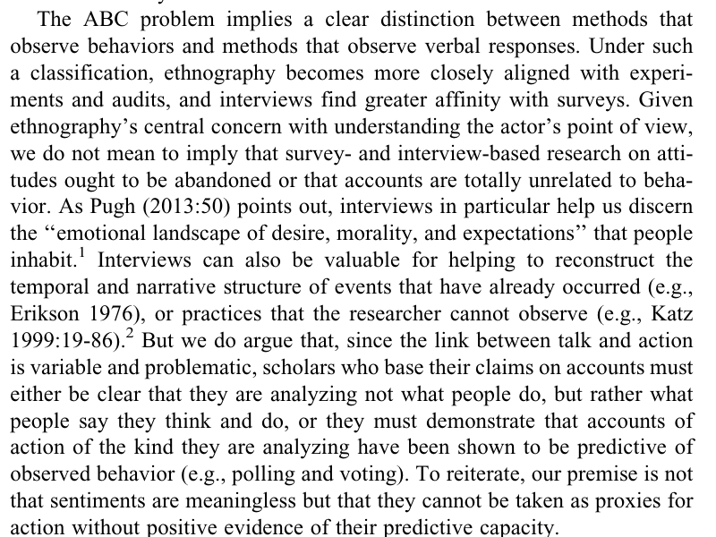<div class="source-mark highlight-uses-account" aria-hidden="true"></div><div class="source-mark highlight-uses-limit" aria-hidden="true"></div></div><div><h3>Interviews can tell us about</h3><p>Meanings, expectations, retrospective narratives and experiences that cannot be observed directly.</p><h3>Claims about conduct need more</h3><p>Observation, triangulation or evidence that this kind of account predicts the behaviour being claimed.</p></div></div>

<div class="citation">Jerolmack & Khan (2014), p. 180.</div>

---

## Rivera combines interviews and observation {.paper-slide}

<div class="cols6040">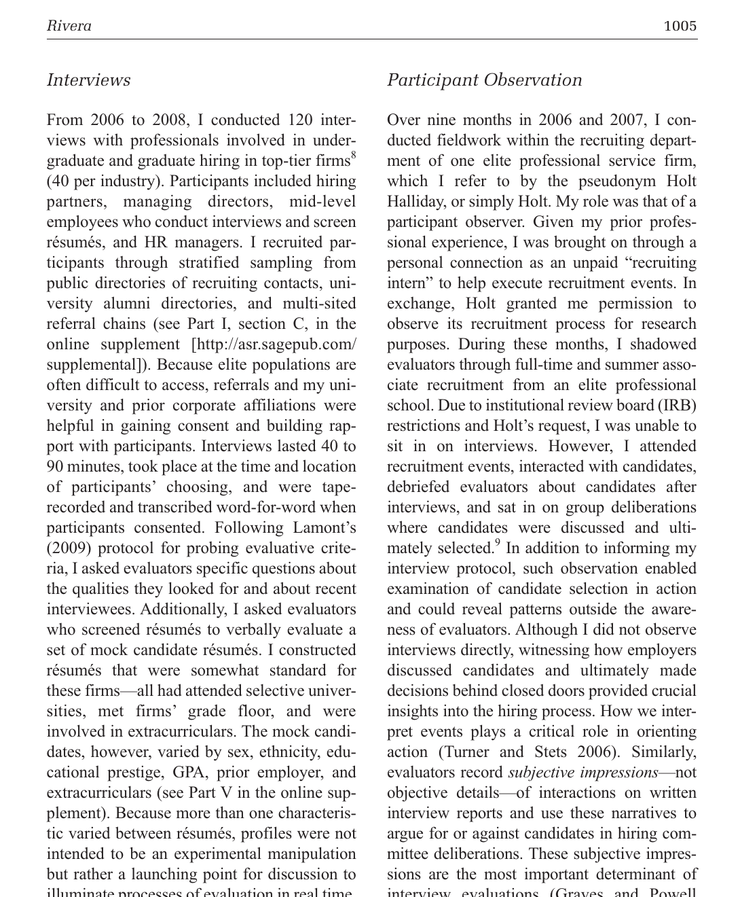<div><p><strong>Interviews:</strong> evaluators explained their criteria, assessed mock résumés and discussed candidates.</p><p><strong>Observation:</strong> a hiring committee showed how candidate evaluations were produced and contested.</p><p>The interview gives us evaluators' accounts. Observation shows part of the decision process outside those accounts.</p></div></div>

<div class="citation">Rivera (2012), pp. 1004–1005.</div>

---

## What “cultural fit” contained {.paper-slide}

<div class="cols6040">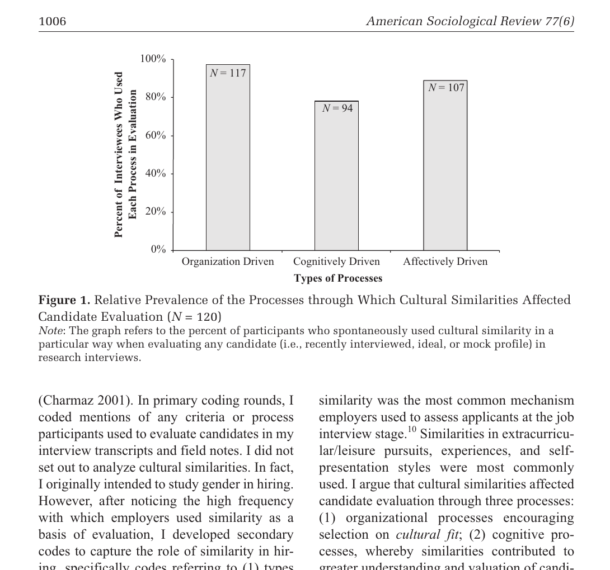<div><p>Evaluators used similarity in several ways:</p><ul><li>to sort candidates into a firm type;</li><li>to interpret their answers;</li><li>to generate excitement or connection.</li></ul><p>Asking only whether someone was a good fit would miss these differences.</p></div></div>

<div class="citation">Rivera (2012), Figure 1 and pp. 1005–1006.</div>

---

## CAPI, CASI and audio-CASI

<p class="bridge-intro">Rivera showed that wording shapes what an interview elicits. Survey researchers also varied who or what presented the question.</p>

<div class="mode3"><div><div class="mode-label">CAPI</div><p>A human reads the question from a computer and enters the answer.</p></div><div><div class="mode-label">CASI</div><p>The participant reads the question and enters the answer privately.</p></div><div><div class="mode-label">Audio-CASI</div><p>The participant hears a recording and answers on the device.</p></div></div>

<p class="plain-takeaway">All three can implement complex branching, but the questions and branches are written in advance.</p>

<div class="citation">Tourangeau & Smith (1996), “Asking Sensitive Questions,” <em>Public Opinion Quarterly</em> 60(2): 275–304.</div>

---

## Tourangeau and Smith on sensitive questions {.paper-slide}

<div class="tourangeau-layout"><div class="tourangeau-window">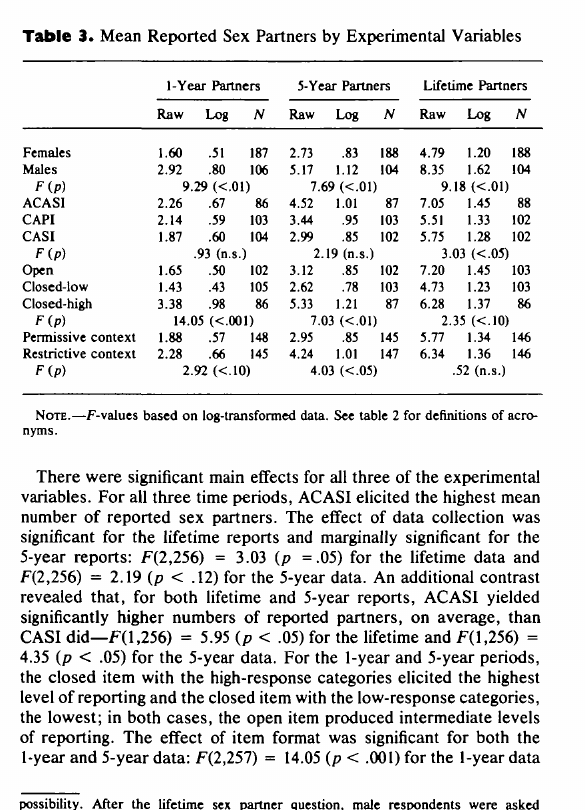</div><div><p><strong>Study:</strong> 339 adults answered questions about sexual behaviour and drug use using CAPI, CASI or audio-CASI.</p><p><strong>Finding:</strong> audio-CASI produced the highest mean reported number of sex partners.</p><p>Greater disclosure and greater accuracy are separate questions.</p></div></div>

<div class="citation">Roger Tourangeau & Tom W. Smith (1996), Table 3, pp. 292–293.</div>

---

## Adaptive interviewing with an LLM

Earlier computer-assisted interviews presented questions and branches written in advance.

<div class="crucial">An LLM can write a new follow-up after reading an open-ended answer.</div>

That decision can reflect the research protocol, the preceding conversation and the model's own interpretation of the answer.

---

## Break {.section-slide}

After the break: what current studies tell us about AI-assisted and AI-led interviews.

---

## Three kinds of AI interview

<table class="tbl roomy"><tr><th>Arrangement</th><th>Who chooses the next question?</th><th>What must be recorded?</th></tr><tr><td>AI assistance</td><td>The model suggests. A human interviewer decides.</td><td>Suggestion, human edit and final question.</td></tr><tr><td>Human approval</td><td>The model writes. A human approves or changes it.</td><td>Conversation, output, approval and edit.</td></tr><tr><td>AI-led interview</td><td>The model writes and delivers the question.</td><td>Conversation, model, settings and exact output.</td></tr></table>

---

## How an answer becomes a follow-up question

<div class="flow"><div><strong>Protocol</strong><br>research aim and required topics</div><div><strong>Conversation</strong><br>questions and answers so far</div><div><strong>Model call</strong><br>instructions plus conversation</div><div><strong>Question</strong><br>generated follow-up</div><div><strong>Record</strong><br>input, output and any edit</div></div>

<p class="plain-takeaway">Reconstructing the exchange requires the conversation sent to the model and the question it returned.</p>

---

## Personalized persuasion after an AI interview {.paper-slide}

<div class="velez-intro">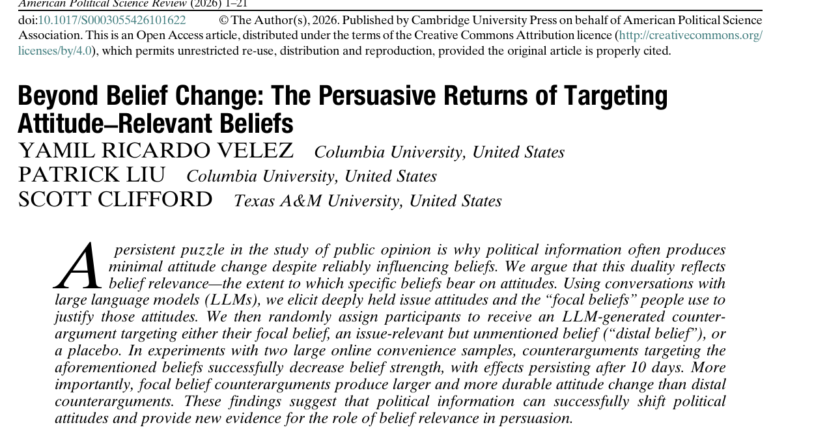<div><p><strong>Question:</strong> Do arguments change attitudes more when they address a belief the participant regards as central?</p><p>Participants discussed a political position with an LLM.</p><p>The model summarized their position, identified a focal belief and generated a relevant belief they had not mentioned.</p></div></div>

<div class="citation">Yamil Ricardo Velez, Patrick Liu & Scott Clifford (2026), “Beyond Belief Change,” <em>American Political Science Review</em>.</div>

---

## How the model classified the interview {.paper-slide}

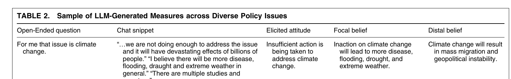

<div class="cols"><div><p><strong>Focal belief:</strong> a reason expressed in the conversation and treated as central to the attitude.</p></div><div><p><strong>Distal belief:</strong> a relevant reason generated by the model but not mentioned by the participant.</p></div></div>

<div class="criterion">Does the focal-belief statement represent the conversation accurately?</div>

<div class="citation">Velez, Liu & Clifford (2026), Table 2.</div>

---

## The three experimental conditions {.paper-slide}

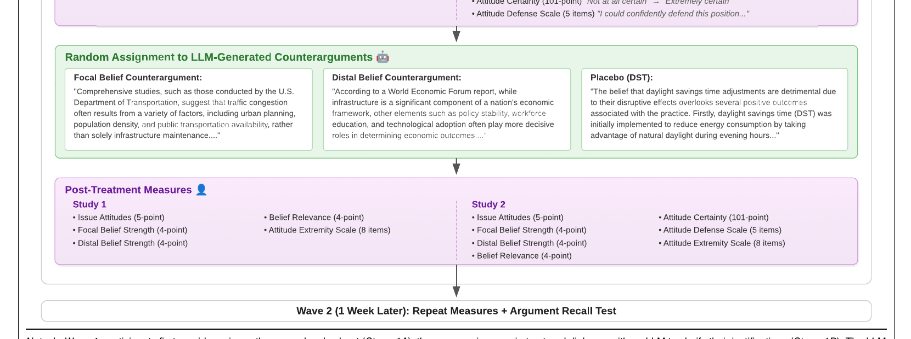

<p class="plain-takeaway">Participants received a counterargument aimed at the focal belief, a counterargument aimed at the generated distal belief, or a placebo message.</p>

<div class="citation">Velez, Liu & Clifford (2026), Figure 2.</div>

---

## Focal-belief messages had larger effects {.paper-slide}

<div class="velez-result">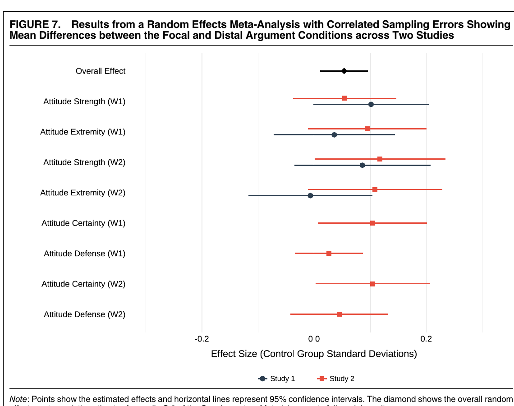<div><p>Positive values favour the focal-belief condition.</p><p><strong>Overall difference:</strong> 0.054 control-group standard deviations (<em>p</em> = .014).</p><p>Eleven of twelve comparisons favoured the focal-belief condition, although several estimates were imprecise.</p><p>Each interview summary requires separate validation.</p></div></div>

<div class="citation">Velez, Liu & Clifford (2026), Figure 7 and pp. 14–15.</div>

---

## Text and voice interviews {.paper-slide}

<div class="cols6040">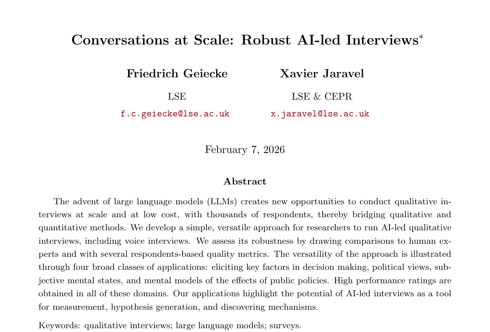<div><p>Geiecke and Jaravel compare human and AI interviewers, text and voice input, prompts and models.</p><p>The comparisons distinguish design choices that are often bundled together as “AI interviewing.”</p><p>Their platform sends the system instruction and conversation back to the model after each answer.</p></div></div>

<div class="citation">Friedrich Geiecke & Xavier Jaravel (2026), “Conversations at Scale: Robust AI-led Interviews,” working paper.</div>

---

## Voice architecture in Geiecke and Jaravel {.paper-slide}

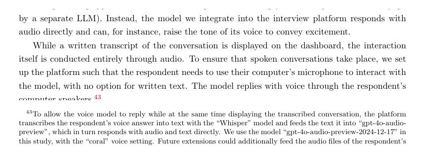

<div class="voice-route"><div><span>1</span><strong>Participant</strong><p>Speaks into the microphone.</p></div><div><span>2</span><strong>Whisper</strong><p>Transcribes the answer.</p></div><div><span>3</span><strong>GPT-4o audio</strong><p>Returns text and spoken audio.</p></div><div><span>4</span><strong>Coral voice</strong><p>Delivers the next question.</p></div></div>

<div class="citation">Geiecke & Jaravel (2026), section 3.4.2 and note 43. Their system used <code>gpt-4o-audio-preview-2024-12-17</code>.</div>

---

## Spoken answers received higher grades {.paper-slide}

<div class="cols4060"><div><p>Eight sociology PhD students graded transcripts against what a human expert might achieve.</p><p>Using the same prompt and GPT-4o, the mean grade was:</p><p class="result-number">2.82 <span>typed</span><br>3.63 <span>spoken</span></p><p>The authors argue that speech produced more information and supported more precise follow-up.</p></div>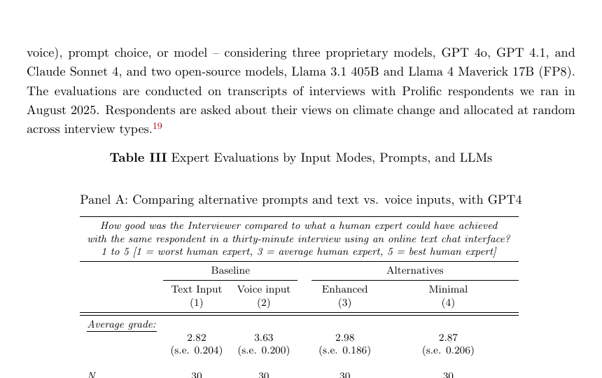</div>

<div class="citation">Geiecke & Jaravel (2026), Table III, Panel A. Thirty transcripts per condition.</div>

---

## Human and AI interviewers {.paper-slide}

<div class="cols6040">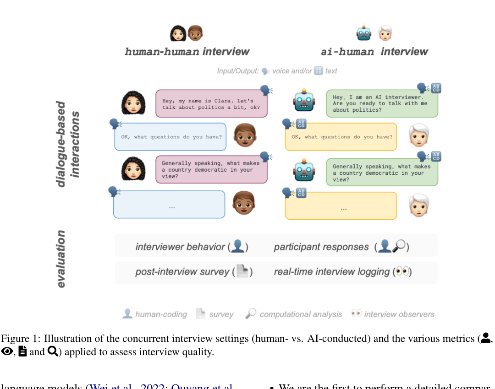<div><p>Participants discussed politics and democracy with an AI interviewer or a student interviewer.</p><p>The AI used GPT-4 Turbo. Participants could choose text or voice.</p><p>The study included five AI-led and six human-led interviews, so the comparison is exploratory.</p></div></div>

<div class="citation">Alexander Wuttke et al. (2025), “AI Conversational Interviewing,” <em>LaTeCH-CLfL 2025</em>: 132–144.</div>

---

## Different interviewer errors

<div class="cols"><div><h3>AI interviewer</h3><ul><li>missed surprising or unclear answers;</li><li>sometimes praised or evaluated responses;</li><li>produced long turns and suffered latency or transcription problems.</li></ul></div><div><h3>Student interviewers</h3><ul><li>more often failed to show active listening;</li><li>sometimes guided the answer;</li><li>were not an expert-interviewer benchmark.</li></ul></div></div>

<p class="plain-takeaway">The eleven-interview sample maps possible errors. The sample is too small to rank the two interviewer types.</p>

<div class="citation">Wuttke et al. (2025), pp. 137–140 and Table 1.</div>

---

## Fixed and adaptive probes {.paper-slide}

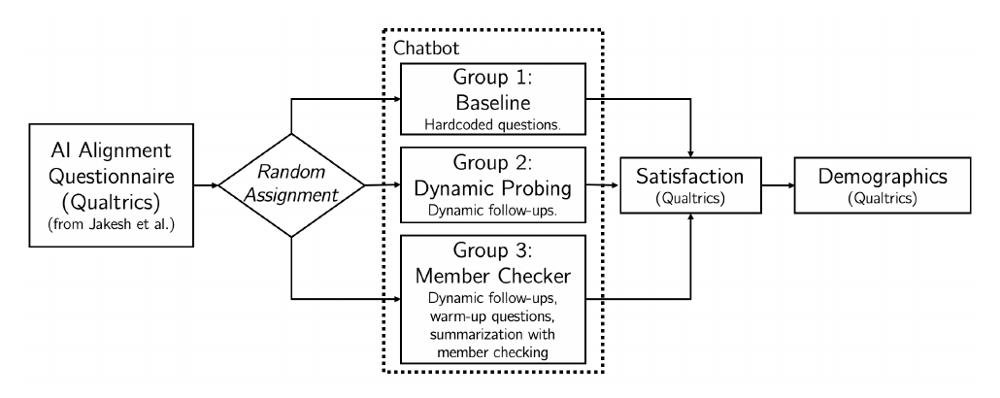

<div class="citation">Cuevas et al. (2025), Figure 2, “Collecting Social Data with Large Language Models,” <em>PACM HCI</em>.</div>

---

## Cuevas and colleagues' three conditions

<table class="tbl"><tr><th>Condition</th><th>After each main answer</th><th>At the end</th></tr><tr><td><strong>Fixed baseline</strong></td><td>Asked “Can you elaborate?” and “Can you provide an example?”</td><td>Ended the conversation.</td></tr><tr><td><strong>Dynamic Prober</strong></td><td>GPT-3.5 Turbo wrote two follow-up questions.</td><td>Ended the conversation.</td></tr><tr><td><strong>Dynamic Prober and Member Checker</strong></td><td>Used the same generated follow-ups.</td><td>Generated a summary the participant could confirm or contest.</td></tr></table>

<p class="plain-takeaway">The study assigned 399 participants and collected 4,308 open-ended responses.</p>

<div class="citation">Cuevas et al. (2025), sections 3.3, 4.2, 5 and Appendix D.</div>

---

## Better follow-up, but little evidence of greater depth {.paper-slide}

<div class="cols4060"><div><p>The Dynamic Prober improved the follow-up score.</p><p>Across most other quality measures, the adaptive conditions resembled the fixed baseline.</p><p>Answers were usually clear and relevant, but often lacked specific examples and the participant's perspective.</p></div>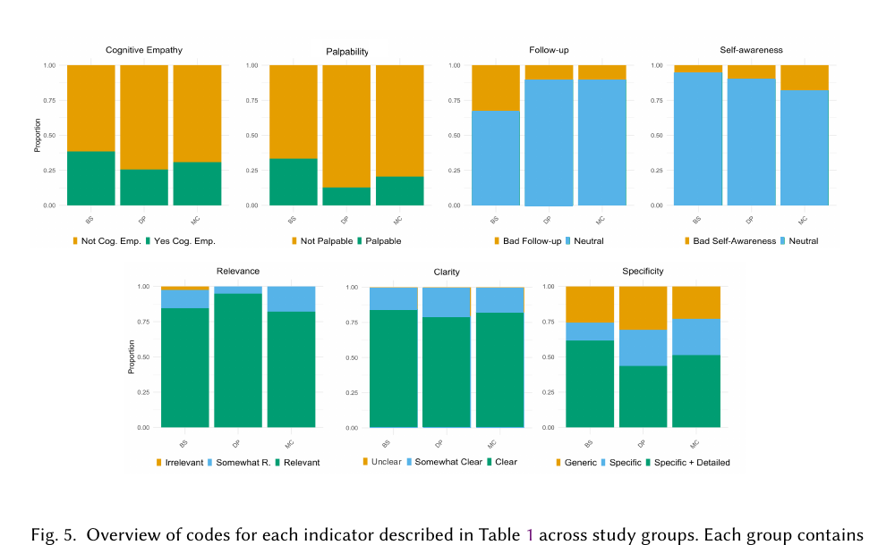</div>

<div class="citation">Cuevas et al. (2025), Figure 5 and sections 6–8.</div>

---

## When the bot claimed to enjoy the interview {.quote-slide}

The Member Checker used friendly language after the interview. One participant objected:

<div class="quote quote-large">“Clearly, it didn’t ‘enjoy’ anything, and saying so felt manipulative.”</div>

The comment shows how this participant interpreted the relationship performed by the chatbot. It also returns us to Oakley's question about reciprocity and the obligations created by an interview.

<div class="citation">Cuevas et al. (2025), p. 14.</div>

---

## Worked example: Rivera's hiring interview

<div class="interview-brief"><div class="brief-aim"><span>Research question</span><p>How do evaluators decide that a candidate is a good cultural fit?</p></div><div class="brief-opener"><span>Opening question</span><p>Tell me about a recent candidate who seemed like a good fit for the firm.</p></div><div class="brief-rule"><span>Rule for the next question</span><p>Ask for a concrete judgment, episode or comparison. Do not name class background, similarity or another cause unless the evaluator has already done so.</p></div></div>

<div class="model-output"><span>Evaluator's first answer</span><p>I could picture her working here.</p></div>

---

## One probe, two possible answers {.transcript-slide}

<div class="turn"><span class="speaker">One plausible first probe:</span> What did she say or do that made you think that?</div>

<div class="path-compare"><div><div class="pair-label">Shared experience</div><div class="turn"><span class="speaker">Evaluator:</span> We discovered that we had both rowed in college and understood long training days.</div></div><div><div class="pair-label">Case performance</div><div class="turn"><span class="speaker">Evaluator:</span> She challenged an assumption in the case without becoming combative.</div></div></div>

<p class="plain-takeaway">The protocol and first probe stay fixed. We change only the evaluator's next answer.</p>

---

## The interview input in Python {.tight-code}

```python
interview_protocol = """
Research question: How do evaluators decide that a candidate
is a good cultural fit?
Ask one follow-up question. Request a concrete episode,
clarification, or comparison. Do not introduce a cause.
Return only the question.
"""

first_answer = "Evaluator: I could picture her working here."

print(type(interview_protocol))
print(type(first_answer))
```

<div class="io-strip"><div><strong>Input 1</strong><br><code>interview_protocol</code> stores the research question and interviewing rule.</div><div><strong>Input 2</strong><br><code>first_answer</code> stores the evaluator's exact words.</div></div>

---

## The message history {.tight-code}

```python
conversation = [
    {"role": "system", "content": interview_protocol},
    {"role": "user", "content": first_answer},
]

print(type(conversation))
print(conversation)
```

<div class="dictionary-parts"><div><strong><code>[ ... ]</code></strong><p>The list keeps messages in order.</p></div><div><strong><code>{ ... }</code></strong><p>Each dictionary stores one message.</p></div><div><strong><code>role</code> and <code>content</code></strong><p>The keys identify the speaker and the words.</p></div></div>

---

## The first call with OpenRouter {.tight-code}

```python
with OpenRouter(
    api_key=os.environ["OPENROUTER_API_KEY"]
) as client:
    first_response = client.chat.send(
        model=HOSTED_MODEL,
        messages=conversation,
        temperature=0,
    )

first_raw = first_response.choices[0].message.content
```

<div class="io-strip"><div><strong>Input</strong><br>The model name, message list and temperature.</div><div><strong>Raw return</strong><br>The response object contains the generated text.</div></div>

---

## The first call with Ollama {.tight-code}

```python
first_response = ollama.chat(
    think=False,
    model=LOCAL_MODEL,
    messages=conversation,
    options={"temperature": 0},
)

first_raw = first_response.message.content
first_probe = first_raw.strip()
print("First probe:", first_probe)
```

<p>After either call, <code>.strip()</code> stores the returned question in <code>first_probe</code>.</p>

---

## Two independent conversation paths {.tight-code}

```python
shared_path = conversation.copy()
shared_path.append({
    "role": "assistant",
    "content": first_probe,
})
shared_path.append({
    "role": "user",
    "content": "Evaluator: We had both rowed in college.",
})

case_path = conversation.copy()
case_path.append({"role": "assistant", "content": first_probe})
case_path.append({
    "role": "user",
    "content": "Evaluator: She challenged a case assumption calmly.",
})
```

<p><code>.copy()</code> creates two separate lists. Each path keeps the same protocol, first answer and first probe.</p>

---

## Two path calls with OpenRouter {.tight-code}

```python
with OpenRouter(
    api_key=os.environ["OPENROUTER_API_KEY"]
) as client:
    shared_response = client.chat.send(
        model=HOSTED_MODEL,
        messages=shared_path,
        temperature=0,
    )
    case_response = client.chat.send(
        model=HOSTED_MODEL,
        messages=case_path,
        temperature=0,
    )

shared_raw = shared_response.choices[0].message.content
case_raw = case_response.choices[0].message.content
```

---

## Two path calls with Ollama {.tight-code}

```python
shared_response = ollama.chat(
    think=False,
    model=LOCAL_MODEL,
    messages=shared_path,
    options={"temperature": 0},
)
case_response = ollama.chat(
    think=False,
    model=LOCAL_MODEL,
    messages=case_path,
    options={"temperature": 0},
)

shared_raw = shared_response.message.content
case_raw = case_response.message.content
```

<p>Each call receives four messages. Only the final evaluator answer differs.</p>

---

## Compare the returned probes {.tight-code}

```python
shared_probe = shared_raw.strip()
case_probe = case_raw.strip()

print("Shared-experience probe:", shared_probe)
print("Case-performance probe:", case_probe)
```

<div class="path-compare"><div><div class="pair-label">Shared-experience path</div><p>Does the question pursue rowing, similarity or another detail from the answer?</p></div><div><div class="pair-label">Case-performance path</div><p>Does the question pursue the challenge, the interaction or another detail from the answer?</p></div></div>

<p class="plain-takeaway">Each call receives four messages. Only the final evaluator answer differs.</p>

---

## Review the generated probes {.tight-code}

```python
shared_review = {
    "responsive": True,
    "introduces_new_cause": False,
    "asks_for_concrete_evidence": True,
    "claims_human_experience": False,
    "notes": "Replace this sentence with your assessment.",
}

case_review = shared_review.copy()
case_review["notes"] = "Replace this with your case-path assessment."
```

<table class="tbl"><tr><th>Reading</th><th>Question for the review</th></tr><tr><td>Rivera</td><td>Does the probe elicit how the evaluator reached the judgment?</td></tr><tr><td>Jerolmack and Khan</td><td>Does the account show what was said, or what happened in hiring practice?</td></tr><tr><td>Cuevas et al.</td><td>Does the model imply that it has human feelings or experiences?</td></tr></table>

---

## The research record {.tight-code}

```python
model_used = HOSTED_MODEL if ROUTE == "openrouter" else LOCAL_MODEL

research_record = {
    "route": ROUTE,
    "requested_model": model_used,
    "opening_messages": conversation,
    "first_raw_return": first_raw,
    "shared_path": shared_path,
    "shared_raw_return": shared_raw,
    "case_path": case_path,
    "case_raw_return": case_raw,
    "shared_review": shared_review,
    "case_review": case_review,
}

print(json.dumps(research_record, indent=2))
```

---

## Week 6 coding task

Run the opening call and both interview paths. Then change only the case-performance answer and recreate the two paths.

In your recording, explain:

1. what the strings, lists and dictionaries store;
2. why <code>.copy()</code> keeps the paths separate;
3. what each model call receives and returns;
4. how the changed answer affects the next probe;
5. what the interview can and cannot establish.

---

## Before using an AI interview transcript

1. What is the interview supposed to tell us?
2. What choices could the interviewer or model make?
3. How might the interview itself affect the answer?
4. What evidence supports the final claim?

<div class="source-record"><strong>Keep:</strong> the protocol, ordered conversation, exact model inputs and outputs, human edits, model and route, speech settings, transcript corrections and validation decisions.</div>

<div class="citation">Next week: whether models can stand in for people or populations.</div>
