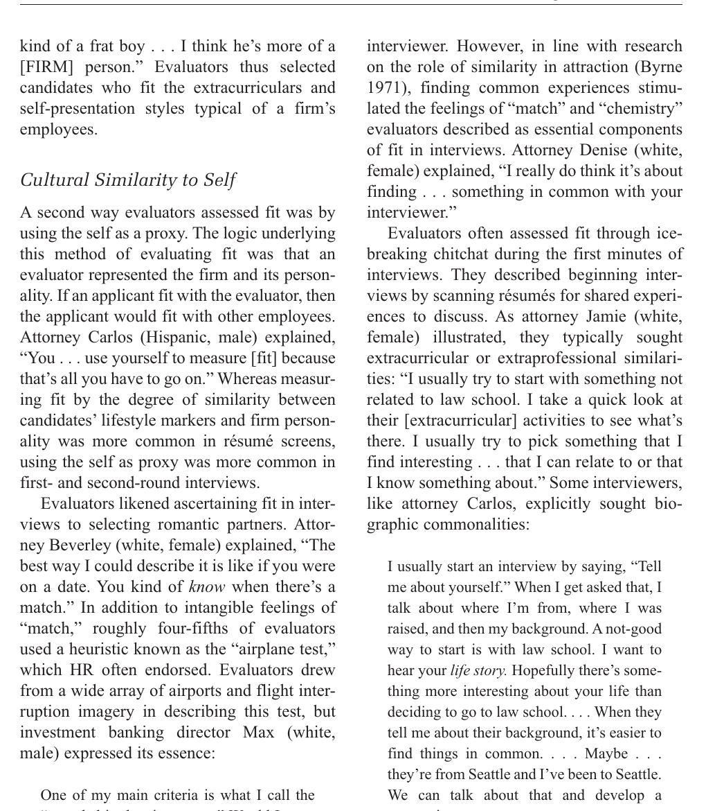
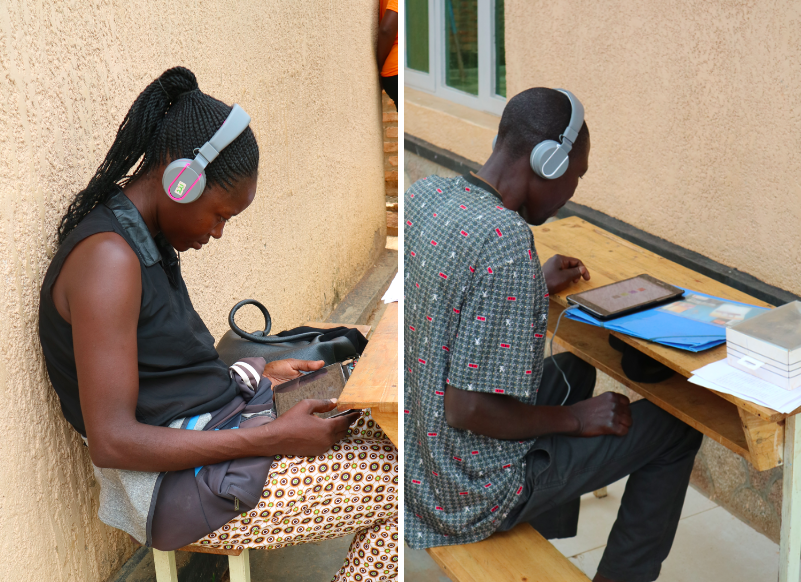
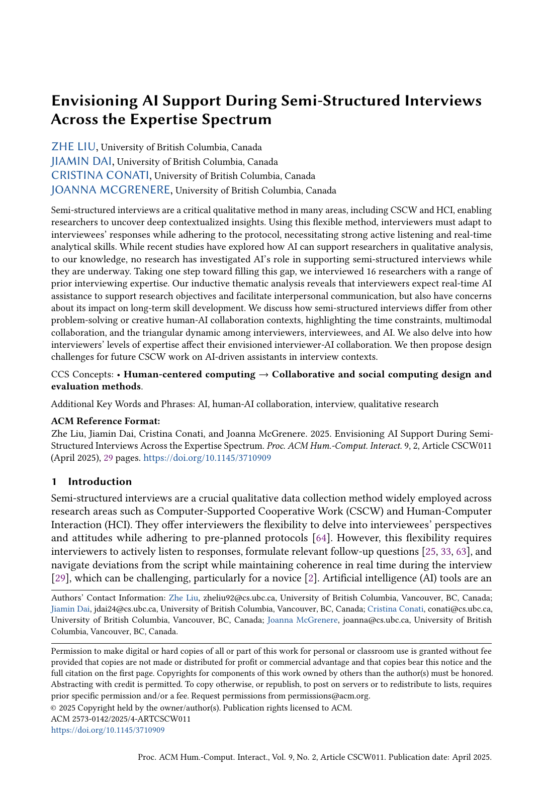
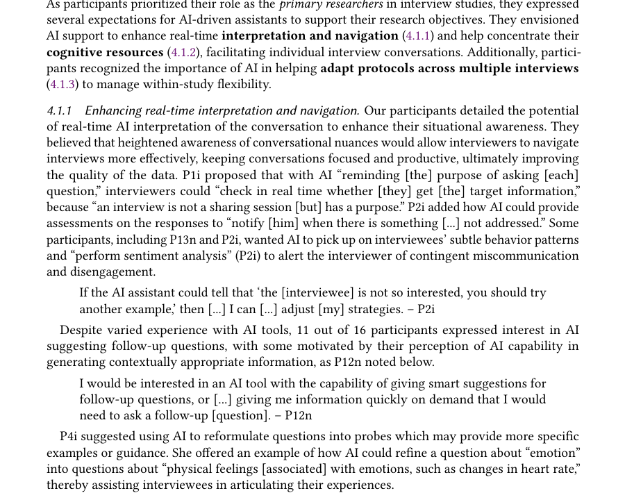
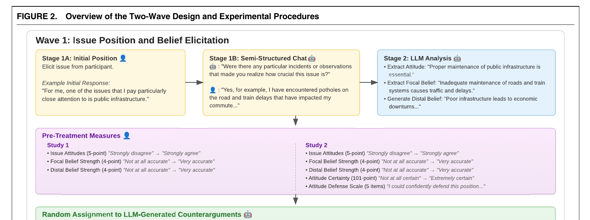
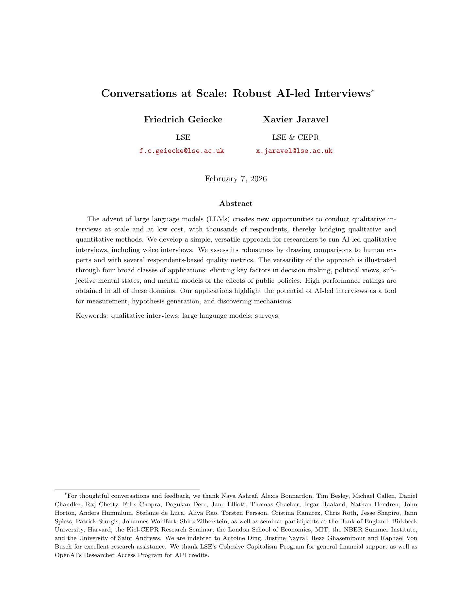
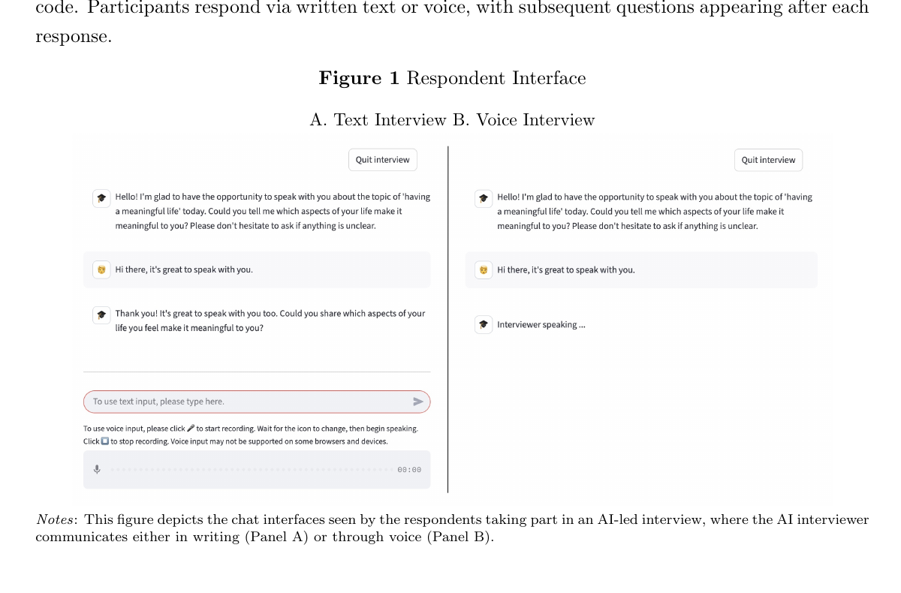
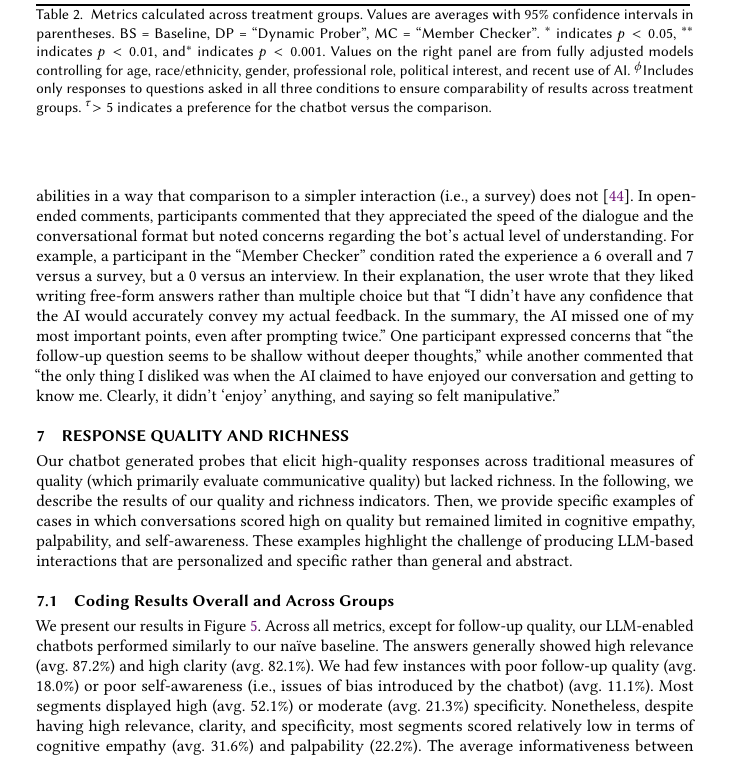

## Two follow-up questions in Rivera's hiring study

<div class="cols"><div class="transcript"><div class="turn"><span class="speaker">Interviewer:</span> Tell me about a recent candidate who seemed like a good fit for the firm.</div><div class="turn"><span class="speaker">Evaluator:</span> The conversation flowed. We had a surprising amount in common.</div><div class="turn"><span class="speaker">Interviewer:</span> What did you find you had in common?</div><div class="turn"><span class="speaker">Evaluator:</span> We had both rowed in college and talked about long training days.</div></div><div class="transcript"><div class="turn"><span class="speaker">Interviewer:</span> Tell me about a recent candidate who seemed like a good fit for the firm.</div><div class="turn"><span class="speaker">Evaluator:</span> The conversation flowed. We had a surprising amount in common.</div><div class="turn"><span class="speaker">Interviewer:</span> So their background matched the firm's culture?</div><div class="turn"><span class="speaker">Evaluator:</span> Yes, I suppose so.</div></div></div>

<div class="citation">Instructor-written comparison based on Rivera (2012), “Hiring as Cultural Matching,” <em>American Sociological Review</em> 77(6): 999–1022.</div>

---

## Four questions for evaluating an interview

<table class="tbl"><tr><th>Question</th><th>Relevant literature</th><th>What we inspect</th></tr><tr><td>What should the interview establish?</td><td>Jerolmack & Khan (2014); Rivera (2012)</td><td>Whether the eventual claim stays within what the account can support.</td></tr><tr><td>What discretion may the interviewer use?</td><td>Merton & Kendall (1946); Fowler & Mangione (1990)</td><td>Whether a probe requests evidence or supplies an explanation.</td></tr><tr><td>How does the encounter shape the answer?</td><td>Oakley (2016); Bourdieu (1996)</td><td>Who or what is asking, through which mode, and how the participant interprets that relationship.</td></tr><tr><td>What record and validation are required?</td><td>Contemporary AI-interview studies</td><td>What this participant received, how it was generated, and how its quality was checked.</td></tr></table>

<div class="citation">Merton & Kendall, 1946, <em>AJS</em> 51(6): 541–557; Fowler & Mangione, 1990, <em>Standardized Survey Interviewing</em>; Oakley, 2016, <em>Sociology</em> 50(1): 195–213; Bourdieu, 1996, <em>Theory, Culture & Society</em> 13(2): 17–37; Jerolmack & Khan, 2014, <em>Sociological Methods & Research</em> 43(2): 178–209.</div>

::: {.notes}
[Sources]
- Merton & Kendall (1946) | Source: https://doi.org/10.1086/219886 | Accessed: 2026-08-25
- Fowler & Mangione (1990) | Source: https://uk.sagepub.com/en-gb/eur/standardized-survey-interviewing/book2496 | Accessed: 2026-08-25
- Oakley (2016) | Source: https://doi.org/10.1177/0038038515580253 | Accessed: 2026-08-25
- Bourdieu (1996) | Source: https://doi.org/10.1177/026327696013002002 | Accessed: 2026-08-25
- Jerolmack & Khan (2014) | Source: https://doi.org/10.1177/0049124114523396 | Accessed: 2026-08-25
[/Sources]
:::

---

## Interview A better serves this research question

<div class="cols"><div><h3>Interview A</h3><p>Asks the evaluator to specify what “in common” meant in this case.</p><p><strong>Risk:</strong> the follow-up creates a participant-specific path.</p></div><div><h3>Interview B</h3><p>Offers “firm culture” as the explanation before the evaluator has done so.</p><p><strong>Risk:</strong> agreement may reflect the wording of the probe rather than the evaluator's original account.</p></div></div>

<div class="criterion">Rivera asks how evaluators construct cultural fit. Interview A currently gives better evidence because it asks the evaluator to specify the comparison. If the aim were a standardized measure of fit, neither exchange would be an adequate instrument.</div>

---

## Rivera combines interview accounts with observation

<div class="cols6040"><div><p>Rivera interviewed <strong>120 evaluators</strong> in elite professional-service firms and observed one hiring committee.</p><p>The interviews elicited evaluators' criteria and accounts of recently interviewed candidates. Observation showed how candidate evaluations were produced and contested in real time.</p><p>The distinction between an account and situated conduct will matter throughout the lecture.</p></div></div>

<div class="citation">Lauren A. Rivera (2012), “Hiring as Cultural Matching,” <em>American Sociological Review</em> 77(6): 999–1022.</div>

---

## Four interviewing traditions clarify different parts of the problem

<table class="tbl"><tr><th>Tradition</th><th>Main concern</th></tr><tr><td>Life histories</td><td>Place an account within biography, institutions and historical change.</td></tr><tr><td>Focused and survey interviews</td><td>Decide when to pursue detail and when to restrict interviewer discretion.</td></tr><tr><td>Feminist and reflexive interviewing</td><td>Examine power, reciprocity and the social relationship that produces the account.</td></tr><tr><td>Ethnographic critique</td><td>Match the eventual claim to what interview talk can establish.</td></tr></table>

<div class="purpose">These traditions do not offer one universal standard. They identify different questions that an AI interviewer must answer.</div>

---

## Early Chicago sociology connected biographies to social change

<div class="cols6040"><div><p>The University of Chicago archive describes life histories as interviews or autobiographical accounts used to connect a person's experience with a changing social world.</p><p>This student paper also shows that the researcher selected, organized and interpreted the life record.</p><div class="criterion"><strong>Question added:</strong> Is one interview adequate to the timescale and context of the claim?</div><div class="citation">C. R. Shaw student paper, Sociology 353, Ernest Watson Burgess Papers, University of Chicago Library.</div></div></div>

::: {.notes}
[Sources]
- University of Chicago Library, “Life History Method” and C. R. Shaw student paper | Source: https://www.lib.uchicago.edu/collex/exhibits/mapping-young-metropolis/life-history-method/ | Accessed: 2026-08-25
[/Sources]
:::

---

## What a life-history transcript leaves out

If our claim concerns how class, migration or institutional experience develops over time, a fluent twenty-minute account can still be too thin.

<div class="question">What would we need besides a transcript to understand a student's route into—and through—graduate education?</div>

---

## Merton and Kendall studied responses to situations the researchers already knew

<div class="cols6040"><div><p>The focused interview developed from research on responses to analysed films, broadcasts and experimental situations.</p><p>The prior analysis gave interviewers expectations to investigate—but the interview still had to leave room for unanticipated responses.</p><div class="citation">Robert K. Merton & Patricia L. Kendall (1946), “The Focused Interview,” <em>American Journal of Sociology</em> 51(6): 541–557. https://doi.org/10.1086/219886</div></div></div>

::: {.notes}
[Sources]
- Merton & Kendall (1946), “The Focused Interview” | Source: https://doi.org/10.1086/219886 | Accessed: 2026-08-24
[/Sources]
:::

---

## These are Merton and Kendall's own four criteria

<div class="cols4060"><div><p>They call the criteria <strong>provisional</strong> and interrelated:</p><ol><li>nondirection;</li><li>specificity;</li><li>range;</li><li>depth and personal context.</li></ol><p>The formulation matters: “depth” is not a word-count metric. It concerns affective significance and personal context.</p></div></div>

<div class="citation">Merton & Kendall (1946), p. 545. Screenshot from the supplied published PDF.</div>

---

## A useful probe asks for evidence without supplying the answer

<div class="transcript"><div class="turn"><span class="speaker">Response:</span> “I found it uncomfortable.”</div><div class="turn"><span class="speaker">Probe A:</span> “Was there a particular moment when you began to feel uncomfortable?”</div><div class="turn"><span class="speaker">Probe B:</span> “Was it the speaker's dismissive tone that made you uncomfortable?”</div></div>
<p>This is an instructor-written example applying Merton and Kendall's distinction. Probe A requests specificity. Probe B introduces both a feature and an interpretation.</p>
<div class="criterion"><strong>Check:</strong> Does the probe obtain specificity or depth while keeping direction to a minimum?</div>

<div class="citation">Applied example based on Merton & Kendall (1946), especially pp. 545–551.</div>

---

## Survey interviewing gave the interviewer a different job

<div class="cols4060"><div></div><div><h3>Read as written</h3><p>Keep wording and order stable.</p><h3>Use standardized probes</h3><p>Do not improvise different explanations for different respondents.</p><h3>Follow skip logic and code consistently</h3><p>The interviewer's role is deliberately restricted.</p><div class="citation">Floyd J. Fowler Jr. & Thomas W. Mangione (1990), <em>Standardized Survey Interviewing: Minimizing Interviewer-Related Error</em>. SAGE.</div></div></div>

<div class="purpose">Standardization reduces one source of interviewer-related variation for a measurement task. It does not remove all interviewer effects or guarantee shared interpretation.</div>

---

## Identical wording does not guarantee identical meaning

<div class="transcript"><div class="turn"><span class="speaker">Interviewer:</span> In the last week, how many times did you exercise?</div><div class="turn"><span class="speaker">Respondent:</span> Does walking to work count?</div><div class="turn"><span class="speaker">Strict:</span> Whatever exercise means to you.</div><div class="turn"><span class="speaker">Clarifying:</span> Count walking if it lasted ten minutes and raised your breathing rate.</div></div>
<div class="purpose">The first preserves the standardized script. The second may improve the respondent's mapping to the intended concept, but changes the words this respondent hears.</div>

<div class="citation">Illustrative exercise based on Schober & Conrad (1997), “Does Conversational Interviewing Reduce Survey Measurement Error?”, <em>Public Opinion Quarterly</em> 61(4): 576–602.</div>

::: {.notes}
[Sources]
- Schober & Conrad (1997) | Source: https://faculty.isr.umich.edu/fredconrad/wp-content/uploads/2015/12/schober___conrad__1997.pdf | Accessed: 2026-08-25
[/Sources]
:::

---

## Depth and comparability are different research objectives

<table class="tbl"><tr><th>Interview job</th><th>Interviewer does</th><th>Main risk</th></tr><tr><td>Reconstruct a process</td><td>Follows chronology and context</td><td>Short accounts detach events from a life</td></tr><tr><td>Understand a response</td><td>Requests specificity and depth</td><td>The probe directs the answer</td></tr><tr><td>Produce comparable measures</td><td>Restricts discretion</td><td>Shared wording conceals different meanings</td></tr></table>

<div class="citation">Instructor synthesis of Thomas & Znaniecki's life-history tradition; Merton & Kendall (1946); Fowler & Mangione (1990); and Schober & Conrad (1997). The table is not reproduced from a single source.</div>

---

## Interviewing also involves trouble and repair

Respondents hesitate, challenge a category, answer a different question, or reveal that interviewer and respondent do not share the same definition.

<div class="question">The respondent's request—“Does walking count?”—shows why we now need to consider the exchange itself, not only the schedule.</div>

<div class="purpose">This is the bridge: standardization asks what the interviewer should keep fixed; interaction research asks what happens when shared meaning breaks down.</div>

::: {.notes}
[Sources]
- Suchman & Jordan (1990), “Interactional Troubles in Face-to-Face Survey Interviews” | Source: https://doi.org/10.1080/10510979009368218 | Accessed: 2026-08-25
- Schober & Conrad (1997) | Source: https://doi.org/10.1086/297818 | Accessed: 2026-08-25
[/Sources]
:::

---

## Repair makes the interviewer's contribution visible

When a respondent asks what a category means, the interviewer has to do something: repeat the words, provide a definition, improvise an explanation, defer, or move on.

<div class="cols"><div><h3>What the transcript records</h3><p>The exact clarification and the answer that followed it.</p></div><div><h3>What the methods section must explain</h3><p>Which clarifications were allowed, how interviewers were trained, and whether different respondents received different explanations.</p></div></div>

<div class="purpose">This is why interviewer behavior is part of the data-generating process rather than an incidental feature of delivery.</div>

---

## Oakley's argument came from interviewing women becoming mothers

<div class="cols6040"><div><p>Oakley's original argument grew from the <em>Becoming a Mother</em> study: four interviews each with 55 women from pregnancy to five months after birth.</p><p>The participants asked Oakley hundreds of questions about pregnancy, childbirth and care. Conventional advice said that answering could bias the data; Oakley argued that refusing could be exploitative and counterproductive.</p><div class="citation">Ann Oakley (2016), “Interviewing Women Again: Power, Time and the Gift,” <em>Sociology</em> 50(1): 195–213. https://doi.org/10.1177/0038038515580253</div></div></div>

::: {.notes}
[Sources]
- Oakley (2016), “Interviewing Women Again” | Source: https://doi.org/10.1177/0038038515580253 | Accessed: 2026-08-24
[/Sources]
:::

---

## Oakley makes power and reciprocity part of the method

<div class="quote">“The two basic questions were about power and reciprocity.”</div>

The person asking questions ordinarily sets the framework and later controls the analysis. Information does not simply pass between equal parties. Rapport may also invite disclosures that create ethical obligations.

<div class="criterion"><strong>For AI interviews:</strong> removing the human interviewer changes the relationship; it does not remove institutional power, expectations about listening, or responsibility for what is disclosed.</div>

<div class="citation">Oakley (2016), pp. 197–199. Quotation contains 9 words.</div>

---

## Bourdieu begins from the same premise, but stresses social structure

<div class="source-highlight-wrap"><div class="highlight-note2" aria-hidden="true"></div></div>

The highlighted sentence is the source of the shortened quotation. The rest of the note is important: Bourdieu argues that objective structures shape both the interaction being studied and the researcher's own interaction with participants.

<div class="citation">Pierre Bourdieu (1996), “Understanding,” <em>Theory, Culture & Society</em> 13(2): 17–37, p. 34, note 2. https://doi.org/10.1177/026327696013002002. Screenshot from the published PDF.</div>

::: {.notes}
[Sources]
- Bourdieu (1996), “Understanding,” p. 34, note 2 | Local source: literature/source_pdfs/session06/bourdieu_1996_understanding.pdf | DOI: https://doi.org/10.1177/026327696013002002 | Accessed: 2026-08-25
[/Sources]
:::

---

## For Bourdieu, good listening requires active work

He describes verbal and bodily signs of attention—“yes,” “right,” nods, looks and smiles—as conditions for a conversation that flows. A moment of inattention can make the respondent lose the thread.

<div class="cols"><div><h3>What an AI system can imitate</h3><p>Acknowledgments, paraphrases, pauses and follow-up questions.</p></div><div><h3>What remains an empirical question</h3><p>Whether participants interpret those signals as attention, institutional surveillance, empty fluency or something else.</p></div></div>

<div class="citation">Bourdieu (1996), note 4; see also pp. 17–37 for the interviewing principles developed for <em>La Misère du Monde</em>.</div>

---

## Interview accounts and claims about conduct

<div class="transcript">“When senior students are in the room, I decide not to speak because I assume their comments will be more sophisticated.”</div>

1. The participant <strong>described</strong> worrying about intellectual worth.
2. The account may help analyse how students <strong>understand</strong> participation.
3. It does not by itself show the participant <strong>always remains silent</strong> around senior students.

---

## Jerolmack and Khan call this the “attitudinal fallacy”

<div class="cols6040"><div class="source-highlight-wrap"><div class="source-mark highlight-fallacy" aria-hidden="true"></div></div><div><p>The mistake is not listening to an account. It is treating what someone says as evidence of how they behave in a particular situation, without showing that the two are linked.</p><div class="criterion"><strong>Criterion 4:</strong> Does the claim stay within what the interview evidence can establish?</div><p class="purpose"><strong>Their first example is LaPiere:</strong> did proprietors’ later answers match what happened when they actually encountered a Chinese couple?</p></div></div>

<div class="citation">Colin Jerolmack & Shamus Khan (2014), “Talk Is Cheap: Ethnography and the Attitudinal Fallacy,” <em>Sociological Methods & Research</em> 43(2): 178–209, p. 179. https://doi.org/10.1177/0049124114523396.</div>

::: {.notes}
[Sources]
- Jerolmack & Khan (2014), “Talk Is Cheap,” p. 179 | Local source: slides/session06/sources/jerolmack_khan_2014.pdf | DOI: https://doi.org/10.1177/0049124114523396 | Accessed: 2026-08-25
[/Sources]
:::

---

## LaPiere observed one pattern, then heard almost the reverse

<div class="cols6040"><div class="source-highlight-wrap"><div class="source-mark highlight-lapiere" aria-hidden="true"></div></div><div><ol><li>LaPiere travelled with a young Chinese couple in the 1930s.</li><li>They were denied service only once in 251 visits.</li><li>Six months later, only one proprietor said they would admit a Chinese guest.</li></ol><p>The later answer did not predict conduct during the earlier encounter.</p></div></div>

<div class="citation">Jerolmack & Khan (2014), p. 182, discussing LaPiere (1934). Screenshot from the published article.</div>

::: {.notes}
[Sources]
- Jerolmack & Khan (2014), p. 182 | Local source: slides/session06/sources/jerolmack_khan_2014.pdf | DOI: https://doi.org/10.1177/0049124114523396 | Accessed: 2026-08-25
[/Sources]
:::

---

## The budgeting example shows why the discrepancy may be situational

<div class="cols6040"><div class="source-highlight-wrap"><div class="source-mark highlight-budget-account" aria-hidden="true"></div></div><div><p><strong>In the interview:</strong> a woman endorses careful family budgeting.</p><p><strong>While shopping with a friend:</strong> she buys a dress outside the plan amid “social competition.”</p><p>Jerolmack and Khan’s point is not that one response reveals her “real” attitude. The interview and the shopping trip are different social situations.</p></div></div>

<div class="citation">Jerolmack & Khan (2014), p. 183, discussing Dean & Whyte (1958). Screenshot from the published article. Quoted phrases contain 5 words.</div>

::: {.notes}
[Sources]
- Jerolmack & Khan (2014), p. 183 | Local source: slides/session06/sources/jerolmack_khan_2014.pdf | DOI: https://doi.org/10.1177/0049124114523396 | Accessed: 2026-08-25
[/Sources]
:::

---

## What interview evidence can establish

<div class="cols6040"><div class="source-highlight-wrap"><div class="source-mark highlight-uses-account" aria-hidden="true"></div><div class="source-mark highlight-uses-limit" aria-hidden="true"></div></div><div><h3>Interviews can tell us about</h3><p>meanings, expectations, retrospective narratives and practices that cannot be directly observed.</p><h3>A claim about action needs more</h3><p>Observation, triangulation, or evidence that this kind of account predicts the behaviour being claimed.</p></div></div>

<div class="citation">Jerolmack & Khan (2014), p. 180. Screenshot from the published article.</div>

::: {.notes}
[Sources]
- Jerolmack & Khan (2014), p. 180 | Local source: slides/session06/sources/jerolmack_khan_2014.pdf | DOI: https://doi.org/10.1177/0049124114523396 | Accessed: 2026-08-25
[/Sources]
:::

---

## Interviews and observation contribute different evidence

<div class="cols6040"><div><p><strong>Interviews:</strong> evaluators explained criteria, assessed mock résumés and discussed recently interviewed candidates.</p><p><strong>Observation:</strong> committee meetings showed how candidate evaluations were produced and contested in real time.</p><p>The two sources do not do the same job. The interview reveals evaluators' accounts; observation shows parts of the decision process outside those accounts.</p></div></div>

<div class="citation">Rivera (2012), pp. 1004–1005. Screenshot from the published article.</div>

---

## “Cultural fit” was not one single criterion

<div class="cols6040"><div><p>Rivera coded several processes through which similarity affected evaluation.</p><p>Evaluators used similarity to sort candidates into a firm type, interpret answers and generate feelings of excitement or connection.</p><p>A probe that merely asks “Was the candidate a good fit?” would miss these distinctions.</p></div></div>

<div class="citation">Rivera (2012), Figure 1 and accompanying discussion, pp. 1005–1006.</div>

---

## A useful probe asks how the judgment was made

<div class="cols6040"><div><p>Evaluators described using themselves as a proxy for the firm and looking for shared experiences during informal conversation.</p><p><strong>Useful follow-up:</strong> “What did you and the candidate find you had in common?”</p><p><strong>Leading follow-up:</strong> “So their elite background made them fit the firm?”</p><p>The first asks for evidence. The second inserts the researcher's explanation.</p></div></div>

<div class="citation">Rivera (2012), “Cultural Similarity to Self,” pp. 1010–1011.</div>

---

## A second question is how the interview was administered

<div class="bridge-questions"><div><h3>What did the probe elicit?</h3><p>Rivera's case shows why the wording of a follow-up matters for the substantive explanation.</p></div><div class="bridge-arrow">→</div><div><h3>Who or what delivered it?</h3><p>Survey researchers show that an interviewer, a screen or a recorded voice can also change what people report.</p></div></div>

These are different methodological questions. Both matter when we evaluate an AI-led interview.

---

## CAPI and CASI changed who presented the question

<div class="mode-compare"><div><div class="mode-label">CAPI</div><p><strong>Computer-assisted personal interviewing.</strong></p><p>A human interviewer reads the item from a computer and enters the answer. The software manages question order and skips.</p></div><div><div class="mode-label">CASI</div><p><strong>Computer-assisted self-interviewing.</strong></p><p>The participant reads the item and enters an answer without the interviewer seeing each response.</p></div></div>

<p class="plain-takeaway">The software changes administration and privacy. The next question is still selected from rules written in advance.</p>

<div class="citation">Tourangeau & Smith (1996), “Asking Sensitive Questions,” <em>Public Opinion Quarterly</em> 60(2): 275–304. https://doi.org/10.1086/297751</div>

---

## Audio-CASI added recorded speech to self-administration

<div class="cols6040"><div><p>The participant hears a prerecorded question through headphones and selects an answer on the device.</p><p>This offers privacy without requiring every participant to read the questionnaire unaided. An enumerator may remain nearby for setup but does not administer each sensitive item.</p><div class="citation">Photograph: Oxford Mind & Behaviour Research Group, “Surveying on Sensitive Topics: Using Audio Computer Assisted Self-Interviewing.”</div></div></div>

::: {.notes}
[Sources]
- Oxford Mind & Behaviour Research Group, ACASI field photograph | Source: https://mbrg.bsg.ox.ac.uk/method/surveying-sensitive-topics-using-audio-computer-assisted-self-interviewing | Accessed: 2026-08-25
[/Sources]
:::

---

## The three modes create different experiences for the respondent

<table class="tbl"><tr><th>Mode</th><th>Question arrives through</th><th>Who can immediately observe the answer?</th><th>Branching</th></tr><tr><td>CAPI</td><td>Human interviewer</td><td>Interviewer</td><td>Written in advance</td></tr><tr><td>CASI</td><td>Text on screen</td><td>Participant</td><td>Written in advance</td></tr><tr><td>Audio-CASI</td><td>Recorded voice and screen</td><td>Participant</td><td>Written in advance</td></tr></table>

<div class="purpose">This gives us a baseline for deciding what is genuinely new about model-led interviewing.</div>

---

## Tourangeau and Smith tested whether mode changed sensitive reports

<div class="cols6040"><div class="compact"><p><strong>Study:</strong> 339 Cook County adults answered questions about sexual behavior and drug use using CAPI, CASI or audio-CASI.</p><p><strong>Finding:</strong> audio-CASI produced the highest mean reported number of sex partners. The mode effect was significant for lifetime reports; audio-CASI was also significantly higher than CASI for five-year and lifetime reports.</p><p><strong>Caution:</strong> higher reporting may indicate greater disclosure. It is not automatically proof of greater accuracy.</p><div class="citation">Roger Tourangeau & Tom W. Smith (1996), <em>POQ</em> 60(2): 275–304, Table 3, pp. 292–293.</div></div></div>

::: {.notes}
[Sources]
- Tourangeau & Smith (1996), “Asking Sensitive Questions” | Source: https://doi.org/10.1086/297751 | Accessed: 2026-08-24
[/Sources]
:::

---

## The new capability is making an interviewing decision from an open answer

Pre-LLM systems could present items, implement complex branching and reduce interviewer presence. The branches were generally written in advance.

<div class="crucial"><strong><em>An LLM can select or compose a substantive follow-up during the exchange.</em></strong></div>

---

## Break

When we return: what kinds of systems are called “AI interviews,” and what do current evaluations actually show?

---

## The phrase “AI interview” covers quite different arrangements

<table class="tbl"><tr><th>Who decides the next question?</th><th>Example in the literature</th><th>What must be recorded?</th></tr><tr><td>Script and authored branches</td><td>CASI and audio-CASI in Tourangeau & Smith (1996)</td><td>Questionnaire version and branch</td></tr><tr><td>Model suggests; human interviewer decides</td><td>Uses proposed by the interview researchers in Liu et al. (2025)</td><td>Suggestion, human edit and decision</td></tr><tr><td>Model writes and delivers the question</td><td>Wuttke et al. (2025); Cuevas et al. (2025); Geiecke & Jaravel (2026)</td><td>Conversation context, output, model and settings</td></tr></table>

::: {.notes}
[Sources]
- Liu et al. (2025), “Envisioning AI Support during Semi-Structured Interviews Across the Expertise Spectrum,” <em>Proceedings of the ACM on Human-Computer Interaction</em> 9(2): 1–29. https://doi.org/10.1145/3710909
- Wuttke et al. (2025), “AI Conversational Interviewing,” <em>LaTeCH-CLfL 2025</em>: 132–144. https://aclanthology.org/2025.latechclfl-1.17/
- Cuevas et al. (2025), “Collecting Social Data with Large Language Models,” <em>PACM HCI</em>. https://doi.org/10.1145/3710947
- Geiecke & Jaravel (2026), “The Rise of AI-Led Interviews in Social Science.” https://benjamin.geiecke.com/files/ai_interviews.pdf
[/Sources]
:::

---

## Current studies answer different methodological questions

<table class="tbl"><tr><th>Question</th><th>Evidence used in the studies</th></tr><tr><td>What support would human interviewers use?</td><td>Interviews with researchers in Liu et al. (2025)</td></tr><tr><td>What happens when an interview shapes a later treatment?</td><td>Personalized experiment in Velez, Liu & Clifford (2026)</td></tr><tr><td>Do adaptive probes improve the material collected?</td><td>Transcript ratings and randomized comparisons in Geiecke & Jaravel (2026) and Cuevas et al. (2025)</td></tr><tr><td>Where do human and AI interviewers make different mistakes?</td><td>Error coding in Wuttke et al. (2025)</td></tr><tr><td>How do participants experience the interaction?</td><td>Participant follow-up in Jack et al. (2026) and Cuevas et al. (2025)</td></tr><tr><td>Does model choice alter the interview?</td><td>Controlled model comparison in Panfilova et al. (2026)</td></tr></table>

<div class="purpose">No single evaluation establishes whether an AI interviewer is good. Each design tests a different part of the method.</div>

---

## Liu et al. asked interview researchers what support they would use

<div class="liu-study"><div><p><strong>Participants:</strong> 16 researchers with different levels of interviewing experience.</p><p><strong>Method:</strong> 50–80 minute semi-structured interviews, followed by inductive thematic analysis.</p><p><strong>Question:</strong> Where might AI help a human interviewer, and where might it create new problems?</p><p>This was a study of researchers' expectations. It did not test an AI assistant during field interviews.</p></div></div>

<div class="citation">Zhe Liu, Jiamin Dai, Cristina Conati & Joanna McGrenere (2025), “Envisioning AI Support During Semi-Structured Interviews Across the Expertise Spectrum,” <em>Proceedings of the ACM on Human-Computer Interaction</em> 9(2), Article CSCW011. https://doi.org/10.1145/3710909</div>

---

## The most common request was help choosing a follow-up

<div class="liu-findings"><div><p><strong>11 of 16 researchers</strong> expressed interest in AI suggestions for follow-up questions.</p><p>Others wanted reminders about the purpose of a question, information that had not yet been covered, or a point worth revisiting.</p><p>Researchers also worried about distraction, over-reliance and whether the system could understand the interview well enough to help.</p></div></div>

<div class="citation">Liu et al. (2025), section 4.1.1, pp. 9–11. Screenshot from the published article.</div>

---

## An AI interviewer uses each answer to decide what to ask next

<div class="flow"><div><strong>Protocol</strong><br>research aims and required topics</div><div><strong>Conversation</strong><br>ordered questions and answers</div><div><strong>Model call</strong><br>instructions plus relevant context</div><div><strong>Next question</strong><br>generated text</div><div><strong>Decision record</strong><br>what was sent and returned</div></div>

<p class="plain-takeaway">Save the conversation sent to the model, the exact question it returned, and any human edit or approval. Otherwise we cannot reconstruct why this particular probe appeared here.</p>

---

## An interview determines the personalized experimental treatments

<div class="velez-intro"><div><p><strong>Research question:</strong> Do arguments change attitudes more when they address a belief that the participant regards as central to that attitude?</p><p>Participants first discussed a deeply held political position with an LLM. The model then summarized the participant's position, identified a focal belief and generated a relevant belief the participant had not mentioned.</p><p>Those outputs determined which personalized counterarguments could enter the experiment.</p></div></div>

<div class="citation">Yamil Ricardo Velez, Patrick Liu & Scott Clifford (2026), “Beyond Belief Change: The Persuasive Returns of Targeting Attitude-Relevant Beliefs,” <em>American Political Science Review</em>: 1–21. https://doi.org/10.1017/S0003055426101622</div>

::: {.notes}
[Sources]
- Velez, Liu & Clifford (2026), title and abstract | Local source: literature/source_pdfs/session06/velez_liu_clifford_2026_beyond_belief_change.pdf | DOI: https://doi.org/10.1017/S0003055426101622 | Accessed: 2026-09-30
[/Sources]
:::

---

## The interview produces the focal and distal beliefs



<div class="purpose">The participant supplies the issue and the reasons. The model decides how to express the attitude, which stated reason counts as focal and which unmentioned reason will serve as the distal comparison.</div>

<div class="citation">Velez, Liu & Clifford (2026), Figure 2, upper section.</div>

::: {.notes}
[Sources]
- Velez, Liu & Clifford (2026), Figure 2 | Local source: literature/source_pdfs/session06/velez_liu_clifford_2026_beyond_belief_change.pdf | DOI: https://doi.org/10.1017/S0003055426101622 | Accessed: 2026-09-30
[/Sources]
:::

---

## Those beliefs define the experiment's three conditions


<div class="purpose">Participants receive a counterargument aimed at their focal belief, a counterargument aimed at the generated distal belief or a placebo message. The second wave repeats the measures approximately ten days later.</div>

<div class="citation">Velez, Liu & Clifford (2026), Figure 2, lower section.</div>

::: {.notes}
[Sources]
- Velez, Liu & Clifford (2026), Figure 2 | Local source: literature/source_pdfs/session06/velez_liu_clifford_2026_beyond_belief_change.pdf | DOI: https://doi.org/10.1017/S0003055426101622 | Accessed: 2026-09-30
[/Sources]
:::

---

## The model turns the conversation into a focal belief and a distal belief


<div class="cols"><div><p><strong>Focal belief:</strong> a reason expressed in the conversation and treated as central to the participant's attitude.</p></div><div><p><strong>Distal belief:</strong> a relevant reason generated by the model but not mentioned by the participant.</p></div></div>

<div class="criterion"><strong>The interpretive question:</strong> what evidence shows that the focal-belief statement faithfully represents the conversation rather than the model's preferred summary of it?</div>

<div class="citation">Velez, Liu & Clifford (2026), Table 2. The published table contains examples from several policy issues; this crop shows the climate-change example.</div>

::: {.notes}
[Sources]
- Velez, Liu & Clifford (2026), Table 2 | Local source: literature/source_pdfs/session06/velez_liu_clifford_2026_beyond_belief_change.pdf | DOI: https://doi.org/10.1017/S0003055426101622 | Accessed: 2026-09-30
[/Sources]
:::

---

## Counterarguments aimed at focal beliefs changed attitudes more

<div class="velez-result"><div><p>The figure compares the effects of focal-belief and distal-belief counterarguments across two studies and two waves.</p><p>Positive values indicate a larger effect for the focal-belief condition.</p><p><strong>Overall difference:</strong> 0.054 control-group standard deviations (<em>p</em> = .014).</p><p>Eleven of the twelve comparisons favored the focal-belief condition, although several individual estimates remain imprecise.</p></div></div>

<div class="purpose">Random assignment estimates the effect of the resulting messages. It does not establish that every probe, summary or generated comparison belief was valid.</div>

<div class="citation">Velez, Liu & Clifford (2026), Figure 7 and pp. 14–15.</div>

::: {.notes}
[Sources]
- Velez, Liu & Clifford (2026), Figure 7 and pp. 14–15 | Local source: literature/source_pdfs/session06/velez_liu_clifford_2026_beyond_belief_change.pdf | DOI: https://doi.org/10.1017/S0003055426101622 | Accessed: 2026-09-30
[/Sources]
:::

---

## Geiecke and Jaravel evaluate both text and voice interviews

<div class="cols6040"><div><p>They build an AI-led interview platform and use it in several substantive applications. Their evaluation compares human and AI interviewers, text and voice input, prompts and models.</p><p>The paper therefore speaks to several design choices separately rather than treating “AI interviewing” as one condition.</p><div class="citation">Benjamin Geiecke & Xavier Jaravel (2026), “The Rise of AI-Led Interviews in Social Science,” working paper.</div></div></div>

::: {.notes}
[Sources]
- Geiecke & Jaravel (2026) | Source: https://benjamin.geiecke.com/files/ai_interviews.pdf | Accessed: 2026-08-24
[/Sources]
:::

---

## Their text interface sends the conversation back to the model after each answer

<div class="cols6040"><div><ol><li>Streamlit displays the chat.</li><li>The platform keeps the system prompt and chat history.</li><li>The participant's new answer is added.</li><li>The LLM generates the next question.</li><li>The new turn is displayed and logged.</li></ol></div></div>

<div class="purpose"><strong>Input to the model:</strong> instructions plus conversation so far. <strong>Output:</strong> the next interviewer question as text.</div>

---

## Voice can mean two different technical arrangements

<div class="cols"><div><h3>A modular pipeline</h3><p>Speech-to-text transcribes the answer; a text model writes a question; text-to-speech reads it aloud.</p><p>Each component can have a different provider, model and retention policy.</p></div><div><h3>A native audio model</h3><p>Audio enters and audio leaves one model, although a transcript may still be produced for display or analysis.</p><p>Voice, latency and prosody become part of the interviewer.</p></div></div>

<div class="citation">Geiecke & Jaravel (2026), section 3.4.2 and note 43. Their 2025 inflation study used Whisper for transcription and <code>gpt-4o-audio-preview-2024-12-17</code> with the “coral” voice for audio output.</div>

::: {.notes}
[Sources]
- Geiecke & Jaravel (2026), pp. 42–43 | Source: https://benjamin.geiecke.com/files/ai_interviews.pdf | Accessed: 2026-08-25
[/Sources]
:::

---

## Geiecke and Jaravel report higher grades when participants speak

<div class="cols4060"><div><p>Eight sociology PhD students graded transcripts against what a human expert might achieve.</p><p>With the same baseline prompt and GPT-4o, the mean grade was:</p><p class="callout">2.82 with typed answers<br>3.63 with spoken answers</p><p>The authors argue that speaking produced more information, which allowed more precise follow-up.</p></div></div>

<div class="citation">Geiecke & Jaravel (2026), Table III, Panel A. Thirty transcripts per condition; these are expert ratings, not a direct measure of truth or rapport.</div>

---

## What the voice comparison establishes

<div class="cards3"><div class="card"><h3>What it shows</h3><p>Mode changed the information participants supplied and the transcripts sociologists evaluated.</p></div><div class="card"><h3>What it cannot show alone</h3><p>Whether accounts were more accurate, whether all topics benefit, or how voice changes disclosure.</p></div><div class="card"><h3>What to record</h3><p>Input and output mode, transcription model, voice model, voice setting, latency and participant edits.</p></div></div>

<div class="purpose">Voice is not merely a more convenient interface. It changes the interaction and possibly the evidence.</div>

---

## Wuttke and colleagues compare where AI and student interviewers go wrong

<div class="cols6040"><div><p>Participants discussed politics and democracy with either an AI or a human student interviewer.</p><p>The AI used GPT-4 Turbo in a Chainlit interface. Participants could choose text or voice for both input and output; speech recognition used Whisper.</p><p>The study included five AI-led and six human-led interviews, so the detailed error comparison is exploratory.</p><div class="citation">Alexander Wuttke et al. (2025), “AI Conversational Interviewing,” <em>LaTeCH-CLfL 2025</em>: 132–144.</div></div></div>

::: {.notes}
[Sources]
- Wuttke et al. (2025) | Source: https://aclanthology.org/2025.latechclfl-1.17/ | Accessed: 2026-08-24
[/Sources]
:::

---

## Human and AI interviewers missed different things

<div class="cols"><div><h3>AI interviewer</h3><ul><li>often failed to pursue surprising or unclear answers;</li><li>sometimes evaluated or praised responses;</li><li>produced longer turns and suffered latency/transcription problems.</li></ul></div><div><h3>Student interviewers</h3><ul><li>more often failed to show active listening;</li><li>sometimes guided the participant's answer;</li><li>were not an expert-interviewer benchmark.</li></ul></div></div>

<div class="criterion">The paper does not establish that one interviewer type is simply better. It identifies different failure patterns that training and system design would need to address.</div>

<div class="citation">Wuttke et al. (2025), pp. 137–140 and Table 1. Human coders judged response quality broadly similar in this small sample.</div>

---

## Cuevas et al. randomly assigned 399 participants to three chatbot designs


<div class="citation">Cuevas et al. (2025), Figure 2, “Collecting Social Data with Large Language Models,” <em>PACM HCI</em>. https://doi.org/10.1145/3710947</div>

::: {.notes}
[Sources]
- Cuevas et al. (2025), Figure 2 | Local source: slides/session06/sources/cuevas_2025.pdf | DOI: https://doi.org/10.1145/3710947 | Accessed: 2026-08-25
[/Sources]
:::

---

## Here is what the three conditions actually did

<table class="tbl"><tr><th>Condition</th><th>After each main answer</th><th>At the end</th></tr><tr><td><strong>Fixed baseline</strong></td><td>Asked the same two probes: “Can you elaborate?” and “Can you provide an example?”</td><td>Ended the conversation.</td></tr><tr><td><strong>Dynamic Prober</strong></td><td>GPT-3.5 Turbo read the participant's answer and wrote two follow-up questions for that answer.</td><td>Ended the conversation.</td></tr><tr><td><strong>Dynamic Prober + Member Checker</strong></td><td>Used the same generated follow-ups, with an additional warm-up question.</td><td>Generated a summary that the participant could confirm or contest.</td></tr></table>

<div class="purpose"><strong>What was compared:</strong> engagement, participant experience, conversational quality and qualitative richness. Both adaptive conditions used GPT-3.5 Turbo through Azure OpenAI; the 399 participants provided 4,308 open-ended responses.</div>

<div class="citation">Cuevas et al. (2025), Sections 3.3, 4.2, 5 and Appendix D.</div>

::: {.notes}
[Sources]
- Cuevas et al. (2025), Sections 3.3, 4.2, 5 and Appendix D | Local source: slides/session06/sources/cuevas_2025.pdf | DOI: https://doi.org/10.1145/3710947 | Accessed: 2026-08-25
[/Sources]
:::

---

## The adaptive chatbot improved follow-up without reliably producing depth

<div class="cols4060"><div><p>The Dynamic Prober improved the study's follow-up score. Across most other quality measures, the LLM conditions looked similar to the fixed baseline.</p><p>Responses were usually clear and relevant, yet often lacked:</p><ul><li><strong>palpable examples</strong> of experience;</li><li><strong>specificity</strong> about what happened;</li><li><strong>cognitive empathy</strong> showing the participant's perspective.</li></ul></div></div>

<div class="citation">Cuevas et al. (2025), sections 6–8. The authors call these systems “adaptive surveyors, not automated interviewers.”</div>

---

## A participant objected when the bot claimed to enjoy the conversation

The Member Checker used friendly conversational language after the interview. One participant thought that wording attributed an emotional capacity to the system that it did not have.

<div class="quote">“Clearly, it didn’t ‘enjoy’ anything, and saying so felt manipulative.”</div>

This tells us how one participant interpreted the relationship the chatbot was performing. It does not tell us that every participant reacted in the same way.

<div class="citation">Cuevas et al. (2025), p. 14.</div>

---

## Data flows in a remote interview system

<div class="cols"><div><h3>Follow the data</h3><ul><li>raw audio;</li><li>transcript;</li><li>conversation context;</li><li>generated question;</li><li>metadata and logs.</li></ul></div><div><h3>Ask who controls it</h3><ul><li>research team;</li><li>routing service;</li><li>model provider;</li><li>speech provider;</li><li>commercial interview platform.</li></ul></div></div>

<div class="criterion"><strong>For OpenRouter:</strong> prompt logging is opt-in, but requests still pass to a model provider and provider policies vary. Zero Data Retention routing and <code>data_collection: "deny"</code> narrow the eligible providers; they do not replace consent, a data-management plan or contractual review.</div>

<div class="citation">OpenRouter documentation and privacy policy, accessed 25 August 2026. For commercial platforms, check the study-specific contract: retention and access may be set by the commissioning organization.</div>

---

## Local and remote inference

<table class="tbl"><tr><th>Question</th><th>Remote service</th><th>Local model</th></tr><tr><td>Where does inference happen?</td><td>Provider infrastructure</td><td>Researcher's machine or server</td></tr><tr><td>What constrains model size?</td><td>Service offering and cost</td><td>RAM/VRAM and supported hardware</td></tr><tr><td>What affects speed?</td><td>Network, provider queue and model</td><td>Model size, quantization and GPU/CPU</td></tr><tr><td>Who maintains the stack?</td><td>Provider plus research team</td><td>Research team</td></tr></table>

<div class="purpose">CPU inference may be slow enough to disrupt a spoken interview. A smaller local model may respond quickly but behave differently from the remote model used in validation.</div>

---

## Remember the two interviews from the opening

<div class="opening-pair"><div><div class="pair-label">Interview A</div><p><strong>Evaluator:</strong> The conversation flowed. We had a surprising amount in common.</p><p><strong>Interviewer:</strong> What did you find you had in common?</p></div><div><div class="pair-label">Interview B</div><p><strong>Evaluator:</strong> The conversation flowed. We had a surprising amount in common.</p><p><strong>Interviewer:</strong> So their background matched the firm's culture?</p></div></div>

Interview A asks the evaluator to specify the comparison. Interview B introduces the researcher's preferred explanation. Which is preferable still depends on the research aim and the claim we later make.

---

## The worked example has one research aim and one probing rule

<div class="interview-brief"><div class="brief-aim"><span>Research aim</span><p>How do evaluators decide that a candidate is a good cultural fit?</p></div><div class="brief-opener"><span>Fixed opening question</span><p>Tell me about a recent candidate who seemed like a good fit for the firm.</p></div><div class="brief-rule"><span>Rule for the next probe</span><p>Ask for a concrete judgment, episode or comparison. Do not name class background, similarity or another cause unless the evaluator has already done so.</p></div></div>

The interview can help us understand how evaluators explain their judgments. It cannot by itself show how often cultural similarity changes an actual hiring decision.

---

## One path identifies a shared activity

<div class="transcript"><div class="turn"><span class="speaker">Evaluator:</span> The conversation flowed. We had a surprising amount in common.</div><div class="turn"><span class="speaker">Adaptive probe:</span> What did you find you had in common?</div><div class="turn"><span class="speaker">Evaluator:</span> We had both rowed in college and talked about long training days.</div></div>
<div class="purpose">The probe asks the evaluator to specify the comparison. It does not name similarity as the cause of the hiring judgment.</div>

---

## Another path identifies an image of the firm

<div class="transcript"><div class="turn"><span class="speaker">Evaluator:</span> She understood how we work with clients. I could picture her here.</div><div class="turn"><span class="speaker">Adaptive probe:</span> What did she say or do that made you picture her working here?</div><div class="turn"><span class="speaker">Evaluator:</span> She challenged the case assumption without becoming combative.</div></div>

---

## The same system produced different interview paths

<table class="tbl"><tr><th></th><th>A</th><th>B</th></tr><tr><td>Fixed questions</td><td>1</td><td>1</td></tr><tr><td>Adaptive probes</td><td>1</td><td>1</td></tr><tr><td>Evidence elicited</td><td>Shared rowing experience</td><td>How the candidate handled disagreement</td></tr><tr><td>Inspect</td><td colspan="2">Exact wording, link to prior response, direction, relevance and stopping decision</td></tr></table>

---

## The Python task generates one probe and records where it came from

<div class="probe-route"><div><span>1</span><strong>Input</strong><p>Interview brief and ordered conversation turns</p></div><div><span>2</span><strong>Model call</strong><p>Ask for one follow-up that follows the probing rule</p></div><div><span>3</span><strong>Output</strong><p>The exact proposed question</p></div><div><span>4</span><strong>Record</strong><p>Append the question and link it to the answer it follows</p></div></div>

The model proposes the next question. We still inspect whether it follows the participant's words, avoids introducing a cause, and serves the research aim.

---

## First, store the instruction and opening answer {.tight-code}

```python
INTERVIEW_PROTOCOL = """
Research aim: understand how evaluators decide that a candidate
is a good cultural fit.
Ask one follow-up question. Request a concrete episode,
clarification, or consequence. Do not introduce a cause.
Return only the question.
"""

first_answer = (
    "Evaluator: The conversation flowed. "
    "We had a surprising amount in common."
)
conversation = [
    {"role": "system", "content": INTERVIEW_PROTOCOL},
    {"role": "user", "content": first_answer},
]
```

<div class="io-strip"><div><strong>Two strings</strong><br><code>INTERVIEW_PROTOCOL</code> stores the research aim and probing rule. <code>first_answer</code> stores the evaluator's words.</div><div><strong>One list</strong><br><code>conversation</code> places those strings inside two dictionaries in the order the model should read them.</div></div>

---

## Then ask the model for one adaptive probe {.tight-code}

```python
reply = client.chat.send(
    model=INTERVIEW_MODEL,
    messages=conversation,
    temperature=0,
    stream=False,
)

next_probe = reply.choices[0].message.content.strip()
```

<div class="model-output"><span>Model output</span><p>What did you find you had in common?</p></div>

<p class="plain-takeaway"><code>next_probe</code> is a string. Before using it, the interviewer or software should check it against the probing rule.</p>

---

## Append the generated question to the same list

```python
conversation.append({
    "role": "assistant",
    "content": next_probe,
})
```

<div class="io-strip"><div><strong>Before</strong><br><code>conversation</code> contains the instruction and the evaluator's first answer.</div><div><strong>After</strong><br>The same list also contains the exact question returned by the model.</div></div>

---

## The conversation is one ordered list of dictionaries

```python
print(conversation)

# 1. system instruction
# 2. evaluator answer
# 3. generated interviewer question
```
<div class="purpose"><strong>The list</strong> preserves the order of the exchange. <strong>Each dictionary</strong> has a <code>role</code> and <code>content</code>. The OpenRouter and Ollama clients both accept this message format.</div>

---

## Read one message dictionary from left to right

<div class="flow"><div><code>{</code><br><span class="mini">dictionary<br>begins</span></div><div><code>"role"</code><br><span class="mini">system, user<br>or assistant</span></div><div><code>"content"</code><br><span class="mini">the instruction,<br>answer or question</span></div><div><code>}</code><br><span class="mini">dictionary<br>ends</span></div></div>

<div class="purpose">The list shows which answer preceded the generated question. It does not establish that the question was relevant or non-leading; that still requires a methodological check.</div>

---

## Optional voice extension: speech-to-text produces the next input

```python
with open("answer.wav", "rb") as audio_file:
    stt_result = speech_client.audio.transcriptions.create(
        model=STT_MODEL,
        file=audio_file,
    )

answer_text = stt_result.text
```

<div class="cols"><div><h3>Input</h3><p><code>answer.wav</code>: recorded participant audio.</p></div><div><h3>Output</h3><p><code>answer_text</code>: a string added to the conversation.</p></div></div>

<div class="purpose">Listen for errors in names, accents, code-switching, overlap and emotional speech. Allowing transcript correction may improve accuracy but changes the interview flow.</div>

---

## OpenRouter handles the text interviewer in our class setup

```python
conversation.append({"role": "user", "content": answer_text})

reply = client.chat.send(
    model=INTERVIEW_MODEL,
    messages=conversation,
    temperature=0,
    stream=False,
)

next_probe = reply.choices[0].message.content.strip()
```

<div class="purpose"><strong>Input:</strong> instructions and conversation including the new transcript. <strong>Output:</strong> one proposed interviewer turn. Store the selected provider, model identifier and exact output.</div>

---

## Optional voice extension: text-to-speech produces an audio file {.tight-code}

```python
from pathlib import Path

with speech_client.audio.speech.with_streaming_response.create(
    model="gpt-4o-mini-tts",
    voice="coral",
    input=next_probe,
    instructions="Speak at a measured pace."
) as response:
    response.stream_to_file(Path("probe_coral.mp3"))
```

<div class="purpose"><strong>Input:</strong> <code>next_probe</code>, a voice name and delivery instructions. <strong>Output:</strong> <code>probe_coral.mp3</code>, an audio file that can be played to the participant.</div>

<div class="criterion">Voice and instructions are part of the interview stimulus. A warmer, faster or more authoritative delivery may change disclosure and perceived attention.</div>

::: {.notes}
[Sources]
- OpenAI Audio API reference, “Create speech” (used here only to show the TTS interface) | https://developers.openai.com/api/reference/resources/audio/subresources/speech/methods/create | Accessed: 2026-08-27
- The class text-model examples use OpenRouter. A speech API needs its own compatible endpoint/key, or the speech layers can run locally with tools such as Whisper and Piper.
[/Sources]
:::

---

## Optional demonstration: compare voices with fixed wording {.tight-code}

```python
voices = ["coral", "marin", "cedar"]

for voice in voices:
    output_file = Path(f"probe_{voice}.mp3")
    with speech_client.audio.speech.with_streaming_response.create(
        model="gpt-4o-mini-tts",
        voice=voice,
        input=next_probe,
        instructions="Speak at a measured pace.",
    ) as response:
        response.stream_to_file(output_file)
```

<div class="voice-files"><div><strong>probe_coral.mp3</strong></div><div><strong>probe_marin.mp3</strong></div><div><strong>probe_cedar.mp3</strong></div></div>

Because the wording and instruction stay fixed, the comparison isolates the selected voice. Ask what changes in perceived authority, warmth, patience or pressure.

<div class="citation">OpenAI Audio API, “Create speech,” accessed 27 August 2026. The demonstration uses no research data.</div>

---

## Now add the evaluator's next answer

```python
second_answer = (
    "Evaluator: We had both rowed in college and "
    "talked about long training days."
)

conversation.append({
    "role": "user",
    "content": second_answer,
})

print(conversation)
```

<div class="purpose"><code>.append(...)</code> adds the evaluator's answer at the end of the same list. The next model call receives the entire expanded conversation.</div>

---

## The second call uses the expanded conversation

```python
second_reply = client.chat.send(
    model=INTERVIEW_MODEL,
    messages=conversation,
    temperature=0,
    stream=False,
)

second_probe = second_reply.choices[0].message.content.strip()
print(second_probe)
```

<div class="purpose"><strong>What changed:</strong> the call uses the same model and settings, but the list now includes the first generated question and the evaluator's answer to it.</div>

---

## The record lets us inspect the generated question directly

<table class="tbl"><tr><th>Check</th><th>What to inspect</th><th>Why it matters</th></tr><tr><td>Responsive?</td><td>Does the probe refer to something in the participant's answer?</td><td>A generic question does not make use of adaptation.</td></tr><tr><td>Leading?</td><td>Does it introduce “cultural fit” or another cause the participant did not name?</td><td>The interviewer may manufacture the explanation.</td></tr><tr><td>Specific?</td><td>Does it ask for a decision, episode or comparison?</td><td>Concrete evidence is easier to assess than a general opinion.</td></tr></table>

---

## The completion task is deliberately small

Generate two adaptive probes, change the evaluator's second answer, and explain orally:

1. what each string stores;
2. what the model received;
3. what the returned string contains;
4. how `.append()` changes the conversation list;
5. why a responsive question can still be leading or methodologically weak.

---

## The source record for an adaptive interview

<div class="cards3"><div class="card"><h3>Before</h3><p>Research question, protocol, consent, system instructions, models, route, speech settings and escalation rules.</p></div><div class="card"><h3>During</h3><p>Ordered turns, exact prompts and outputs, probe links, human approvals/edits, latency and errors.</p></div><div class="card"><h3>After</h3><p>Validation evidence, transcript corrections, analysis decisions, retention, deletion and access.</p></div></div>

<div class="purpose">A transcript is one part of this record. It does not show how the system decided what to ask next.</div>

---

## Four questions before treating the transcript as evidence

1. What should this interview establish?
2. What discretion did the interviewer or model use?
3. How did the encounter, mode and relationship shape the answer?
4. What record and validation support the eventual claim?

<div class="purpose">Next week: whether models can stand in for people or populations.</div>
