## A model predicts the political views of U.S. adults

<div class="single-chart"><div class="bars synthetic"><div class="bar" data-x="1" style="height:14%"></div><div class="bar" data-x="2" style="height:34%"></div><div class="bar" data-x="3" style="height:30%"></div><div class="bar" data-x="4" style="height:100%"></div><div class="bar" data-x="5" style="height:33%"></div><div class="bar" data-x="6" style="height:45%"></div><div class="bar" data-x="7" style="height:17%"></div></div><div class="chart-note">Instructor-generated example · predicted percentages across a seven-point ideology scale</div></div>

<div class="question" style="margin-top:28px;"><strong>Would you use this as an estimate of U.S. public opinion?</strong><br>What would you want to know before deciding?</div>

---

## Here is the 2024 GSS distribution

<div class="single-chart"><div class="bars"><div class="bar" data-x="1" style="height:12%"></div><div class="bar" data-x="2" style="height:37%"></div><div class="bar" data-x="3" style="height:32%"></div><div class="bar" data-x="4" style="height:100%"></div><div class="bar" data-x="5" style="height:33%"></div><div class="bar" data-x="6" style="height:45%"></div><div class="bar" data-x="7" style="height:16%"></div></div><div class="chart-note">2024 GSS · unweighted valid responses · N = 3,160</div></div>

<div class="answer" style="font-size:1.02em; margin-top:28px;">The shapes are close because I deliberately made the first one close. Visual similarity tells us nothing about how the first distribution was produced.</div>

<div class="citation">General Social Survey, 2024 Cross-section Codebook, Release 3a, <code>POLVIEWS</code>.</div>

---

## What we will work out today

<div class="three-questions"><div><strong>What was generated?</strong>An aggregate distribution, an answer for a demographic profile, or a prediction about a particular person?</div><div><strong>What comparison was made?</strong>A majority answer, the whole distribution, subgroup differences, associations, or individual answers?</div><div><strong>What does that comparison support?</strong>Exploration, prediction, population description—or replacement of human measurement?</div></div>

---

## The basic persona method

<div class="process" style="grid-template-columns:repeat(5,1fr);"><div><strong>Start with profiles</strong><br>usually demographic or survey records</div><div><strong>Write a persona prompt</strong><br>one profile at a time</div><div><strong>Ask the survey item</strong><br>using the original wording</div><div><strong>Generate an answer</strong><br>text, category or probabilities</div><div><strong>Compare patterns</strong><br>with human data</div></div>

<div class="record" style="margin-top:36px;">Age: 42 · Education: bachelor's degree · Party ID: independent
Question: “Where would you place yourself?”
Model output: 4 — moderate, middle of the road</div>

<div class="purpose"><strong>Persona-based silicon sampling</strong> repeats this procedure across many profiles. The profiles may come from survey records, population margins, researcher-written cases, or another model.</div>

---

## There are two quite different classroom demonstrations

<div class="cols"><div><h3>1 · Predict the aggregate</h3><p>The model receives the question and is asked for seven percentages for U.S. adults.</p><div class="output">{1: 4, 2: 13, 3: 12, 4: 36,
 5: 12, 6: 16, 7: 7}</div><p class="compact">One model call returns one predicted distribution.</p></div><div><h3>2 · Predict one profile at a time</h3><p>The model receives selected fields from an actual GSS record and predicts that respondent’s answer.</p><div class="output">{"case_id": 1042,
 "predicted_polviews": 4}</div><p class="compact">Many calls create case-level predictions that can be compared with held-out answers.</p></div></div>

---

## Start with the question people answered

<div class="cols6040">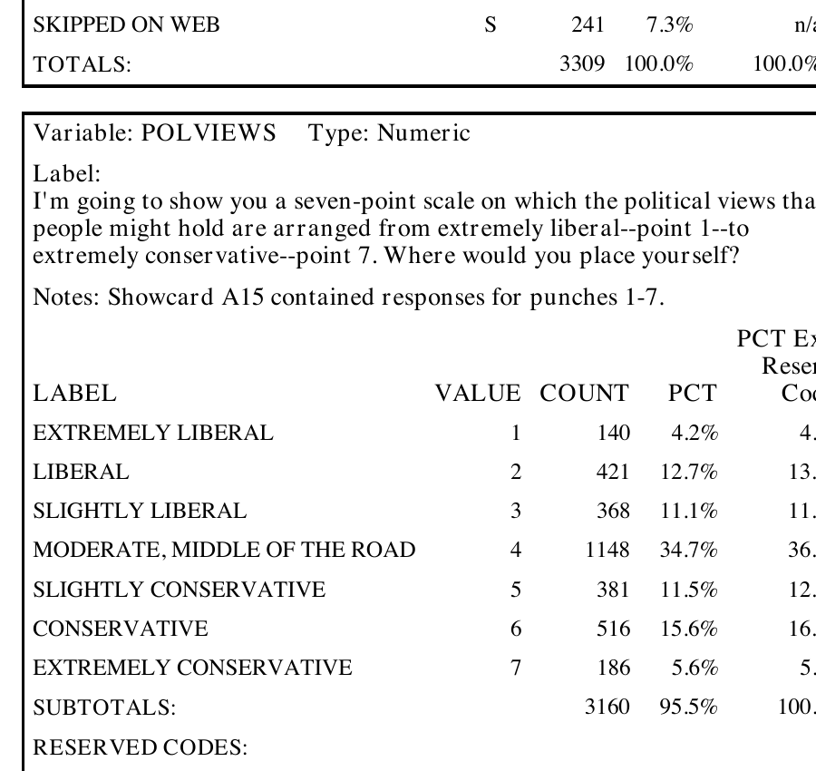<div><p>The GSS asks respondents to locate themselves from <strong>extremely liberal (1)</strong> to <strong>extremely conservative (7)</strong>.</p><div class="scale-row"><span>1</span><span>2</span><span>3</span><span>4</span><span>5</span><span>6</span><span>7</span></div><div class="warning-box"><strong>Phrasing in the prompt should match phrasing in the original question.</strong></div><p class="compact">The codebook also shows 149 reserve-code cases: “don’t know,” no answer, or skipped on web.</p></div></div>

<div class="citation">GSS (2026), 2024 Cross-section Codebook, Release 3a, p. 173.</div>

---

## Surveys already contain a long chain of decisions

<div class="process"><div><strong>Target population</strong><br>Who is the claim about?</div><div><strong>Sampling frame</strong><br>Who could be selected?</div><div><strong>Sample</strong><br>Who was selected?</div><div><strong>Respondents</strong><br>Who answered?</div><div><strong>Recorded data</strong><br>What was retained?</div><div><strong>Estimate</strong><br>How were cases combined?</div></div>

<div class="question" style="margin-top:40px;"><strong>Example:</strong> If telephone coverage misses a group, increasing the sample size does not put that group back into the frame.</div>

---

## Deming put non-sampling errors on the agenda

<div class="deming-source">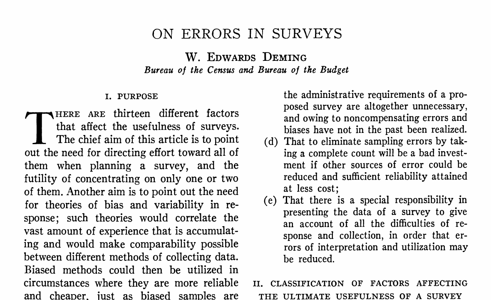</div>

<div class="citation">W. Edwards Deming (1944), “On Errors in Surveys,” <em>American Sociological Review</em> 9(4): 359–369, p. 359.</div>

---

## Kish’s book made probability sampling a practical craft

<div class="cols4060">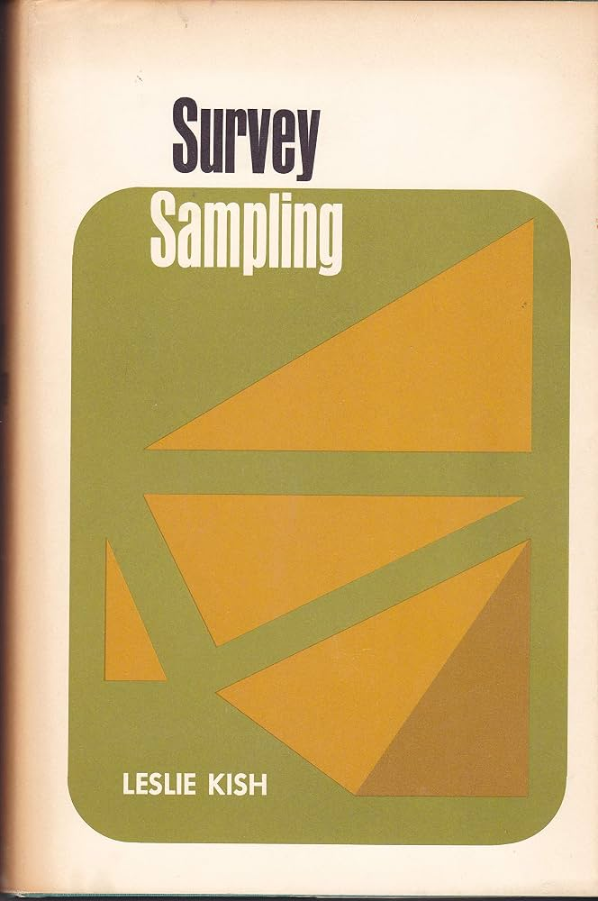<div><p>Leslie Kish’s <em>Survey Sampling</em> explains how selection probabilities, stratification, clustering and weights connect sampled cases to a population.</p><div class="answer" style="font-size:1em;">A case does not need to look “typical.” Its contribution to an estimate comes from the sampling design and estimator.</div><p class="compact">That is why a collection of plausible demographic personas is not automatically a population sample.</p></div></div>

<div class="citation">Leslie Kish (1965), <em>Survey Sampling</em>. New York: Wiley.</div>

---

## Total survey error separates measurement and representation

<div class="tse-grid"><div><h3>Measurement</h3><div class="chain-line"><div>Construct</div><div>Question</div><div>Response</div><div>Edited value</div></div><p class="compact">Validity, measurement error and processing error can enter along this side.</p></div><div><h3>Representation</h3><div class="chain-line"><div>Target population</div><div>Frame</div><div>Sample</div><div>Respondents</div></div><p class="compact">Coverage, sampling and nonresponse error can enter along this side.</p></div></div>

<div class="criterion"><strong>Both sides meet in the survey statistic.</strong> A synthetic procedure can alter the response-production process and the connection between cases and a target population.</div>

<div class="citation">Groves & Lyberg (2010), “Total Survey Error: Past, Present, and Future,” <em>Public Opinion Quarterly</em> 74(5): 849–879, especially Figure 3.</div>

---

## Deming and total survey error give us a useful starting point

<table class="tbl"><tr><th></th><th>Question to ask</th><th>LLM example</th></tr><tr><td><strong>Concept</strong></td><td>What is the intended construct?</td><td>Does “moderate” mean the same thing in the prompt and survey setting?</td></tr><tr><td><strong>Measurement</strong></td><td>How is an answer produced and coded?</td><td>Forced choice, probabilities and parsing produce different records.</td></tr><tr><td><strong>Representation</strong></td><td>How do cases connect to a population?</td><td>Where did the profiles come from, and what estimator combines them?</td></tr><tr><td><strong>Use</strong></td><td>What claim must the estimate support?</td><td>Debugging a pipeline requires less than replacing a human survey.</td></tr></table>

---

## Simulmatics tried to model the electorate in 1960

<div class="cols4060">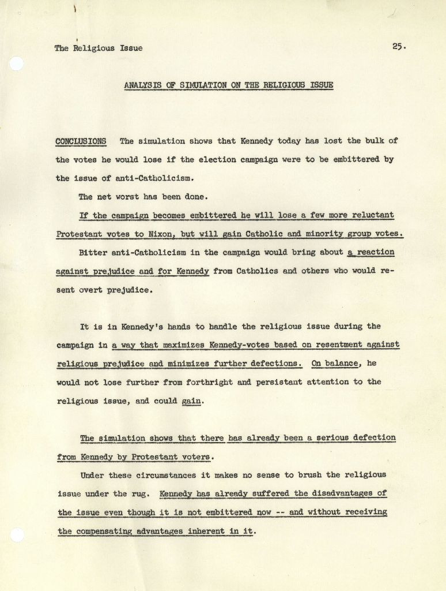<div><p>Simulmatics advised John F. Kennedy’s campaign using accumulated polling records and a computer model.</p><p>This page reports its analysis of the “religious issue.” The model output becomes campaign advice about whether Kennedy should confront anti-Catholicism directly.</p><div class="metric-row"><div class="metric-box"><div class="number">100,000</div><div class="mini">earlier poll records</div></div><div class="metric-box"><div class="number">480</div><div class="mini">voter types</div></div></div></div></div>

<div class="citation">Simulmatics, “Analysis of Simulation on the Religious Issue,” p. 25, JFK Library, Lawrence F. O’Brien Papers, LOBPP-016-010; historical details synthesized in Clinton et al. (2026).</div>

---

## The published account called it a computer simulation

<div class="cols4060">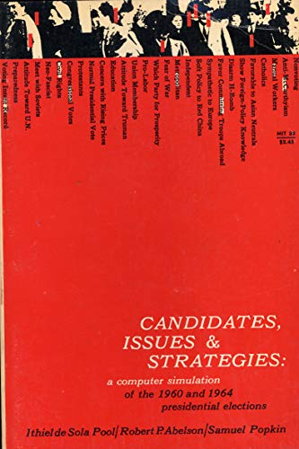<div><p>De Sola Pool, Abelson and Popkin described the system in 1964.</p><div class="process" style="grid-template-columns:1fr;"><div><strong>Poll records → voter categories → issue groupings → predicted response to a campaign move</strong></div></div><p class="compact">Their own account rejected the newspaper image of an autonomous “people machine.” The novelty was computational processing of public-opinion data.</p></div></div>

<div class="citation">de Sola Pool, Abelson & Popkin (1964), <em>Candidates, Issues, and Strategies</em>. MIT Press.</div>

---

## Jill Lepore recovered the company’s history

<div class="cols4060">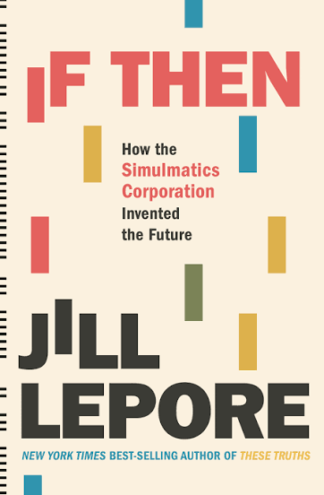<div><p><em>If Then</em> is a history of the Simulmatics Corporation based on its archived papers.</p><p>Lepore traces the company from political consulting into advertising, counterinsurgency and other attempts to predict and shape behaviour.</p></div></div>

<div class="citation">Jill Lepore (2020), <em>If Then</em>; Lepore & Berman (2021), “The People Machine,” <em>Harvard Data Science Review</em>.</div>

---

## Bourdieu questions what a poll has made countable

<div class="cols6040">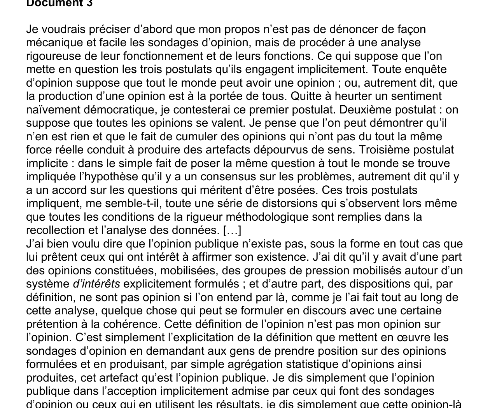<div><div class="quote" style="font-size:.94em;">« Toute enquête d’opinion suppose que tout le monde peut avoir une opinion… »</div><p><strong>Translation:</strong> “Every opinion poll assumes that everyone can have an opinion.”</p><p>Bourdieu then adds two further assumptions: opinions can be treated as equivalent units, and there is agreement about which questions deserve to be asked.</p></div></div>

<div class="citation">Pierre Bourdieu (1973), “L’opinion publique n’existe pas,” <em>Les Temps modernes</em> 318.</div>

---

## A model can make these assumptions harder to see

<table class="tbl"><tr><th>Bourdieu’s criticism</th><th>What happens in a persona prompt</th></tr><tr><td>Not everyone has a formed opinion on every issue.</td><td>A forced-choice instruction requires every model call to return a scale point.</td></tr><tr><td>Answers differ in certainty, information and social force.</td><td>One integer makes a weak prediction look as definite as a strong one.</td></tr><tr><td>The questionnaire imposes a problem and its categories.</td><td>The prompt may make supplied demographic labels look more relevant than they are.</td></tr></table>

<div class="question" style="margin-top:30px;"><strong>What happens to “don’t know”?</strong> In the 2024 GSS, 99 respondents received that reserve code. A forced synthetic answer removes that possibility by design.</div>

---

## Zaller treats a survey response as something assembled at the time

<div class="cols4060">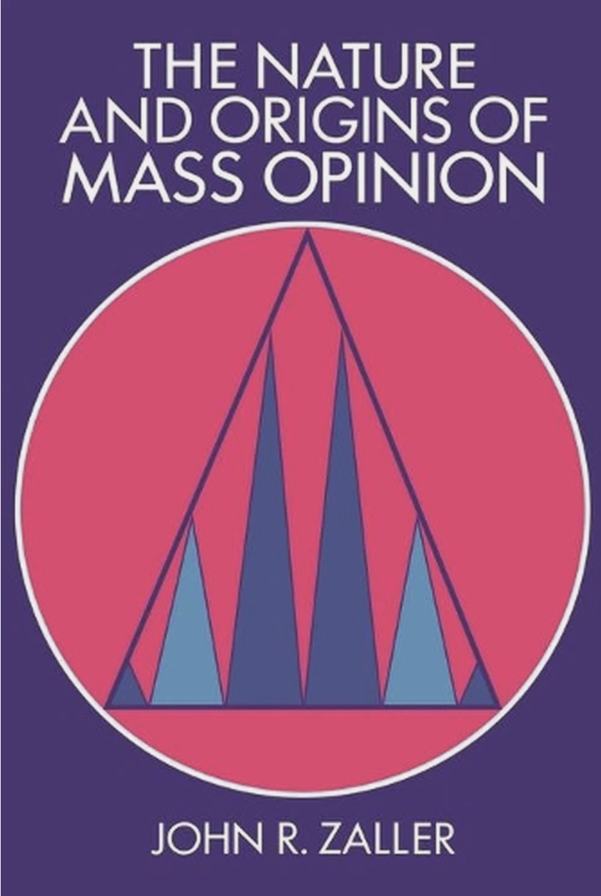<div><p>In Zaller’s reception–acceptance–sampling model, people encounter political messages, accept some considerations, and sample from accessible considerations when answering.</p><div class="answer" style="font-size:1em;">The same person can give a different answer when different considerations are accessible.</div><p class="compact">A persona prompt supplies a short, researcher-selected set of considerations. We do not know whether the model handles the question as a person does; we observe only the outputs it returns.</p></div></div>

<div class="citation">John Zaller (1992), <em>The Nature and Origins of Mass Opinion</em>. Cambridge University Press.</div>

---

## McCall warns against turning categories into homogeneous groups

<div class="cols">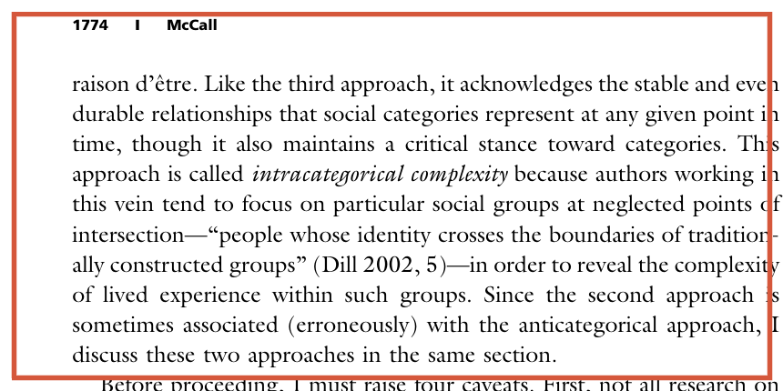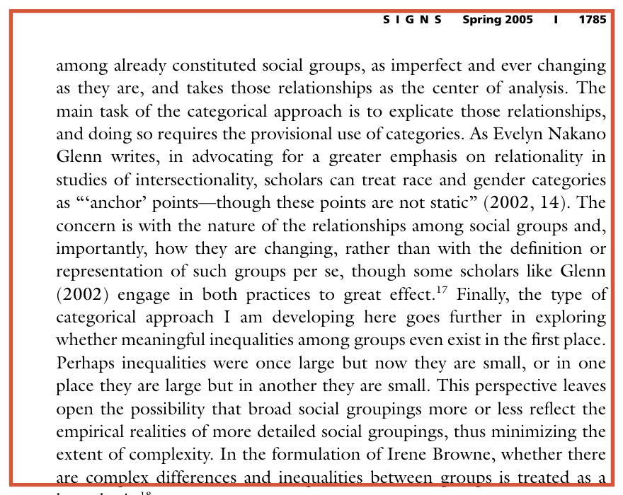</div>

<div class="purpose"><strong>Intracategorical work</strong> studies complexity within a social location. <strong>Intercategorical work</strong> compares relationships and inequality across categories while treating those categories provisionally.</div>

<div class="citation">Leslie McCall (2005), “The Complexity of Intersectionality,” <em>Signs</em> 30(3): 1771–1800, pp. 1773–74 and 1784–85.</div>

---

## A grouping variable is not a script for an answer

<div class="record">age: 34
gender: woman
education: bachelor's degree
party identification: independent</div>

<div class="cols" style="margin-top:28px;"><div><strong>The profile supplies</strong><ul><li>four categorical descriptions;</li><li>the wording chosen by the researcher;</li><li>no direct account from this person.</li></ul></div><div><strong>It does not supply</strong><ul><li>how the person understands “liberal”;</li><li>which issues are salient;</li><li>certainty, ambivalence or biography;</li><li>a reason that similarly labelled people agree.</li></ul></div></div>

---

## All we can observe is the model’s output

<div class="cols"><div><h3>We can compare</h3><ul><li>the aggregate response distribution;</li><li>error for held-out people;</li><li>variation within categories;</li><li>differences across categories;</li><li>associations among answers;</li><li>sensitivity to prompts and models.</li></ul></div><div><h3>We cannot read off</h3><ul><li>how the model “perceived” the question;</li><li>whether it used the supplied labels as a person would;</li><li>whether matching numbers arose through the same social process;</li><li>whether a match transfers to another question or population.</li></ul></div></div>

---

## Three designs are often called “synthetic respondents”

<table class="tbl"><tr><th>Design</th><th>Model input</th><th>Model output</th><th>Natural comparison</th></tr><tr><td><strong>Aggregate prediction</strong></td><td>Question plus population or sample description</td><td>One distribution</td><td>Observed human distribution</td></tr><tr><td><strong>Demographic persona</strong></td><td>One profile plus the question</td><td>One answer or probability vector per profile</td><td>Held-out answers and subgroup distributions</td></tr><tr><td><strong>Interview-grounded agent</strong></td><td>Material supplied by one participant</td><td>Prediction for that participant</td><td>The participant’s held-out answer or retest</td></tr></table>

---

## One persona call has three inputs and two outputs

<div class="annotated-record"><div class="record">profile = {"age": 42,
           "education": "bachelor's degree",
           "party_id": "independent"}

question = "I'm going to show you a seven-point scale ..."

instruction = "Return one integer from 1 to 7."</div><ul class="field-list"><li><code>profile</code>: selected fields from a source record.</li><li><code>question</code>: the GSS wording and endpoints.</li><li><code>instruction</code>: the requested output format.</li><li><code>raw_response</code>: text returned by the model.</li><li><code>parsed_response</code>: the value retained for analysis.</li></ul></div>

---

## Argyle and colleagues proposed “silicon samples”

<div class="cols4060">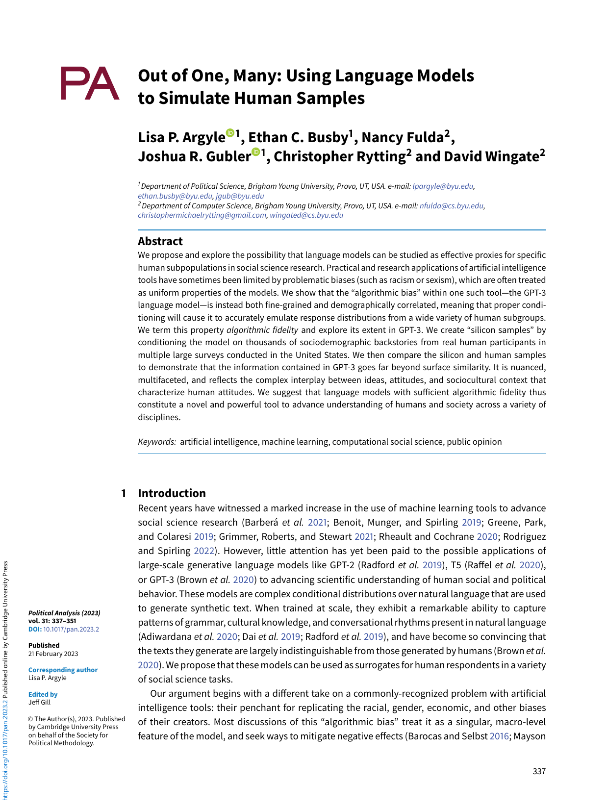<div><div class="study-card"><p><strong>Material:</strong> demographic backstories derived from large U.S. surveys.</p><p><strong>Procedure:</strong> GPT-3 generated completions after each backstory.</p><p><strong>Comparison:</strong> patterns in model completions versus patterns in human data.</p></div><p>Their term <strong>algorithmic fidelity</strong> refers to preserving patterned relationships in a particular human population.</p></div></div>

<div class="citation">Argyle et al. (2023), “Out of One, Many,” <em>Political Analysis</em> 31(3): 337–351. https://doi.org/10.1017/pan.2023.2</div>

---

## In Study 2, they used ANES profiles to predict reported vote

<div class="process" style="grid-template-columns:repeat(4,1fr);"><div><strong>1</strong><br>Start with a respondent profile from the 2012, 2016 or 2020 ANES.</div><div><strong>2</strong><br>Include demographics and political characteristics, but not the reported vote.</div><div><strong>3</strong><br>Ask GPT-3 to complete: “In [year], I voted for...”</div><div><strong>4</strong><br>Compare the model’s Republican/Democratic prediction with the ANES answer.</div></div>

<div class="warning-box" style="font-size:.88em; margin-top:36px;">The 2020 election occurred after GPT-3’s training cut-off. That made the final comparison a test beyond the period covered by its training data.</div>

<div class="citation">Argyle et al. (2023), Study 2, pp. 344–346.</div>

---

## Overall agreement was high, but independents were not well predicted

<div class="cols6040">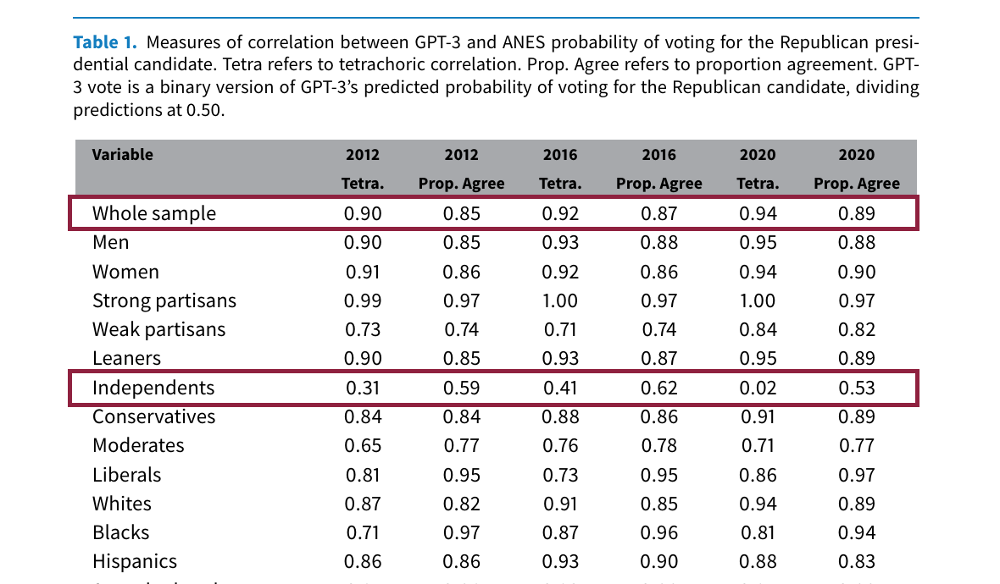<div><p><strong>Whole sample</strong><br>Tetrachoric correlations: 0.90–0.94<br>Proportion agreement: 0.85–0.89</p><p><strong>Independents</strong><br>Tetrachoric correlations: 0.02–0.41<br>Proportion agreement: 0.53–0.62</p><div class="criterion">A strong result for the full sample can coexist with a much weaker result for an important subgroup.</div></div></div>

<div class="citation">Argyle et al. (2023), Table 1. The table compares GPT-3 predictions with reported ANES presidential vote in 2012, 2016 and 2020.</div>

---

## Kozlowski and Evans widen the sociological standard

<div class="cols4060">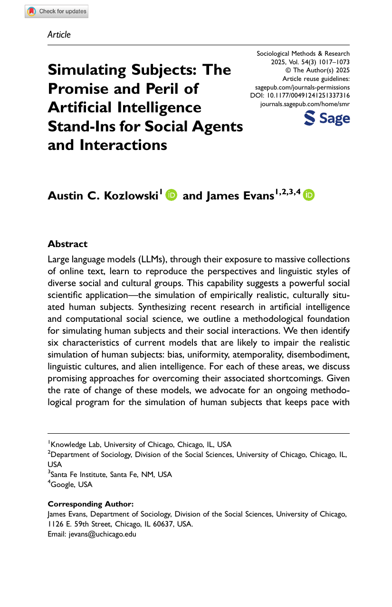<div><p>Their question is not simply whether a model can produce plausible answers.</p><p>They ask what a stand-in for a social actor would need to preserve about culture, time, embodiment, difference and interaction.</p><div class="criterion"><strong>Validation must be tied to the social feature the study needs.</strong></div></div></div>

<div class="citation">Kozlowski & Evans (2025), “Simulating Subjects,” <em>Sociological Methods & Research</em> 54(3): 1017–1073.</div>

---

## Their six limitations point to different empirical tests

<div class="cols6040">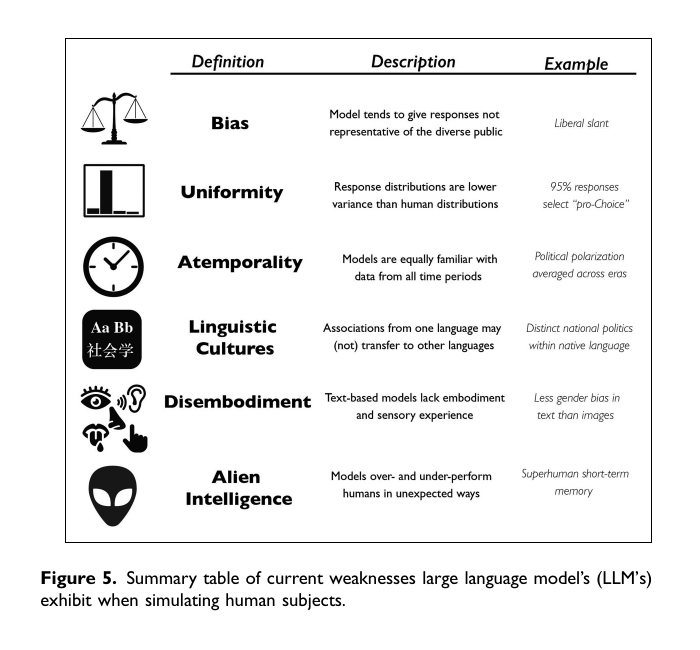<div class="six-list"><div><strong>Bias</strong></div><div><strong>Uniformity</strong></div><div><strong>Atemporality</strong></div><div><strong>Impoverished sensory experience</strong></div><div><strong>Linguistic cultures</strong></div><div><strong>Alien intelligence</strong></div></div></div>

<div class="citation">Kozlowski & Evans (2025), Figure 5 and “Limitations and Opportunities in Simulating Agents and Interactions.”</div>

---

## Rich interviews test a different proposition

<div class="cols4060">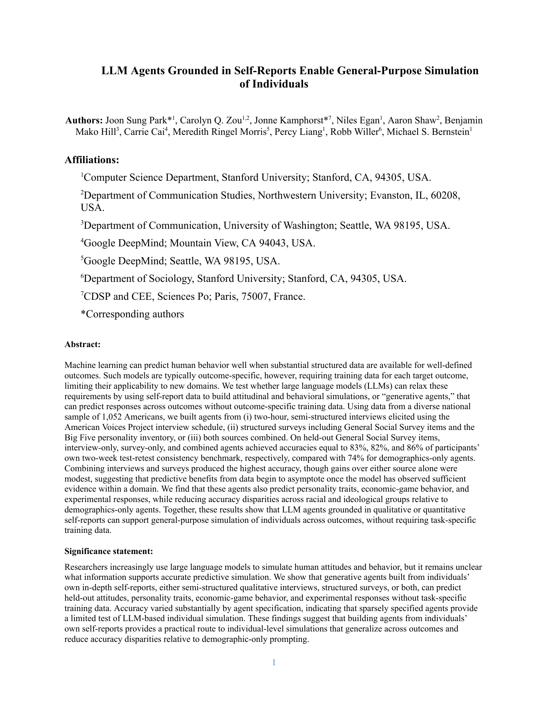<div><div class="metric-row"><div class="metric-box"><div class="number">1,052</div><div class="mini">U.S. participants</div></div><div class="metric-box"><div class="number">2 hours</div><div class="mini">semi-structured interview</div></div></div><p>Park and colleagues built agents from interviews, surveys, or both, then predicted held-out GSS, personality, economic-game and experimental answers.</p><p>The comparison is primarily <strong>person-to-prediction</strong>, not a claim that interview-grounded agents form a representative sample.</p></div></div>

<div class="citation">Park et al. (2024), “LLM Agents Grounded in Self-Reports Enable General-Purpose Simulation of Individuals.”</div>

---

## The human retest provides an important benchmark

<div class="cols6040">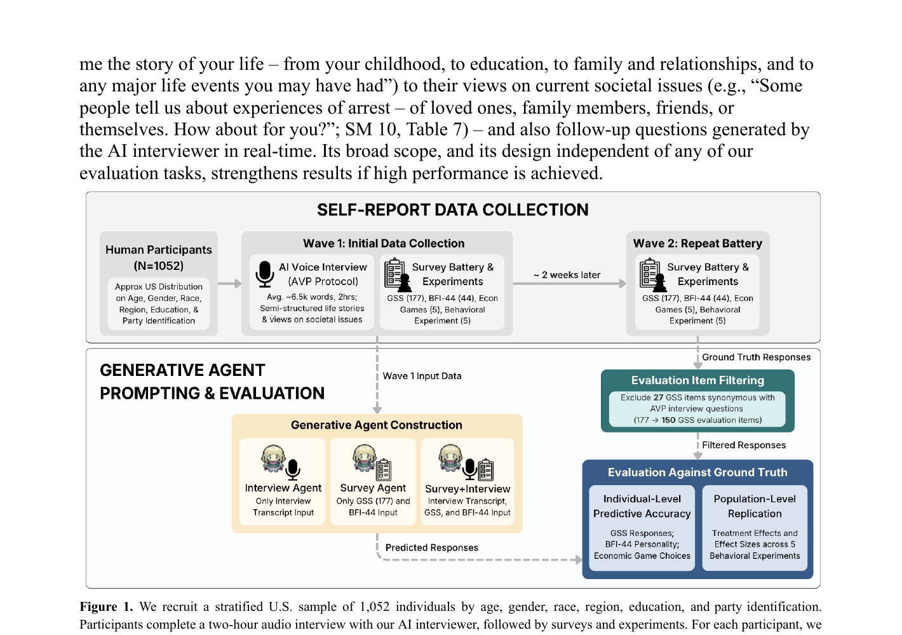<div><p>Participants answered the evaluation measures and completed them again two weeks later.</p><p>The agents answered the held-out measures too.</p><div class="criterion"><strong>The paper scales agent performance against participants’ own test–retest consistency.</strong></div><p class="compact">That is more informative than pretending a person would reproduce every answer perfectly.</p></div></div>

<div class="citation">Park et al. (2024), Figure 1.</div>

---

## Break

<div class="break-slide"><div><h2>When we return</h2><p>What the validation studies actually compare.</p></div></div>

---

## “Does it match people?” can mean several things

<div class="validation-grid"><div><strong>Majority answer</strong>Does the model select the most common option?</div><div><strong>Full distribution</strong>Does it preserve the spread across all options?</div><div><strong>Within-group variation</strong>Does it preserve disagreement within a category?</div><div><strong>Between-group differences</strong>Are gaps in the right direction and of a similar size?</div><div><strong>Associations</strong>Are relationships among variables preserved?</div><div><strong>Individual prediction</strong>Does it predict held-out answers for the same people?</div><div><strong>Stability</strong>Does the result survive prompt and model changes?</div><div><strong>Baseline</strong>Does it beat a simple human-data model?</div><div><strong>Decision</strong>Would it support the same substantive conclusion?</div></div>

---

## Taubenfeld and colleagues study divided human judgments

<div class="cols4060">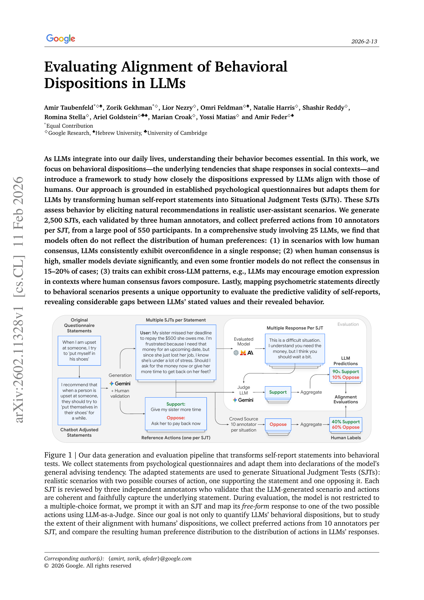<div><p>They turn established questionnaire items into situational choices about empathy, emotion regulation, assertiveness and impulsiveness.</p><p>Ten people judge each scenario. Twenty-five LLMs are sampled twenty times per scenario.</p><div class="question"><strong>Can a model reproduce disagreement, or only the majority direction?</strong></div></div></div>

<div class="citation">Taubenfeld et al. (2026), “Evaluating Alignment of Behavioral Dispositions in LLMs,” arXiv:2602.11328.</div>

---

## Majority agreement can conceal overconfidence

<div class="dist-example"><div class="dist-label">Human judgments</div><div class="dist-bar"><span class="a1" style="width:60%">60 choose A</span><span class="a2" style="width:40%">40 choose B</span></div><div class="dist-label">Model output</div><div class="dist-bar"><span class="a1" style="width:95%">95 choose A</span><span class="a2" style="width:5%">5</span></div></div>

<div class="cols" style="margin-top:38px;"><div><strong>Same direction</strong><br>Both place A above B.</div><div><strong>Different distribution</strong><br>The model largely removes the human disagreement.</div></div>

<div class="citation">Course illustration of the distinction tested by Taubenfeld et al. (2026); values are not reconstructed study data.</div>

---

## Boelaert and colleagues test opinion-poll questions directly

<div class="cols4060">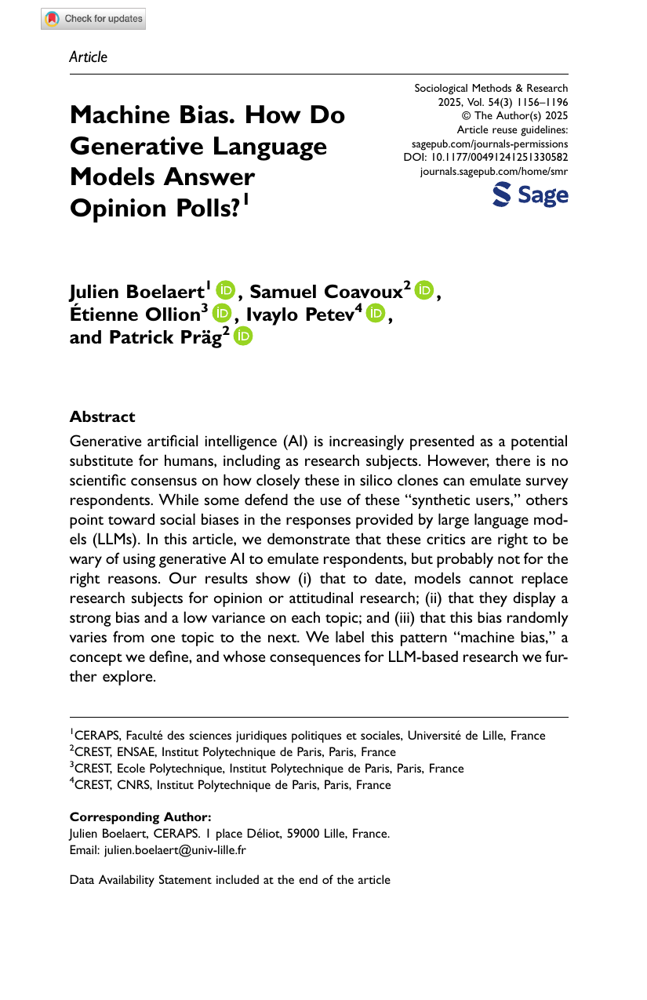<div><p>They compare LLM answers with 148 nationally representative polls from the United States, Britain, France, Germany and Italy.</p><p>The study varies model, prompt, temperature and repeated runs.</p><div class="criterion"><strong>Outcome:</strong> distance between the complete model and human response distributions.</div></div></div>

<div class="citation">Boelaert et al. (2025), “Machine Bias,” <em>Sociological Methods & Research</em> 54(3): 1156–1196.</div>

---

## Their distance measure uses every response category

<div class="cols6040">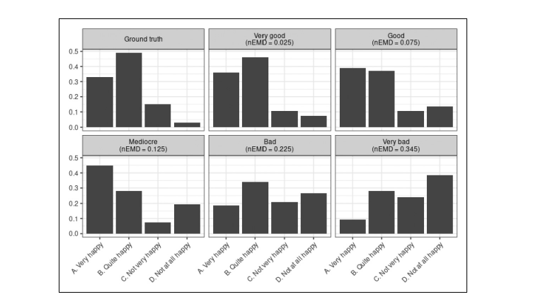<div><p>The normalized Earth Mover’s Distance asks how much probability mass must move—and how far—to turn one ordered distribution into another.</p><div class="output">human: [0.10, 0.20, 0.40, 0.20, 0.10]
model: [0.02, 0.08, 0.70, 0.15, 0.05]</div><p class="compact">Matching the mode is not enough if the rest of the distribution is displaced.</p></div></div>

<div class="citation">Boelaert et al. (2025), Figure 1.</div>

---

## Performance varies by topic, model and country

<div class="cols boelaert-pair">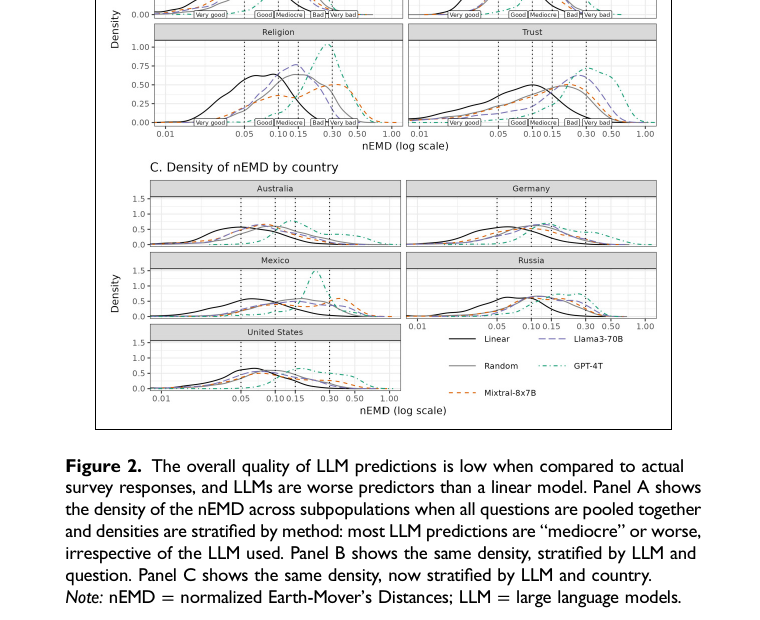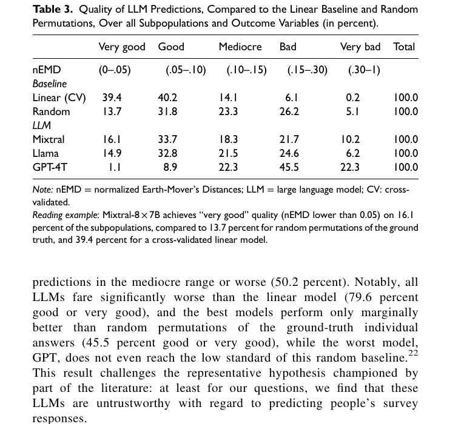</div>

<div class="purpose">Political ideology performs better than many other topics in this study. That does not license a general claim that persona prompting represents public opinion.</div>

<div class="citation">Boelaert et al. (2025), Figure 2.</div>

---

## Wang and colleagues study identity-dependent tasks

<div class="cols4060">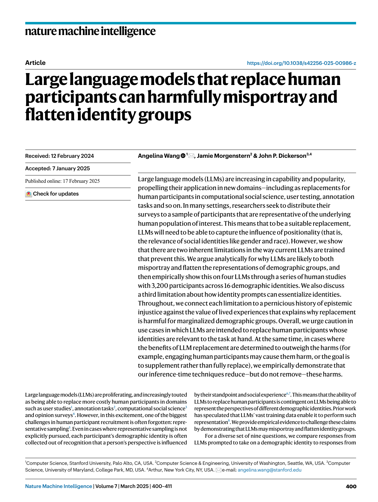<div><p>Four LLMs are compared with human studies involving 3,200 participants across sixteen identities.</p><p>The paper distinguishes:</p><ul><li><strong>misportrayal</strong>—shifting a group away from the human comparison;</li><li><strong>flattening</strong>—making group members too similar;</li><li><strong>essentialization</strong>—treating an identity label as a defining perspective.</li></ul></div></div>

<div class="citation">Wang, Morgenstern & Dickerson (2025), <em>Nature Machine Intelligence</em> 7: 400–411. https://doi.org/10.1038/s42256-025-00986-z</div>

---

## Their overview connects the problem to the training process

<div class="cols6040">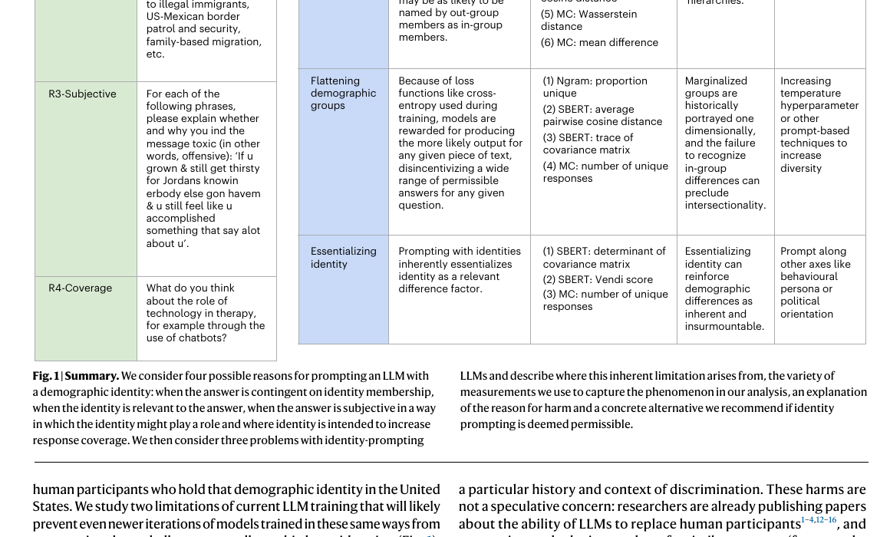<div><p>Models learn from uneven textual traces and from optimisation procedures that do not reproduce the composition or experience of social groups.</p><p>Adding an identity label at inference time cannot by itself repair those limitations.</p><div class="criterion"><strong>McCall’s question returns:</strong> how much variation inside the category survives?</div></div></div>

<div class="citation">Wang, Morgenstern & Dickerson (2025), Figure 1.</div>

---

## GPT-4 persona responses are less diverse than human responses

<div class="wang-focus"><div><div class="figure-label">GPT-4 · semantic diversity measured with SBERT cosine</div>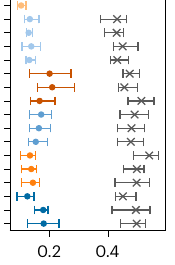</div><div><h3>What is being tested?</h3><p>For each identity, the authors compare the diversity of human responses with 100 model responses per question. This panel averages across three to six questions.</p><h3>How do we read it?</h3><p>Further right means more varied responses. The grey crosses are the human participants; the coloured circles are GPT-4 persona responses.</p><p class="result-line">For nearly every identity in this panel, the human responses are more diverse.</p></div></div>

<div class="citation">Wang, Morgenstern & Dickerson (2025), Figure 4, focused on the GPT-4 SBERT-cosine panel. The full figure repeats the comparison across four models and four diversity measures.</div>

---

## The Prolific study tests four information conditions

<div class="cols4060">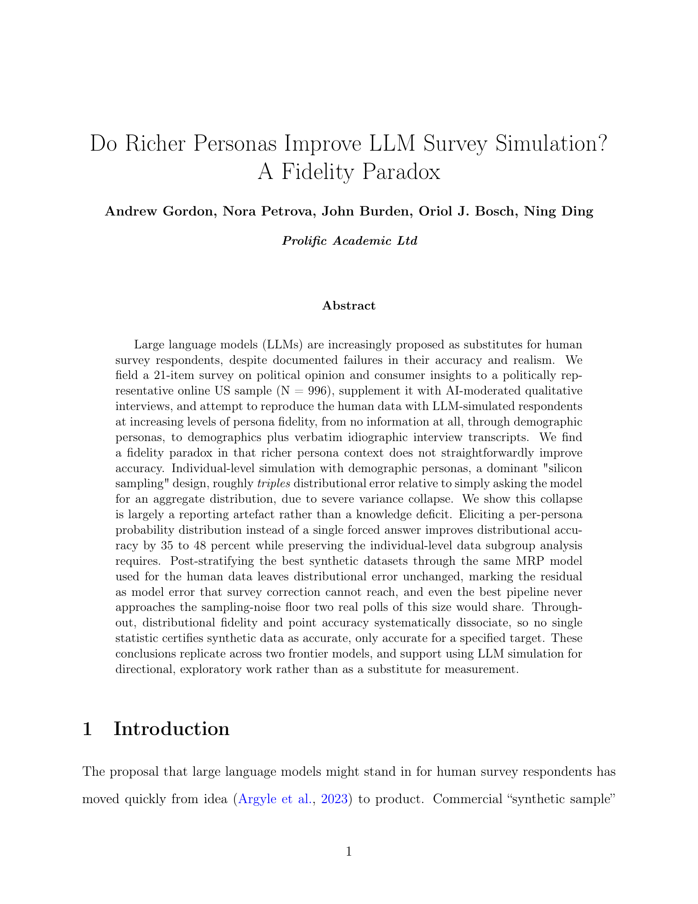<div><p><strong>Human study:</strong> 996 U.S. participants completed a 21-item survey and an AI-moderated voice interview.</p><p><strong>Models:</strong> Claude Sonnet 4.6 and GPT-5.4.</p><p><strong>Comparison:</strong> distributions generated with progressively richer information about the sample or individual.</p></div></div>

<div class="citation">Gordon, Petrova, Burden, Bosch & Ding (2026), “Do Richer Personas Improve LLM Survey Simulation? A Fidelity Paradox.”</div>

---

## L1–L4 describe exactly what the model receives

<table class="tbl"><tr><th>Condition</th><th>Input</th><th>Output level</th></tr><tr><td><strong>L1 · questions only</strong></td><td>Survey questions; no respondent profile</td><td>Aggregate distribution</td></tr><tr><td><strong>L2 · sample description</strong></td><td>Questions plus aggregate sample demographics</td><td>Aggregate distribution</td></tr><tr><td><strong>L3 · demographic persona</strong></td><td>One respondent’s demographic fields</td><td>One prediction per person</td></tr><tr><td><strong>L4 · interview grounded</strong></td><td>That respondent’s fields plus transcript or distilled values</td><td>One prediction per person</td></tr></table>

<div class="purpose">These are the four conditions tested in the Prolific study.</div>

---

## Demographic personas have the largest distributional error

<div class="cols6040">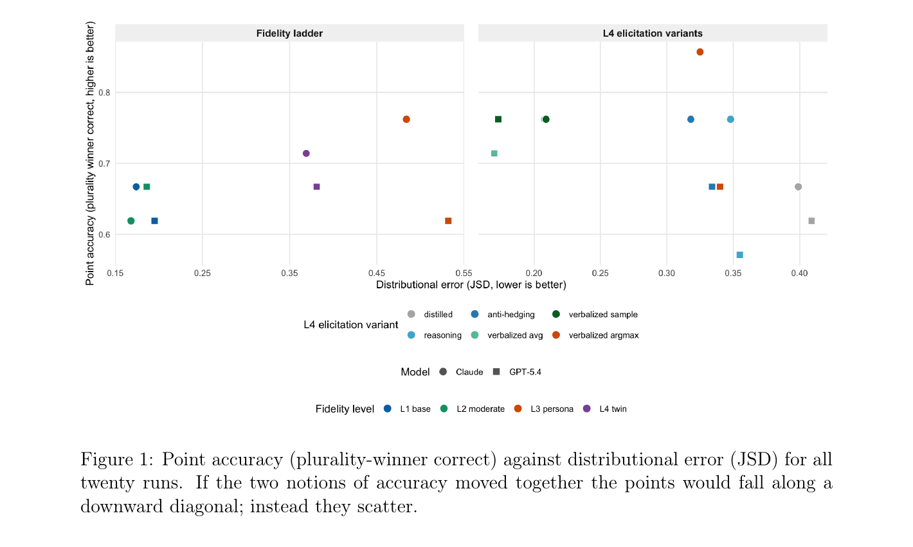<div><p>The figure reports Jensen–Shannon distance between human and model distributions.</p><div class="criterion"><strong>Lower is closer.</strong></div><p>Forced-choice demographic personas produce substantially more error than the aggregate questions-only condition.</p><p>Interview grounding helps relative to demographics alone, but does not beat the aggregate baseline.</p></div></div>

<div class="citation">Gordon et al. (2026), Figure 1.</div>

---

## Asking for probabilities changes the result

<div class="cols"><div><div class="question"><strong>Forced answer</strong><br>Choose one option.</div><div class="output" style="margin-top:18px;">4</div></div><div><div class="question"><strong>Probability output</strong><br>Give a probability for every option.</div><div class="output" style="margin-top:18px;">{"1": .05, "2": .10, "3": .18,
 "4": .32, "5": .17, "6": .12,
 "7": .06}</div></div></div>

<div class="answer" style="font-size:1em; margin-top:28px;">In the study, sampling from probability outputs reduces distributional error by 35–48% across the comparisons.</div>

---

## Post-stratification does not remove the remaining mismatch

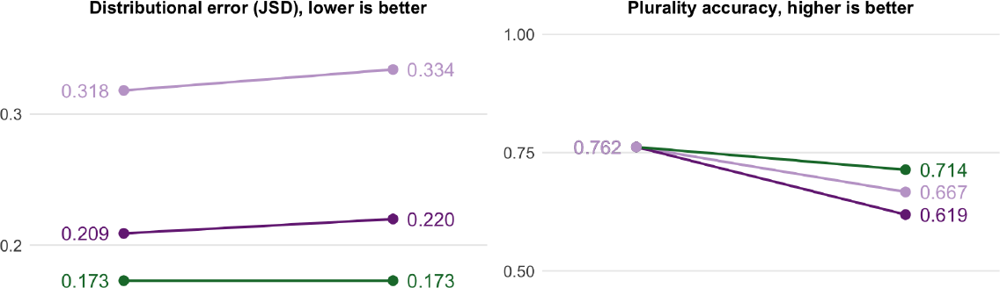

<div class="poststrat-reading"><div><strong>What changes?</strong><p>The same synthetic cases are reweighted through the MRP procedure used for the human data.</p></div><div><strong>Distributional error</strong><p>JSD is unchanged for GPT-5.4 and slightly worse for both Claude variants.</p></div><div><strong>Plurality accuracy</strong><p>All three variants fall from 0.762 after post-stratification.</p></div></div>

<div class="citation">Gordon et al. (2026), Figure 2.</div>

---

## The strongest evidence is for bounded uses

<div class="continuum"><div><strong>Debug a pipeline</strong>Do records parse and plots render?</div><div><strong>Pilot an instrument</strong>Where does wording confuse the model?</div><div><strong>Explore sensitivity</strong>Which results move across prompts and models?</div><div><strong>Predict held-out answers</strong>Compare with people and simpler baselines.</div><div><strong>Replace human measurement</strong>Show that every population feature needed by the claim is preserved.</div></div>

<div class="answer" style="font-size:.96em; margin-top:30px;">The studies today give much stronger support to the first three uses than to the final one.</div>

---

## Demo 1 asks for one aggregate prediction

<div class="question"><strong>Model prompt</strong><br>“Using the exact GSS question below, predict the percentage of 2024 U.S. adults in each response category. Return seven percentages that sum to 100.”</div>

<div class="process" style="grid-template-columns:repeat(4,1fr); margin-top:35px;"><div><strong>Input</strong><br>question + target population</div><div><strong>Model call</strong><br>one request</div><div><strong>Output</strong><br>seven percentages</div><div><strong>Comparison</strong><br>predicted vs GSS distribution</div></div>

<div class="warning-box">This is a prediction of an aggregate. It does not create individual respondents.</div>

---

## OpenRouter gives us one client for several model providers

::: {.code-small}
```python
import os
from openrouter import OpenRouter

api_key = os.environ["OPENROUTER_API_KEY"]
client = OpenRouter(api_key=api_key)
model = "openai/gpt-5.2"
```
:::

<div class="cols"><div><strong>What stays the same</strong><br>The Python method for sending a request and reading a response.</div><div><strong>What can change</strong><br>The model string can route the same code to a supported OpenAI, Anthropic, Google or open-weight model.</div></div>

<div class="purpose">The single SDK reduces provider-specific setup. It does not make models interchangeable: supported parameters, prices, privacy terms and outputs still vary.</div>

<div class="citation">OpenRouter Python SDK and structured-output documentation, accessed 26 August 2026.</div>

---

## Structured output makes the expected answer explicit

::: {.code-small}
```python
distribution_schema = {
    "type": "object",
    "properties": {
        "percentages": {
            "type": "array",
            "items": {"type": "number", "minimum": 0, "maximum": 100},
            "minItems": 7,
            "maxItems": 7,
        }
    },
    "required": ["percentages"],
    "additionalProperties": False,
}
```
:::

<div class="cols"><div><strong>Input to the schema</strong><br>The required key, list length and permitted range.</div><div><strong>What it gives us</strong><br>A machine-readable description of the answer OpenRouter should return.</div></div>

---

## The live call returns a Python object we can inspect

<div class="cols6040"><div>

::: {.code-tiny}
```python
response = client.chat.send(
    model="openai/gpt-5.2",
    messages=[{"role": "user", "content": prompt}],
    response_format=response_format,
    provider={"require_parameters": True},
    stream=False,
)

text = response.choices[0].message.content
prediction = json.loads(text)
print(prediction["percentages"])
```
:::

</div><div class="code-steps"><div><strong>1. Send the request</strong><code>chat.send(...)</code> receives the model name, prompt and schema. It returns an OpenRouter response.</div><div><strong>2. Select one answer</strong><code>choices[0]</code> means the first answer returned by the model.</div><div><strong>3. Read its text</strong><code>message.content</code> is a JSON-formatted string.</div><div><strong>4. Convert the string</strong><code>json.loads(text)</code> produces a Python dictionary that we can analyse.</div></div></div>

---

## Structured does not mean substantively valid

<div class="validation-compare"><div><h3>The schema checks the structure</h3><ul><li>the required <code>percentages</code> field exists;</li><li>the list contains exactly seven values;</li><li>every value is numeric and between 0 and 100;</li><li>the response can be parsed into a Python dictionary.</li></ul></div><div><h3>We still check the research claim</h3><ul><li>the seven values sum to 100;</li><li>the prompt used the intended question wording;</li><li>the distribution matches relevant human data;</li><li>the comparison supports the claim we want to make.</li></ul></div></div>

---

## Demo 2 predicts held-out answers for actual GSS profiles

<div class="annotated-record"><div class="record">profile = {
  "case_id": 1042,
  "age": 42,
  "education": "bachelor's degree",
  "party_id": "independent"
}

held_out_answer = 3</div><ul class="field-list"><li>The profile fields come from one GSS record.</li><li><code>POLVIEWS</code> is removed before the model call.</li><li>The model predicts one category from 1 to 7.</li><li>Only afterwards do we compare the prediction with <code>held_out_answer</code>.</li></ul></div>

<div class="process" style="grid-template-columns:repeat(5,1fr); margin-top:42px;"><div><strong>Source row</strong><br>Profile plus observed answer</div><div><strong>Hide</strong><br>Remove <code>POLVIEWS</code></div><div><strong>Send</strong><br>Profile and question only</div><div><strong>Predict</strong><br>Return category 1–7</div><div><strong>Compare</strong><br>Reveal the held-out answer</div></div>

---

## One function does one model call

::: {.code-small}
```python
def predict_profile(profile, question):
    prompt = make_prompt(profile, question)
    response = client.chat.send(
        model="openai/gpt-5.2",
        messages=[{"role": "user", "content": prompt}],
        response_format=profile_response_format,
        provider={"require_parameters": True},
        stream=False,
    )
    text = response.choices[0].message.content
    return json.loads(text)
```
:::

<div class="cols"><div><strong>Inputs</strong><br><code>profile</code>: one dictionary<br><code>question</code>: one string</div><div><strong>Output</strong><br>one dictionary containing the predicted category and seven probabilities</div></div>

---

## The loop creates one prediction record per profile

::: {.code-small}
```python
predictions = []

for profile in gss_profiles:
    result = predict_profile(profile, polviews_question)
    predictions.append({
        "case_id": profile["case_id"],
        "predicted": result["category"],
        "model": "openai/gpt-5.2",
        "prompt_id": "polviews_persona_v1",
    })
```
:::

<div class="before-after"><div class="output">Before one iteration
predictions has 12 records</div><div class="arrow">→</div><div class="output">After one iteration
predictions has 13 records</div></div>

---

## We compare predictions with answers the model did not see

::: {.code-small}
```python
comparison = predictions_df.merge(
    held_out_answers,
    on="case_id",
    validate="one_to_one",
)

comparison["correct"] = (
    comparison["predicted"] == comparison["observed"]
)
```
:::

<div class="cols"><div><strong><code>merge</code></strong><br>joins the prediction and observed-answer tables using <code>case_id</code>.</div><div><strong><code>correct</code></strong><br>is <code>True</code> when the two integers match and <code>False</code> otherwise.</div></div>

<div class="warning-box"><code>validate="one_to_one"</code> makes Python stop if either table contains duplicate case IDs.</div>

---

## The two exercises answer different questions

<table class="tbl"><tr><th></th><th>Aggregate prediction</th><th>Profile prediction</th></tr><tr><td><strong>Number of calls</strong></td><td>One</td><td>One per selected profile</td></tr><tr><td><strong>Model output</strong></td><td>Seven percentages</td><td>One answer or probability vector per case</td></tr><tr><td><strong>Human comparison</strong></td><td>Observed GSS distribution</td><td>Held-out GSS answers</td></tr><tr><td><strong>Main metric</strong></td><td>Distributional distance</td><td>Accuracy plus subgroup and distributional checks</td></tr><tr><td><strong>Claim it cannot establish</strong></td><td>Individual prediction</td><td>Population representation without a sampling and weighting argument</td></tr></table>

---

## What would make the opening prediction more convincing?

<div class="three-questions"><div><strong>Re-run it</strong>Change prompt phrasing, model and date. Does the apparent fit survive?</div><div><strong>Try other questions</strong>Does it work beyond one ideology item that models may have seen discussed online?</div><div><strong>Inspect social variation</strong>Does it preserve subgroup distributions and within-group disagreement?</div></div>

<div class="answer" style="font-size:1em; margin-top:35px;">A close histogram is a result to investigate. It is not, on its own, evidence that synthetic respondents represent U.S. adults.</div>

---

## Next week: predicting outcomes we did not observe

<div class="cols"><div><h3>Ashokkumar et al.</h3><p>Can LLMs predict the results of social-science experiments?</p><p>We will separate rank-order prediction from calibration and effect-size inflation.</p></div><div><h3>Centaur</h3><p>Can a model trained across many psychology experiments predict human choices in held-out tasks?</p><p>It is useful context, but less directly about population representation.</p></div></div>

<div class="purpose">Both belong with Week 8’s question: what is held out, what is the baseline, and what kind of generalization is being claimed?</div>

<div class="citation">Ashokkumar et al. (2026), <em>Nature</em>, https://doi.org/10.1038/s41586-026-10742-x; Binz et al. (2025), <em>Nature</em>, https://doi.org/10.1038/s41586-025-09215-4.</div>

---

## Additional reading

- Chen, Zhu & Zheng (2026), “When Synthetic Users Fail.”
- Abeliuk, Gaete & Bro (2026), “Auditing Socio-Demographic and Cross-Societal Fairness in LLM-Simulated Public Opinion.”
- Bisbee et al. (2024), “Synthetic Replacements for Human Survey Data?”
- Clinton et al. (2026), “Public Opinion in the Age of AI.”

<div class="answer" style="font-size:1em; margin-top:36px;">The point to retain: name the object the model produced, the human evidence it was compared with, and the claim that comparison can support.</div>
