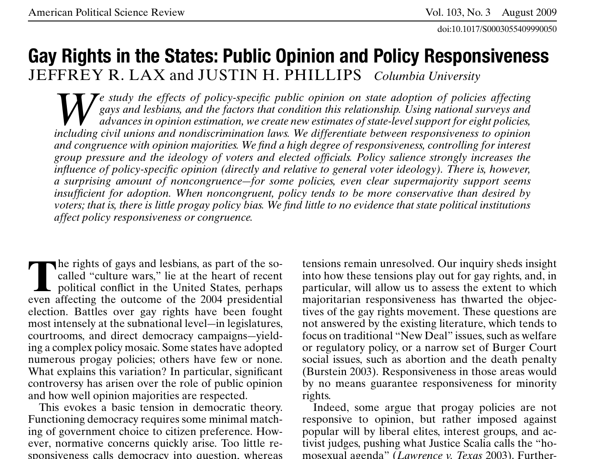
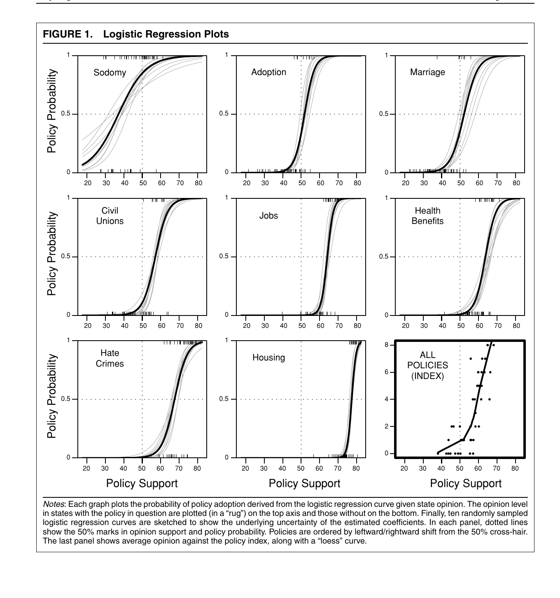
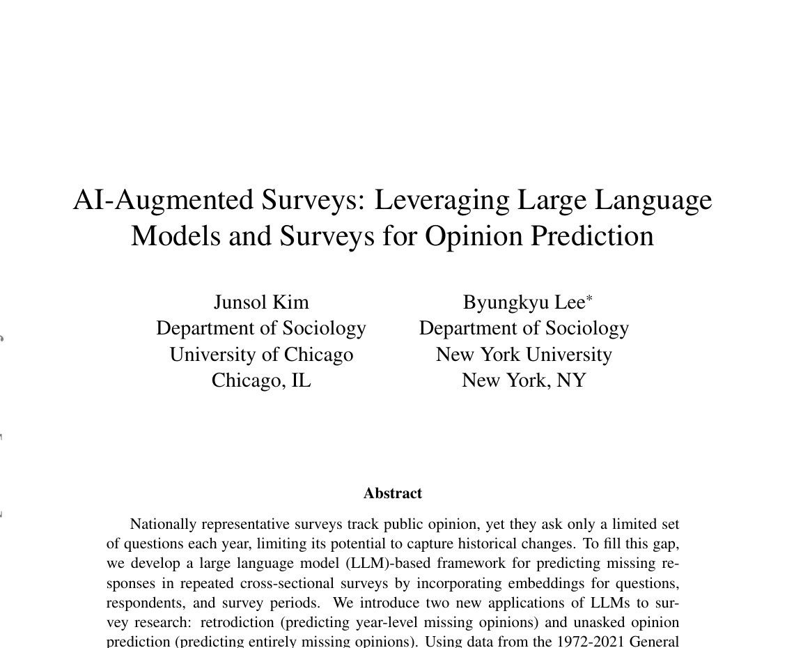
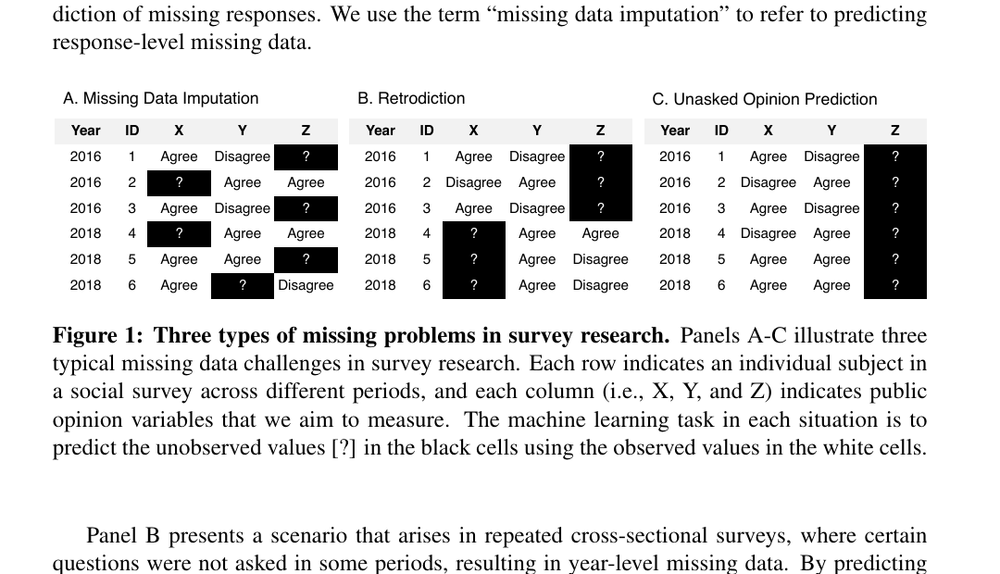
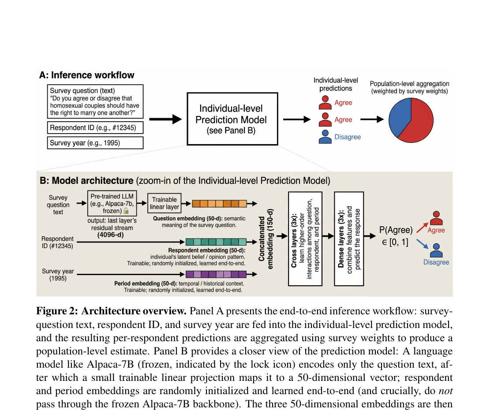
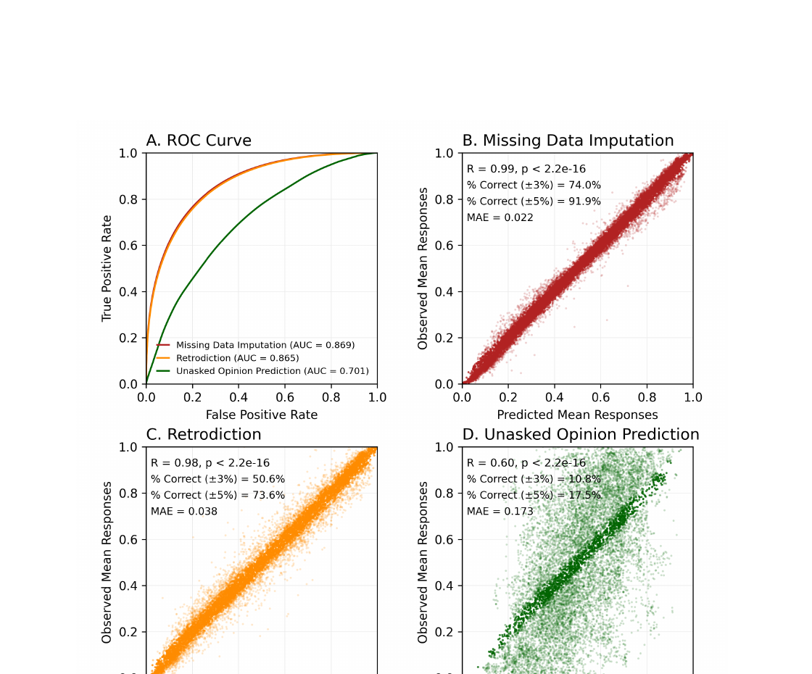
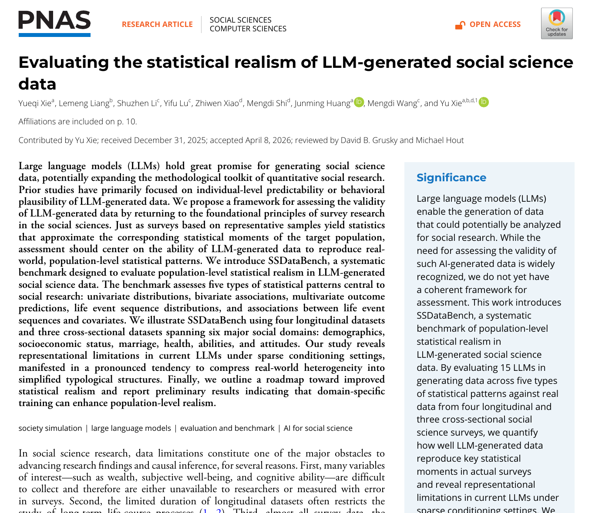
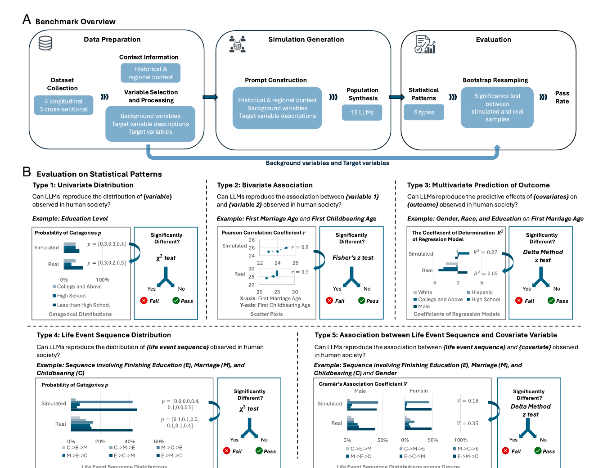
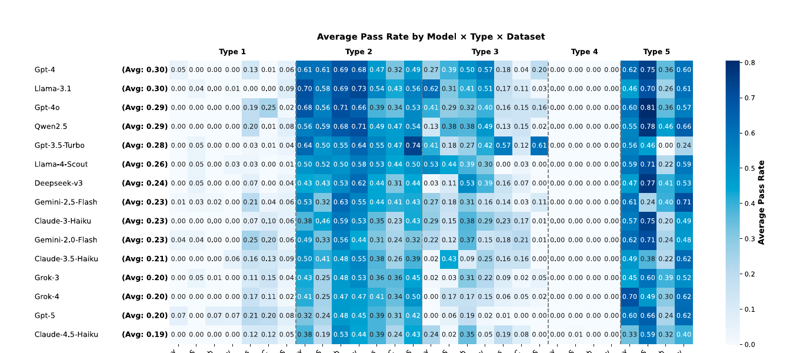
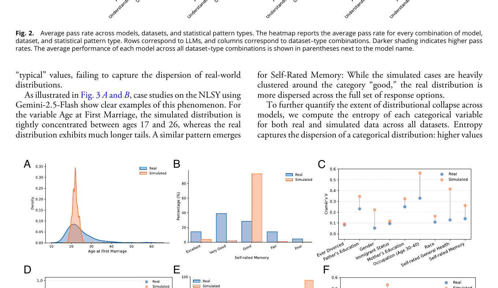

## Suppose we need state opinion but do not have a state survey

<div class="opening-case"><div><span>Observed</span><p>A national survey contains people from every state, but too few respondents in many states for a reliable state estimate.</p></div><div><span>Wanted</span><p>Support for same-sex marriage in each state—and an account of whether state policy responds to those preferences.</p></div></div>

<div class="big-question">What information can legitimately fill the gap between the national sample and the state quantity?</div>

---

## Several different things can be “missing”

<table class="closed-table"><thead><tr><th>Target</th><th>Example</th><th>What we would compare with</th></tr></thead><tbody><tr><td>One person's answer</td><td>A respondent skipped <code>POLVIEWS</code>.</td><td>The held-out answer from that person.</td></tr><tr><td>A survey item in an earlier year</td><td>The GSS did not ask an item in 1988.</td><td>A comparable poll from 1988, if one exists.</td></tr><tr><td>An aggregate quantity</td><td>Support for same-sex marriage in Utah.</td><td>A sufficiently large state poll or election result.</td></tr><tr><td>A relationship</td><td>Whether policy is more likely where support is higher.</td><td>Observed policy and validated opinion estimates.</td></tr></tbody></table>

<div class="plain-note">A model can perform well on one row and badly on another.</div>

---

## Lax and Phillips estimate opinion before testing policy responsiveness

<div class="paper-layout"><div><p>The substantive question is whether state policies on gay and lesbian rights respond to state public opinion.</p><p>The obstacle is measurement: national surveys contain too few respondents in many states.</p><p>Their approach uses human survey answers, a multilevel model, and population counts—not simulated respondents.</p></div></div>

<p class="citation" style="font-size:.48em;">Lax, J. R., and J. H. Phillips. (2009). “Gay Rights in the States: Public Opinion and Policy Responsiveness.” <em>American Political Science Review</em> 103(3):367–386. https://doi.org/10.1017/S0003055409990050.</p>

---

## Multilevel regression and poststratification has two main steps

<div class="mrp"><div><b>1. Estimate responses</b><p>Use observed survey answers to estimate how opinion varies across demographic and geographic groups.</p></div><div><b>2. Reweight to the state</b><p>Combine those estimates with known population counts for each demographic cell in each state.</p></div></div>

<div class="example-strip"><code>survey answers</code><i>+</i><code>statistical model</code><i>+</i><code>state population counts</code><i>→</i><code>estimated state opinion</code></div>

<p class="citation">Lax and Phillips (2009), pp. 371–373 and online appendix.</p>

---

## The estimated opinion is used inside a substantive analysis

<div class="figure-layout"><div><p>Each panel relates estimated public support to the probability that a state has adopted a policy.</p><p>The curves differ across sodomy laws, adoption, marriage, civil unions, jobs, health benefits, hate-crime laws and housing.</p><p>The opinion estimate is not the endpoint. It becomes an explanatory variable in a study of democratic responsiveness.</p></div></div>

<p class="citation">Lax and Phillips (2009), Figure 1, p. 374.</p>

---

## Their evidence chain remains visible

<div class="evidence-chain"><div><b>Human responses</b><p>People answered real survey questions.</p></div><div><b>Population counts</b><p>Census cells tell us who lives in each state.</p></div><div><b>Validated estimates</b><p>MRP is compared with direct estimates and election data.</p></div><div><b>Policy outcomes</b><p>State law supplies the substantive outcome.</p></div></div>

<div class="plain-note">Week 8 asks what changes when an LLM supplies some of the unobserved answers.</div>

---

## Kim and Lee train a model on survey responses

<div class="paper-layout"><div><p>The data are 3,110 binarized opinions from 68,846 GSS respondents between 1972 and 2021.</p><p>The model learns from survey questions, respondents' other answers, and survey years.</p><p>The paper asks whether this combination can predict opinions that were not observed.</p></div></div>

<p class="citation">Kim, J., and B. Lee. (2026). “AI-Augmented Surveys: Leveraging Large Language Models and Surveys for Opinion Prediction.” arXiv:2305.09620v4.</p>

---

## The paper separates three prediction problems



<div class="three-jobs"><div><b>Imputation</b><p>An answer is missing inside an otherwise observed survey.</p></div><div><b>Retrodiction</b><p>An item was not asked in a particular survey year.</p></div><div><b>Unasked opinion</b><p>An item has never been asked in the survey data.</p></div></div>

<p class="citation">Kim and Lee (2026), Figure 1, p. 3.</p>

---

## This is not an off-the-shelf persona prompt

<div class="figure-layout wide-left"><div><p>The model incorporates embeddings for the survey question, the respondent and the survey period.</p><p>It is fine-tuned on observed GSS responses, then predicts an individual answer that can be aggregated with survey weights.</p><p>The human survey data calibrate the model. They are not replaced by a demographic description.</p></div></div>

<p class="citation">Kim and Lee (2026), Figure 2, p. 7.</p>

---

## Performance falls as the prediction task becomes harder

<div class="figure-layout"><div><p><strong>Imputation:</strong> the model sees closely related observed answers for the same survey setting.</p><p><strong>Retrodiction:</strong> it predicts an item in a year where that item was absent.</p><p><strong>Unasked opinion:</strong> it predicts an item absent from all training waves.</p><p>The final task has visibly weaker individual- and aggregate-level performance.</p></div></div>

<p class="citation">Kim and Lee (2026), Figure 3 and discussion, pp. 15–18.</p>

---

## Xie and colleagues ask whether synthetic data preserve social structure

<div class="paper-layout"><div><p>They evaluate 15 models against four longitudinal and three cross-sectional social-science datasets.</p><p>The benchmark does not ask whether individual records sound plausible.</p><p>It asks whether the generated population preserves statistical patterns found in the observed data.</p></div></div>

<p class="citation" style="font-size:.48em;">Xie, Y., L. Liang, S. Li, et al. (2026). “Evaluating the Statistical Realism of LLM-Generated Social Science Data.” <em>PNAS</em> 123(19):e2538145123. https://doi.org/10.1073/pnas.2538145123.</p>

---

## Their benchmark tests five kinds of population pattern



<div class="plain-note">Distributions, bivariate associations, multivariate predictions, life-event sequences, and relationships between sequences and covariates are tested separately.</div>

<p class="citation">Xie et al. (2026), Figure 1, p. 3.</p>

---

## No model passes every type of test reliably



<div class="reading-figure"><b>How to read this:</b> darker cells indicate a larger share of statistical tests on which simulated and observed data were not significantly different. Performance varies by model, dataset and type of pattern; no row is uniformly dark.</div>

<p class="citation">Xie et al. (2026), Figure 2, p. 5.</p>

---

## The generated data often compress real heterogeneity

<div class="figure-layout"><div><p>In the observed data, age at first marriage and self-rated memory are dispersed.</p><p>Model-generated cases concentrate around more typical values.</p><p>The models also tend to produce associations and regression fit that are stronger than those in the human data.</p></div></div>

<p class="citation">Xie et al. (2026), Figure 3 and discussion, pp. 5–7.</p>

---

## The three assigned readings answer different questions

<table class="closed-table"><thead><tr><th>Reading</th><th>What is unobserved?</th><th>What supplies the estimate?</th><th>What is tested?</th></tr></thead><tbody><tr><td>Lax & Phillips</td><td>State opinion</td><td>Human survey responses + MRP + census counts</td><td>Opinion estimates and policy responsiveness</td></tr><tr><td>Kim & Lee</td><td>Individual answers or item-year responses</td><td>A model trained on GSS responses and embeddings</td><td>Held-out individual and aggregate answers</td></tr><tr><td>Xie et al.</td><td>A synthetic population</td><td>Prompted LLMs conditioned on sparse profiles</td><td>Five kinds of population-level pattern</td></tr></tbody></table>

---

## A good result must name the target

<div class="target-grid"><div><b>Individual</b><p>Did the model predict this person's held-out answer?</p></div><div><b>Aggregate</b><p>Did the predicted distribution resemble the human distribution?</p></div><div><b>Group difference</b><p>Were differences between groups preserved?</p></div><div><b>Association</b><p>Were relationships among variables similar?</p></div></div>

<div class="big-question">“The model matches the survey” is not a complete finding.</div>

---

## After the break: repeat one prediction across five cases {.section-slide}

We will make the same structured request through OpenRouter and Ollama, keep every raw return, and compare individual and aggregate results.

---

## The classroom task is deliberately small

<div class="task-brief"><span>Question</span><p>Can either route predict the held-out <code>POLVIEWS</code> category for five deidentified GSS profiles?</p><span>Input</span><p>Five profile dictionaries and the exact seven-category GSS question.</p><span>Output</span><p>One predicted category and seven probabilities for each profile and route.</p><span>Check</span><p>Individual exact matches and the aggregate distribution are calculated separately.</p></div>

---

## Python stores the five cases as a list of dictionaries

```python
profiles = [
    {"case_id": "p01", "age": 28, "education": "BA",
     "party_id": "Independent", "held_out": 4},
    {"case_id": "p02", "age": 61, "education": "HS",
     "party_id": "Republican", "held_out": 6},
    # three more supplied records
]
```

<div class="io-grid"><div><b><code>profiles</code></b><p>A <strong>list</strong>: an ordered collection containing five items.</p></div><div><b><code>profiles[0]</code></b><p>A <strong>dictionary</strong>: named fields describing one case.</p></div><div><b><code>profiles[0]["age"]</code></b><p>An <strong>integer</strong>: the value <code>28</code>.</p></div></div>

---

## The held-out answer is removed from the prompt

```python
profile_for_model = {
    "case_id": profile["case_id"],
    "age": profile["age"],
    "education": profile["education"],
    "party_id": profile["party_id"],
}
```

<div class="before-after"><div><b>Research record</b><p>Contains the profile and the human answer.</p></div><i>→</i><div><b>Model input</b><p>Contains only fields available before prediction.</p></div></div>

<div class="plain-note">If <code>held_out</code> enters the prompt, this is no longer a prediction exercise.</div>

---

## The first loop gives us one case at a time

```python
predictions = []

for profile in profiles:
    print("Current case:", profile["case_id"])
```

<div class="loop-trace"><div><b>Before the loop</b><p><code>predictions</code> is an empty list.</p></div><div><b>First iteration</b><p><code>profile</code> refers to the dictionary for <code>p01</code>.</p></div><div><b>Second iteration</b><p><code>profile</code> refers to <code>p02</code>.</p></div></div>

<div class="plain-note"><code>for</code> repeats the indented lines once for every item in the list.</div>

---

## Each iteration constructs the complete model message

```python
prompt = f"""
Predict this person's answer to the GSS POLVIEWS question.
Profile: {profile_for_model}
Question: {polviews_question}
Return one category from 1 to 7 and seven probabilities.
"""

messages = [{"role": "user", "content": prompt}]
```

<div class="io-grid"><div><b>Input</b><p>One profile dictionary and one question string.</p></div><div><b>Operation</b><p>The f-string inserts their current values into the instruction.</p></div><div><b>Output</b><p><code>messages</code>, a list containing one message dictionary.</p></div></div>

---

## The OpenRouter branch sends the message to a hosted model

```python
if route == "openrouter":
    with OpenRouter(api_key=api_key) as client:
        response = client.chat.send(
            model=HOSTED_MODEL,
            messages=messages,
            response_format=response_format,
            stream=False,
        )
    raw_json = response.choices[0].message.content
```

<div class="plain-note"><strong>Input:</strong> model name, message list and output schema. <strong>Output:</strong> a response object; <code>raw_json</code> retrieves its first answer as text.</div>

---

## The Ollama branch sends the same research request locally

```python
else:
    response = ollama.chat(
        model=LOCAL_MODEL,
        messages=messages,
        format=prediction_schema,
        options={"temperature": 0},
        think=False,
    )
    raw_json = response.message.content
```

<div class="plain-note">The message has the same purpose, but the transport and response objects differ. Ollama runs the configured model on this computer.</div>

---

## We preserve the raw return before extracting fields

```python
parsed = json.loads(raw_json)

predictions.append({
    "case_id": profile["case_id"], "route": route,
    "raw_json": raw_json, "predicted": parsed["category"],
    "probabilities": parsed["probabilities"],
    "held_out": profile["held_out"],
})
```

<div class="io-grid"><div><b><code>raw_json</code></b><p>A string exactly as returned.</p></div><div><b><code>parsed</code></b><p>A dictionary made by <code>json.loads</code>.</p></div><div><b><code>predictions</code></b><p>A list that grows by one record.</p></div></div>

---

## One check compares predictions case by case

```python
matches = []
for row in predictions:
    same = row["predicted"] == row["held_out"]
    matches.append(same)

accuracy = sum(matches) / len(matches)
```

<div class="example-output"><b>Example output</b><code>[True, False, True, False, False]</code><p><code>accuracy</code> is <code>0.40</code>: two of five held-out answers were predicted exactly.</p></div>

---

## A second check compares the aggregate distribution

<div class="distribution-pair"><div><b>Five human answers</b><div class="mini-bars"><span style="height:15%"></span><span style="height:15%"></span><span style="height:35%"></span><span style="height:55%"></span><span style="height:35%"></span><span style="height:15%"></span><span style="height:15%"></span></div></div><div><b>Five model predictions</b><div class="mini-bars model"><span style="height:15%"></span><span style="height:15%"></span><span style="height:35%"></span><span style="height:55%"></span><span style="height:35%"></span><span style="height:15%"></span><span style="height:15%"></span></div></div></div>

<div class="plain-note">These illustrative distributions match exactly even though three individual predictions on the preceding slide were wrong.</div>

---

## Comparing routes does not identify which one represents people

<table class="closed-table"><thead><tr><th>Observed difference</th><th>What we can say</th><th>What we cannot say yet</th></tr></thead><tbody><tr><td>OpenRouter has higher exact-match accuracy.</td><td>It predicted these five held-out cases more often.</td><td>It is valid for the target population.</td></tr><tr><td>Ollama better matches the aggregate.</td><td>Its five predictions produce a closer distribution here.</td><td>Its individual records are more realistic.</td></tr><tr><td>The routes disagree on <code>p02</code>.</td><td>The prediction is sensitive to model and route.</td><td>Either answer reveals the person's “true” opinion.</td></tr></tbody></table>

---

## The completion task uses the same five-case routine

<div class="task-brief"><span>Run</span><p>Make five predictions through OpenRouter and five through Ollama.</p><span>Change one thing</span><p>Change the education field for <code>p02</code>, then repeat both calls for that case.</p><span>Explain</span><p>Trace one iteration line by line, including the input object, message, raw return, parsed record and appended result.</p><span>Conclude carefully</span><p>Report individual and aggregate results separately and identify one comparison still needed for a population claim.</p></div>

<div class="citation">Submit the narrated screen recording by 5:00 p.m. Eastern on the Tuesday before the next class.</div>

---

## What to take from today

<div class="takeaways"><div><b>Prediction has an object</b><p>Name whether it is a person, an item-year, an aggregate or a relationship.</p></div><div><b>Validation follows the claim</b><p>A matching mean cannot validate individuals, groups and associations at once.</p></div><div><b>Generated data need observed data</b><p>Without a human or population comparison, plausibility is all we have assessed.</p></div></div>
